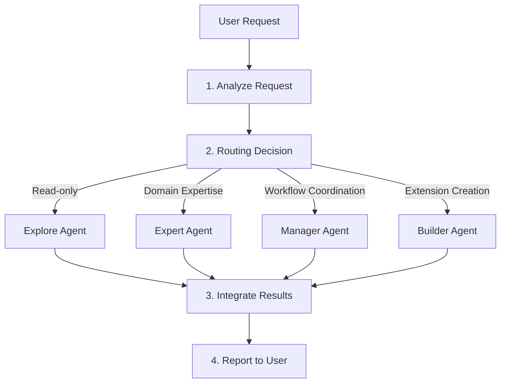
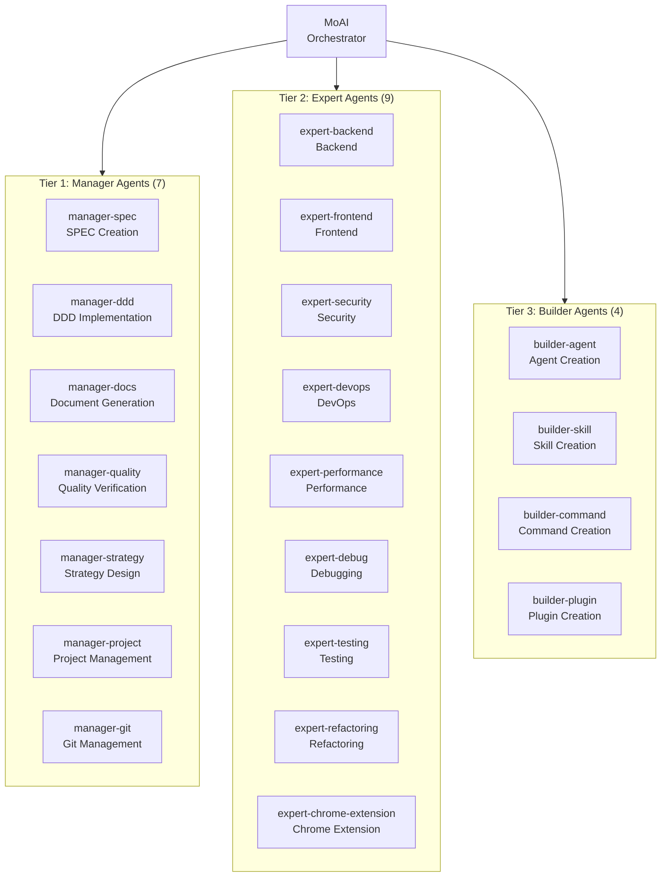
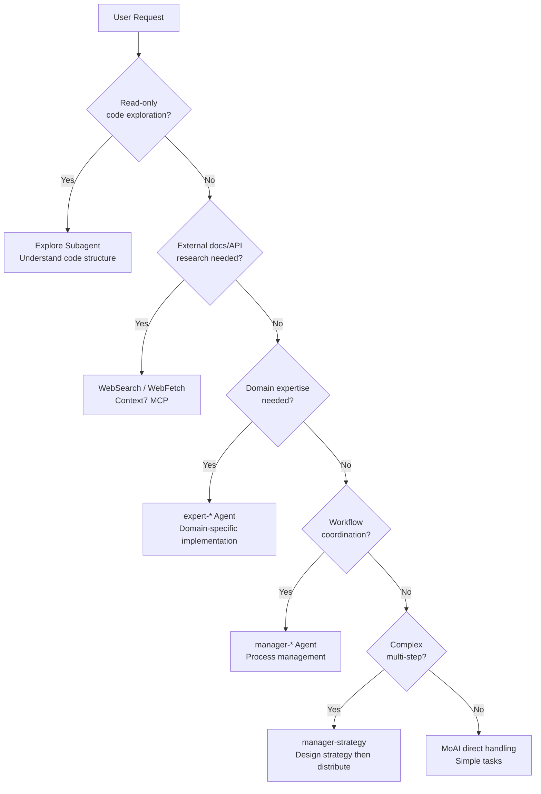
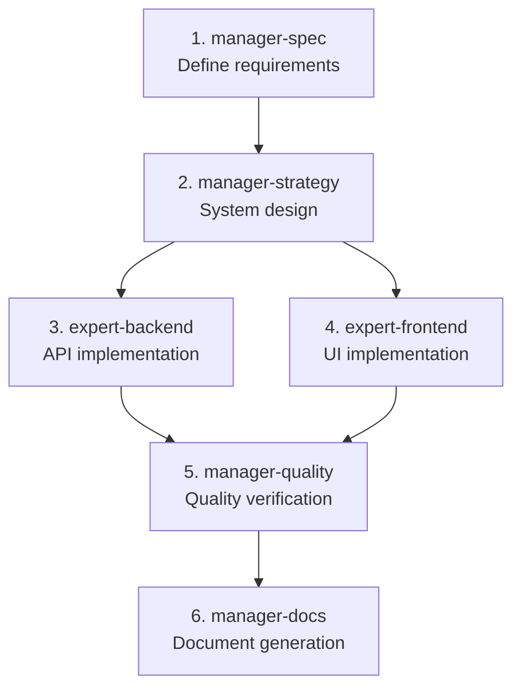

import { Callout } from 'nextra/components'

# Agent Guide

Detailed guide to MoAI-ADK's agent system.

<Callout type="tip">
**One-line summary**: Agents are **expert teams** for each domain. MoAI acts as team leader, delegating tasks to appropriate experts.
</Callout>

## What are Agents?

Agents are **AI task executors** specialized in specific domains.

Based on Claude Code's **Sub-agent** system, each agent has an independent context window, custom system prompt, specific tool access, and independent permissions.

Using a company organization analogy: MoAI is the CEO, Manager agents are department heads, Expert agents are experts in each field, and Builder agents are HR teams recruiting new team members.

## MoAI Orchestrator

MoAI is the **top-level coordinator** of MoAI-ADK. It analyzes user requests and delegates tasks to appropriate agents.

### MoAI's Core Rules

| Rule | Description |
|------|-------------|
| Delegation Only | Complex tasks are delegated to expert agents, not performed directly |
| User Interface | Only MoAI handles user interaction (subagents cannot) |
| Parallel Execution | Independent tasks are delegated to multiple agents simultaneously |
| Result Integration | Consolidates agent execution results and reports to user |

### MoAI's Request Processing Flow



## Agent 3-Tier Structure

MoAI-ADK agents are organized into **3 tiers**:



## Manager Agent Details

Manager agents **coordinate and manage workflows**.

| Agent | Role | Used Skills | Main Tools |
|--------|------|-------------|------------|
| `manager-spec` | SPEC document creation, EARS format requirements | `moai-workflow-spec` | Read, Write, Grep |
| `manager-ddd` | ANALYZE-PRESERVE-IMPROVE cycle execution | `moai-workflow-ddd`, `moai-foundation-core` | Read, Write, Edit, Bash |
| `manager-docs` | Document generation, Nextra integration | `moai-library-nextra`, `moai-docs-generation` | Read, Write, Edit |
| `manager-quality` | TRUST 5 verification, code review | `moai-foundation-quality` | Read, Grep, Bash |
| `manager-strategy` | System design, architecture decisions | `moai-foundation-core`, `moai-foundation-philosopher` | Read, Grep, Glob |
| `manager-project` | Project configuration, initialization | `moai-workflow-project` | Read, Write, Bash |
| `manager-git` | Git branching, merge strategy | `moai-foundation-core` | Bash (git) |

### Manager Agents and Workflow Commands

Manager agents connect directly to major MoAI workflow commands:

```bash
# Plan phase: manager-spec creates SPEC document
> /moai plan "Implement user authentication system"

# Run phase: manager-ddd executes DDD cycle
> /moai run SPEC-AUTH-001

# Sync phase: manager-docs synchronizes documentation
> /moai sync SPEC-AUTH-001
```

## Expert Agent Details

Expert agents perform **actual implementation work** in specific domains.

| Agent | Role | Used Skills | Main Tools |
|--------|------|-------------|------------|
| `expert-backend` | API development, server logic, DB integration | `moai-domain-backend`, language-specific skills | Read, Write, Edit, Bash |
| `expert-frontend` | React components, UI implementation | `moai-domain-frontend`, `moai-lang-typescript` | Read, Write, Edit, Bash |
| `expert-security` | Security analysis, OWASP compliance | `moai-foundation-core` (TRUST 5) | Read, Grep, Bash |
| `expert-devops` | CI/CD, infrastructure, deployment automation | Platform-specific skills | Read, Write, Bash |
| `expert-performance` | Performance optimization, profiling | Domain-specific skills | Read, Grep, Bash |
| `expert-debug` | Debugging, error analysis, problem resolution | Language-specific skills | Read, Grep, Bash |
| `expert-testing` | Test creation, coverage improvement | `moai-workflow-testing` | Read, Write, Bash |
| `expert-refactoring` | Code refactoring, architecture improvement | `moai-workflow-ddd` | Read, Write, Edit |

### Expert Agent Usage Examples

```bash
# Backend API development request
> Create a user CRUD API with FastAPI
# → MoAI delegates to expert-backend
# → Activates moai-lang-python + moai-domain-backend skills

# Security analysis request
> Analyze security vulnerabilities in this code
# → MoAI delegates to expert-security
# → Analyzes based on OWASP Top 10 criteria

# Performance optimization request
> This query is slow, optimize it
# → MoAI delegates to expert-performance
# → Profiling and optimization recommendations
```

## Builder Agent Details

Builder agents create **new components that extend MoAI-ADK**.

| Agent | Role | Output |
|--------|------|--------|
| `builder-agent` | Create new agent definitions | `.claude/agents/moai/*.md` |
| `builder-skill` | Create new skills | `.claude/skills/my-skills/*/skill.md` |
| `builder-command` | Create new slash commands | `.claude/commands/moai/*.md` |
| `builder-plugin` | Create new plugins | `.claude-plugin/plugin.json` |

<Callout type="info">
For details on builder agents, refer to [Builder Agent Guide](/advanced/builder-agents).
</Callout>

## Agent Selection Decision Tree

The process by which MoAI analyzes user requests and selects appropriate agents:



### Agent Selection Criteria

| Task Type | Agent to Select | Example |
|-----------|-----------------|---------|
| Code reading/analysis | Explore | "Analyze this project's structure" |
| API development | expert-backend | "Create REST API endpoints" |
| UI implementation | expert-frontend | "Create login page" |
| Bug fixing | expert-debug | "Find cause of this error" |
| Test writing | expert-testing | "Add tests for this function" |
| Security review | expert-security | "Check for security vulnerabilities" |
| SPEC creation | manager-spec | `/moai plan "feature description"` |
| DDD implementation | manager-ddd | `/moai run SPEC-XXX` |
| Document generation | manager-docs | `/moai sync SPEC-XXX` |
| Code review | manager-quality | "Review this PR" |
| Extension creation | builder-* | "Create new skill" |

## Agent Definition Files

Agents are defined as markdown files in the `.claude/agents/moai/` directory.

### File Structure

```
.claude/agents/moai/
├── expert-backend.md
├── expert-frontend.md
├── expert-security.md
├── expert-devops.md
├── expert-performance.md
├── expert-debug.md
├── expert-testing.md
├── expert-refactoring.md
├── manager-spec.md
├── manager-ddd.md
├── manager-docs.md
├── manager-quality.md
├── manager-strategy.md
├── manager-project.md
├── manager-git.md
├── builder-agent.md
├── builder-skill.md
├── builder-command.md
└── builder-plugin.md
```

### Agent Definition Format

```markdown
---
name: expert-backend
description: >
  Backend API development expert. Handles API design, server logic, database integration.
  PROACTIVELY use for automatic delegation during backend implementation tasks.
tools: Read, Write, Edit, Grep, Glob, Bash, TodoWrite
model: sonnet
---

You are a backend development expert.

## Role
- REST/GraphQL API design and implementation
- Database schema design
- Authentication/authorization system implementation
- Server-side business logic

## Used Skills
- moai-domain-backend
- moai-lang-python (for Python projects)
- moai-lang-typescript (for TypeScript projects)

## Quality Standards
- TRUST 5 framework compliance
- 85%+ test coverage
- OWASP Top 10 security standards
```

<Callout type="warning">
**Caution**: Subagents **cannot directly ask users questions**. All user interaction happens only through MoAI. Collect necessary information before delegating to agents.
</Callout>

## Agent Collaboration Patterns

### Sequential Execution (With Dependencies)

```bash
# 1. manager-spec creates SPEC
# 2. manager-ddd implements based on SPEC
# 3. manager-docs generates documentation
> /moai plan "authentication system"
> /moai run SPEC-AUTH-001
> /moai sync SPEC-AUTH-001
```

### Parallel Execution (Independent Tasks)

```bash
# MoAI delegates independent tasks simultaneously
# - expert-backend: API implementation
# - expert-frontend: UI implementation
# - expert-testing: Test writing
> Create both backend API and frontend UI simultaneously
```

### Agent Chain

For complex tasks, multiple agents work sequentially, handing off to each other.



## Sub-agent System

Claude Code's official Sub-agent system forms the foundation of MoAI-ADK's agent architecture.

### What are Sub-agents?

Sub-agents are **AI assistants specialized for specific task types**.

| Feature | Description |
|---------|-------------|
| **Independent Context** | Each sub-agent runs in its own context window |
| **Custom Prompts** | Customized system prompts define behavior |
| **Specific Tool Access** | Only necessary tools provided |
| **Independent Permissions** | Individual permission settings |

### Sub-agent vs Agent Teams

| Sub-agent Mode | Agent Teams Mode |
|-----------------|------------------|
| Single sub-agent works sequentially | Multiple team members collaborate in parallel |
| Best for simple tasks | Best for complex multi-phase tasks |
| Faster execution | Requires careful coordination |

## Agent Teams

Agent Teams mode is an advanced workflow where multiple experts **collaborate in parallel**.

<Callout type="info">
**Experimental Feature**: Agent Teams require Claude Code v2.1.32+ with `CLAUDE_CODE_EXPERIMENTAL_AGENT_TEAMS=1` environment variable and `workflow.team.enabled: true` setting.
</Callout>

### Team Mode Settings

| Setting | Default | Description |
|---------|---------|-------------|
| `workflow.team.enabled` | `false` | Enable Agent Teams mode |
| `workflow.team.max_teammates` | `10` | Maximum number of teammates per team |
| `workflow.team.auto_selection` | `true` | Auto-select mode based on complexity |

### Mode Selection

| Flag | Behavior |
|------|----------|
| **--team** | Force team mode |
| **--solo** | Force sub-agent mode |
| **No flag** | Auto-select based on complexity thresholds |

### /moai --team Workflow

MoAI's `--team` flag activates Agent Teams for SPEC workflow.

```bash
# Plan phase: Team mode for research and analysis
> /moai plan --team "user authentication system"
# researcher, analyst, architect work in parallel

# Run phase: Team mode for implementation
> /moai run --team SPEC-AUTH-001
# backend-dev, frontend-dev, tester work in parallel

# Sync phase: Documentation (always sub-agent)
> /moai sync SPEC-AUTH-001
# manager-docs generates documentation
```

### Team Composition

| Role | Plan Phase | Run Phase | Permissions |
|------|------------|-----------|-------------|
| **Team Lead** | MoAI | MoAI | Coordinates all work |
| **Researcher** | researcher (haiku) | - | Read-only code analysis |
| **Analyst** | analyst (inherit) | - | Requirements analysis |
| **Architect** | architect (inherit) | - | Technical design |
| **Backend Dev** | - | backend-dev (acceptEdits) | Server-side files |
| **Frontend Dev** | - | frontend-dev (acceptEdits) | Client-side files |
| **Tester** | - | tester (acceptEdits) | Test files |
| **Designer** | - | designer (acceptEdits) | UI/UX design |
| **Quality** | - | quality (plan) | TRUST 5 validation |

### Team File Ownership

Agent Teams clearly separate file ownership to prevent conflicts.

| File Type | Ownership |
|----------|-----------|
| `.md` docs | All team members |
| `src/` | backend-dev |
| `components/` | frontend-dev |
| `tests/` | tester |
| `*.design.pen` | designer |
| Shared config | All team members |

## Related Documents

- [Skill Guide](/advanced/skill-guide) - Skill system used by agents
- [Builder Agent Guide](/advanced/builder-agents) - Custom agent creation
- [Hooks Guide](/advanced/hooks-guide) - Automation before/after agent execution
- [SPEC-based Development](/core-concepts/spec-based-dev) - SPEC workflow details

<Callout type="tip">
**Tip**: You don't need to specify agents directly. Just make natural language requests to MoAI and it will automatically select the optimal agent. Say "Create API" and `expert-backend` is automatically called, "Review this code" and `manager-quality` is automatically called.
</Callout>