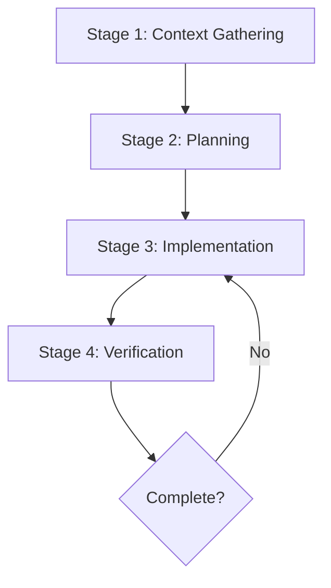

# Best Practices

Claude Code is an AI-based coding environment. Unlike chatbots that answer questions and wait, Claude Code can read files, run commands, make changes, see the results, and work autonomously when you're completely away.

This changes how you work. Instead of writing code yourself and asking Claude to review it, you describe what you want and let Claude figure out how to implement it. Claude explores, plans, and implements.

But this autonomy still has a learning curve. Claude operates within certain constraints that you need to understand.

This guide covers patterns proven effective by Anthropic's internal teams and engineers using Claude Code across diverse codebases, languages, and environments. For how the agent loop works, see [How It Works](/claude-code/how-it-works).

---

Most best practices are based on one constraint: Claude's context window fills up quickly, and performance degrades as it does. Claude's context window contains the entire conversation, every file Claude reads, and every command output. But this fills up fast. A single debugging session or codebase exploration can generate and consume tens of thousands of tokens.

This matters because LLM performance degrades when context is full. When the context window is full, Claude can start "forgetting" early instructions or make more mistakes. The context window is the most important resource to manage. For detailed strategies on reducing token usage, see [Manage Context Aggressively](https://code.claude.com/docs/en/best-practices#manage-context-aggressively).

---

## Give Claude Something to Verify Against

Claude performs much better when it can verify its own work. Without clear success criteria, it can create something that looks correct but doesn't actually work. You become the only feedback loop and need to catch every mistake.

| Strategy | Before | After |
|----------|--------|-------|
| **Provide verification criteria** | "Implement a function to validate email addresses" | "Write a validateEmail function. Example test cases: test@example.com should be true, invalid should be false, test@example should be false. After implementing, run the tests" |
| **Visually verify UI changes** | "Improve the dashboard" | "[Paste screenshot] Implement this design. Take a screenshot of the result and compare with the original. List differences and fix" |
| **Address root cause** | "Fix the build failure" | "Build failing with the following error: [paste error]. Fix it and verify build succeeds. Address the root cause, don't suppress the error" |

For UI changes, use the Claude in Chrome extension to verify. Open your browser, test the UI, and iterate until the code works.

Verification can also be a test suite, linter, or Bash command that checks output. Invest in making verification solid.

## Explore First, Then Plan, Then Code

If you let Claude jump straight into coding, it can create code that solves the wrong problem. Use plan mode to separate exploration from execution.

The recommended workflow has four stages:



## Provide Specific Context in Prompts

Claude can infer intent but can't read minds. Reference specific files, mention constraints, and specify example patterns.

| Strategy | Before | After |
|----------|--------|-------|
| **Scope the task**<br/>Specify files, scenarios, test preferences | "Add tests to foo.py" | "Write tests in foo.py for logged-out users. Don't use mocks" |
| **Point to sources**<br/>Guide Claude to sources that can answer questions | "Why is ExecutionFactory's API so weird?" | "Look at the git history of ExecutionFactory and summarize how the API got that way" |
| **Reference existing patterns**<br/>Point Claude to patterns in the codebase | "Add a calendar widget" | "Look at how the homepage implements existing widgets. HotDogWidget.php is a good example. Follow that pattern and implement a new calendar widget from scratch that allows selecting month/year and navigating pages back and forth to select a year. Don't use any libraries other than those already in the codebase" |
| **Describe symptoms**<br/>Provide symptoms, likely locations, what "fixed" looks like | "Fix login bug" | "Users report failing to log in after session timeout. Check src/auth/, especially token refresh. Write a failing test that reproduces the problem, then fix it" |

Vague prompts can be useful when you want room to explore and course-correct. Prompts like `"What would be good to improve in this file?"` can discover things you hadn't thought of.

### Provide Rich Content

You can give Claude rich data in several ways:

- **Reference files with `@`** - Instead of describing code locations. Claude reads the file before responding.
- **Paste images directly** - Copy/paste or drag-and-drop to paste images
- **Provide URLs** - For documentation and API references. Use `/permissions` to add frequently-used domains to the allowlist
- **Pipe data** - Send file contents directly with `cat error.log | claude`
- **Let Claude fetch what it needs** - Ask Claude to fetch context directly via Bash commands, MCP tools, or file reads

## Configure Your Environment

A few setup steps make Claude Code much more effective in every session. For an overview of all extensions and when to use each, see [Extensions](/claude-code/extensions).

### Write Effective CLAUDE.md

CLAUDE.md is a special file that Claude reads at the start of every conversation. Include Bash commands, code style, workflow rules. This provides Claude with **persistent context that it cannot infer from code alone**.

The `/init` command analyzes your codebase to detect build systems, test frameworks, and code patterns, providing a solid foundation for you to refine.

There's no required format for CLAUDE.md files, but keep them concise and human-readable. Example:

```markdown
# Code style
- Use ES module (import/export) syntax, not CommonJS (require)
- Use destructuring when possible (e.g., import { foo } from 'bar')

# Workflow
- Run type checks whenever you make a series of code changes
- For performance, run single tests, refrain from running the entire test suite
```

Since CLAUDE.md is loaded in every session, include only things that generally apply to every session. Use skills instead for domain knowledge or workflows that are only sometimes relevant. If CLAUDE.md gets too large, Claude will start ignoring actual instructions.

Keep it lean. Ask yourself for each line: *"If I remove this, will Claude make mistakes?"* If not, cut it. Bloated CLAUDE.md files cause Claude to ignore actual instructions.

| ✅ Include | ❌ Exclude |
|------|------|
| Bash commands Claude can't guess | What Claude can figure out by reading code |
| Code style rules different from defaults | Standard language rules Claude already knows |
| Testing instructions and preferred test runner | Detailed API docs (link to docs instead) |
| Repository etiquette (branch naming, PR norms) | Frequently changing information |
| Project-specific architecture decisions | Long explanations or tutorials |
| Developer environment quirks (required env vars) | Per-file descriptions of codebase |
| Common gotchas or non-obvious behaviors | "Write clean code" and other obvious advice |

### Configure Permissions

By default, Claude Code asks for permission for actions that can modify your system (file writes, bash commands, MCP tools). This is safe but can be tedious. After the 10th approval, you're clicking without reviewing anymore.

There are two ways to reduce friction:

- **Permission allowlists**: Allow commands you know are safe, like `npm run lint` or `git status`
- **Sandboxing**: Enable OS-level isolation that restricts filesystem and network access, letting Claude work more freely within defined boundaries

See [Permissions](https://code.claude.com/docs/en/settings#permissions) documentation for details.

## Communicate Effectively

How you communicate with Claude Code has a big impact on the quality of results.

### Codebase Questions

When onboarding to a new codebase, use Claude Code for learning and exploration. Ask the same questions you'd ask another engineer:

- How does logging work?
- How do I create a new API endpoint?
- What does the `async move { ... }` on line 134 of `foo.rs` do?
- What edge cases does `CustomerOnboardingFlowImpl` handle?
- Why does the code on line 333 call `bar()` instead of `foo()`?

Using Claude Code this way is an effective onboarding workflow that reduces ramp-up time and load on other engineers. No special prompting needed. Just ask.

### Interview Claude

Claude can ask you questions about things you haven't considered yet. You can ask about technical implementation, UI/UX, edge cases, pros and cons.

```
I want to build [brief description]. Use the AskUserQuestion tool to interview me.

Ask about technical implementation, UI/UX, edge cases, concerns, pros and cons. Don't ask obvious questions—dig into the tricky parts I might not have considered.

Keep interviewing until we've covered everything, then write up the full spec in SPEC.md.
```

Once the spec is complete, start a new session to implement it. The new session has a clean context focused only on implementation, with a written spec to reference.

## Session Management

Conversations are persistent and reversible. Use this to your advantage.

### Correct Early and Often

Good outcomes come from fast feedback loops. While Claude occasionally solves problems perfectly on the first try, fast course-correction is generally faster and produces better solutions.

- **`Esc`**: Interrupt Claude mid-task with the `Esc` key. Context is preserved so you can redirect
- **`Esc` + `Esc` or `/rewind`**: Press `Esc` twice or run `/rewind` to open the rewind menu and restore previous conversation/code states
- **`"undo"`**: Ask Claude to undo changes
- **`/clear`**: Reset context between unrelated tasks. Long sessions with unrelated context can degrade performance

If you've corrected the same problem more than once in a session, your context is filled with failed approaches. Run `/clear` and start fresh with a more specific prompt that incorporates what you learned. A clean session with a better prompt is almost always better than a long session with accumulated corrections.

### Manage Context Aggressively

During long sessions, Claude's context window can fill with unrelated conversations, file contents, and commands. This degrades performance and can make Claude distracted.

- Use `/clear` frequently between tasks to reset the entire context window
- When auto-compaction triggers, Claude summarizes what's most important. It includes code patterns, file states, and key decisions
- Run `/compact <instructions>` for more control (e.g., `/compact focus on the API changes`)
- Add instructions to CLAUDE.md to configure important context to be preserved during compaction (e.g., `"When compacting, always preserve the full list of modified files and all test commands"`)

### Use Subagents for Investigation

Since context is the fundamental constraint, subagents are one of the most powerful tools available. When Claude investigates your codebase, it reads many files, all consuming main context.

```
Use a subagent to investigate how the authentication system handles token refresh and whether there are OAuth utilities to reuse.
```

The subagent explores the codebase, reads relevant files, and reports back key findings. The main conversation only receives a summary. Subagent work doesn't bloat the main context, which is useful when intermediate work doesn't need to be visible in the main conversation.

### Rewind with Checkpoints

Claude automatically takes checkpoints before making changes. Press `Escape` twice or run `/rewind` to open the checkpoint menu and restore just the conversation (keeping code changes), just the code (keeping conversation), or both.

Instead of carefully planning everything, you can ask Claude to try something adventurous. If it doesn't work, rewind and try a different approach. Checkpoints persist between sessions, so you can close your terminal and rewind later.

### Resume Conversations

Claude Code saves conversations locally. When work spans multiple sessions (you start a feature, stop, and resume the next day), you don't need to re-explain context:

```bash
claude --continue    # Continue most recent conversation in current directory
claude --resume      # Choose from recent conversations
```

Use `/rename` to give sessions descriptive names (`"oauth-migration"`, `"debugging-memory-leak"`) so you can find them later. Treat sessions like branches. Different workflows can have separate persistent contexts.

## Automation and Scaling

Now that you've learned to work well with a single Claude, scale up. Everything so far assumed one person, one Claude, one conversation. But Claude Code can scale horizontally.

### Run in Headless Mode

You can run in headless mode—no interactive session—with `claude -p "your prompt"`. Headless mode is how to integrate Claude Code into CI pipelines, pre-commit hooks, or other automated workflows.

```bash
# One-off query
claude -p "Explain what this project does"

# Structured output for scripts
claude -p "List all API endpoints" --output-format json

# Streaming for real-time processing
claude -p "Analyze log file" --output-format stream-json
```

### Run Multiple Claude Sessions

There are two main ways to run parallel sessions:

- **Claude Desktop**: Visually manage multiple local sessions. Each session gets an isolated worktree.
- **Claude Code on the Web**: Run in isolated VMs on Anthropic's secure cloud infrastructure.

Beyond parallelization, you can also enable quality-focused workflows. Clean contexts improve code reviews in new sessions since Claude isn't biased toward code it just wrote.

For example, you can use a Writer/Reviewer pattern:

| Session A (Writer) | Session B (Reviewer) |
|------|-----------|
| `Implement a rate limiter for the endpoint` |  |
|  | `Review the rate limiter implementation at @src/middleware/rateLimiter.ts. Look for edge cases, race conditions, consistency with existing middleware patterns.` |
| `Address review feedback: [Session B output]` |  |

You can do similar things with testing. Have one Claude write tests and another Claude write code to make them pass.

## Avoid Common Failure Patterns

These are common mistakes. Recognizing them early saves time:

| Failure Pattern | Fix |
|----------|------|
| **Kitchen sink session** | Start one task, ask about something unrelated, go back to first task. Context fills with unrelated information | Run `/clear` between unrelated tasks |
| **Keep correcting** | Claude does something wrong, you correct, still wrong, correct again. Context gets polluted with failed approaches | After two failed corrections, run `/clear` and start with a better initial prompt that incorporates what you learned |
| **Over-specified CLAUDE.md** | CLAUDE.md gets too long, Claude ignores half of it. Important rules are lost in the noise | Cut ruthlessly. Delete instructions or convert to hooks if Claude is already doing them right |
| **Trust-but-verify gap** | Claude creates implementations that look plausible but don't actually handle edge cases | Always provide verification (tests, scripts, screenshots). Don't ship if you can't verify |
| **Infinite exploration** | Vague "investigate" prompts cause Claude to read hundreds of files and fill context | Narrow investigations or use subagents to keep exploration from consuming main context |

## Develop Intuition

The patterns in this guide aren't written in stone. They generally work well but aren't optimal for every situation.

Sometimes you need to go deep into complex problems where you should accumulate context. Sometimes it's better to let Claude figure things out without a plan for exploratory work. Sometimes vague prompts are exactly what you need. Pay attention to how Claude interprets your problems. When Claude produces great output, notice what you did. Notice the prompt structure you used, the context you provided, the mode you used. When Claude struggles, ask why. Is the context too noisy? Is the prompt too vague? Is the task too big for one go?

Over time, you'll develop intuition. No guide can capture this. You'll learn when to be specific and when to be open-ended, when to plan and when to explore, when to clear context and when to let it accumulate.

---

**Sources:**
- [Best practices](https://code.claude.com/docs/en/best-practices)