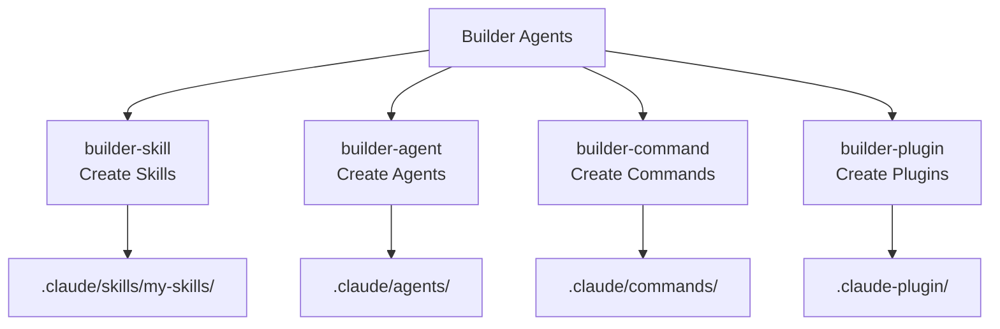

import { Callout } from "nextra/components";

# Builder Agents Guide

Detailed guide to the 4 builder agents that extend MoAI-ADK.

<Callout type="tip">
  **One-line summary**: Builder agents are the **extension toolkit factory** of MoAI-ADK. You can customize the system by creating skills, agents, commands, and plugins.
</Callout>

## What are Builder Agents?

In addition to the 52 built-in skills and 20 agents, MoAI-ADK provides 4 builder agents that users can use to extend the system.



### 4 Types of Extensions

| Type   | Builder            | Purpose                              | Invocation Method            |
| ------ | ------------------ | ------------------------------------ | ----------------------------- |
| Skill  | `builder-skill`    | Provide new expertise to AI          | Auto trigger / `Skill()`      |
| Agent  | `builder-agent`    | Define new expert roles              | Alfred delegates              |
| Command| `builder-command`  | Create user shortcut commands        | `/command`                    |
| Plugin | `builder-plugin`   | Bundle deploy: skill+agent+command   | `plugin install`              |

## Creating Skills (builder-skill)

### What is a Skill?

A skill is a document that provides **specific domain expertise** to Claude Code. When a skill is loaded, Claude Code learns the best practices, patterns, and rules of that domain.

### YAML Frontmatter Schema

The `SKILL.md` file of a skill must begin with YAML frontmatter.

```yaml
---
# Official Fields
name: my-custom-skill # Skill identifier (kebab-case, max 64 characters)
description: > # Purpose description (50-1024 characters, 3rd person)
  Description of custom skill. What tasks it's used for, what expertise it provides,
  written in 3rd person.
allowed-tools: # Allowed tools (comma-separated or list)
  - Read
  - Grep
  - Glob
model: claude-sonnet-4-20250514 # Model to use (defaults to current model if omitted)
context: fork # Execute in subagent context
agent: general-purpose # Agent to use when context: fork
hooks: # Skill lifecycle hooks
  PreToolUse: ...
user-invocable: true # Show in slash command menu
disable-model-invocation: false # If false, Claude can also invoke directly
argument-hint: "[issue-number]" # Autocomplete hint

# MoAI-ADK Extended Fields
version: 1.0.0 # Semantic version (MAJOR.MINOR.PATCH)
category: domain # One of 8 categories
modularized: false # Whether to use modules/ directory
status: active # active | experimental | deprecated
updated: "2025-01-28" # Last modified date
tags: # Array of tags for discovery
  - graphql
  - api
related-skills: # Related skills
  - moai-domain-backend
  - moai-lang-typescript
context7-libraries: # MCP Context7 library IDs
  - graphql
aliases: # Alternative names
  - graphql-expert
author: YourName # Author
---
```

### Frontmatter Field Details

| Field                      | Required | Description                                        | Example                       |
| -------------------------- | -------- | -------------------------------------------------- | ----------------------------- |
| `name`                     | Optional| kebab-case identifier (max 64 characters)          | `my-graphql-patterns`         |
| `description`              | Recommended | 50-1024 characters, 3rd person, for discovery | "Provides GraphQL API patterns..." |
| `allowed-tools`            | Optional | Tools allowed when skill is active                 | `["Read", "Grep"]`            |
| `model`                    | Optional | Model to use                                       | `claude-sonnet-4-20250514`    |
| `context`                  | Optional | Run in subagent when `fork` is set                 | `fork`                        |
| `agent`                    | Optional | Agent to use when `context: fork`                   | `general-purpose`             |
| `hooks`                    | Optional | Skill lifecycle hooks                               | `PreToolUse: ...`             |
| `user-invocable`           | Optional | Show in slash menu (default: true)                  | `true`                        |
| `disable-model-invocation` | Optional | If true, only user can invoke                      | `false`                       |
| `argument-hint`            | Optional | Autocomplete hint                                  | `"[issue-number]"`            |
| `version`                  | MoAI     | Semantic version                                   | `1.0.0`                       |
| `category`                 | MoAI     | Category                                           | `domain`                      |
| `modularized`              | MoAI     | Whether modularized                                | `false`                       |
| `status`                   | MoAI     | Active status                                      | `active`                      |

### Skill Directory Structure

```text
.claude/skills/my-skills/
└── my-graphql-patterns/
    ├── SKILL.md            # Main skill document (under 500 lines)
    ├── modules/            # In-depth documentation (unlimited)
    │   ├── schema-design.md
    │   └── resolver-patterns.md
    ├── examples.md         # Real-world examples
    └── reference.md        # External references
```

<Callout type="warning">
  **Important**: The filename must use **uppercase** `SKILL.md`. Create user custom skills in the `.claude/skills/my-skills/` directory. The `moai-*` prefix is reserved for MoAI-ADK official skills only.
</Callout>

### String Substitutions

The following runtime substitutions can be used in the skill body.

| Substitution              | Description                   | Example                         |
| ------------------------- | ----------------------------- | ------------------------------- |
| `$ARGUMENTS`              | All arguments when invoking skill | `/skill foo bar` → `foo bar` |
| `$ARGUMENTS[N]` or `$N`   | Nth argument (0-indexed)      | `$0`, `$1`                      |
| `${CLAUDE_SESSION_ID}`    | Current session ID            | For session tracking            |

### Dynamic Context Injection

You can execute shell commands before loading the skill and inject their output using the `!`command`` syntax.

```markdown
---
# YAML
---

# Project Information

Project name: !basename $(pwd)
Git branch: !git branch --show-current
```

### Invocation Control Modes

There are three invocation modes.

| Mode    | Setting                             | Description                           | Purpose                  |
| ------- | ----------------------------------- | ------------------------------------- | ------------------------ |
| Default | Omit both fields                    | Both user and Claude can invoke       | General skills           |
| User-only | `disable-model-invocation: true` | Only user can invoke with `/name`     | Deployment, commit workflows |
| Claude-only | `user-invocable: false`        | Hidden from menu, only Claude invokes | Background knowledge     |

### Repository Priority

When skills are defined in duplicate locations, the priority is as follows:

1. **Enterprise**: Managed settings (highest priority)
2. **Personal**: `~/.claude/skills/` (individual)
3. **Project**: `.claude/skills/` (team shared, version controlled)
4. **Plugin**: Installed plugin bundles (lowest priority)

### Creating Skills

```bash
# Invoke builder-skill in Claude Code
> Create a custom skill for GraphQL API design patterns
```

Generated file: `.claude/skills/my-skills/my-graphql-patterns/SKILL.md`

```markdown
---
name: my-graphql-patterns
description: >
  GraphQL API design expert. Provides schema design, resolver patterns, N+1 problem
  resolution, DataLoader patterns. Use when developing GraphQL APIs.
version: 1.0.0
category: domain
status: active
triggers:
  keywords: ["graphql", "schema", "resolver", "dataloader"]
  agents: ["expert-backend"]
allowed-tools: ["Read", "Grep", "Glob"]
---

# GraphQL API Design Expert

## Quick Reference

- Schema-first design
- DataLoader essential for preventing N+1 problems
- Use Relay Cursor pagination

## Implementation Guide

(Detailed implementation guide)

## Advanced Patterns

(Advanced patterns)

## Works Well With

- moai-domain-backend
- moai-lang-typescript
```

<Callout type="warning">
  **Constraint**: **NEVER use the `moai-` prefix** for user skill names. This namespace is reserved for MoAI-ADK system skills. Exceptions are only granted for admin mode (system skill) requests.
</Callout>

## Creating Agents (builder-agent)

### Agent Definition Structure

Agents are defined as markdown files with metadata in YAML frontmatter.

```markdown
---
name: my-data-analyst
description: >
  Data analysis expert. Responsible for data pipeline design, ETL processes,
  analytics query optimization. PROACTIVELY use for automatic delegation
  during data analysis tasks.
tools: Read, Write, Edit, Grep, Glob, Bash, TodoWrite
disallowedTools: Task, Skill # Optional: tools to exclude
model: sonnet # sonnet | opus | haiku | inherit
permissionMode: default # Permission mode
skills: # Skills to preload
  - moai-lang-python
  - moai-domain-database
hooks: # Agent lifecycle hooks
  PostToolUse:
    - matcher: "Write|Edit"
      hooks:
        - type: command
          command: "echo 'File modified'"
---

You are a data analysis expert.

## Primary Mission

Provide data-driven insights through data pipeline design and implementation.

## Core Capabilities

- Data pipeline design and implementation
- ETL process automation
- Analytics query optimization
- Data visualization

## Scope Boundaries

IN SCOPE:
- Data analysis and visualization
- ETL process design
- Query performance optimization

OUT OF SCOPE:
- ML model development (delegate to expert-data-science)
- Infrastructure configuration (delegate to expert-devops)

## Delegation Protocol

- For ML model needs: expert-data-science
- For infrastructure setup: expert-devops

## Quality Standards

- Follow TRUST 5 framework
- Verify data integrity
- Optimize query performance
```

### Agent Frontmatter Field Details

| Field              | Required | Description                                                       |
| ------------------ | -------- | ------------------------------------------------------------------ |
| `name`             | Required | Agent identifier (kebab-case, max 64 characters)                  |
| `description`      | Required | Role description. Including `PROACTIVELY` keyword enables auto delegation |
| `tools`            | Optional | Allowed tools (comma-separated, inherits all if omitted)          |
| `disallowedTools`  | Optional | Tools to exclude (removed from inherited tools)                   |
| `model`            | Optional | `sonnet`, `opus`, `haiku`, `inherit` (default: configured model)  |
| `permissionMode`   | Optional | Permission mode (see below)                                       |
| `skills`          | Optional | List of skills to preload (not inherited)                         |
| `hooks`           | Optional | Agent lifecycle hooks                                              |

### Permission Modes

5 permission modes control tool approval behavior.

| Mode                | Description                    | Purpose                      |
| ------------------- | ------------------------------ | ---------------------------- |
| `default`           | Standard permission prompts    | General agents               |
| `acceptEdits`       | Auto-approve file edits        | Edit-focused tasks           |
| `dontAsk`           | Auto-deny all prompts          | Only use pre-approved tools  |
| `bypassPermissions` | Skip all permission checks     | Trusted agents only          |
| `plan`              | Read-only exploration mode     | When modification prevention needed |

### Ways to Create Agents

There are 4 ways to create agents.

| Method           | Description                    | Location              |
| ---------------- | ------------------------------ | --------------------- |
| `/agents` command | Interactive interface          | Project/Personal      |
| Manual file creation | Direct markdown file editing | `.claude/agents/`     |
| CLI flag         | `--agents` JSON definition     | Session-only          |
| Plugin distribution | Plugin bundle               | Installed plugins     |

### Agent Repository Priority

When the same agent name is defined in multiple locations:

1. **Project level**: `.claude/agents/` (highest priority, version controlled)
2. **User level**: `~/.claude/agents/` (individual, non-versioned)
3. **CLI flag**: `--agents` JSON (session-only)
4. **Plugin**: Installed plugins (lowest priority)

### Built-in Agent Types

Claude Code includes several built-in agents.

| Agent            | Model    | Characteristics                               |
| ---------------- | -------- | --------------------------------------------- |
| `Explore`        | haiku    | Read-only tools, optimized for codebase search |
| `Plan`           | inherit  | plan permission mode, read-only tools         |
| `general-purpose`| inherit  | All tools, complex multi-step tasks            |
| `Bash`           | inherit  | Execute terminal commands                     |
| `Claude Code Guide` | haiku | Q&A about Claude Code features               |

### Skills Preloading

Skills listed in the `skills` field have their **full content injected** at agent startup.

- Does **not inherit** skills from parent conversation
- Full content of each skill is injected into system prompt
- List only essential skills to minimize token consumption
- Order matters: higher priority skills first

### Hooks Configuration

Agents can define lifecycle hooks in their frontmatter.

| Event        | Description                              |
| ------------ | ---------------------------------------- |
| `PreToolUse`  | Before tool execution (validation, pre-checks) |
| `PostToolUse` | After tool completion (lint, formatting, logging) |
| `Stop`        | When agent execution completes           |

### Key Constraints

| Constraint              | Description                                                       |
| ----------------------- | ------------------------------------------------------------------ |
| Cannot create subagents | Subagents cannot spawn other subagents                            |
| AskUserQuestion limited | Subagents cannot interact directly with users                     |
| Skills not inherited    | Does not inherit skills from parent conversation                  |
| MCP tools restricted    | MCP tools cannot be used in background subagents                  |
| Independent context     | Each subagent has independent 200K token context                  |

## Creating Plugins (builder-plugin)

### What is a Plugin?

A plugin is a **distribution unit that bundles** skills, agents, commands, Hooks, and MCP servers into a single package.

<Callout type="warning">
  **Important constraint**: The commands/, agents/, skills/, hooks/ directories must be located at the **plugin root**. They should not be placed inside .claude-plugin/.
</Callout>

### Plugin Directory Structure

```text
my-plugin/
├── .claude-plugin/
│   └── plugin.json         # Plugin manifest
├── commands/               # Slash commands (root level!)
│   └── analyze.md
├── agents/                 # Agent definitions (root level!)
│   └── data-expert.md
├── skills/                 # Skill definitions (root level!)
│   └── my-skill/
│       └── SKILL.md
├── hooks/                  # Hooks configuration (root level!)
│   └── hooks.json
├── .mcp.json               # MCP server configuration
├── .lsp.json               # LSP server configuration
├── LICENSE
├── CHANGELOG.md
└── README.md
```

<Callout type="warning">
  **Wrong example**: .claude-plugin/commands/ (commands inside .claude-plugin)
  **Correct example**: commands/ (commands at plugin root)
</Callout>

### Plugin Manifest (plugin.json)

```json
{
  "name": "my-data-plugin",
  "version": "1.0.0",
  "description": "Comprehensive plugin for data analysis tasks",
  "author": {
    "name": "My Team",
    "email": "team@example.com",
    "url": "https://example.com"
  },
  "homepage": "https://example.com/docs",
  "repository": {
    "type": "git",
    "url": "https://github.com/owner/repo"
  },
  "license": "MIT",
  "keywords": ["data", "analytics", "etl"],
  "commands": ["./commands/"],
  "agents": ["./agents/"],
  "skills": ["./skills/"],
  "hooks": "./hooks/hooks.json",
  "mcpServers": "./.mcp.json",
  "lspServers": "./.lsp.json",
  "outputStyles": "./output-styles/"
}
```

### Field Details

| Field          | Required | Description                               |
| -------------- | -------- | ----------------------------------------- |
| `name`         | Required | kebab-case plugin identifier              |
| `version`      | Required | Semantic version (e.g., "1.0.0")          |
| `description`  | Required | Clear purpose description                 |
| `author`       | Optional | name, email, url properties               |
| `homepage`     | Optional | Documentation or project URL              |
| `repository`   | Optional | Source code repository URL                |
| `license`      | Optional | SPDX license identifier                    |
| `keywords`     | Optional | Array of keywords for discovery           |
| `commands`     | Optional | Command path (must start with "./")        |
| `agents`       | Optional | Agent path (must start with "./")          |
| `skills`       | Optional | Skill path (must start with "./")          |
| `hooks`        | Optional | Hooks path (must start with "./")          |
| `mcpServers`   | Optional | MCP server configuration path             |
| `lspServers`   | Optional | LSP server configuration path             |

### Path Rules

- All paths are relative to the plugin root
- All paths must start with **"./"**
- Available environment variables: `${CLAUDE_PLUGIN_ROOT}`, `${CLAUDE_PROJECT_DIR}`

### Marketplace Setup (marketplace.json)

To distribute multiple plugins, create a marketplace.json.

```json
{
  "name": "my-marketplace",
  "owner": {
    "name": "My Organization",
    "email": "plugins@example.com"
  },
  "plugins": [
    {
      "name": "plugin-one",
      "source": "./plugins/plugin-one"
    },
    {
      "name": "plugin-two",
      "source": {
        "type": "github",
        "repo": "owner/repo"
      }
    }
  ]
}
```

### Installation Scopes

| Scope   | Location                          | Description                          |
| ------- | --------------------------------- | ------------------------------------ |
| `user`  | `~/.claude/settings.json`        | Personal plugins (default)           |
| `project`| `.claude/settings.json`          | Team shared (version controlled)     |
| `local` | `.claude/settings.local.json`    | Developer-only (gitignored)          |
| `managed`| `managed-settings.json`          | Enterprise managed (read-only)       |

### Plugin Installation and Management

```bash
# Install plugin from GitHub
$ /plugin install owner/repo

# Validate local plugin
$ /plugin validate .

# Enable plugin
$ /plugin enable my-data-plugin

# Add marketplace
$ /plugin marketplace add ./path/to/marketplace

# List installed plugins
$ /plugin list
```

### Plugin Caching and Security

**Caching behavior**:

- Plugins are copied to a cache directory for security and validation
- All relative paths are resolved within the cached plugin directory
- Path traversal like `../shared-utils` will not work

**Security warning**:

- Verify the source before installing plugins
- Anthropic does not control MCP servers, files, or software from third-party plugins
- Review plugin source code before installation

### Real-World Plugin Creation Example

```bash
# Plugin creation request
> Create a data analysis plugin.
> Include skills, agents, and commands.
```

## Custom Preservation Locations

Locations where user custom files are preserved during MoAI-ADK updates.

| Type     | Preserved Locations            | Overwritten Locations        |
| -------- | ------------------------------ | ---------------------------- |
| Skills   | `.claude/skills/my-skills/`    | `.claude/skills/moai-*/`     |
| Agents   | User-defined agents             | `.claude/agents/moai/`       |
| Commands | User-defined commands           | `.claude/commands/moai/`     |
| Hooks    | User-defined Hooks              | `.claude/hooks/moai/`        |
| Rules    | `.claude/rules/local/`          | `.claude/rules/moai/`        |
| Settings | `.claude/settings.local.json`   | `.claude/settings.json`      |
| Guidelines | `CLAUDE.local.md`              | `CLAUDE.md`                  |

<Callout type="info">
  **Recommendation**: Always create personal extensions in `my-skills/` or `local/` directories. They are safely preserved during MoAI-ADK updates.
</Callout>

## How to Invoke Builder Agents

Builder agents are automatically invoked when you request them in natural language to Alfred.

```bash
# Create skill
> @"builder-skill (agent)" Create a custom skill for GraphQL patterns

# Create agent
> @"builder-agent (agent)" Create a data analysis expert agent

# Create plugin
> @"builder-plugin (agent)" Create a comprehensive data analysis plugin
```

## Key Constraints

| Constraint              | Description                                                           |
| ----------------------- | --------------------------------------------------------------------- |
| Cannot create subagents | Subagents cannot spawn other subagents                                |
| User interaction limited| Subagents cannot interact directly with users (only Alfred can)      |
| Skills not inherited    | Does not inherit skills from parent conversation (explicit listing needed) |
| Independent context     | Each subagent has independent 200K token context                      |
| moai- prefix prohibited | User skills/agents cannot use `moai-` prefix                          |
| SKILL.md naming         | Skill main file must use uppercase `SKILL.md`                         |
| Plugin component location| Plugin's commands/, agents/, skills/ must be at root                 |

## Related Documentation

- [Skill Guide](/advanced/skill-guide) - Skill system details
- [Agent Guide](/advanced/agent-guide) - Agent system details
- [Hooks Guide](/advanced/hooks-guide) - Event automation
- [settings.json Guide](/advanced/settings-json) - Configuration management

<Callout type="tip">
  **Tip**: We recommend starting with **skill creation**. Skills are the lightest and fastest way to extend MoAI-ADK.
</Callout>