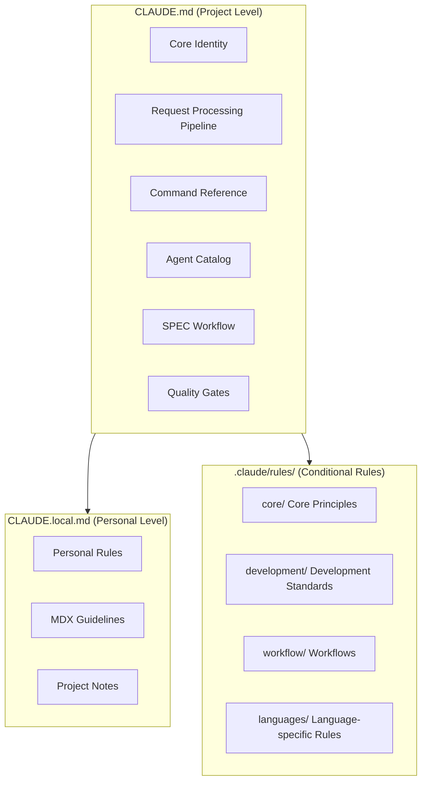
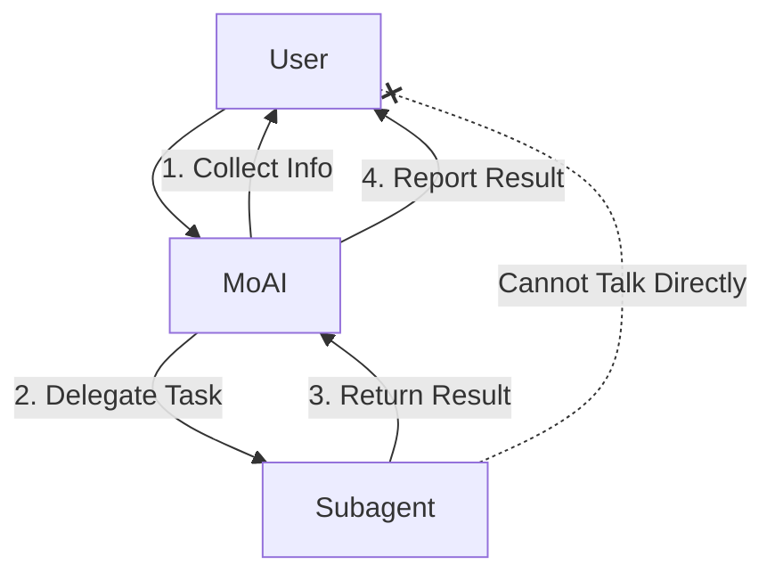
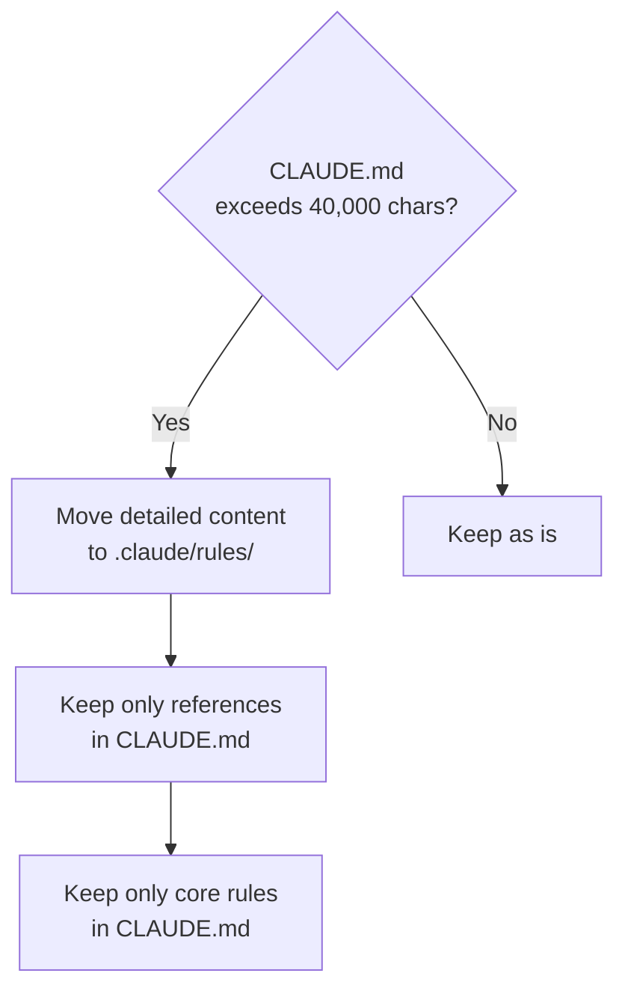
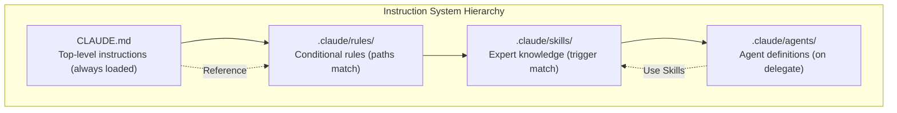

import { Callout } from 'nextra/components'

# CLAUDE.md Guide

Detailed guide to Claude Code's core instruction file system.

<Callout type="tip">
**One-line summary**: `CLAUDE.md` is your project's **constitution**. It determines how Claude Code understands your project, what rules it follows, and which agents it calls.
</Callout>

## What is CLAUDE.md?

`CLAUDE.md` is the **first instruction file** Claude Code reads when starting a session. This file defines your project's rules, agent structure, workflows, quality standards, and more.

Just as a person reads an employee handbook when joining a new company, Claude Code reads `CLAUDE.md` when starting a session to understand the project context.

## File Structure

MoAI-ADK uses 2 instruction files and a rules directory.



| File/Directory | Purpose | Git Tracked | Update Behavior |
|---------------|---------|--------------|-----------------|
| `CLAUDE.md` | MoAI-ADK core instructions | Yes | Overwritten |
| `CLAUDE.local.md` | Personal custom instructions | No | Preserved |
| `.claude/rules/moai/` | Conditional detailed rules | Yes | Overwritten |
| `.claude/rules/local/` | Personal custom rules | No | Preserved |

## MoAI CLAUDE.md Main Sections

### 1. Core Identity

Defines the role of the MoAI orchestrator and HARD rules.

```markdown
## 1. Core Identity

MoAI is the Strategic Orchestrator for Claude Code.

### HARD Rules (Required)
- [HARD] Language-aware responses: Respond in user's conversation_language
- [HARD] Parallel execution: Execute independent tool calls in parallel
- [HARD] No XML tags: Don't display XML in user-facing responses
- [HARD] Markdown output: Use Markdown for all communications
```

### 2. Request Processing Pipeline

4-stage pipeline for analyzing and routing user requests.

| Stage | Description |
|-------|-------------|
| 1. Analyze | Evaluate request complexity, detect technical keywords |
| 2. Route | Select appropriate path based on command type |
| 3. Execute | Delegate to agents to perform tasks |
| 4. Report | Integrate results and report to user |

### 3. Command Reference

Defines 3 command types in MoAI-ADK.

| Type | Commands | Purpose |
|------|-----------|---------|
| Type A (Workflow) | `/moai project`, `/moai plan`, `/moai run`, `/moai sync` | Major development workflows |
| Type B (Utility) | `/moai`, `/moai fix`, `/moai loop` | Quick fixes, automation |
| Type C (Feedback) | `/moai feedback` | Improvement reports |

### 4. Agent Catalog

Defines roles and selection criteria for 20 agents.

| Tier | Agents | Count |
|------|--------|-------|
| Manager | spec, ddd, docs, quality, strategy, project, git | 7 |
| Expert | backend, frontend, security, devops, performance, debug, testing, refactoring, chrome-extension | 9 |
| Builder | agent, skill, command, plugin | 4 |

### 5. SPEC Workflow

Defines 3-stage SPEC-based development workflow.

```bash
# Plan: Create SPEC document (30K tokens)
> /moai plan "feature description"

# Run: DDD implementation (180K tokens)
> /moai run SPEC-XXX

# Sync: Documentation sync (40K tokens)
> /moai sync SPEC-XXX
```

### 6. Quality Gates

Defines TRUST 5 framework and LSP quality gates.

| Quality Standard | Requirements |
|-----------------|--------------|
| Tested | 85%+ coverage, 0 LSP type errors |
| Readable | Clear names, 0 LSP lint errors |
| Unified | Consistent style, ≤10 LSP warnings |
| Secured | OWASP compliance, 0 LSP security warnings |
| Trackable | Clear commits, LSP state tracking |

### 7. User Interaction Architecture

Subagents cannot directly interact with users.



### 8. Configuration Reference

References language settings, user settings, and project rules.

```yaml
language:
  conversation_language: ko           # User response language
  agent_prompt_language: en           # Agent internal language
  git_commit_messages: en             # Git commit messages
  code_comments: en                   # Code comments
  documentation: en                   # Documentation files
```

## Using CLAUDE.local.md

`CLAUDE.local.md` is for writing personal rules and notes. It's preserved regardless of MoAI-ADK updates.

### Writing Example

```markdown
# Project Local Settings

## Documentation Writing Guidelines

### Prevent MDX Rendering Errors
- Always add space between emphasis and parentheses

### Mermaid Diagram Direction
- All diagrams in vertical orientation (flowchart TD)

## Personal Notes
- Backup required before DB migration
- API endpoint naming: use kebab-case
```

### Usage Tips

| Purpose | Example Content |
|---------|-----------------|
| Coding rules | "Variable names in camelCase, file names in kebab-case" |
| Project notes | "Auth: JWT, expires 24h, refresh 7d" |
| Prohibitions | "Don't leave console.log in production code" |
| Preferred patterns | "Use only function components for React" |
| MDX rules | "Space required between emphasis and parentheses" |

## .claude/rules/ System

The `.claude/rules/` directory stores **conditionally loaded detailed rules**.

### Directory Structure

```
.claude/rules/moai/
├── core/                          # Core principles
│   └── moai-constitution.md       # TRUST 5, core rules
├── development/                   # Development standards
│   ├── skill-authoring.md         # Skill writing guide
│   └── coding-standards.md        # Coding standards
├── workflow/                      # Workflows
│   ├── workflow-modes.md          # Plan/Run/Sync definitions
│   └── spec-workflow.md           # SPEC workflow
└── languages/                     # Language-specific rules (16)
    ├── python.md
    ├── typescript.md
    ├── javascript.md
    └── ...
```

### Conditional Loading (paths frontmatter)

Rule files are loaded **only when working on specific files** via `paths` frontmatter.

```yaml
---
paths:
  - "**/*.py"
  - "**/pyproject.toml"
---

# Python coding rules
- Use ruff formatter
- Type hints required
- Docstrings in Google style
```

This rule is only loaded when modifying Python files, **saving tokens**.

### Rule File Types

| Directory | File | Load Condition |
|----------|------|---------------|
| `core/` | `moai-constitution.md` | Always loaded |
| `development/` | `skill-authoring.md` | During skill-related work |
| `development/` | `coding-standards.md` | During code work |
| `workflow/` | `workflow-modes.md` | During workflow commands |
| `workflow/` | `spec-workflow.md` | During SPEC-related work |
| `languages/` | `python.md` etc. | When modifying that language's files |

## Size Limits

`CLAUDE.md` should be kept at **40,000 characters or less**.

### Response to Size Exceeded



**Response Strategy:**

1. **Move detailed content**: Separate long explanations into `.claude/rules/` files
2. **Use references**: Reference from `CLAUDE.md` using `@filepath`
3. **Keep only essentials**: Maintain only identity, HARD rules, agent catalog
4. **Convert to skills**: Convert long pattern explanations to skills

## Practical Example: CLAUDE.local.md Custom Rules

### Frontend Project

```markdown
# Project Local Settings

## React Rules
- Components must be written as function components
- Props interfaces defined at top of component file
- Use Zustand for state management
- Use only Tailwind CSS for CSS

## Naming Rules
- Components: PascalCase (UserProfile.tsx)
- Utilities: camelCase (formatDate.ts)
- Constants: UPPER_SNAKE_CASE (MAX_RETRY_COUNT)
- API endpoints: kebab-case (/api/user-profiles)

## Prohibitions
- No `any` type usage
- No console.log in production code
- No default exports (only named exports)
```

### Backend Project

```markdown
# Project Local Settings

## Python Rules
- Use FastAPI
- Prefer async functions (async/await)
- Use Pydantic v2 models
- SQLAlchemy 2.0 style

## Database Rules
- Backup required before migration
- Add indexes after query pattern analysis
- Use soft delete pattern (is_deleted flag)

## API Rules
- RESTful endpoint naming
- Unified response format: {"data": ..., "message": ...}
- Standardized error codes
```

## Relationship Between CLAUDE.md, Rules, Skills, and Agents



| Layer | File | Load Time | Role |
|-------|------|-----------|-----|
| 1. CLAUDE.md | `CLAUDE.md` | Always | Project identity, core rules |
| 2. Rules | `.claude/rules/*.md` | File pattern match | Conditional detailed rules |
| 3. Skills | `.claude/skills/*/skill.md` | Trigger match | Expert knowledge, patterns |
| 4. Agents | `.claude/agents/*.md` | On delegation | Expert role definitions |

## Related Documentation

- [Skill Guide](/advanced/skill-guide) - Detailed skill system
- [Agent Guide](/advanced/agent-guide) - Detailed agent system
- [settings.json Guide](/advanced/settings-json) - Settings file management
- [Hooks Guide](/advanced/hooks-guide) - Event automation

<Callout type="tip">
**Tip**: Instead of directly modifying `CLAUDE.md`, it's recommended to add personal rules in `CLAUDE.local.md`. Personal rules are safely preserved during MoAI-ADK updates.
</Callout>