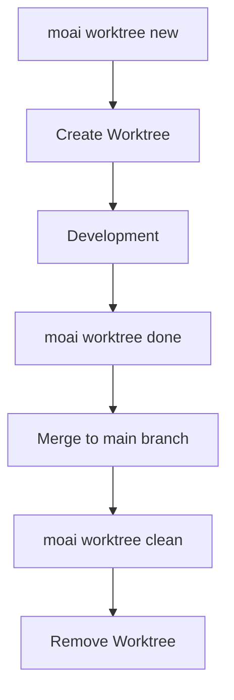

import { Callout } from 'nextra/components'

# CLI Reference

Reference all commands and options of the MoAI-ADK command-line interface.

## Command List

```bash
moai --help
```

**Output Example:**

```bash
Usage: moai [OPTIONS] COMMAND [ARGS]...

  MoAI Agentic Development Kit

  SPEC-First DDD Framework with Alfred SuperAgent

Options:
  --version  Show the version and exit.
  --help     Show this message and exit.

Commands:
  claude      Switch to Claude backend (Anthropic API)
  doctor      Run system diagnostics
  glm         Switch to GLM backend (cost-effective) or update API key
  init        Initialize a new MoAI-ADK project
  rank        MoAI Rank - Token usage leaderboard.
  status      Show project status
  statusline  Render Claude Code statusline (internal use only)
  update      Update MoAI-ADK to latest version
  worktree    Manage Git worktrees for parallel SPEC development.
```

| Command | Description |
|---------|-------------|
| `moai init` | Initialize project |
| `moai update` | Update MoAI-ADK |
| `moai doctor` | System diagnostics |
| `moai glm` | Switch to GLM backend |
| `moai claude`, `moai cc` | Switch to Claude backend |
| `moai status` | Check project status |
| `moai worktree` | Manage Git worktrees |
| `moai rank` | Token usage ranking |

---

## moai init

Initialize a project.

```bash
moai init [PATH] [OPTIONS]
```

### Options

| Option | Description |
|--------|-------------|
| `-y, --non-interactive` | Non-interactive mode (use defaults) |
| `--mode [personal\|team]` | Project mode |
| `--locale [ko\|en\|ja\|zh]` | Preferred language (default: en) |
| `--language TEXT` | Programming language (auto-detect if specified) |
| `--force` | Force re-initialization without confirmation |

### Examples

```bash
# Initialize new project
moai init my-project

# Korean, team mode
moai init my-project --locale ko --mode team

# Python project
moai init --language python
```

---

## moai update

Update MoAI-ADK to the latest version.

```bash
moai update [OPTIONS]
```

### Options

| Option | Description |
|--------|-------------|
| `--path PATH` | Project path (default: current directory) |
| `--force` | Force update without backup |
| `--check` | Check version only (no update) |
| `--project` | Sync project templates only |
| `--templates-only` | Sync templates only (skip package upgrade) |
| `--yes` | Auto confirm (CI/CD mode) |
| `-c, --config` | Edit project config (same as initial setup wizard) |
| `--merge` | Auto merge (preserve user changes) |
| `--manual` | Manual merge (create guide) |

### Examples

```bash
# Check for updates
moai update --check

# Force update
moai update --force

# Auto merge
moai update --merge
```

<Callout type="warning">
**Important:** `--force` option does not create backups. User changes may be lost.
</Callout>

---

## moai doctor

Run system diagnostics.

```bash
moai doctor [OPTIONS]
```

### Options

| Option | Description |
|--------|-------------|
| `-v, --verbose` | Show detailed tool versions and language detection |
| `--fix` | Suggest fixes for missing tools |
| `--export PATH` | Export to JSON file |
| `--check TEXT` | Check only specific tool |
| `--check-commands` | Diagnose slash command loading issues |
| `--shell` | Diagnose shell and PATH configuration (WSL/Linux) |

### Examples

```bash
# Full diagnostics
moai doctor

# Verbose diagnostics
moai doctor --verbose

# Suggest fixes
moai doctor --fix
```

---

## moai glm

Switch to GLM backend or update API key.

```bash
moai glm [OPTIONS] [API_KEY]
```

### Options

| Option | Description |
|--------|-------------|
| `--help` | Show help |

### Usage

```bash
# Switch to GLM backend
moai glm

# Update API key
moai glm <api-key>

# Get API key from z.ai
# https://z.ai/subscribe?ic=1NDV03BGWU
```

---

## moai claude

Switch to Claude backend (Anthropic API).

```bash
$ moai claude
# Or shorthand
$ moai cc
```

---

## moai status

Check project status.

```bash
moai status
```

**Output Example:**

```
╭────── Project Status ──────╮
│   Mode          personal   │
│   Locale        unknown    │
│   SPECs         1          │
│   Branch        main       │
│   Git Status    Modified   │
╰────────────────────────────╯
```

**Output Information:**
- **Mode**: Work mode (personal, team, manual)
- **Locale**: Language setting
- **SPECs**: Number of active SPECs
- **Branch**: Current branch
- **Git Status**: Git status (Clean, Modified)

---

## moai worktree

Manage Git worktrees for parallel SPEC development.

```bash
moai worktree [OPTIONS] COMMAND [ARGS]...
```

### Subcommands

| Command | Description |
|---------|-------------|
| `moai worktree new` | Create new worktree |
| `moai worktree list` | List active worktrees |
| `moai worktree switch` | Switch to a worktree |
| `moai worktree go` | Navigate to worktree directory |
| `moai worktree sync` | Sync with upstream |
| `moai worktree remove` | Remove worktree |
| `moai worktree clean` | Clean up stale worktrees |
| `moai worktree recover` | Recover from existing directory |

### moai worktree new

Create a new worktree.

```bash
moai worktree new [OPTIONS] SPEC_ID
```

#### Options

| Option | Description |
|--------|-------------|
| `-b, --branch TEXT` | User branch name |
| `--base TEXT` | Base branch (default: main) |
| `--repo PATH` | Repository path |
| `--worktree-root PATH` | Worktree root path |
| `-f, --force` | Force create even if exists |
| `--glm` | Use GLM LLM settings |
| `--llm-config PATH` | User LLM config file path |

#### Examples

```bash
# Create worktree for SPEC-001
moai worktree new SPEC-001

# Specify user branch
moai worktree new SPEC-001 --branch feature-auth

# Change base branch
moai worktree new SPEC-001 --base develop
```

### moai worktree list

List active worktrees.

```bash
moai worktree list [OPTIONS]
```

#### Options

| Option | Description |
|--------|-------------|
| `--format [table\|json]` | Output format |
| `--repo PATH` | Repository path |
| `--worktree-root PATH` | Worktree root path |

### moai worktree remove

Remove a worktree.

```bash
moai worktree remove [OPTIONS] SPEC_ID
```

#### Options

| Option | Description |
|--------|-------------|
| `-f, --force` | Force remove uncommitted changes |
| `--repo PATH` | Repository path |
| `--worktree-root PATH` | Worktree root path |

### worktree Workflow



---

## moai rank

Display token usage ranking.

```bash
moai rank
```

---

## moai hook

Claude Code hook dispatcher for MoAI-ADK events.

```bash
moai hook <event>
```

### Supported Events

| Event | Description |
|-------|-------------|
| `PreToolUse` | Before tool execution |
| `PostToolUse` | After tool execution |
| `Notification` | System notifications |
| `Stop` | Session end |

### Examples

```bash
# Run PreToolUse hook
moai hook PreToolUse

# Run PostToolUse hook
moai hook PostToolUse
```

---

## Environment Variables

| Variable | Description |
|----------|-------------|
| `MOAI_API_KEY` | API key (Claude/GLM) |
| `MOAI_MODE` | Execution mode (development/production) |
| `MOAI_LOCALE` | Language setting (ko/en/ja/zh) |
| `MOAI_WORKTREE_ROOT` | Worktree root path |

---

## See Also

- [Quick Start](./quickstart)
- [Installation](./installation)
- [Update](./update)