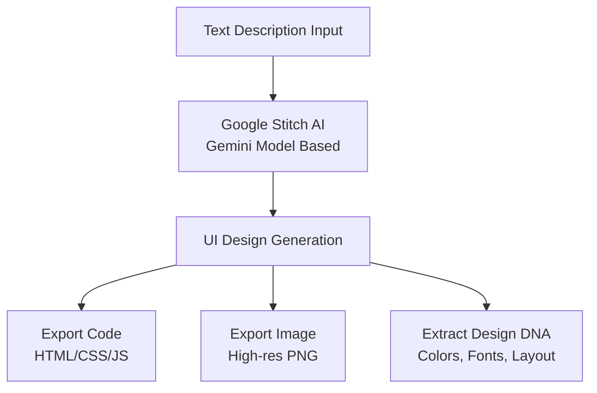
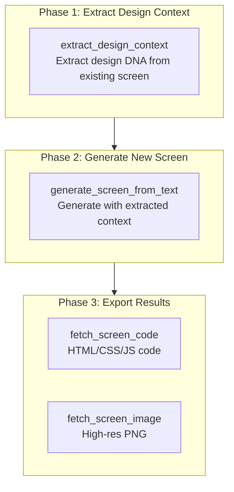
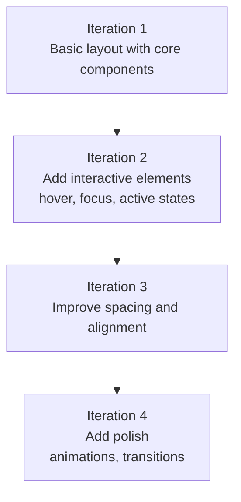

import { Callout } from 'nextra/components'

# Google Stitch Guide

Detailed guide to generating AI-powered UI/UX designs using the Google Stitch MCP server.

<Callout type="tip">
**One-line summary**: Google Stitch is an **AI design tool that generates UI screens from text descriptions**. Through the MCP server, you can directly generate UI in Claude Code, extract design context, and export to production code.
</Callout>

## What is Google Stitch?

Google Stitch is an AI-powered UI/UX design generation tool developed by Google Labs. It uses the Gemini AI model to transform natural language descriptions into professional-grade UI screens.

Even in development environments without designers, you can quickly prototype UIs while maintaining a consistent design system.



### Key Features

| Feature | Description |
|---------|-------------|
| **AI Design Generation** | Generate complete UI screens from text prompts |
| **Design DNA Extraction** | Extract colors, fonts, layout patterns from existing screens |
| **Code Export** | Generate production-ready HTML/CSS/JavaScript code |
| **Image Export** | Download high-resolution PNG screenshots |
| **Project Management** | Organize and manage screens as projects |
| **Figma Integration** | Copy generated designs to Figma |

<Callout type="info">
Google Stitch is available **for free**. Standard Mode allows 350 generations per month, Experimental Mode allows 50 generations per month. Only requires a Google account.
</Callout>

## Prerequisites

To use the Google Stitch MCP, you need the following 4-step setup.

### Step 1: Create Google Cloud Project

Create a new project in Google Cloud Console or select an existing one.

```bash
# If you don't have gcloud CLI, install it first
# https://cloud.google.com/sdk/docs/install

# Google Cloud authentication
gcloud auth login

# Set project (if using existing project)
gcloud config set project YOUR_PROJECT_ID
```

### Step 2: Enable Stitch API

```bash
# Install beta component (first time only)
gcloud components install beta

# Enable Stitch API
gcloud beta services mcp enable stitch.googleapis.com --project=YOUR_PROJECT_ID
```

### Step 3: Configure Application Default Credentials

```bash
# Application default credentials login
gcloud auth application-default login

# Set quota project
gcloud auth application-default set-quota-project YOUR_PROJECT_ID
```

### Step 4: Set Environment Variable

```bash
# Add to .bashrc or .zshrc
export GOOGLE_CLOUD_PROJECT="YOUR_PROJECT_ID"
```

<Callout type="warning">
**Google Cloud project must have billing enabled**. Stitch itself is free, but requires a project with billing configured for API calls. The project must also have the `roles/serviceusage.serviceUsageConsumer` IAM role assigned.
</Callout>

## MCP Configuration

### .mcp.json Configuration

Add the Stitch MCP server to the `.mcp.json` file at the project root.

```json
{
  "mcpServers": {
    "stitch": {
      "command": "${SHELL:-/bin/bash}",
      "args": ["-l", "-c", "exec npx -y stitch-mcp"],
      "env": {
        "GOOGLE_CLOUD_PROJECT": "YOUR_PROJECT_ID"
      }
    }
  }
}
```

Replace `YOUR_PROJECT_ID` with your actual Google Cloud project ID.

### settings.json Permission Configuration

To use MCP tools, you must register them in `permissions.allow`.

```json
{
  "permissions": {
    "allow": [
      "mcp__stitch__*"
    ]
  }
}
```

### Activation in settings.local.json

Enable Stitch MCP in your personal environment.

```json
{
  "enabledMcpjsonServers": ["stitch"]
}
```

### Verify Connection

After configuration is complete, verify the connection by querying the project list in Claude Code.

```bash
# Run in Claude Code
> Show me the Stitch project list
```

## MCP Tool List

Stitch MCP provides 9 tools.

### Complete Tool List

| Tool | Purpose |
|------|---------|
| `create_project` | Create new Stitch project (workspace) |
| `get_project` | Query project metadata details |
| `list_projects` | List all accessible projects |
| `list_screens` | List all screens in a project |
| `get_screen` | Query individual screen metadata |
| `generate_screen_from_text` | Generate new UI screen from text prompt |
| `fetch_screen_code` | Download screen's HTML/CSS/JS code |
| `fetch_screen_image` | Download screen's high-res screenshot |
| `extract_design_context` | Extract screen's design DNA (colors, fonts, layout) |

### Tool Selection Guide

| Purpose | Tool to Use |
|---------|-------------|
| Want to create new design | `generate_screen_from_text` |
| Want to analyze existing design | `extract_design_context` |
| Want to export design as code | `fetch_screen_code` |
| Need design image | `fetch_screen_image` |
| Want to manage multiple designs as projects | `create_project`, `list_projects` |

## Designer Flow Workflow

The biggest problem when generating multiple screens with AI agents is **design consistency**. When each screen is generated independently, fonts, colors, and layouts become inconsistent.

**Designer Flow** is a 3-phase pattern that solves this problem.



### Real-World Example: E-Commerce App

```bash
# Phase 1: Extract design context from existing home screen
> Extract the design context from the home screen
# → extract_design_context(screen_id="home-screen-001")
# → Extract color palette, fonts, spacing patterns

# Phase 2: Generate product listing screen with extracted context
> Generate a product listing page. 3-column grid, left filter sidebar,
#   each card includes image/title/price/cart button
# → generate_screen_from_text(prompt=..., design_context=extracted context)

# Phase 3: Export code and images
> Export the code and images for the generated screen
# → fetch_screen_code(screen_id="product-listing-001")
# → fetch_screen_image(screen_id="product-listing-001")
```

<Callout type="tip">
**Key**: Before generating any new screen, **always** run `extract_design_context` on an existing screen. This maintains consistent design across the entire project.
</Callout>

## Prompt Writing Guide

To get good results with Stitch, structured prompts are important.

### 5-Part Prompt Structure

| Order | Element | Description | Example |
|-------|---------|-------------|---------|
| 1 | **Context** | Screen purpose and target users | "E-commerce product listing page" |
| 2 | **Design** | Overall visual style | "Minimalist modern, light background" |
| 3 | **Components** | Complete list of all UI elements needed | "Header, search, filter, card grid" |
| 4 | **Layout** | How components are arranged | "3-column grid, left filter sidebar" |
| 5 | **Style** | Colors, fonts, visual attributes | "Blue primary, Inter font" |

### Good Prompts vs Bad Prompts

| Bad Prompt | Good Prompt |
|------------|-------------|
| "Create a cool login page" | "Login screen: email/password inputs, login button (blue primary), social login (Google, Apple), forgot password link. Center card layout, mobile vertical stack" |
| "Create a dashboard" | "Analytics dashboard: top 3 metric cards (revenue, users, conversion), line chart below, bottom recent transactions table. Sidebar navigation. Mobile: hide sidebar, vertical card layout" |
| "375px width button" | "Mobile full-width button, large touch area" |

### Effective Prompt Templates

```
Create a [Screen Type]. Include [Component List].
Arrange with [Layout Type] and apply [Content Hierarchy].
Include [Interactive Elements] and [Responsive Behavior].
Apply [Design Style/Context].
```

<Callout type="info">
**Golden Rule**: Request **one screen per prompt** and **one or two adjustments** only. Keep prompts **under 500 characters**. For complex screens, start with basic layout and iteratively improve.
</Callout>

## Best Practices

| Principle | Description |
|-----------|-------------|
| **Consistency First** | Always run `extract_design_context` before generating new screens to maintain design consistency |
| **Incremental Approach** | Start with basic layout, then add interactions and details with follow-up prompts |
| **Include Accessibility** | Always specify ARIA labels, keyboard navigation, focus indicators |
| **Specify Responsive** | Always include mobile and desktop behavior in prompts |
| **Semantic HTML** | Request semantic elements like header, main, section, nav, footer |
| **Organize Projects** | Group related screens in the same project for management |

### Incremental Improvement Strategy

Complex screens yield better quality when generated in multiple iterations.



## Anti-Patterns to Avoid

<Callout type="warning">
Avoid these patterns for better results:

- **Over-specification**: Instead of pixel-specific values like "375px width", "48px height button", use relative terms like "mobile width", "large touch area"
- **Vague prompts**: Instead of "cool login page", explicitly specify component list, layout, and content hierarchy
- **Ignoring design context**: If existing screens exist, always extract with `extract_design_context` first, then pass along
- **Mixed concerns**: Don't mix layout changes and component additions in one prompt like "add sidebar and also fix header"
- **Long prompts**: Over 500 characters produces unstable results. Include only key elements and improve incrementally
- **Unspecified responsive**: Stitch doesn't auto-optimize for mobile. Always specify mobile/desktop behavior
</Callout>

## Troubleshooting

| Problem | Cause | Solution |
|---------|-------|----------|
| Authentication error | Incomplete ADC setup | Re-run `gcloud auth application-default login` |
| API disabled | Stitch API inactive | Run `gcloud beta services mcp enable stitch.googleapis.com` |
| Permission denied | IAM role not assigned | Verify project has Owner or Editor role, check billing enabled |
| Quota exceeded | Daily/monthly usage limit | Wait for quota reset (Standard: 350/month, Experimental: 50/month) |
| Poor generation quality | Vague prompt | Add component list, layout type, content hierarchy |
| Inconsistency | design_context not used | Run `extract_design_context` on existing screen first |

### Authentication Troubleshooting

```bash
# 1. Re-authenticate
gcloud auth application-default login

# 2. Check API enabled
gcloud services list --enabled | grep stitch

# 3. Verify project ID
echo $GOOGLE_CLOUD_PROJECT

# 4. Enable API (if inactive)
gcloud beta services mcp enable stitch.googleapis.com --project=YOUR_PROJECT_ID
```

## Related Documentation

- [MCP Servers Guide](/advanced/mcp-servers) - MCP protocol overview and other MCP servers
- [settings.json Guide](/advanced/settings-json) - MCP server permission configuration
- [Skill Guide](/advanced/skill-guide) - Using moai-platform-stitch skill
- [Agent Guide](/advanced/agent-guide) - Integration with agent system

<Callout type="tip">
**Tip**: The key to maximizing Google Stitch is the **Designer Flow pattern**. Extract design context from existing screens before generating new ones to maintain consistent design across the project.
</Callout>