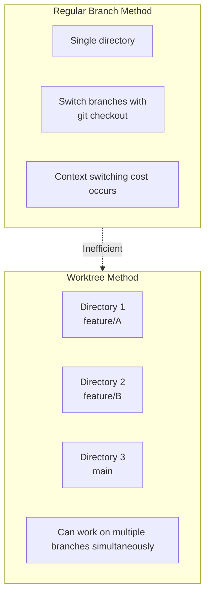
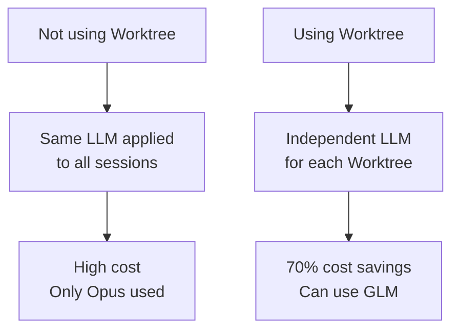
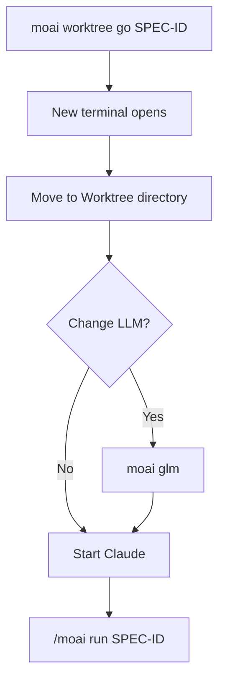
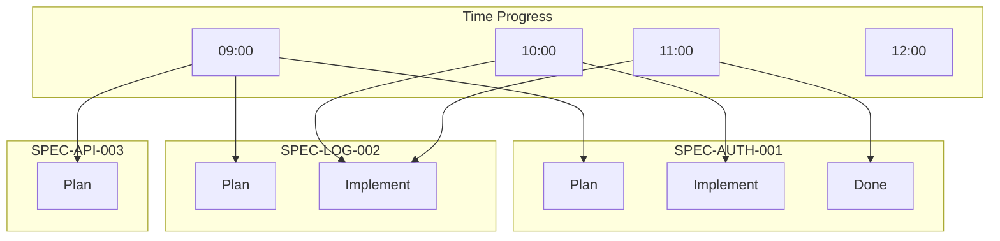
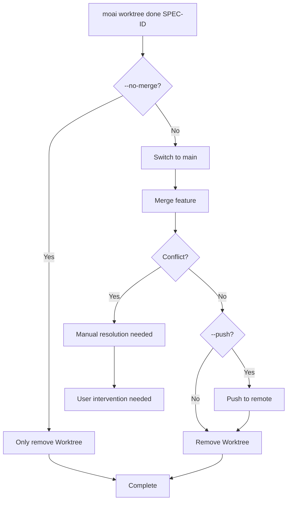
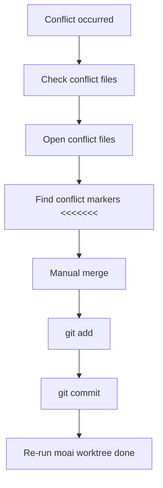
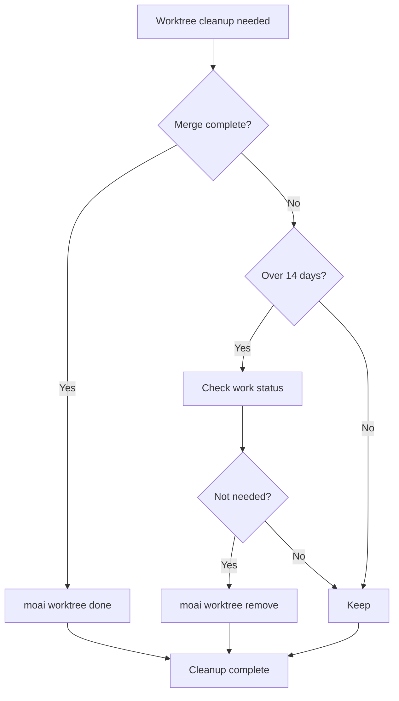
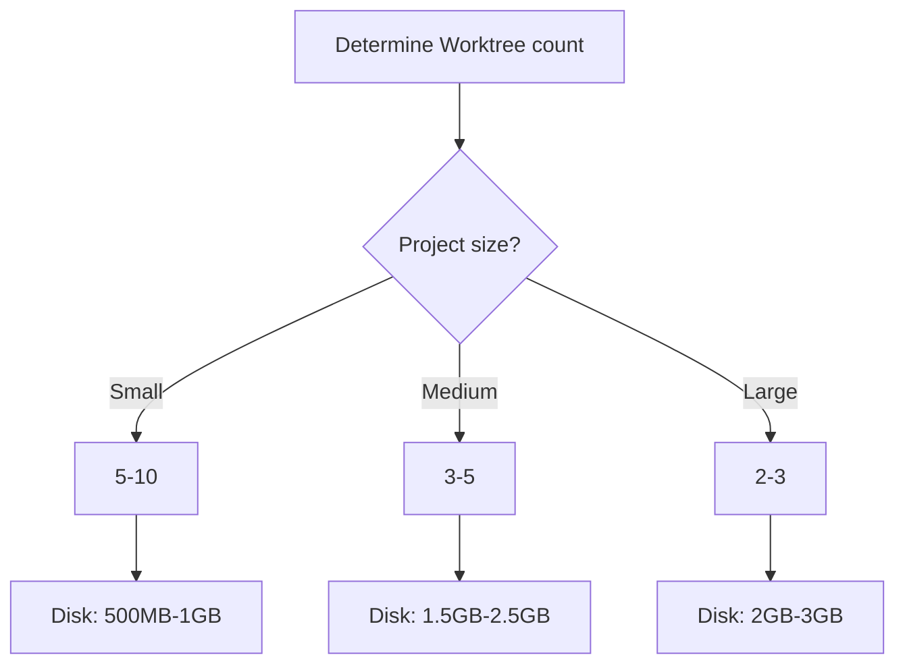
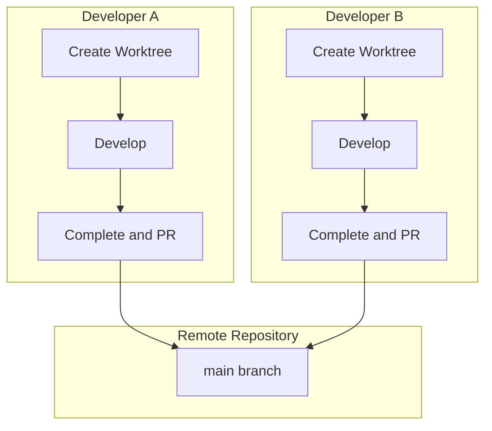

# Git Worktree FAQ

Common problems and solutions when using Git Worktree.

## Table of Contents

1. [Basic Concepts](#basic-concepts)
2. [Usage](#usage)
3. [Troubleshooting](#troubleshooting)
4. [Performance & Optimization](#performance--optimization)
5. [Team Collaboration](#team-collaboration)

---

## Basic Concepts

### Q: What's the difference between Git Worktree and regular branches?

**A**: Git Worktree allows you to work in **physically separated directories**:



**Key Differences**:

| Feature          | Regular Branch         | Git Worktree    |
| ------------- | ------------------- | --------------- |
| Working Directory | 1 shared            | N independent        |
| Branch Switch   | `git checkout` needed | Just directory move |
| Simultaneous Work | Not possible      | Possible            |
| LLM Settings      | Shared              | Independent          |
| Conflict Possibility   | High                | Low            |

---

### Q: Why should I use Worktree?

**A**: We recommend using Worktree for the following reasons:

1. **LLM Settings Independence**: Can use different LLMs for each SPEC
   - Plan phase: Opus (high quality)
   - Implement phase: GLM (low cost)
   - Document phase: Sonnet (medium)

2. **Parallel Development**: Can develop multiple SPECs simultaneously
3. **Conflict Prevention**: Minimizes conflicts with isolated workspaces
4. **Cost Savings**: 70% cost savings with GLM



---

### Q: Is Worktree required in MoAI-ADK?

**A**: No, it's not required but **strongly recommended**:

- **Single SPEC Development**: Possible without Worktree
- **Multiple SPEC Development**: Worktree essential
- **Team Collaboration**: Prevent conflicts with Worktree
- **Cost Optimization**: Separate LLMs with Worktree

---

## Usage

### Q: How do I create a Worktree?

**A**: There are two methods:

**Method 1: Automatic Creation (Recommended)**

```bash
# Automatically create during SPEC planning phase
> /moai plan "feature description" --worktree

# Automatically:
# 1. Create SPEC document
# 2. Create Worktree
# 3. Create feature branch
```

**Method 2: Manual Creation**

```bash
# Manually create Worktree
moai worktree new SPEC-AUTH-001

# Create from specific branch
moai worktree new SPEC-AUTH-001 --from develop
```

---

### Q: How do I enter a Worktree?

**A**: Use the `moai worktree go` command:

```bash
# Enter Worktree
moai worktree go SPEC-AUTH-001

# New terminal opens and moves to Worktree
# Prompt changes
(SPEC-AUTH-001) $
```

**Workflow after entering**:



---

### Q: Can I use multiple Worktrees simultaneously?

**A**: Yes, unlimited:

```bash
# Terminal 1
moai worktree go SPEC-AUTH-001
(SPEC-AUTH-001) $ moai glm

# Terminal 2
moai worktree go SPEC-LOG-002
(SPEC-LOG-002) $ moai glm

# Terminal 3
moai worktree go SPEC-API-003
(SPEC-API-003) $ moai glm

# All can work simultaneously
```

**Parallel work visualization**:



---

### Q: How do I complete a Worktree?

**A**: Use the `moai worktree done` command:

```bash
# Basic completion (merge + cleanup)
moai worktree done SPEC-AUTH-001

# Including push to remote
moai worktree done SPEC-AUTH-001 --push

# Remove only without merging
moai worktree done SPEC-AUTH-001 --no-merge
```

**Completion process**:



---

## Troubleshooting

### Q: Worktree conflict occurred

**A**: Resolve with the following steps:



**Real example**:

```bash
moai worktree done SPEC-AUTH-001
✗ Merge conflict occurred!

# 1. Check conflict files
cd .moai/worktrees/SPEC-AUTH-001
git status
# Conflict file: src/auth/jwt.ts

# 2. Resolve conflict
code src/auth/jwt.ts

# 3. Check and edit conflict markers
<<<<<<< HEAD
const secret = process.env.JWT_SECRET;
=======
const secret = config.jwt.secret;
>>>>>>> feature/SPEC-AUTH-001

# 4. Merge
const secret = process.env.JWT_SECRET || config.jwt.secret;

# 5. Commit
git add src/auth/jwt.ts
git commit -m "fix: resolve merge conflict"

# 6. Retry completion
cd /path/to/project
moai worktree done SPEC-AUTH-001
✓ Complete!
```

---

### Q: Worktree is corrupted

**A**: Recover with the following steps:

```bash
# 1. Diagnose
moai worktree status SPEC-AUTH-001
✗ Worktree directory does not exist

# 2. Remove existing Worktree
moai worktree remove SPEC-AUTH-001 --force

# 3. Recreate Worktree
moai worktree new SPEC-AUTH-001

# 4. Verify recovery
moai worktree status SPEC-AUTH-001
✓ Worktree is normal
```

---

### Q: Insufficient disk space

**A**: Clean up old Worktrees:

```bash
# 1. Check disk usage
$ du -sh .moai/worktrees/*
2.5G    .moai/worktrees/SPEC-AUTH-001
1.8G    .moai/worktrees/SPEC-LOG-002
3.2G    .moai/worktrees/SPEC-API-003

# 2. Clean old Worktrees
$ moai worktree clean --older-than 14

# Worktrees to be cleaned:
#   - SPEC-OLD-001 (30 days ago, 2.1GB)
#   - SPEC-OLD-002 (45 days ago, 1.7GB)

Continue? [y/N] y

✓ 2 Worktrees cleaned
✓ 3.8GB disk space freed
```

**Cleanup strategy**:



---

### Q: LLM not working as expected

**A**: Check Worktree-specific LLM settings:

```bash
# Check current LLM
moai config
Current LLM: GLM 4.7

# Change LLM in Worktree
moai worktree go SPEC-AUTH-001
(SPEC-AUTH-001) $ moai cc
→ Changed to Claude Opus

# Other Worktree unaffected
(SPEC-AUTH-001) $ exit
moai worktree go SPEC-LOG-002
(SPEC-LOG-002) $ moai config
Current LLM: GLM 4.7 (no change)
```

---

### Q: Git commands not working

**A**: Check if you're in the correct directory:

```bash
# Check Worktree directory
pwd
/Users/goos/MoAI/moai-project/.moai/worktrees/SPEC-AUTH-001

# Check Git status
git status
On branch feature/SPEC-AUTH-001
nothing to commit, working tree clean

# If Git error occurs
git fetch --all
git rebase origin/feature/SPEC-AUTH-001
```

---

## Performance & Optimization

### Q: Does Worktree affect performance?

**A**: Minimal impact:

**Advantages**:

- Each Worktree is independent, so cache efficient
- Fast Git operations (local branches)
- Leverages file system cache

**Disadvantages**:

- Disk space usage (duplicated per Worktree)
- Initial Worktree creation takes time

**Optimization tips**:

```bash
# 1. Remove unnecessary Worktrees
moai worktree clean --merged-only

# 2. Git garbage collection
git gc --aggressive --prune=now

# 3. Worktree pruning
git worktree prune
```

---

### Q: How many Worktrees can I create?

**A**: Theoretically unlimited, but practically limited by:

**Limiting factors**:

1. **Disk Space**: Each Worktree uses ~100MB-1GB
2. **Memory**: Open sessions in each Worktree
3. **File System**: Number of files open simultaneously

**Recommendations**:

- **Small projects**: 5-10 Worktrees
- **Medium projects**: 3-5 Worktrees
- **Large projects**: 2-3 Worktrees



---

### Q: Can I automatically clean Worktrees?

**A**: Yes, use periodic cleanup scripts:

```bash
#!/bin/bash
# clean-worktrees.sh

# Clean merged Worktrees
moai worktree clean --merged-only

# Clean Worktrees older than 30 days
moai worktree clean --older-than 30

# Git garbage collection
cd /path/to/project
git gc --aggressive --prune=now

echo "Worktree cleanup complete"
```

**Set up cron job**:

```bash
# Run every Sunday at 2 AM
0 2 * * 0 /path/to/clean-worktrees.sh >> /var/log/worktree-cleanup.log 2>&1
```

---

## Team Collaboration

### Q: How does the team use Worktree?

**A**: We recommend the following workflow:



**Team collaboration guide**:

1. **Worktree naming convention**: `SPEC-{category}-{number}`
2. **Regular sync**: `git pull origin main`
3. **Before PR review**: Complete testing locally
4. **Conflict prevention**: Sync with `main` frequently

---

### Q: How do I sync Worktree with remote repository?

**A**: Run `git pull` regularly:

```bash
# Sync in each Worktree
moai worktree go SPEC-AUTH-001
(SPEC-AUTH-001) $ git pull origin main

# Or sync all Worktrees
for spec in $(moai worktree list --porcelain | awk '{print $1}'); do
    cd ~/.moai/worktrees/$spec
    echo "Syncing $spec..."
    git pull origin main
done
```

---

### Q: How do I manage Worktree during PR review?

**A**: Use the following strategy:

```bash
# Before PR creation
moai worktree status SPEC-AUTH-001
# Check status

git log main..feature/SPEC-AUTH-001
# Check changes

# During PR review
# Keep Worktree (waiting for merge)

# After PR approval
moai worktree done SPEC-AUTH-001 --push
# Merge and cleanup

# After PR rejection
cd .moai/worktrees/SPEC-AUTH-001
# Continue revision work
```

---

## Additional Questions

### Q: Can I use MoAI-ADK without Worktree?

**A**: Yes, but not recommended:

```bash
# Use without Worktree
> /moai plan "feature description"
# Skip Worktree creation step

# But the following problems occur:
# 1. Same LLM applied to all sessions
# 2. No parallel development possible
# 3. Context switching cost
```

---

### Q: Do I need to backup Worktree?

**A**: Worktree is managed by Git, so no separate backup needed:

```bash
# Worktree is part of Git
# Automatic backup when pushed to remote

# Push to remote regularly
git push origin feature/SPEC-AUTH-001

# Recover after Worktree loss
git fetch origin
git worktree add SPEC-AUTH-001 origin/feature/SPEC-AUTH-001
```

---

## Related Documents

- [Git Worktree Overview](/worktree/index)
- [Complete Guide](./guide)
- [Real Usage Examples](./examples)

## Need More Help?

- [GitHub Issues](https://github.com/MoAI-ADK/moai-adk/issues)
- [Discord Community](https://discord.gg/moai-adk)
- [Email Support](mailto:support@moai-adk.org)