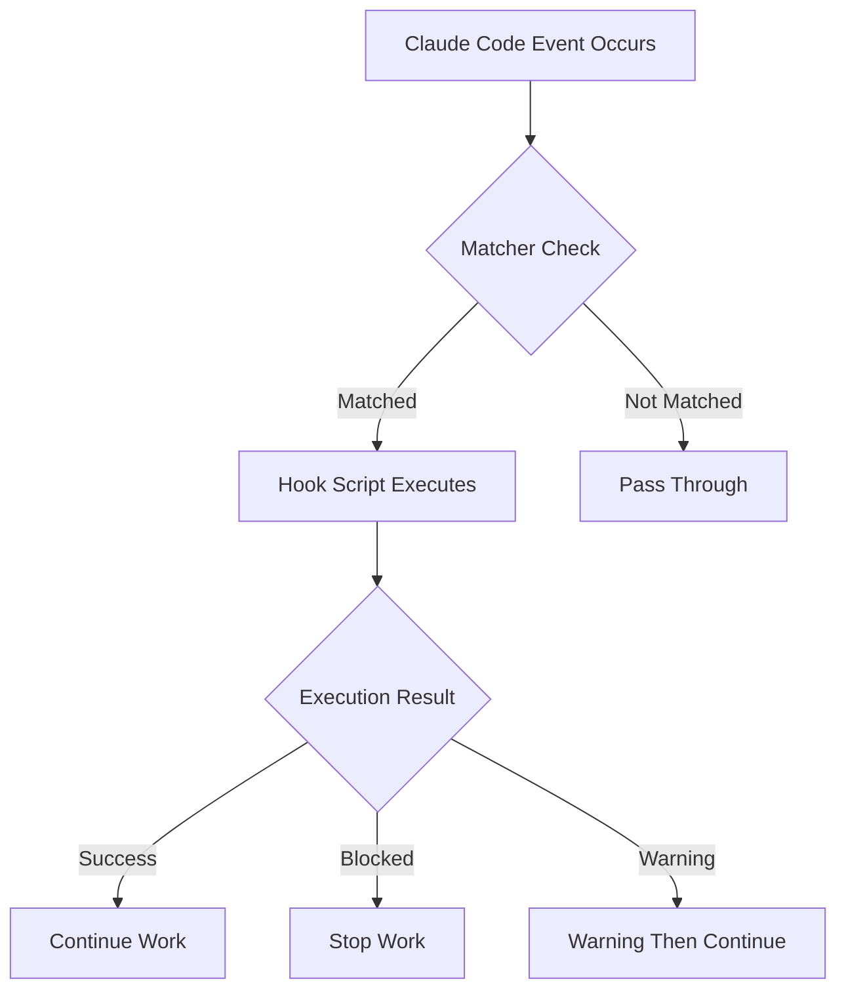
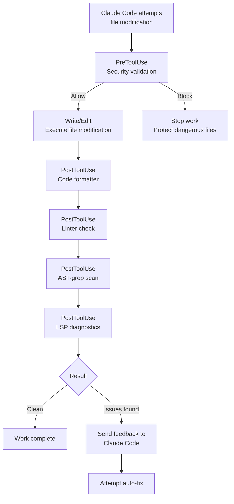

import { Callout } from 'nextra/components'

# Hooks Guide

Detailed guide to Claude Code's Hooks system and MoAI-ADK's default Hook scripts.

<Callout type="tip">
**One-line summary**: Hooks are Claude Code's **automatic reflex nerves**. Automatically format files when saved, block dangerous commands.
</Callout>

## What are Hooks?

Hooks are **scripts that execute automatically** in response to specific events in Claude Code.

To use the analogy of a doctor's reflex test: when a knee is tapped (event occurs), the leg automatically rises (script executes), just as when Claude Code modifies a file (PostToolUse event), the formatter automatically runs (code cleanup).



## Hook Event Types

Claude Code supports **10 event types**.

### Complete Event List

| Event | Execution Timing | Main Purpose |
|--------|------------------|--------------|
| `Setup` | Start with `--init`, `--init-only`, `--maintenance` flags | Initial setup, environment checks |
| `SessionStart` | When session starts | Project info display, environment initialization |
| `SessionEnd` | When session ends | Cleanup, context storage, rank submission |
| `PreCompact` | Before context compact (`/clear` etc) | Backup important context |
| `PreToolUse` | Before tool use | Security validation, block dangerous commands |
| **`PermissionRequest`** | When permission dialog shown | Auto allow/deny decisions |
| `PostToolUse` | After tool use | Code formatting, lint checks, LSP diagnostics |
| **`UserPromptSubmit`** | When user submits prompt | Prompt preprocessing, validation |
| **`Notification`** | When Claude Code sends notification | Customize desktop notifications |
| `Stop` | After response completes | Loop control, completion condition check |
| **`SubagentStop`** | After subagent work completes | Process subtask results |

### Event Details

#### 1. Setup
Executed when Claude Code starts with `--init`, `--init-only`, or `--maintenance` flags. Used for initial setup and environment checks.

#### 2. SessionStart
Executed when a session starts or resumes an existing session. Used for displaying project status and environment initialization.

#### 3. SessionEnd
Executed when Claude Code session ends. Used for cleanup, context storage, and metrics collection.

#### 4. PreCompact
Executed before Claude Code performs context compacting (like `/clear` command). Used to backup important context.

#### 5. PreToolUse
Executed **before** a tool is called. Can block or modify tool calls. Used for security validation and blocking dangerous commands.

#### 6. PermissionRequest
Executed when a permission dialog is displayed to the user. Can automatically allow or deny.

#### 7. PostToolUse
Executed **after** a tool call completes. Used for code formatting, lint checks, and LSP diagnostics collection.

#### 8. UserPromptSubmit
Executed when the user submits a prompt, **before** Claude processes it. Used for prompt preprocessing and validation.

#### 9. Notification
Executed when Claude Code sends a notification. Can be customized for desktop notifications, sound alerts, etc.

#### 10. Stop
Executed when Claude Code completes a response. Used for loop control and completion condition verification.

#### 11. SubagentStop
Executed when a subagent's work is complete. Used to process subtask results.

### Events Implemented in MoAI-ADK

MoAI-ADK has implemented the following events:

| Event | Status | Hook File |
|--------|--------|------------|
| `SessionStart` | ✅ | `session_start__show_project_info.py` |
| `PreToolUse` | ✅ | `pre_tool__security_guard.py` |
| `PostToolUse` | ✅ | `post_tool__code_formatter.py`, `post_tool__linter.py`, `post_tool__ast_grep_scan.py`, `post_tool__lsp_diagnostic.py` |
| `PreCompact` | ✅ | `pre_compact__save_context.py` |
| `SessionEnd` | ✅ | `session_end__auto_cleanup.py`, `session_end__rank_submit.py` |
| `Stop` | ✅ | `stop__loop_controller.py` |
| `Setup` | ⚪ | See official examples |
| `PermissionRequest` | ⚪ | See official examples |
| `UserPromptSubmit` | ⚪ | See official examples |
| `Notification` | ⚪ | See official examples |
| `SubagentStop` | ⚪ | See official examples |

### Event Execution Order

The order in which hooks execute during a typical file modification operation:



## Claude Code Official Examples

These examples are standard patterns provided in Claude Code's official documentation.

### Bash Command Logging Hook

Logs all Bash commands to a log file.

```json
{
  "hooks": {
    "PreToolUse": [
      {
        "matcher": "Bash",
        "hooks": [
          {
            "type": "command",
            "command": "jq -r '\"\\(.tool_input.command) - \\(.tool_input.description // \"No description\")\"' >> ~/.claude/bash-command-log.txt"
          }
        ]
      }
    ]
  }
}
```

### TypeScript Formatting Hook

Automatically runs Prettier after editing TypeScript files.

```json
{
  "hooks": {
    "PostToolUse": [
      {
        "matcher": "Edit|Write",
        "hooks": [
          {
            "type": "command",
            "command": "jq -r '.tool_input.file_path' | { read file_path; if echo \"$file_path\" | grep -q '\\.ts$'; then npx prettier --write \"$file_path\"; fi; }"
          }
        ]
      }
    ]
  }
}
```

### Markdown Formatter Hook

Automatically detects and adds language tags to Markdown files.

```json
{
  "hooks": {
    "PostToolUse": [
      {
        "matcher": "Edit|Write",
        "hooks": [
          {
            "type": "command",
            "command": "\"$CLAUDE_PROJECT_DIR\"/.claude/hooks/markdown_formatter.py"
          }
        ]
      }
    ]
  }
}
```

`.claude/hooks/markdown_formatter.py` file:

```python
#!/usr/bin/env python3
"""
Markdown formatter for Claude Code output.
Fixes missing language tags and spacing issues while preserving code content.
"""
import json
import sys
import re
import os

def detect_language(code):
    """Best-effort language detection from code content."""
    s = code.strip()

    # JSON detection
    if re.search(r'^\\s*[{\\[]', s):
        try:
            json.loads(s)
            return 'json'
        except:
            pass

    # Python detection
    if re.search(r'^\\s*def\\s+\\w+\\s*\\(', s, re.M) or \
       re.search(r'^\\s*(import|from)\\s+\\w+', s, re.M):
        return 'python'

    # JavaScript detection
    if re.search(r'\\b(function\\s+\\w+\\s*\\(|const\\s+\\w+\\s*=)', s) or \
       re.search(r'=>|console\\.(log|error)', s):
        return 'javascript'

    # Bash detection
    if re.search(r'^#!.*\\b(bash|sh)\\b', s, re.M) or \
       re.search(r'\\b(if|then|fi|for|in|do|done)\\b', s):
        return 'bash'

    return 'text'

def format_markdown(content):
    """Format markdown content with language detection."""
    # Fix unlabeled code fences
    def add_lang_to_fence(match):
        indent, info, body, closing = match.groups()
        if not info.strip():
            lang = detect_language(body)
            return f"{indent}```{lang}\\n{body}{closing}\\n"
        return match.group(0)

    fence_pattern = r'(?ms)^([ \\t]{0,3})```([^\\n]*)\\n(.*?)(\\n\\1```)\\s*$'
    content = re.sub(fence_pattern, add_lang_to_fence, content)

    # Fix excessive blank lines
    content = re.sub(r'\\n{3,}', '\\n\\n', content)

    return content.rstrip() + '\\n'

# Main execution
try:
    input_data = json.load(sys.stdin)
    file_path = input_data.get('tool_input', {}).get('file_path', '')

    if not file_path.endswith(('.md', '.mdx')):
        sys.exit(0)  # Not a markdown file

    if os.path.exists(file_path):
        with open(file_path, 'r', encoding='utf-8') as f:
            content = f.read()

        formatted = format_markdown(content)

        if formatted != content:
            with open(file_path, 'w', encoding='utf-8') as f:
                f.write(formatted)
            print(f"✓ Fixed markdown formatting in {file_path}")

except Exception as e:
    print(f"Error formatting markdown: {e}", file=sys.stderr)
    sys.exit(1)
```

### Desktop Notification Hook

Displays a desktop notification when Claude is waiting for input.

```json
{
  "hooks": {
    "Notification": [
      {
        "matcher": "",
        "hooks": [
          {
            "type": "command",
            "command": "notify-send 'Claude Code' 'Awaiting your input'"
          }
        ]
      }
    ]
  }
}
```

### File Protection Hook

Blocks modification of sensitive files.

```json
{
  "hooks": {
    "PreToolUse": [
      {
        "matcher": "Edit|Write",
        "hooks": [
          {
            "type": "command",
            "command": "python3 -c \"import json, sys; data=json.load(sys.stdin); path=data.get('tool_input',{}).get('file_path',''); sys.exit(2 if any(p in path for p in ['.env', 'package-lock.json', '.git/']) else 0)\""
          }
        ]
      }
    ]
  }
}
```

## MoAI Default Hooks

MoAI-ADK provides **11 default Hook scripts**.

### Hook List

| Hook File | Event | Matcher | Role | Timeout |
|-----------|-------|---------|------|---------|
| `session_start__show_project_info.py` | SessionStart | All | Project status display, update check | 5 sec |
| `pre_tool__security_guard.py` | PreToolUse | `Write\|Edit\|Bash` | Block dangerous file modifications/commands | 5 sec |
| `post_tool__code_formatter.py` | PostToolUse | `Write\|Edit` | Auto code formatting | 30 sec |
| `post_tool__linter.py` | PostToolUse | `Write\|Edit` | Auto lint check | 60 sec |
| `post_tool__ast_grep_scan.py` | PostToolUse | `Write\|Edit` | AST-based security scan | 30 sec |
| `post_tool__lsp_diagnostic.py` | PostToolUse | `Write\|Edit` | LSP diagnostics collection | default |
| `pre_compact__save_context.py` | PreCompact | All | Save context before `/clear` | 3 sec |
| `session_end__auto_cleanup.py` | SessionEnd | All | Session end cleanup | 5 sec |
| `session_end__rank_submit.py` | SessionEnd | All | Submit session data to MoAI Rank | default |
| `stop__loop_controller.py` | Stop | All | Ralph loop control and completion check | default |
| `quality_gate_with_lsp.py` | Manual | All | LSP-based quality gate validation | default |

### SessionStart: Display Project Info

When a session starts, shows the current state of the project.

**Displayed Information:**
- MoAI-ADK version and update status
- Current project name and tech stack
- Git branch, changes, last commit
- Git strategy (Github-Flow mode, Auto Branch settings)
- Language settings (conversation language)
- Previous session context (SPEC status, task list)
- Personalized welcome message or setup guide

### PreToolUse: Security Guard

**Protects dangerous operations** before file modification/command execution.

**Protected Files:**

| Category | Protected Files | Reason |
|----------|----------------|--------|
| Secret storage | `secrets/`, `*.secrets.*`, `*.credentials.*` | Protect sensitive information |
| SSH keys | `~/.ssh/*`, `id_rsa*`, `id_ed25519*` | Protect server access keys |
| Certificates | `*.pem`, `*.key`, `*.crt` | Protect certificate files |
| Cloud credentials | `~/.aws/*`, `~/.gcloud/*`, `~/.azure/*`, `~/.kube/*` | Protect cloud accounts |
| Git internal | `.git/*` | Git repository integrity |
| Token files | `*.token`, `.tokens/*`, `auth.json` | Protect auth tokens |

**Note:** `.env` files are NOT protected. Allows developers to edit environment variables.

**Blocking Behavior:**
- Detects Write/Edit attempts on protected files
- Returns `"permissionDecision": "deny"` response in JSON format
- Claude Code stops modifying that file

**Dangerous Bash Command Blocking:**
- Database deletion: `supabase db reset`, `neon database delete`
- Dangerous file deletion: `rm -rf /`, `rm -rf .git`
- Docker complete removal: `docker system prune -a`
- Force push: `git push --force origin main`
- Terraform destroy: `terraform destroy`

### PostToolUse: Code Formatter

**Automatically cleans up code** after file modification.

**Supported Languages and Formatters:**

| Language | Formatter (priority) | Config File |
|----------|---------------------|-------------|
| Python | `ruff format`, `black` | `pyproject.toml` |
| TypeScript/JavaScript | `biome`, `prettier`, `eslint_d` | `.prettierrc`, `biome.json` |
| Go | `gofmt`, `goimports` | default |
| Rust | `rustfmt` | `rustfmt.toml` |
| Ruby | `prettier` | `.prettierrc` |
| PHP | `prettier` | `.prettierrc` |
| Java | `prettier` | `.prettierrc` |
| Kotlin | `prettier` | `.prettierrc` |
| Swift | `swiftformat` | `.swiftformat` |
| C# | `prettier` | `.prettierrc` |

**Exclusions:**
- `.json`, `.lock`, `.min.js`, `.svg`, etc.
- `node_modules`, `.git`, `dist`, `build` directories

### PostToolUse: Linter

**Automatically checks code quality** after file modification.

**Supported Languages and Linters:**

| Language | Linter (priority) | Check Items |
|----------|-------------------|-------------|
| Python | `ruff check`, `flake8` | PEP 8, type hints, complexity |
| TypeScript/JavaScript | `eslint`, `biome lint`, `eslint_d` | Coding standards, potential bugs |
| Go | `golangci-lint` | Code quality, performance |
| Rust | `clippy` | Rust idioms, performance |

### PostToolUse: AST-grep Scan

**Scans for structural security vulnerabilities** after file modification.

**Supported Languages:**
Python, JavaScript/TypeScript, Go, Rust, Java, Kotlin, C/C++, Ruby, PHP

**Sample Scan Patterns:**
- SQL Injection vulnerabilities (string-concatenated queries)
- Hardcoded secret keys (API keys, tokens)
- Unsafe function calls
- Unused imports

**Configuration:** `.claude/skills/moai-tool-ast-grep/rules/sgconfig.yml` or `sgconfig.yml` at project root

### PostToolUse: LSP Diagnostics

**Collects LSP (Language Server Protocol) diagnostics** after file modification.

**Supported Languages:**
Python, TypeScript/JavaScript, Go, Rust, Java, Kotlin, Ruby, PHP, C/C++

**Fallback Diagnostics:**
When LSP is unavailable, uses command-line tools:
- Python: `ruff check --output-format=json`
- TypeScript: `tsc --noEmit`

**Configuration:** `.moai/config/sections/ralph.yaml`

```yaml
ralph:
  enabled: true
  hooks:
    post_tool_lsp:
      enabled: true
      severity_threshold: error  # error | warning | info
```

### PreCompact: Save Context

**Saves current context to file** before `/clear` execution.

**Save Location:** `.moai/memory/context-snapshot.json`

**Saved Content:**
- Current active SPEC status (ID, phase, progress)
- In-progress task list (TodoWrite)
- Completed task list
- Modified file list
- Git status information (branch, uncommitted changes)
- Key decisions

**Archive:** Previous snapshots are automatically archived to `.moai/memory/context-archive/`.

### SessionEnd: Auto Cleanup

Performs the following tasks when session ends:

**P0 Tasks (Required):**
- Save session metrics (files modified, commits made, SPECs worked on)
- Save work status snapshot (`.moai/memory/last-session-state.json`)
- Warning for uncommitted changes

**P1 Tasks (Optional):**
- Cleanup temporary files (older than 7 days)
- Cleanup cache files
- Scan for root directory documentation violations
- Generate session summary

### SessionEnd: MoAI Rank Submission

Submits session data to MoAI Rank service.

**Submitted Data:**
- Token usage (input, output, cache)
- Project path (anonymized with one-way hash)
- **Excluded:** Code, conversation content, and other sensitive information are NOT sent

**Configuration:** `~/.moai/rank/config.yaml`

```yaml
rank:
  enabled: true
  exclude_projects:
    - "/path/to/private-project"
    - "*/confidential/*"
```

**Registration:** Link GitHub account using `moai-adk rank register` command

### Stop: Loop Controller

Controls Ralph Engine feedback loop.

**Completion Condition Check:**
- LSP error count (0 errors goal)
- LSP warning count
- Test pass status
- Coverage target (default 85%)
- Completion markers (`<moai>DONE</moai>`, `<moai>COMPLETE</moai>`) detection

**State File:** `.moai/cache/.moai_loop_state.json`

**Configuration:** `.moai/config/sections/ralph.yaml`

```yaml
ralph:
  enabled: true
  loop:
    max_iterations: 10
    auto_fix: false
    completion:
      zero_errors: true
      zero_warnings: false
      tests_pass: true
      coverage_threshold: 85
```

### Quality Gate with LSP

Validates quality gates using LSP diagnostics.

**Quality Criteria:**
- Maximum error count: 0 (default)
- Maximum warning count: 10 (default)
- Type errors: 0 allowed
- Lint errors: 0 allowed

**Configuration:** `.moai/config/sections/quality.yaml`

```yaml
constitution:
  quality_gate:
    max_errors: 0
    max_warnings: 10
    enabled: true
```

**Result Example:**
```json
{
  "lsp_errors": 0,
  "lsp_warnings": 2,
  "type_errors": 0,
  "lint_errors": 0,
  "passed": true,
  "reason": "Quality gate passed: LSP diagnostics clean"
}
```

## lib/ Shared Library

MoAI Hooks provides modules in the `lib/` directory for shared functionality.

```
.claude/hooks/moai/lib/
├── __init__.py
├── atomic_write.py           # Atomic write operations
├── checkpoint.py             # Checkpoint management
├── common.py                 # Common utilities
├── config.py                 # Configuration management
├── config_manager.py         # Configuration manager (advanced)
├── config_validator.py       # Configuration validation
├── context_manager.py        # Context management (snapshots, archives)
├── enhanced_output_style_detector.py  # Output style detection
├── file_utils.py             # File utilities
├── git_collector.py          # Git data collection
├── git_operations_manager.py # Git operations manager (optimized)
├── language_detector.py      # Language detection
├── language_validator.py     # Language validation
├── main.py                   # Main entry point
├── memory_collector.py       # Memory collection
├── metrics_tracker.py        # Metrics tracking
├── models.py                 # Data models
├── path_utils.py             # Path utilities
├── project.py                # Project-related
├── renderer.py               # Renderer
├── timeout.py                # Timeout handling
├── tool_registry.py          # Tool registry (formatters, linters)
├── unified_timeout_manager.py # Unified timeout manager
├── update_checker.py         # Update check
├── version_reader.py         # Version reading
├── alfred_detector.py        # Alfred detection
└── shared/utils/
    └── announcement_translator.py  # Announcement translation
```

**Key Modules:**

- **tool_registry.py**: Auto-detection of formatters/linters for 16 programming languages
- **git_operations_manager.py**: Optimized Git operations with connection pooling and caching
- **unified_timeout_manager.py**: Unified timeout management with graceful degradation
- **context_manager.py**: Context snapshots, archives, and Memory MCP payload generation

## Hook Configuration in settings.json

Hooks are configured in the `hooks` section of the `.claude/settings.json` file.

```json
{
  "hooks": {
    "SessionStart": [
      {
        "matcher": "",
        "hooks": [
          {
            "type": "command",
            "command": "${SHELL:-/bin/bash} -l -c 'uv run \"$CLAUDE_PROJECT_DIR/.claude/hooks/moai/session_start__show_project_info.py\"'"
          }
        ]
      }
    ],
    "PreToolUse": [
      {
        "matcher": "Write|Edit",
        "hooks": [
          {
            "type": "command",
            "command": "${SHELL:-/bin/bash} -l -c 'uv run \"$CLAUDE_PROJECT_DIR/.claude/hooks/moai/pre_tool__security_guard.py\"'",
            "timeout": 5000
          }
        ]
      }
    ],
    "PostToolUse": [
      {
        "matcher": "Write|Edit",
        "hooks": [
          {
            "type": "command",
            "command": "${SHELL:-/bin/bash} -l -c 'uv run \"$CLAUDE_PROJECT_DIR/.claude/hooks/moai/post_tool__code_formatter.py\"'",
            "timeout": 30000
          },
          {
            "type": "command",
            "command": "${SHELL:-/bin/bash} -l -c 'uv run \"$CLAUDE_PROJECT_DIR/.claude/hooks/moai/post_tool__linter.py\"'",
            "timeout": 60000
          },
          {
            "type": "command",
            "command": "${SHELL:-/bin/bash} -l -c 'uv run \"$CLAUDE_PROJECT_DIR/.claude/hooks/moai/post_tool__ast_grep_scan.py\"'",
            "timeout": 30000
          },
          {
            "type": "command",
            "command": "${SHELL:-/bin/bash} -l -c 'uv run \"$CLAUDE_PROJECT_DIR/.claude/hooks/moai/post_tool__lsp_diagnostic.py\"'"
          }
        ]
      }
    ],
    "PreCompact": [
      {
        "matcher": "",
        "hooks": [
          {
            "type": "command",
            "command": "${SHELL:-/bin/bash} -l -c 'uv run \"$CLAUDE_PROJECT_DIR/.claude/hooks/moai/pre_compact__save_context.py\"'",
            "timeout": 5000
          }
        ]
      }
    ],
    "SessionEnd": [
      {
        "matcher": "",
        "hooks": [
          {
            "type": "command",
            "command": "${SHELL:-/bin/bash} -l -c 'uv run \"$CLAUDE_PROJECT_DIR/.claude/hooks/moai/session_end__auto_cleanup.py\"'",
            "timeout": 5000
          },
          {
            "type": "command",
            "command": "${SHELL:-/bin/bash} -l -c 'uv run \"$CLAUDE_PROJECT_DIR/.claude/hooks/moai/session_end__rank_submit.py\"'"
          }
        ]
      }
    ],
    "Stop": [
      {
        "matcher": "",
        "hooks": [
          {
            "type": "command",
            "command": "${SHELL:-/bin/bash} -l -c 'uv run \"$CLAUDE_PROJECT_DIR/.claude/hooks/moai/stop__loop_controller.py\"'"
          }
        ]
      }
    ]
  }
}
```

### Configuration Structure

| Field | Description | Example |
|------|-------------|---------|
| `matcher` | Tool name matching pattern (regex) | `"Write\|Edit"` |
| `type` | Hook type | `"command"` |
| `command` | Command to execute | Shell script path |
| `timeout` | Execution time limit (milliseconds) | `5000` (5 seconds) |

### Matcher Patterns

| Pattern | Description |
|---------|-------------|
| `""` (empty string) | Matches all tools |
| `"Write"` | Matches only Write tool |
| `"Write\|Edit"` | Matches Write or Edit tools |
| `"Bash"` | Matches only Bash tool |

## Writing Custom Hooks

### Basic Template

Custom Hook scripts can be written in Python.

```python
#!/usr/bin/env python3
"""Custom PostToolUse Hook: Perform specific checks after file modification"""

import json
import sys


def main():
    # Read Hook input data from stdin
    input_data = json.loads(sys.stdin.read())

    tool_name = input_data.get("tool_name", "")
    tool_input = input_data.get("tool_input", {})
    file_path = tool_input.get("file_path", "")

    # Check logic
    if file_path.endswith(".py"):
        # Custom check for Python files
        result = check_python_file(file_path)

        if result["has_issues"]:
            # Send feedback to Claude Code
            output = {
                "hookSpecificOutput": {
                  "hookEventName": "PostToolUse",
                  "additionalContext": result["message"]
                }
            }
            print(json.dumps(output))
            return

    # Suppress output if no issues
    output = {"suppressOutput": True}
    print(json.dumps(output))


def check_python_file(file_path: str) -> dict:
    """Custom Python file check"""
    # Implement check logic
    return {"has_issues": False, "message": ""}


if __name__ == "__main__":
    main()
```

### Hook Response Format

| Field | Value | Behavior |
|------|-------|----------|
| `suppressOutput` | `true` | Display nothing |
| `hookSpecificOutput` | object | Provide additional context |
| `permissionDecision` | `"allow"` | Allow work (PreToolUse) |
| `permissionDecision` | `"deny"` | Block work (PreToolUse) |
| `permissionDecision` | `"ask"` | Request user confirmation (PreToolUse) |

### Hook Input Data

Hook scripts receive JSON data via standard input (stdin).

```json
{
  "tool_name": "Write",
  "tool_input": {
    "file_path": "/path/to/file.py",
    "content": "File content..."
  },
  "tool_output": "File output result (PostToolUse only)"
}
```

## Hook Directory Structure

```
.claude/hooks/moai/
├── __init__.py                        # Package initialization
├── session_start__show_project_info.py # Session start
├── pre_tool__security_guard.py         # Security guard
├── post_tool__code_formatter.py        # Code formatter
├── post_tool__linter.py                # Linter
├── post_tool__ast_grep_scan.py         # AST-grep scan
├── post_tool__lsp_diagnostic.py        # LSP diagnostics
├── pre_compact__save_context.py        # Context save
├── session_end__auto_cleanup.py        # Auto cleanup
├── session_end__rank_submit.py         # MoAI Rank submit
├── stop__loop_controller.py            # Loop controller
├── quality_gate_with_lsp.py            # Quality gate
└── lib/                                # Shared library
    ├── atomic_write.py                 # Atomic write
    ├── checkpoint.py                   # Checkpoint
    ├── common.py                       # Common utilities
    ├── config.py                       # Config
    ├── config_manager.py               # Config manager
    ├── config_validator.py             # Config validation
    ├── context_manager.py              # Context management
    ├── git_operations_manager.py       # Git operations manager
    ├── tool_registry.py                # Tool registry
    ├── unified_timeout_manager.py      # Timeout manager
    └── ...                             # Other modules
```

<Callout type="warning">
**Caution**: Setting hook timeouts too long will slow down Claude Code responses. Recommended: formatter 30 sec, linter 60 sec, security guard 5 sec or less.
</Callout>

## Disabling Hooks with Environment Variables

Specific hooks can be disabled with environment variables:

| Hook | Environment Variable |
|------|---------------------|
| AST-grep scan | `MOAI_DISABLE_AST_GREP_SCAN=1` |
| LSP diagnostics | `MOAI_DISABLE_LSP_DIAGNOSTIC=1` |
| Loop controller | `MOAI_DISABLE_LOOP_CONTROLLER=1` |

```bash
export MOAI_DISABLE_AST_GREP_SCAN=1
```

## Related Documentation

- [settings.json Guide](/advanced/settings-json) - Hook configuration methods
- [CLAUDE.md Guide](/advanced/claude-md-guide) - Project guideline management
- [Agent Guide](/advanced/agent-guide) - Agent and Hook integration

<Callout type="tip">
**Tip**: Hooks are the core of MoAI-ADK quality assurance. Automating code formatting and lint checks allows developers to focus on logic. Add custom hooks to build automation tailored to your project.
</Callout>