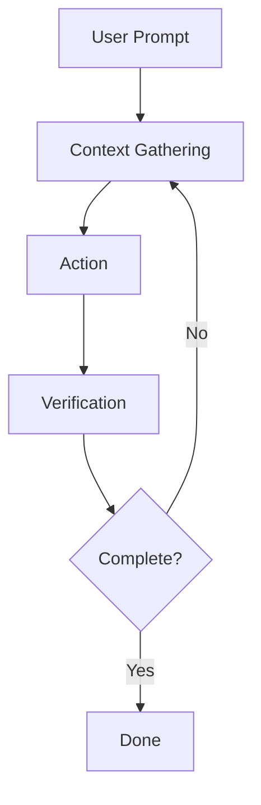
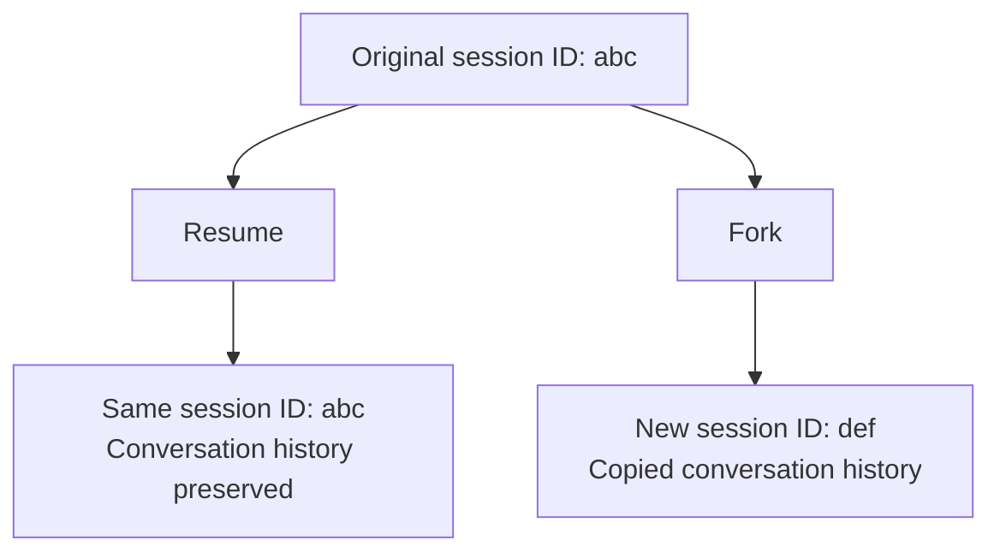

# How It Works

Claude Code is an AI-based assistant that runs in your terminal. It excels at coding but can help with anything you can do from the command line: writing files, running builds, searching files, researching topics, and more.

This guide covers core architecture, built-in features, and tips for working effectively. For step-by-step workflows, see [Common Workflows](/claude-code/common-workflows). For extensions like skills, MCP, and hooks, see [Extensions](/claude-code/extensions).

## The Agent Loop

When you give Claude a task, it works through three phases: **Context Gathering**, **Action**, and **Verification**. These phases are interwoven. Claude uses tools throughout the process. It searches files to understand code, edits to make changes, runs tests to verify its work, and learns from each phase to inform the next.



The loop adapts to your request. A question about your codebase might only need context gathering. A bug fix might repeat all three phases. Refactoring might involve extensive verification. Claude decides what each phase requires based on what it learned in previous phases, chaining dozens of operations together and iterating to refine.

You're part of this loop too. You can interrupt at any point to redirect, provide additional context, or ask for a different approach. Claude operates autonomously but responds to your input.

The agent loop is powered by two components: the reasoning model and the tools it uses. Claude Code serves as an **agent harness** around the language model, providing tools, context management, and an execution environment that transforms a language model into a capable coding agent.

### The Model

Claude Code uses Claude models to understand code and reason about tasks. Claude can read code in any language, understand how components connect, and figure out what needs to change to achieve goals. For complex tasks, it breaks work into steps, executes them, and adjusts based on what it learns.

Multiple models are available with different strengths. Sonnet handles most coding tasks well. Opus provides stronger reasoning for complex architecture decisions. Switch during a session with `/model` or start with `claude --model <name>`.

When this guide says "Claude chooses" or "Claude decides," it's the model doing the reasoning.

### The Tools

Tools are what make Claude Code an agent. Without tools, Claude can only respond with text. With tools, Claude can act. It can read code, edit files, run commands, search the web, and interact with external services. Each tool use feeds back into the loop as information that informs Claude's next decision.

Built-in tools generally fall into four categories, each representing a different type of agency:

| Category | What Claude Can Do |
|------|----------------------|
| **File Operations** | Read files, edit code, create new files, rename and reorganize |
| **Search** | Find files by pattern, search content with regex, explore codebase |
| **Execution** | Run shell commands, start servers, run tests, use git |
| **Web** | Search web, fetch documentation, look up error messages |
| **Code Intelligence** | See type errors and warnings after edits, jump to definition, find references (requires code intelligence plugin) |

These are the main capabilities. Claude also has tools for creating subagents, asking questions, and other orchestration tasks. For the full list, see [Tools Available to Claude](https://code.claude.com/docs/en/tools).

Claude selects which tools to use based on your prompt and what it learns along the way. If you say "fix failing tests," Claude might:

1. Run test suite to see what's failing
2. Read error output
3. Search for related source files
4. Read those files to understand the code
5. Edit files to fix the issue
6. Re-run tests to verify the fix

Each tool use provides Claude with information for the next step. This is the agent loop in action.

**Extending Beyond Basic**: Built-in tools are just the foundation. You can extend what Claude knows with skills, connect to external services with MCP, automate workflows with hooks, and delegate tasks with subagents. These extensions form layers on top of the core agent loop. For guidance on choosing the right extensions, see [Claude Code Extensions](/claude-code/extensions).

## What Claude Can Access

This guide focuses primarily on the terminal. Claude Code also runs in VS Code, JetBrains IDEs, and other environments.

When you run `claude` in a directory, Claude Code has access to:

- **Project**: Files in the directory and subdirectories, and other locations with user permission
- **Terminal**: Any command you can run: build tools, git, package managers, system utilities, scripts. Anything you can do from the command line, Claude can do too
- **Git State**: Current branch, uncommitted changes, recent commit history
- **CLAUDE.md**: A markdown file that stores project-specific guidelines, rules, and context that Claude should know in every session
- **Configured Extensions**: MCP servers for external services, skills for workflows, subagents for delegated tasks, Claude in Chrome for browser interaction

Because Claude sees your entire project, it can work across the whole project. When you ask to "fix auth bug," Claude searches for relevant files, reads multiple files to understand context, makes coordinated edits, runs tests to verify fixes, and can commit changes if you request. This is different from inline coding assistants that only see the current file.

## Working with Sessions

Claude Code saves your running conversation locally. All messages, tool uses, and results are stored, enabling undo, resume, and session forking. Before Claude changes code, it takes snapshots of affected files so you can revert when needed.

**Sessions are ephemeral.** Unlike claude.ai, Claude Code has no persistent memory between sessions. Each new session starts from scratch. Claude doesn't "learn" your preferences over time or "remember" what you worked on last week. To inform Claude across sessions, put it in CLAUDE.md.

### Working Across Branches

Each Claude Code conversation is a session tied to the current directory. When you resume, only sessions from that directory are shown.

Claude sees files from the current branch. When you switch branches, Claude sees files from the new branch but conversation history remains the same. Claude remembers what you discussed even after switching branches.

Because sessions are tied to directories, you can run parallel Claude sessions using git worktree. Worktree creates separate directories for individual branches.

### Resume or Fork Sessions

Resuming a session with `claude --continue` or `claude --resume` continues from where you left off using the same session ID. New messages are appended to the existing conversation. The full conversation history is restored, but session-scoped permissions are not. You must approve again.



To branch off without affecting the original session, use the `--fork-session` flag:

```bash
claude --continue --fork-session
```

This creates a new session ID while preserving conversation history up to that point. The original session is unchanged. Like resume, forked sessions also don't inherit session-scoped permissions.

**Same session in multiple terminals**: If you resume the same session in multiple terminals, both terminals write to the same session file. Messages from both terminals get interleaved. Nothing breaks but the conversation becomes confusing. Each terminal only sees its own messages during the session, but when you later resume that session, you'll see everything mixed together. To work in parallel from the same starting point, use `--fork-session` to give each terminal its own clean session.

### Context Window

Claude's context window contains conversation history, file contents, command output, CLAUDE.md, loaded skills, and system instructions. Context fills as you work. Claude compresses automatically but early instructions in the conversation can be lost. Put permanent rules in CLAUDE.md and run `/context` to check space usage.

#### When Context Is Full

When you approach the context limit, Claude Code manages it automatically. First, old tool outputs are cleared, and if necessary, conversations are summarized. Your requests and key code snippets are preserved, but detailed instructions from early in the conversation can be lost. Put permanent rules in CLAUDE.md and don't rely on conversation history.

To control what gets preserved during compression, add a "Compact Instructions" section to CLAUDE.md or run `/compact` with a focus like `/compact focus on the API changes`.

To check space usage, run `/context`. MCP servers add tool definitions to every request, so several servers can consume significant context before starting work. Run `/mcp` to see server-specific costs.

#### Managing Context with Skills and Subagents

Beyond compression, you can use other features to control what gets loaded into context.

Skills load on demand. Claude sees skill descriptions at session start, but full content only loads when using the skill. For manually invoked skills, you can set `disable-model-invocation: true` to prevent descriptions from entering context until needed.

Subagents get their own fresh context and are completely isolated from the main conversation. Tasks don't bloat the main context. When complete, they return a summary. This isolation is why subagents help with long sessions.

For context costs by feature, see [Context Costs by Feature](https://code.claude.com/docs/en/how-it-works#context-costs-by-feature). For tips on reducing token usage, see [Manage Context Aggressively](https://code.claude.com/docs/en/best-practices#manage-context-aggressively).

## Staying Safe with Checkpoints and Permissions

Claude has two safety mechanisms. Checkpoints let you undo file changes, and permissions control what Claude can do without asking.

### Undo Changes with Checkpoints

**All file edits are reversible.** Before Claude edits a file, it takes a snapshot of the current contents. If something goes wrong, press `Esc` twice to revert to the previous state or ask Claude to undo.

Checkpoints are local to the session and separate from git. They only include file changes. Operations that affect remote systems like databases, APIs, and deployments can't be checkpointed. This is why Claude asks before running commands with external side effects.

### Control What Claude Can Do

Press `Shift+Tab` to cycle through permission modes:

- **Default**: Claude asks before file edits and shell commands
- **Auto-approve edits**: Claude edits files without asking, but still asks about commands
- **Plan mode**: Claude uses read-only tools to create a plan for you to approve

In `.claude/settings.json`, you can also allow specific commands so Claude doesn't ask every time. This is useful for trusted commands like `npm test` or `git status`. Settings can range from org-wide policies to individual preferences. For details, see [Permissions](https://code.claude.com/docs/en/settings#permissions).

---

## Working Effectively with Claude Code

These tips will help you get better results with Claude Code.

### Ask Claude Code for Help

Claude Code can teach you how to use it. Ask questions like "How do I set up hooks?" or "What's the best way to configure CLAUDE.md?" and Claude will explain.

Built-in commands also guide you through setup:

- `/init` walks you through creating a CLAUDE.md for your project
- `/agents` helps with custom subagent configuration
- `/doctor` diagnoses common installation problems

### It's a Conversation

Claude Code is conversational. You don't need perfect prompts. Start with what you want and refine:

```
> Fix login bug

[Claude investigates and tries]

> That's not right. The problem is in session handling.

[Claude adjusts approach]
```

If the first attempt isn't right, you don't need to start over. Just iterate.

#### Interrupting and Course Correcting

You can interrupt Claude at any time. If it's going in the wrong direction, type your correction and press Enter. Claude will stop what it's doing and adjust its approach based on your input. No need to wait until completion or start from the beginning.

### Be Specific Upfront

The more specific your initial prompt, the fewer iterations you'll need. Reference specific files, mention constraints, and specify example patterns.

```
> Payment flow breaks for users with expired cards.
> Check src/payments/, especially token refresh.
> First write a failing test, then fix it.
```

Vague prompts like "fix login bug" work too but require more course correction. Specific prompts like the above often succeed on the first try.

### Give Claude Something to Verify Against

Claude performs much better when it can verify its own work. Include test cases, paste screenshots of expected UI, or define expected output.

For visual tasks, paste a screenshot of the design and ask Claude to compare the implementation against the design.

### Explore Before Implementing

For complex problems, separate research from coding. Use plan mode (`Shift+Tab` twice) to first analyze the codebase:

```
> Read src/auth/ to understand how it handles sessions.
> Then create a plan for adding OAuth support.
```

Review the plan and refine it through conversation, then have Claude implement. This two-stage approach produces better results than diving straight into code.

### Delegate, Don't Micromanage

Think of it like delegating to a capable colleague. Provide context and direction, then trust Claude to figure out the details:

```
> Payment flow breaks for users with expired cards.
> Related code is in src/payments/. Can you investigate and fix it?
```

No need to specify which files to read or which commands to run. Claude will figure it out.

---

**Sources:**
- [How Claude Code works](https://code.claude.com/docs/en/how-it-works)