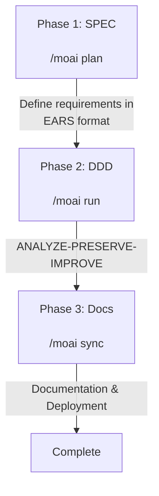

import { Callout } from 'nextra/components'

# Introduction

MoAI-ADK is an AI-based development environment, a comprehensive toolkit for efficiently generating high-quality code.

## Notation Guide

In this documentation, command prefixes indicate the execution environment:

- **Claude Code** commands entered in the chat window
  ```bash
  > /moai plan "feature description"
  ```

- **Terminal** commands entered in the terminal
  ```bash
  moai init my-project
  ```

## Core Concepts

MoAI-ADK is based on **SPEC-First DDD** (Domain-Driven Development) methodology and ensures code quality through the **TRUST 5** quality framework.

### What is SPEC? (Easy Understanding)

**SPEC** (Specification) is "documenting conversations with AI."

The biggest problem with **Vibe Coding** is **context loss**:
- 😰 Content discussed with AI for 1 hour **disappears** when the session ends
- 😰 To continue work the next day, you must **explain from the beginning**
- 😰 For complex features, **results differ from intentions**

**SPEC solves this problem:**
- ✅ Permanently preserve requirements by **saving them to files**
- ✅ Can **continue work** by reading just the SPEC even if session ends
- ✅ Define clearly without ambiguity using **EARS format**

<Callout type="tip">
**One-line summary:** Yesterday's discussion about "JWT authentication + 1 hour expiration + refresh token" - no need to re-explain today. Just `/moai run SPEC-AUTH-001` and start implementation immediately!
</Callout>

### What is DDD? (Easy Understanding)

**DDD** (Domain-Driven Development) is "a safe code improvement method."

Using home remodeling as an analogy:
- 🏠 **Without destroying the existing house**, improve one room at a time
- 📸 **Take photos of the current state before remodeling** (= characterization tests)
- 🔧 **Work on one room at a time, checking each time** (= incremental improvement)

MoAI-ADK automates this process with the **ANALYZE-PRESERVE-IMPROVE** cycle:

| Phase | Meaning | What it does |
|------|---------|--------------|
| **ANALYZE** | Analyze | Understand current code structure and problems |
| **PRESERVE** | Preserve | Record current behavior with tests (safety net) |
| **IMPROVE** | Improve | Make incremental improvements while tests pass |

### TRUST 5 Quality Framework

TRUST 5 is based on 5 core principles:

| Principle | Description |
|-----------|-------------|
| **T**ested | 85% coverage, characterization tests, behavior preservation |
| **R**eadable | Clear naming conventions, consistent formatting |
| **U**nified | Unified style guide, auto-formatting |
| **S**ecured | OWASP compliance, security verification, vulnerability analysis |
| **T**rackable | Structured commits, change history tracking |

## Key Features

MoAI-ADK provides 20 specialized AI agents and 52 skills to automate and optimize the entire development workflow.

- 🧠 **Sequential Thinking MCP**: Structured problem-solving with step-by-step reasoning
- 🔗 **Ralph-Style LSP Integration** (NEW v1.9.0): LSP-based autonomous workflow with real-time quality feedback

### Agent Categories

| Category | Count | Key Agents |
|----------|-------|------------|
| **Manager** | 7 | spec, ddd, docs, quality, project, strategy, git |
| **Expert** | 9 | backend, frontend, security, devops, performance, debug, testing, refactoring, chrome-extension |
| **Builder** | 4 | agent, command, skill, plugin |

### SPEC-First DDD Workflow

MoAI-ADK follows a 3-phase development workflow:



## Multilingual Support

MoAI-ADK supports 4 languages:

- 🇰🇷 **Korean** (Korean)
- 🇺🇸 **English** (English)
- 🇯🇵 **Japanese** (Japanese)
- 🇨🇳 **Chinese** (Chinese)

You can select your preferred language in the installation wizard or change it directly in the configuration file.

## LSP Integration (v1.9.0)

MoAI-ADK integrates Language Server Protocol (LSP) for autonomous workflow management:

- **LSP-based completion marker auto-detection**: Automatically detects when work is complete
- **Real-time regression detection**: Catches errors before they become problems
- **Auto-completion trigger**: Automatically completes when 0 errors, 0 type errors, 85% coverage achieved

## 🎁 MoAI-ADK Sponsor: z.ai GLM 4.7

**💎 Optimal Solution for Cost-Effective AI Development**

MoAI-ADK partners with **z.ai GLM 4.7** to provide developers with an economical AI development environment.

### 🚀 GLM 4.7 Special Benefits

| Benefit | Description |
|---------|-------------|
| **💰 70% Cost Savings** | 1/7 the price of Claude with equivalent performance |
| **⚡ Fast Response Speed** | Low-latency responses with optimized infrastructure |
| **🔄 Compatibility** | Fully compatible with Claude Code, no code modification needed |
| **📈 Unlimited Usage** | Use freely without daily/weekly token limits |

### 🎁 Sign-Up Special Discount

If you don't have a GLM account yet, sign up through the link below to receive an **additional 10% discount**.

**👉 [GLM 4.7 Sign Up (10% Additional Discount)](https://z.ai/subscribe?ic=1NDV03BGWU)**

<Callout type="tip">
By signing up through this link, you'll receive an additional 10% discount. Rewards generated from link sign-ups are used for **MoAI open source development**. 🙏
</Callout>

### Switching to GLM

Easily switch to the GLM backend in MoAI-ADK:

```bash
# Switch to GLM backend
moai glm

# Return to Claude backend
moai cc
```

## Getting Started

To start your MoAI-ADK journey:

1. **[Installation](/getting-started/installation)** - Install MoAI-ADK on your system
2. **[Initial Setup](/getting-started/installation)** - Run the interactive setup wizard
3. **[Quick Start](/getting-started/quickstart)** - Create your first project
4. **[Core Concepts](/core-concepts/what-is-moai-adk)** - Deepen your understanding of MoAI-ADK

## Key Benefits

| Benefit | Description |
|---------|-------------|
| **Quality Assurance** | Maintain consistent quality with TRUST 5 framework |
| **Productivity** | Reduce development time with AI agent automation |
| **Cost Efficiency** | 70% cost savings with GLM 4.7 |
| **Scalable** | Flexible scaling with modular architecture |
| **Multilingual** | Support for 4 languages |

## Additional Resources

- [GitHub Repository](https://github.com/modu-ai/moai-adk)
- [Documentation Site](https://adk.mo.ai.kr)
- [Community Forum](https://github.com/modu-ai/moai-adk/discussions)

---

## Next Steps

Learn about MoAI-ADK installation in the [Installation Guide](./installation).