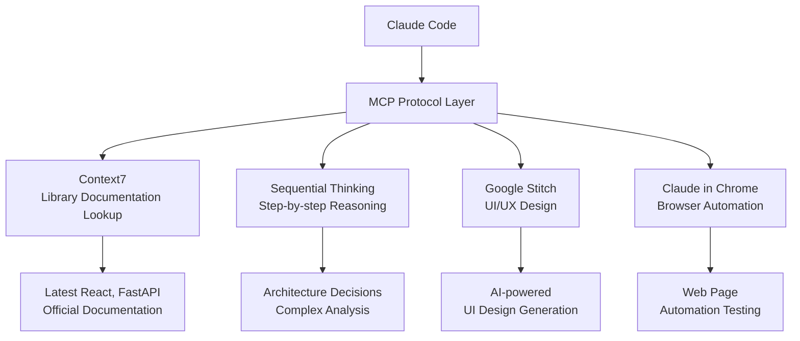
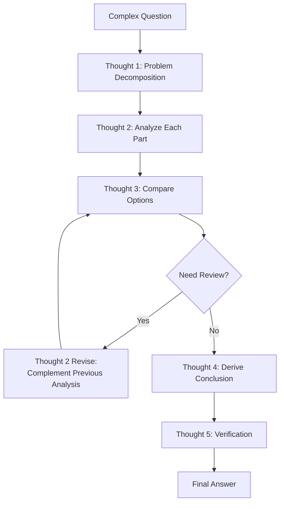

import { Callout } from 'nextra/components'

# MCP Servers Guide

Detailed guide to leveraging Claude Code's MCP (Model Context Protocol) servers.

<Callout type="tip">
**One-line summary**: MCP is the **USB port that connects external tools** to Claude Code. Query up-to-date documentation with Context7, analyze complex problems with Sequential Thinking.
</Callout>

## What is MCP?

MCP (Model Context Protocol) is a standard protocol that **connects external tools and services** to Claude Code.

Claude Code has basic tools like file read/write and terminal commands. Through MCP, you can extend this toolset to add features like library documentation lookup, knowledge graph storage, step-by-step reasoning, and more.



## MCP Servers Used in MoAI

### MCP Server List

| MCP Server | Purpose | Tools | Activation |
|------------|---------|-------|------------|
| **Context7** | Real-time library documentation lookup | `resolve-library-id`, `get-library-docs` | `.mcp.json` |
| **Sequential Thinking** | Step-by-step reasoning, UltraThink | `sequentialthinking` | `.mcp.json` |
| **Google Stitch** | AI-powered UI/UX design generation ([Detailed Guide](/advanced/stitch-guide)) | `generate_screen`, `extract_context` etc. | `.mcp.json` |
| **Claude in Chrome** | Browser automation | `navigate`, `screenshot` etc. | `.mcp.json` |

## Using Context7

Context7 is an MCP server that **queries library official documentation in real-time**.

### Why is it Needed?

Claude Code's training data only includes information up to a certain point. With Context7, you can reference **the latest version of official documentation** in real-time to generate accurate code.

| Situation | Without Context7 | With Context7 |
|-----------|-----------------|---------------|
| React 19 new features | May not be in training data | Reference latest official docs |
| Next.js 16 setup | May use old version patterns | Apply current version patterns |
| FastAPI latest APIs | May use old syntax | Apply latest syntax |

### How to Use

Context7 operates in two stages.

**Stage 1: Query Library ID**

```bash
# Claude Code calls internally
> Write code referencing React's latest documentation

# What Context7 does:
# mcp__context7__resolve-library-id("react")
# → Library ID: /facebook/react
```

**Stage 2: Search Documentation**

```bash
# Search docs for specific topic
# mcp__context7__get-library-docs("/facebook/react", "useEffect cleanup")
# → Returns useEffect cleanup function related content from React official docs
```

### Real-World Use Cases

```bash
# Scenario: Next.js 16 App Router setup
> Set up project with Next.js 16

# Claude Code internal operation:
# 1. Query Next.js latest docs with Context7
# 2. Check App Router setup patterns
# 3. Generate latest config files
# 4. Apply official recommendations
```

### Supported Library Examples

| Category | Libraries |
|----------|-----------|
| Frontend | React, Next.js, Vue, Svelte, Angular |
| Backend | FastAPI, Django, Express, NestJS, Spring |
| Database | PostgreSQL, MongoDB, Redis, Prisma |
| Testing | pytest, Jest, Vitest, Playwright |
| Infrastructure | Docker, Kubernetes, Terraform |
| Other | TypeScript, Tailwind CSS, shadcn/ui |

## Sequential Thinking (UltraThink)

Sequential Thinking is an MCP server that **analyzes complex problems step-by-step**.

### Normal Thinking vs Sequential Thinking

| Aspect | Normal Thinking | Sequential Thinking |
|--------|----------------|---------------------|
| Analysis Depth | Surface | Deep step-by-step analysis |
| Problem Decomposition | Simple | Structured decomposition |
| Revision/Correction | Limited | Can revise previous thoughts |
| Branch Exploration | Single path | Explore multiple paths |

### UltraThink Mode

Using the `--ultrathink` flag activates enhanced analysis mode.

```bash
# Architecture analysis with UltraThink mode
> Design an authentication system architecture --ultrathink

# Claude Code uses Sequential Thinking MCP to:
# 1. Decompose problem into sub-problems
# 2. Analyze each sub-problem step-by-step
# 3. Review and revise previous conclusions
# 4. Derive optimal solution
```

### Activation Scenarios

Sequential Thinking automatically activates in the following scenarios:

| Scenario | Example |
|----------|---------|
| Complex problem decomposition | "Design a microservices architecture" |
| Affecting 3+ files | "Refactor the entire authentication system" |
| Technology selection comparison | "JWT vs session authentication, which is better?" |
| Trade-off analysis | "How to maintain performance while improving maintainability?" |
| Breaking change review | "What impact will this API change have on existing clients?" |

### Sequential Thinking Stages



## MCP Configuration

### .mcp.json Configuration

Configure MCP servers in the `.mcp.json` file at the project root.

```json
{
  "context7": {
    "command": "npx",
    "args": ["-y", "@anthropic/context7-mcp-server"]
  },
  "sequential-thinking": {
    "command": "npx",
    "args": ["-y", "@anthropic/sequential-thinking-mcp-server"]
  }
}
```

### Activation in settings.local.json

To personally enable a specific MCP server, add it to `settings.local.json`.

```json
{
  "enabledMcpjsonServers": [
    "context7"
  ]
}
```

### Permission Allow in settings.json

To use MCP tools, you must register them in `permissions.allow`.

```json
{
  "permissions": {
    "allow": [
      "mcp__context7__resolve-library-id",
      "mcp__context7__get-library-docs",
      "mcp__sequential-thinking__*"
    ]
  }
}
```

## Real-World Examples

### Using Context7 for Latest React Documentation

```bash
# 1. User requests to use React 19's new features
> Implement data fetching using React 19's use() hook

# 2. Claude Code internal operation
# a) Query React library ID with Context7
#    → resolve-library-id("react") → "/facebook/react"
#
# b) Search React 19 use() related documentation
#    → get-library-docs("/facebook/react", "use hook data fetching")
#
# c) Generate code based on latest official documentation
#    → Apply correct use() hook usage
#    → Use with Suspense boundary
#    → Include error boundary handling

# 3. Result: Accurate code generation reflecting latest patterns
```

### Using UltraThink for Complex Architecture Decisions

```bash
# Architecture decision needed
> Analyze whether to use JWT or session for our service authentication --ultrathink

# Steps Sequential Thinking performs:
# Thought 1: Basic concepts of both approaches
# Thought 2: Analyze our service characteristics (SPA, mobile app support needed)
# Thought 3: JWT pros and cons analysis
# Thought 4: Session pros and cons analysis
# Thought 5: Security perspective comparison
# Thought 6: Scalability perspective comparison
# Thought 7: Revise previous thought - review hybrid approach
# Thought 8: Final conclusion and implementation strategy
```

## Related Documentation

- [settings.json Guide](/advanced/settings-json) - MCP server permission configuration
- [Skill Guide](/advanced/skill-guide) - Relationship between skills and MCP tools
- [Agent Guide](/advanced/agent-guide) - MCP tool utilization by agents
- [CLAUDE.md Guide](/advanced/claude-md-guide) - MCP-related configuration references
- [Google Stitch Guide](/advanced/stitch-guide) - AI-powered UI/UX design tool detailed usage

<Callout type="tip">
**Tip**: Context7 is most useful when referencing the latest library documentation. Activate Context7 when adopting new frameworks or upgrading to the latest version to get accurate code.
</Callout>