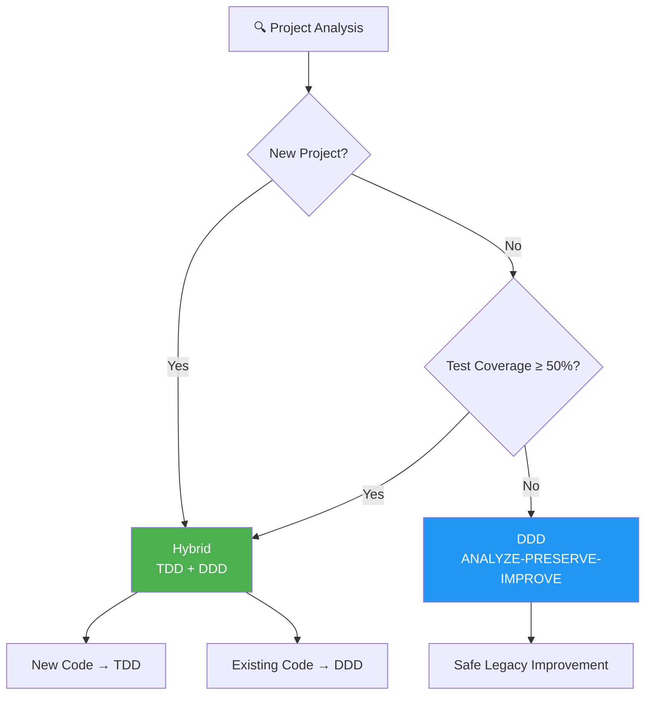
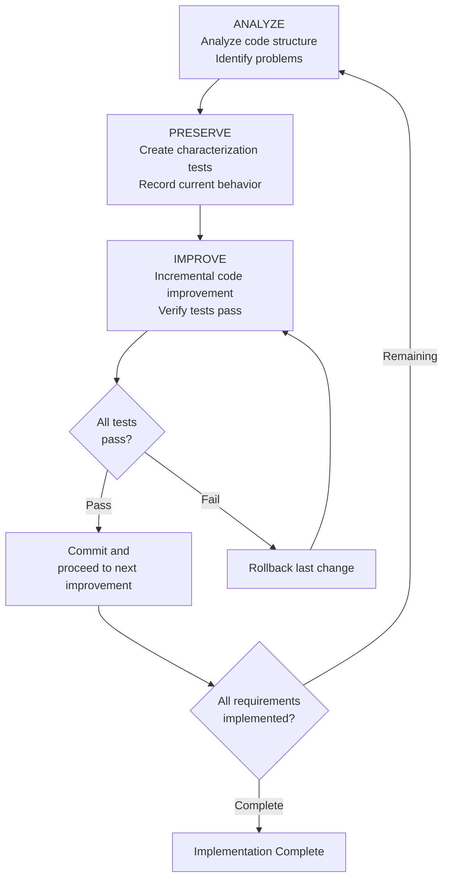
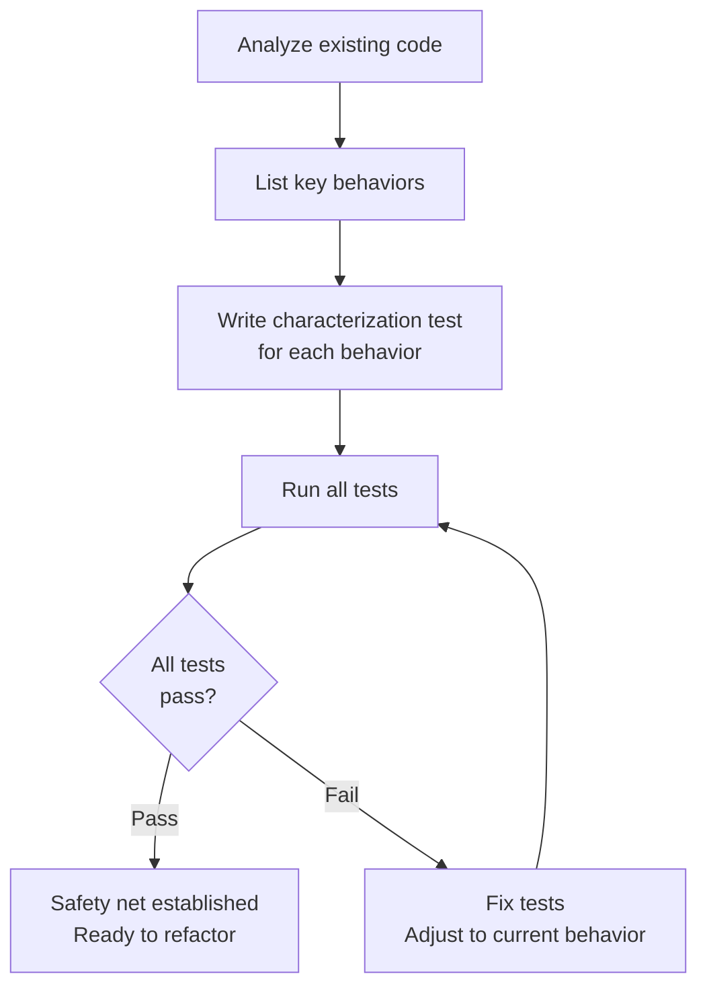
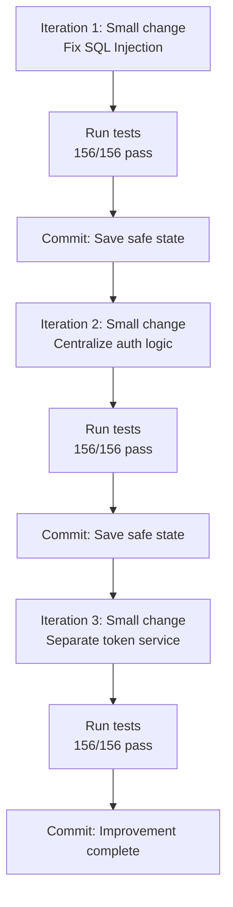
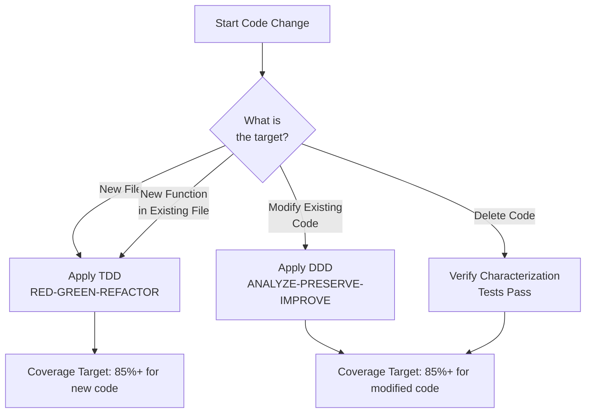
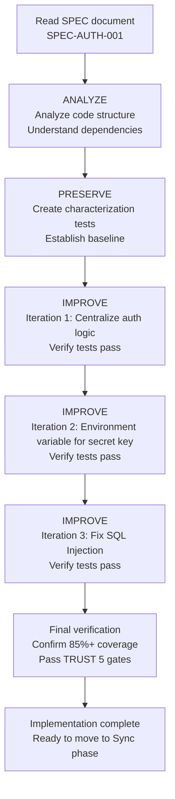

import { Callout } from 'nextra/components'

# MoAI-ADK Development Methodology

Detailed guide to MoAI-ADK's Hybrid (TDD + DDD) methodology and DDD's ANALYZE-PRESERVE-IMPROVE cycle.

<Callout type="tip">
**One-line summary:** MoAI-ADK automatically applies **Hybrid (TDD + DDD) for new projects** and **DDD for existing projects**. Like home remodeling, record the current state and safely change one room at a time.
</Callout>

## Methodology Overview

MoAI-ADK automatically selects the optimal development methodology based on your project's state.



| Project Type | Methodology | Cycle | Description |
|-------------|-------------|-------|-------------|
| **New Project** | **Hybrid** | TDD + DDD | New code uses TDD, existing code modifications use DDD |
| **Existing Project** (Coverage ≥ 50%) | **Hybrid** | TDD + DDD | Sufficient test base enables TDD |
| **Existing Project** (Coverage < 50%) | **DDD** | ANALYZE → PRESERVE → IMPROVE | Safe incremental improvement |

## What is DDD?

DDD (Domain-Driven Development) is a **safe code improvement method**. An approach that incrementally improves while respecting existing code.

### Home Remodeling Analogy

Let me explain DDD using a **home remodeling** analogy for those new to it. Imagine remodeling a 10-year-old house.

| Home Remodeling Stage | DDD Stage | What It Does | Why It Matters |
|-----------------------|-----------|--------------|----------------|
| Inspect the house | **ANALYZE** (Analyze) | Check for wall cracks, plumbing condition, electrical wiring | Can't fix what you don't understand |
| Take photos of current state | **PRESERVE** (Preserve) | Photograph every room to record | Later when confused "was there a wall here?" you can check |
| Remodel one room at a time | **IMPROVE** (Improve) | Work on one room at a time, verify each time | If you do everything at once, you won't know where problems started |

**Wrong vs Right Approach:**

```
Wrong: "Let's change all the code at once!"
  --> High risk of breaking existing functionality
  --> Hard to identify where problems occurred

Right: "Record current behavior with tests, then change incrementally!"
  --> Tests immediately tell if existing functionality breaks
  --> Just rollback last change if problems occur
```

## ANALYZE-PRESERVE-IMPROVE Cycle

MoAI-ADK's DDD proceeds as a cycle of three repeated phases.



### Phase 1: ANALYZE (Analyze)

Thoroughly analyze the existing code structure. Like a doctor examining a patient.

**Analysis Items:**

| Analysis Target | What to Check | Analogy |
|-----------------|---------------|---------|
| File Structure | What files exist and how they're connected | Check house blueprints |
| Dependencies | Which modules depend on which | Check plumbing and electrical wiring |
| Test Status | How many existing tests | Check existing insurance |
| Problems | Duplicate code, security vulnerabilities, performance bottlenecks | Check for cracked walls, leaks |

**Example Analysis Report by manager-ddd:**

```markdown
## Code Analysis Report

- Target: src/auth/ (authentication module)
- Files: 8 Python files
- Code Lines: 1,850 lines
- Test Coverage: 45%

## Discovered Problems
1. Duplicate authentication logic (same code repeated in 3 places)
2. Hardcoded secret key (written directly in config.py)
3. SQL Injection vulnerability (user_repository.py)
4. Insufficient tests (45%, target 85%)
```

### Phase 2: PRESERVE (Preserve)

Build a **safety net** to preserve existing behavior. The core of this phase is creating **characterization tests**.

<Callout type="info">
**What are characterization tests?**

Like **taking photos before home remodeling**.

Regular tests check "is this working correctly?" But characterization tests record "how is this currently working?"

They don't judge right/wrong, but **record the fact that "it originally worked like this."** Later if tests fail after code changes, you immediately know existing behavior changed.
</Callout>

**Characterization Test Example:**

```python
class TestExistingLoginBehavior:
    """Characterization test recording current login function behavior"""

    def test_valid_login_returns_token(self):
        """
        GIVEN: Registered user exists
        WHEN: Login with correct password
        THEN: Record response returned by current implementation
        """
        user = create_test_user(
            email="test@example.com",
            password="password123"
        )

        result = login_service.login("test@example.com", "password123")

        # Record current behavior as-is (not judging right/wrong)
        assert result["status"] == "success"
        assert result["token"] is not None
        assert result["expires_in"] == 3600  # Current expiration time

    def test_wrong_password_returns_error(self):
        """Record current behavior for login with wrong password"""
        create_test_user(email="test@example.com", password="password123")

        result = login_service.login("test@example.com", "wrongpassword")

        assert result["status"] == "error"
        assert result["code"] == 401
```

**Test Writing Strategy:**



### Phase 3: IMPROVE (Improve)

Once characterization tests are in place, you can safely improve the code. The core principle is **divide changes into small steps**.

**Improvement Process:**

```python
# BEFORE: Code before improvement
def login(email, password):
    # SQL Injection vulnerability
    user = db.query("SELECT * FROM users WHERE email = '" + email + "'")
    if user and check_password(user.password, password):
        token = generate_token(user.id)
        return {"status": "success", "token": token}
    return {"status": "error", "code": 401}

# ====================================

# AFTER: Code after improvement (completed in 3 iterations)
def login(email: str, password: str) -> LoginResult:
    """Process user login."""
    # Iteration 1: Use parameterized query to prevent SQL Injection
    user = user_repository.find_by_email(email)

    if not user:
        return LoginResult.failure("Invalid credentials")

    # Iteration 2: Centralize authentication logic
    if not auth_service.verify_password(user, password):
        return LoginResult.failure("Invalid credentials")

    # Iteration 3: Separate token service
    token = token_service.generate(user.id)
    return LoginResult.success(token)
```

**Incremental Improvement Steps:**



<Callout type="warning">
**Core Principle:** Always run tests after each change. If tests fail, just rollback the last change. This is the power of "small steps." If you change too much at once, it's hard to identify where problems occurred.
</Callout>

## Hybrid Mode (TDD + DDD)

Hybrid mode combines TDD (Test-Driven Development) and DDD methodologies, applying each based on the code context.

### When to Use Hybrid Mode

| Project State | Test Coverage | Recommendation |
|--------------|---------------|----------------|
| Greenfield (new) | N/A | Hybrid |
| Brownfield | 10-49% | Hybrid |
| Brownfield | >= 50% | TDD |
| Brownfield | < 10% | DDD |

### How Hybrid Mode Works

Hybrid mode applies **different methodologies based on code type**:



<Callout type="info">
**Classification Rules:**

- **New files**: TDD rules (strict test-first)
- **New functions in existing files**: TDD rules for those functions
- **Modified existing files**: DDD rules (characterization tests first)
- **Deleted code**: Verify characterization tests still pass
</Callout>

### Hybrid Mode Workflow

**For NEW code** (new files, new functions):
- Apply TDD workflow (RED-GREEN-REFACTOR)
- Strict test-first requirement
- Coverage target: 85% for new code

**For EXISTING code** (modifications, refactoring):
- Apply DDD workflow (ANALYZE-PRESERVE-IMPROVE)
- Characterization tests before changes
- Coverage target: 85% for modified code

### Success Criteria

- All SPEC requirements implemented
- New code has TDD-level coverage (85%+)
- Modified code has characterization tests
- Overall coverage improvement trend
- TRUST 5 quality gates passed

### Hybrid Mode Configuration

```yaml
constitution:
  development_mode: hybrid  # Use Hybrid methodology

  hybrid_settings:
    new_features: tdd              # Use TDD for new code
    legacy_refactoring: ddd        # Use DDD for existing code
    min_coverage_new: 90           # Coverage target for new code
    min_coverage_legacy: 85        # Coverage target for modified code
    preserve_refactoring: true     # Preserve behavior during refactoring

  test_coverage_target: 85
```

<Callout type="tip">
**When to use Hybrid mode:**

- Projects with partial test coverage (10-49%)
- Teams adding new features to existing codebases
- Migrations from legacy to modern code
- Any project with mixed new and existing code
</Callout>

### Methodology Comparison

| Aspect | DDD | TDD | Hybrid |
|--------|-----|-----|--------|
| **Test timing** | After analysis (PRESERVE) | Before code (RED) | Mixed |
| **Coverage approach** | Gradual improvement | Strict per-commit | Unified 85% target |
| **Best for** | Legacy refactoring only | Isolated modules (rare) | All development work |
| **Risk level** | Low (preserves behavior) | Medium (requires discipline) | Medium |
| **Coverage exemptions** | Allowed | Not allowed | Allowed for legacy only |
| **Run Phase cycle** | ANALYZE-PRESERVE-IMPROVE | RED-GREEN-REFACTOR | Both (per change type) |

## Why DDD?

### Why Improve Without Breaking Existing Code

When you tell AI "fix this code," AI modifies it with good intentions. But **if other code depends on it**, the modified code can break existing functionality.

| Approach | Pros | Cons |
|----------|------|------|
| **Change all at once** | Can be faster | High risk of breaking existing functionality, hard to rollback |
| **DDD incremental improvement** | Preserve existing functionality, can rollback anytime | More steps |

DDD is "a method to go fast by going slow." Because you verify safety at each step, it ultimately greatly reduces bug-fix time.

## What are Characterization Tests?

Characterization tests are DDD's core tool. Let's learn more.

### Difference from Regular Tests

| Aspect | Regular Tests | Characterization Tests |
|---------|---------------|------------------------|
| **Purpose** | "Is this working correctly?" | "How is this currently working?" |
| **When Written** | Before/after writing new code | Before refactoring existing code |
| **Criteria** | Requirements (specification) | Current actual behavior |
| **Analogy** | Check if built according to blueprint | Take photos of current house state |

### Writing Principles

1. **Record only, don't judge**: Even if current code has bugs, record that behavior
2. **Include edge cases**: Record all exceptional cases, not just normal ones
3. **Make reproducible**: Tests should produce same results every time
4. **Make fast**: Characterization tests must run fast to verify after each change

## How to Execute DDD

### /moai run Command

Once SPEC document is ready, execute DDD cycle with the following command:

```bash
# Execute DDD
> /moai run SPEC-AUTH-001
```

This command automatically causes **manager-ddd agent** to:



**Example Execution Log:**

```markdown
## ANALYZE Phase Complete
- Target files: 8
- Test coverage: 45%
- Problems found: 2 SQL Injections, hardcoded secret key

## PRESERVE Phase Complete
- Characterization tests: 156 written
- Current behavior capture: 100%
- All tests pass

## IMPROVE Phase Complete
- Iteration 1: Centralize auth logic (156/156 tests pass)
- Iteration 2: Environment variable for secret key (156/156 tests pass)
- Iteration 3: Fix SQL Injection (156/156 tests pass)

## Final Result
- Coverage: 45% --> 87%
- Behavior preservation: 100%
- Security vulnerabilities: 0
```

## DDD Configuration

Adjust DDD-related settings in `.moai/config/sections/quality.yaml` file.

```yaml
constitution:
  development_mode: ddd  # Use DDD methodology

  ddd_settings:
    require_existing_tests: true    # Require existing tests before refactoring
    characterization_tests: true    # Auto-generate characterization tests
    behavior_snapshots: true        # Use snapshot tests
    max_transformation_size: small  # Limit change size

  test_coverage_target: 85          # Target coverage
```

**Key Setting Descriptions:**

| Setting | Default | Description |
|---------|---------|-------------|
| `require_existing_tests` | `true` | Existing tests required before refactoring |
| `characterization_tests` | `true` | Auto-generate characterization tests if insufficient |
| `behavior_snapshots` | `true` | Record complex outputs with snapshot tests |
| `max_transformation_size` | `small` | Limit size of code changed at once |

**max_transformation_size Options:**

| Value | Change Scope | Recommended Situation |
|-------|--------------|----------------------|
| `small` | 1-2 files, simple refactoring | General code improvement (recommended) |
| `medium` | 3-5 files, medium complexity | Module structure changes |
| `large` | 10+ files, complex changes | Architecture changes (use caution) |

<Callout type="warning">
Setting `max_transformation_size` to `large` changes many files at once, making it hard to identify problem sources. Keep it at `small` when possible.
</Callout>

## Practical Example: Legacy Code Refactoring

Scenario for refactoring an authentication module written 3 years ago.

### Situation

```
Problems:
- 2 SQL Injection vulnerabilities
- Hardcoded secret key
- 3 places with duplicate authentication logic
- Test coverage 45%
- High code complexity
```

### Execution Process

```bash
# Phase 1: SPEC creation (Plan)
> /moai plan "Refactor legacy authentication system. Fix SQL Injection, environment variable for secret key, centralize authentication logic"

# manager-spec creates SPEC-AUTH-REFACTOR-001
```

```bash
# Phase 2: DDD execution (Run)
> /moai run SPEC-AUTH-REFACTOR-001

# manager-ddd executes ANALYZE-PRESERVE-IMPROVE cycle
# ANALYZE: Analyze code, list problems
# PRESERVE: Write 156 characterization tests
# IMPROVE: 3 iterations of incremental improvement
```

```bash
# Phase 3: Document sync (Sync)
> /moai sync SPEC-AUTH-REFACTOR-001

# manager-docs updates API docs, creates refactoring report
```

### Results

| Metric | Before | After | Change |
|--------|--------|-------|--------|
| Test Coverage | 45% | 87% | +42% |
| SQL Injection Vulnerabilities | 2 | 0 | Removed |
| Hardcoded Secret Key | Yes | No | Environment variable |
| Duplicate Code | 3 | 0 | Centralized |
| Code Complexity | High | 35% reduction | Structure improved |

<Callout type="info">
**Key Point:** During refactoring, not a single existing behavior changed. All 156 characterization tests passed in each iteration, greatly improving code quality without affecting existing users.
</Callout>

## Related Documents

- [SPEC-Based Development](/core-concepts/spec-based-dev) -- Need SPEC document before starting DDD
- [TRUST 5 Quality](/core-concepts/trust-5) -- Check quality validation criteria after DDD completion