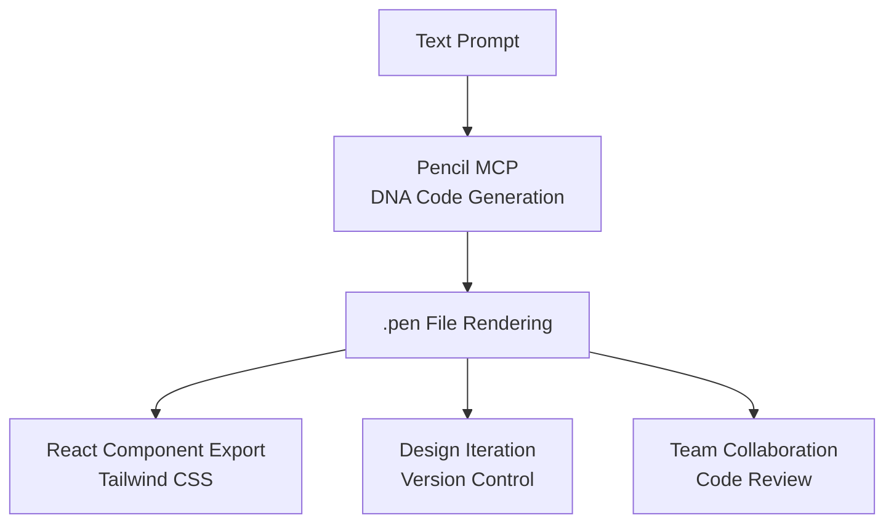
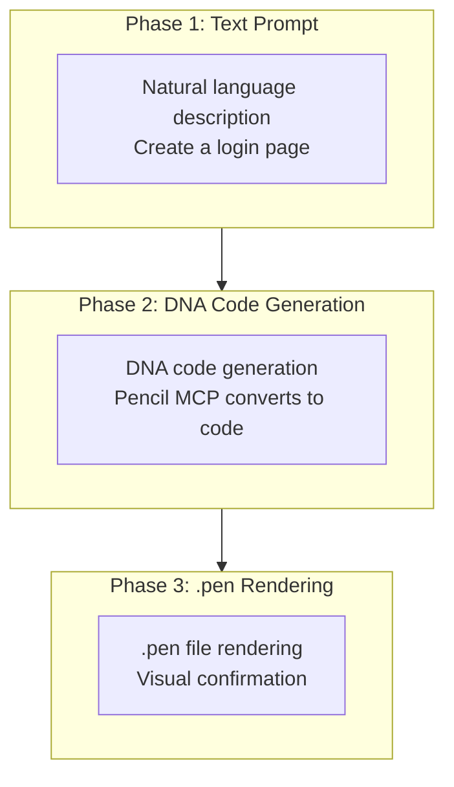
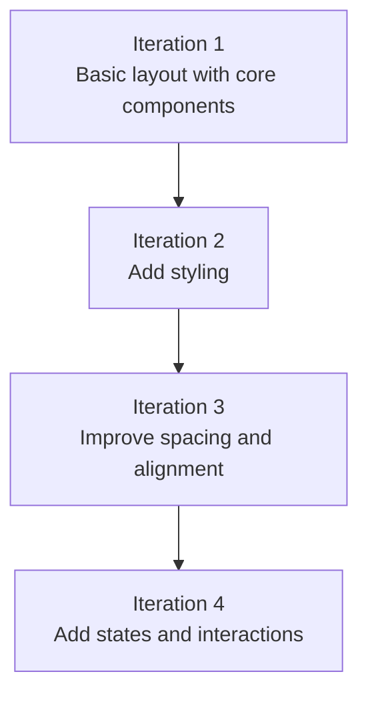
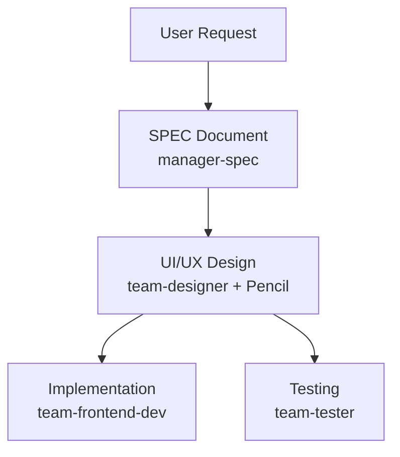

import { Callout } from 'nextra/components'

# Pencil Guide

Comprehensive guide to using Pencil MCP server for AI-powered UI/UX design generation.

<Callout type="tip">
**One-line summary**: Pencil is a **code-first design tool**. Generate UI directly in Claude Code using MCP, manage with .pen files, and export to production code.
</Callout>

## What is Pencil?

Pencil is an **AI-powered design tool** that works directly in your development environment. It bridges the gap between design and code, allowing developers to create consistent UI without separate design tools like Figma.



### Key Features

| Feature | Description |
|---------|-------------|
| **DNA Code** | Declarative code format for UI (version control friendly) |
| **Text-to-Design** | Generate UI screens from natural language descriptions |
| **.pen Files** | Encrypted design file format |
| **React Export** | Production code with Tailwind CSS |
| **Infinite Canvas** | Support for large-scale design projects |
| **Team Collaboration** | Code-based design reviews |

<Callout type="info">
Pencil uses an **open design format**. .pen files can be managed directly in your codebase. Visit https://pencil.dev for more information.
</Callout>

## Prerequisites

To use Pencil MCP, you need the following setup.

### Step 1: Install Pencil

Pencil is available as an IDE extension and a standalone desktop application.

#### VS Code Extension

1. Open VS Code
2. Go to Extensions (Cmd/Ctrl + Shift + X)
3. Search for "Pencil"
4. Click **Install**

#### Cursor Extension

1. Open Cursor
2. Go to Extensions
3. Search for "Pencil"
4. Click **Install**

#### Desktop Application

**macOS:**

1. Download the latest `.dmg` from the Pencil website
2. Drag Pencil to your Applications folder
3. Launch Pencil (right-click → Open if you see a security warning)

**Linux:**

```bash
# Example for .deb package
sudo dpkg -i pencil-*.deb

# Example for .AppImage
chmod +x pencil-*.AppImage
./pencil-*.AppImage
```

<Callout type="warning">
**Windows**: The desktop app is not currently available. Windows users should use the VS Code or Cursor extension.
</Callout>

### Step 2: Install Claude Code CLI

Pencil's AI features require Claude Code to be installed and authenticated.

```bash
# Install Claude Code CLI
npm install -g @anthropic-ai/claude-code-cli

# Or using the official installer
curl https://claude.ai/cli/install.sh | sh
```

### Step 3: Authenticate Claude Code

```bash
# Login to Claude Code
claude

# Follow the browser authentication flow
```

### Step 4: Complete Pencil Activation

1. Open Pencil (IDE extension or desktop app)
2. Complete the activation process with your email
3. Open the welcome file (Right-click canvas → Open Welcome File)

## MCP Configuration

### What is MCP?

MCP (Model Context Protocol) is a protocol that gives AI assistants tools to interact with your design files. Think of it as an API that lets AI read and modify `.pen` files programmatically.

### How It Works

1. **Pencil MCP Server runs locally** - No cloud dependency for design operations
2. **AI assistants connect** via MCP when Pencil is running
3. **AI can use tools** to read, modify, and generate designs
4. **You stay in control** - AI suggests, you approve

### Automatic Setup

The Pencil MCP server starts automatically when you open Pencil. No additional configuration is needed for basic use.

**In Cursor:**

- Open Settings → Tools & MCP
- Verify Pencil appears in the MCP server list

**In Codex CLI:**

1. Run Pencil first
2. Open Codex
3. Run `/mcp`
4. Pencil should appear in the MCP list

### Security & Privacy

<Callout type="info">
**Local-only Operation**: The Pencil MCP server runs on your machine. Design files stay local, and there is no remote access to your designs.
</Callout>

- **Local-only**: MCP server runs on your machine
- **No remote access**: Design files stay local
- **Repository is private**: Source code not yet public
- **Tool inspection**: View available tools in IDE settings

### settings.json Permission Setup

If you want to explicitly configure MCP tools in Claude Code:

```json
{
  "permissions": {
    "allow": [
      "mcp__pencil__*"
    ]
  }
}
```

## Supported AI Assistants

Pencil works with multiple AI tools through MCP:

| AI Assistant | Platform | Notes |
|--------------|----------|-------|
| **Claude Code** | CLI and IDE | Full support |
| **Claude Desktop** | Desktop App | Full support |
| **Cursor** | AI-powered IDE | Full support with extension |
| **Windsurf IDE** | Codeium | Full support |
| **Codex CLI** | OpenAI | Terminal-based workflow |
| **Antigravity IDE** | IDE | Full support |
| **OpenCode CLI** | CLI | Full support |

## MCP Tool List

When AI assistants connect to Pencil via MCP, they get access to these tools:

### Design Tools

| Tool | Purpose |
|------|---------|
| `open_document` | Create new .pen file or open existing file |
| `batch_design` | Create/modify multiple design elements at once |
| `batch_get` | Retrieve multiple node information at once |

### Analysis Tools

| Tool | Purpose |
|------|---------|
| `get_screenshot` | Capture screenshot of .pen file |
| `snapshot_layout` | Analyze layout structure |
| `get_editor_state` | Get current editor context and selection |

### Design Resources

| Tool | Purpose |
|------|---------|
| `get_guidelines` | Get design guidelines |
| `get_style_guide` | Get style guide |
| `get_style_guide_tags` | Get style guide tags for design inspiration |
| `get_variables` | Extract design tokens and theme values |
| `set_variables` | Update design variables and themes |

### Advanced Tools

| Tool | Purpose |
|------|---------|
| `find_empty_space_on_canvas` | Find empty space for new elements |
| `search_all_unique_properties` | Search for all unique properties |
| `replace_all_matching_properties` | Replace all matching properties |

### Tool Selection Guide

| Purpose | Tool to Use |
|---------|-------------|
| Start new design | `open_document` |
| Create components | `batch_design` |
| Preview design | `get_screenshot` |
| Analyze layout | `snapshot_layout` |
| Reference styles | `get_style_guide` |
| Update theme | `set_variables` |
| Export design | Use Pencil Editor Export |

## Using with Claude Code

### Basic Workflow

1. **Open AI prompt panel**: Press `Cmd/Ctrl + K`
2. **Ask for design help**:
   - "Create a login form with email and password"
   - "Add a navigation bar to this page"
   - "Design a card component for my design system"
3. **AI uses MCP tools** to modify your `.pen` file
4. **See changes** reflected in the canvas immediately

### Example Prompts

**Creating designs:**

- "Design a dashboard with sidebar and main content area"
- "Create a pricing table with 3 tiers"
- "Add a hero section with heading and CTA button"

**Modifying designs:**

- "Change all primary buttons to blue"
- "Make the sidebar narrower"
- "Add spacing between these elements"

**Design systems:**

- "Create a button component with variants"
- "Generate a color palette based on #3b82f6"
- "Build a typography scale"

**Code integration:**

- "Generate React code for this component"
- "Import the Header from my codebase"
- "Create Tailwind config from these variables"

## Using with Cursor

### Setup

1. Install Pencil extension in Cursor
2. Complete activation
3. Authenticate Claude Code
4. Verify MCP connection: Settings → Tools & MCP

### Cursor-Specific Features

**Inline editing:**

- Select elements in Pencil
- Use Cursor's AI chat to modify
- Changes apply to `.pen` file

**Codebase awareness:**

- Cursor can see both your code and designs
- Ask to sync components between them
- Maintain consistency automatically

### Common Issues

**"Need Cursor Pro":**

- Some features may require Cursor Pro subscription
- Check Cursor's pricing for current limitations

**Prompt panel missing:**

- Check activation/login status
- Restart Cursor
- Verify MCP connection in settings

**Extension doesn't connect:**

- Ensure Claude Code is logged in (`claude` CLI)
- Complete the activation process
- Check that Pencil MCP server is connected

## Using with Codex CLI

### Setup

1. **Run Pencil first** - Start the desktop app or IDE extension
2. **Open Codex** in your terminal
3. **Verify MCP connection**: `/mcp`
4. **Pencil should appear** in the MCP server list

### Working with Codex

**Design prompts in terminal:**

```bash
# In Codex CLI
> Create a button component in design.pen
> Add a hero section to the landing page
> Generate a color scheme based on blue
```

**Benefits:**

- Command-line workflow
- Scriptable design generation
- Integrate with build tools

### Known Issues

**Codex config.toml modifications:**

- Pencil may modify or duplicate the config
- Issue is acknowledged and under investigation
- Backup your config before first use

## DNA Code Format

Pencil uses DNA code, a declarative format for expressing UI.

### Basic Structure

```dna
// Button component DNA code
component Button {
  variant: primary
  size: medium
  content: "Click me"
  onClick: handleSubmit
}
```

### Layout Structure

```dna
// Login form layout
layout LoginForm {
  direction: column
  spacing: 16
  children: [
    Input {
      placeholder: "Email"
      type: email
    }
    Input {
      placeholder: "Password"
      type: password
    }
    Button {
      variant: primary
      content: "Sign In"
    }
  ]
}
```

### Design Tokens

```dna
// Token references
color: primary.500
spacing: md
radius: lg

// Token definitions
tokens {
  primary.500 = #3B82F6
  md = 16px
  lg = 8px
}
```

## Design Generation Workflow

Three-phase pattern for generating designs with Pencil.



### Practical Example: E-Commerce Card

```bash
# Phase 1: Request design with text prompt
> Create a product card. Product image at top, title and price in middle,
# cart button at bottom. Clean minimal style

# Phase 2: Pencil generates DNA code
# → component ProductCard { ... }

# Phase 3: Render to .pen file
# → open_document then batch_design
```

<Callout type="tip">
**Key**: Pencil **manages designs as code**. .pen files can be version controlled with Git and integrated into code review workflows.
</Callout>

## Advanced Workflows

### Automated Design Generation

**Style guides**: Ask AI to follow specific design systems:

```
"Create a dashboard using Material Design principles"
"Design a landing page with modern, minimal aesthetics"
"Build components following our design system in design-system.pen"
```

**Batch operations:**

```
"Create 5 variations of this button component"
"Generate a complete form with all input types"
"Design an entire landing page with hero, features, pricing, and footer"
```

### Design System Management

**Consistency enforcement:**

```
"Ensure all buttons use the primary color variable"
"Update all headings to use the typography scale"
"Apply 8px spacing grid to all elements"
```

**Component library:**

```
"Create a complete button component with all variants"
"Generate form input components (text, select, checkbox, radio)"
"Build a card component with image, title, description, and actions"
```

### Code-Design Workflows

**Import existing app:**

```
"Recreate all components from src/components in Pencil"
"Import the design system from our Tailwind config"
"Analyze the codebase and create matching designs"
```

**Sync changes:**

```
"Update all React components to match the Pencil designs"
"Apply the new color scheme to both design and code"
"Sync typography variables between CSS and Pencil"
```

## React Component Export

Export .pen files to React components in Pencil Editor.

### Export Configuration

```typescript
// pencil.config.js
module.exports = {
  framework: 'react',
  styling: 'tailwind',
  output: './src/components/generated',
  options: {
    typescript: true,
    responsive: true,
    accessibility: true
  }
};
```

### Generated Component Example

```typescript
export interface ButtonProps {
  variant?: 'primary' | 'secondary' | 'tertiary';
  size?: 'small' | 'medium' | 'large';
  isLoading?: boolean;
}

export const Button = ({ variant = 'primary', size = 'medium', isLoading, children, ...props }: ButtonProps) => {
  const baseStyles = 'inline-flex items-center justify-center font-medium rounded-md transition-colors';

  const variantStyles = {
    primary: 'bg-blue-600 text-white hover:bg-blue-700',
    secondary: 'bg-gray-200 text-gray-900 hover:bg-gray-300',
    tertiary: 'bg-transparent text-gray-700 hover:bg-gray-100'
  };

  const sizeStyles = {
    small: 'px-3 py-1.5 text-sm',
    medium: 'px-4 py-2 text-base',
    large: 'px-6 py-3 text-lg'
  };

  return (
    <button className={`${baseStyles} ${variantStyles[variant]} ${sizeStyles[size]}`} {...props}>
      {isLoading ? 'Loading...' : children}
    </button>
  );
};
```

## Prompt Writing Guide

Structured prompts are key to getting good results with Pencil.

### Good vs Bad Prompts

| Bad Prompt | Good Prompt |
|-----------|-------------|
| "Create a cool button" | "Medium-sized primary button with blue background, 'Confirm' text, 16px padding" |
| "Dashboard" | "Analytics dashboard with sidebar nav, 3 metric cards at top (revenue, users, conversion), line chart, table" |
| "Responsive" | "Mobile: vertical stack, desktop: 3-column grid" |

### Effective Prompt Template

```
Create a [component type].
Include [component list].
Layout as [layout].
Apply [style].
Consider [responsive].
```

### Best Practices for Effective Prompting

**Be specific:**

- ❌ "Make it better"
- ✅ "Increase the button padding to 16px and change color to blue"

**Provide context:**

- ❌ "Add a form"
- ✅ "Add a login form with email, password, remember me checkbox, and submit button"

**Reference design systems:**

- "Use our existing button component"
- "Follow the spacing scale from our variables"
- "Match the style of the header component"

### Iterative Design

1. **Start broad**: "Create a dashboard layout"
2. **Refine**: "Add a sidebar with navigation items"
3. **Detail**: "Style the nav items with hover states"
4. **Polish**: "Adjust spacing to match 8px grid"

<Callout type="info">
**Golden Rule**: Be **specific** in prompts. Specify colors, spacing, alignment, and interactions clearly.
</Callout>

## Best Practices

| Principle | Description |
|-----------|-------------|
| **Code First** | Manage designs as code for easier version control and collaboration |
| **Iterative Approach** | Start with basic layout, then add details progressively |
| **Accessibility** | Always specify ARIA labels, keyboard navigation |
| **Responsive** | Always include mobile and desktop behaviors |
| **Design System** | Use consistent tokens and components |

### Progressive Enhancement Strategy

Complex screens yield better quality when generated in multiple iterations.



## Troubleshooting

### Connection Issues

**"Claude Code not connected":**

1. Ensure Claude Code is logged in: `claude`
2. Restart Pencil
3. Open terminal in project directory and run `claude`

**MCP server not appearing:**

1. Verify Pencil is running
2. Check IDE MCP settings
3. Restart both Pencil and the AI assistant

### Permission Issues

**"Can't access folders":**

- Accept permission prompts
- Check system folder permissions
- Run IDE/Pencil with proper permissions

**"Permission prompt never appeared":**

- Try operation in separate Claude Code session
- Check notification settings
- Verify IDE permissions

### AI Output Issues

**"Invalid API key":**

- Re-authenticate Claude Code: `claude`
- Check for conflicting auth configs
- Clear environment variables

**AI makes unexpected changes:**

- Be more specific in prompts
- Ask AI to explain before applying
- Use version control to revert if needed

### Extension Issues

**Extension installed but doesn't connect:**

- Verify Claude Code is logged in
- Complete the activation process
- Restart your IDE

**Activation email not received:**

- Check spam/junk folder
- Try a different email address
- Reinstall the extension

## Using with MoAI

MoAI integrates with Pencil MCP for automated UI design.

```bash
# MoAI uses Pencil for UI generation
> /moai run --team
# team-designer agent uses Pencil MCP for design generation
```

### Team Mode Design Workflow



## Related Documents

- [MCP Servers Guide](/advanced/mcp-servers) - MCP protocol overview
- [settings.json Guide](/advanced/settings-json) - MCP server permission setup
- [Agent Guide](/advanced/agent-guide) - MoAI agent system
- [Skill Guide](/advanced/skill-guide) - moai-design-tools skill

## Sources

- [Installation - Pencil Documentation](https://docs.pencil.dev/getting-started/installation)
- [AI Integration - Pencil Documentation](https://docs.pencil.dev/getting-started/ai-integration)

<Callout type="tip">
**Tip**: The key to maximizing Pencil is **managing designs as code**. Managing .pen files with Git makes design version tracking and collaboration much easier.
</Callout>