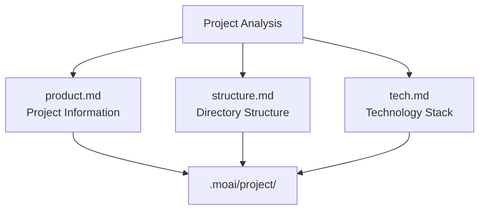
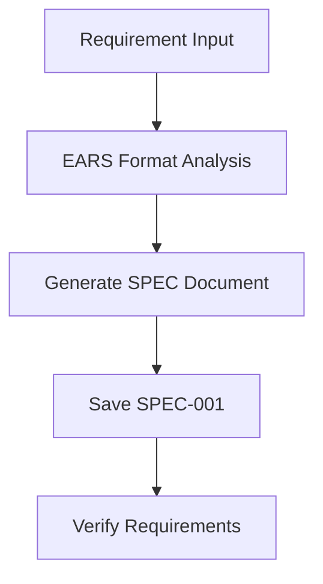
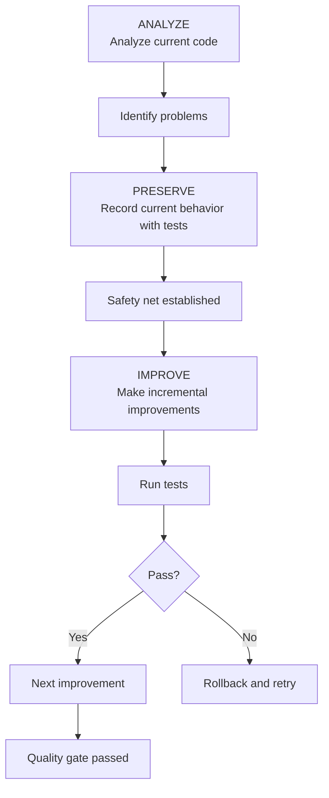
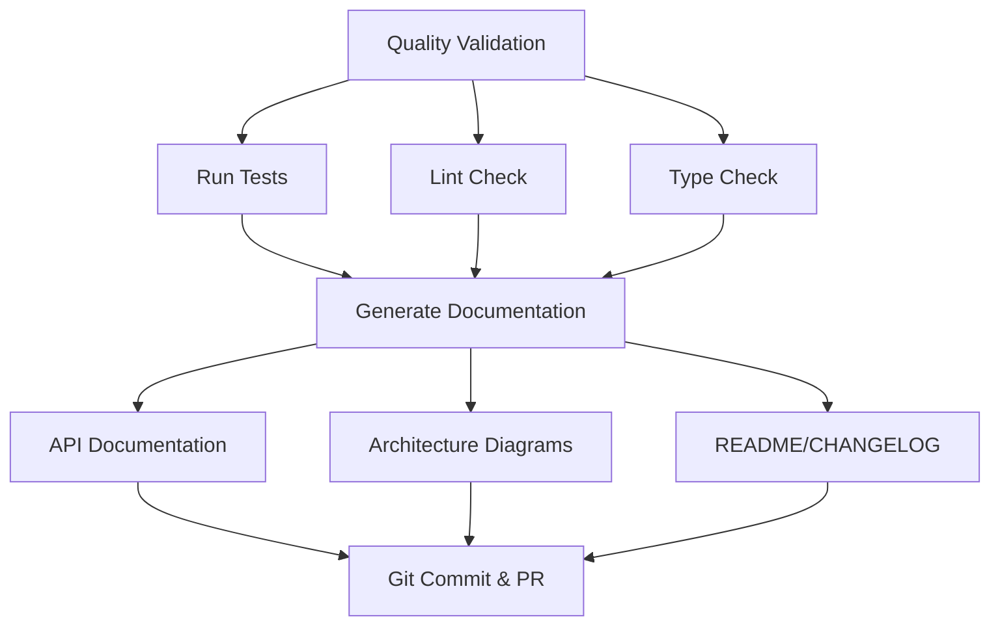
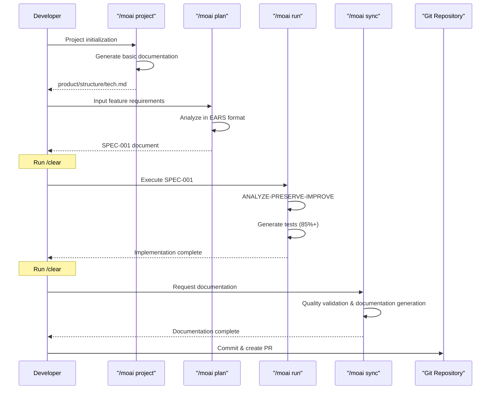
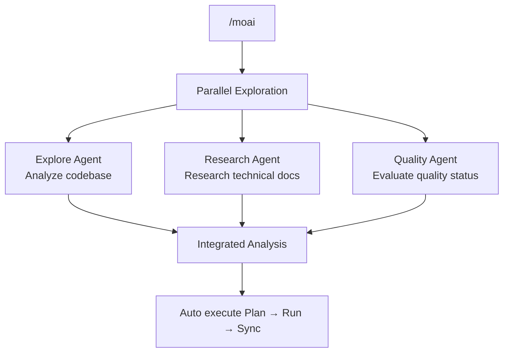
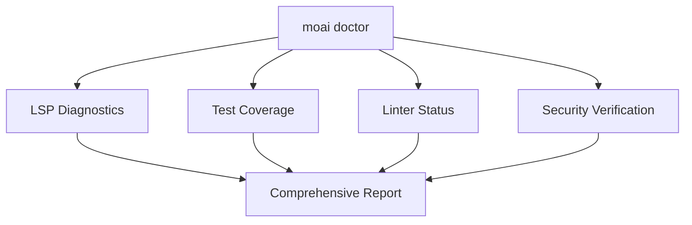

import { Callout } from 'nextra/components'

# Quick Start

Create your first project with MoAI-ADK and experience the development workflow.

## Prerequisites

Before starting, ensure the following are complete:

- [x] MoAI-ADK installed ([Installation Guide](./installation))
- [x] Initial setup completed ([Initial Setup](./init-wizard))
- [x] GLM API key obtained

## Creating Your First Project

### Step 1: Project Initialization

Use the `moai init` command to create a new project:

```bash
moai init my-first-project
cd my-first-project
```

To initialize MoAI-ADK in an existing project, navigate to that folder and run:

```bash
cd existing-project
moai init
```

### Step 2: Generate Project Documentation

Generate basic project documentation. This step is essential for Claude Code to understand the project.

```bash
> /moai project
```

This command analyzes the project and automatically generates 3 files:



| File | Content |
|------|---------|
| **product.md** | Project name, description, target users, key features |
| **structure.md** | Directory tree, folder purposes, module composition |
| **tech.md** | Technologies used, frameworks, development environment, build/deploy config |

<Callout type="tip">
Run `/moai project` after initial project setup or when structure changes significantly.
</Callout>

### Step 3: Create SPEC Document

Create a SPEC document for your first feature. Use EARS format to define clear requirements.

<Callout type="info">
**Why do we need SPEC?** 📝

The biggest problem with **Vibe Coding** is **context loss**:

- While coding with AI, you reach moments like "Wait, what were we trying to do?"
- When session ends or context initializes, **previously discussed requirements disappear**
- Eventually, you repeat explanations or get code that differs from intentions

**SPEC documents solve this problem:**

| Problem | SPEC Solution |
|---------|---------------|
| Context loss | Permanently preserve requirements by **saving to files** |
| Ambiguous requirements | Structure clearly with **EARS format** |
| Communication errors | Specify completion conditions with **acceptance criteria** |
| Cannot track progress | Manage work units with **SPEC ID** |

**One-line summary:** SPEC is "documenting conversations with AI." Even if session ends, you can continue working by reading the SPEC document!
</Callout>

```bash
> /moai plan "Implement user authentication feature"
```

This command performs the following:



The generated SPEC document is saved at `.moai/specs/SPEC-001/spec.md`.

<Callout type="warning">
After SPEC creation, always run `/clear` to save tokens.
</Callout>

### Step 4: Execute DDD Development

Develop using Domain-Driven Development based on the SPEC document.

<Callout type="info">
**What is DDD?** 🏠

DDD is similar to "home remodeling":
- **Without destroying the existing house**, improve one room at a time
- **Take photos of current state before remodeling** (= characterization tests)
- **Work on one room at a time, checking each time** (= incremental improvement)

Why do we do this? **To safely improve code.** We don't want to break existing functionality!
</Callout>

```bash
> /clear
> /moai run SPEC-001
```

This command runs the **ANALYZE-PRESERVE-IMPROVE** cycle:

**Understanding ANALYZE-PRESERVE-IMPROVE:**

| Phase | Analogy | Actual Work |
|-------|---------|-------------|
| **ANALYZE** (Analyze) | 🔍 House inspection | Understand current code structure and problems |
| **PRESERVE** (Preserve) | 📸 Take photos of current state | Record current behavior with characterization tests |
| **IMPROVE** (Improve) | 🔧 Remodel one room at a time | Make incremental improvements while tests pass |



<Callout type="tip">
`/moai run` automatically targets 85%+ test coverage. **Tests are insurance for remodeling!**
</Callout>

**Completion Criteria:**
- Test coverage >= 85%
- 0 errors, 0 type errors
- LSP baseline achieved

### Step 5: Document Synchronization

When development is complete, automatically generate quality validation and documentation.

```bash
> /clear
> /moai sync SPEC-001
```

This command performs the following:



## Complete Development Workflow



## Integrated Automation: /moai

To automatically execute all phases at once:

```bash
> /moai "Implement user authentication feature"
```

MoAI automatically executes Plan → Run → Sync, providing 3-4x faster analysis with parallel exploration.



## Workflow Selection Guide

| Situation | Recommended Command | Reason |
|-----------|---------------------|--------|
| New Project | Run `/moai project` first | Basic documentation required |
| Simple Feature | `/moai plan` + `/moai run` | Quick execution |
| Complex Feature | `/moai` | Auto optimization |
| Parallel Development | Use `--worktree` flag | Independent environment guarantee |

## Practical Examples

### Example 1: Simple API Endpoint

```bash
# 1. Generate project documentation (first time only)
> /moai project

# 2. Create SPEC
> /moai plan "Implement user list API endpoint"
> /clear

# 3. Implement
> /moai run SPEC-001
> /clear

# 4. Document & PR
> /moai sync SPEC-001
```

### Example 2: Complex Feature (Using MoAI)

```bash
# If project documentation exists, execute all at once with MoAI
> /moai "Implement JWT authentication middleware"
```

### Example 3: Parallel Development (Using Worktree)

```bash
# Parallel development in independent environments
> /moai plan "Implement payment system" --worktree
```

## Understanding File Structure

Standard MoAI-ADK project structure:

```
my-first-project/
├── CLAUDE.md                        # Claude Code project guidelines
├── CLAUDE.local.md                  # Project local settings (personal)
├── .mcp.json                        # MCP server configuration
├── .claude/
│   ├── agents/                      # Claude Code agent definitions
│   ├── commands/                    # Slash command definitions
│   ├── hooks/                       # Hook scripts
│   ├── skills/                      # Reusable skills
│   └── rules/                       # Project rules
├── .moai/
│   ├── config/
│   │   └── sections/
│   │       ├── user.yaml            # User information
│   │       ├── language.yaml        # Language settings
│   │       ├── quality.yaml         # Quality gate settings
│   │       └── git-strategy.yaml    # Git strategy settings
│   ├── project/
│   │   ├── product.md               # Project overview
│   │   ├── structure.md             # Directory structure
│   │   └── tech.md                  # Technology stack
│   ├── specs/
│   │   └── SPEC-001/
│   │       └── spec.md              # Requirements specification
│   └── memory/
│       └── checkpoints/             # Session checkpoints
├── src/
│   └── [project source code]
├── tests/
│   └── [test files]
└── docs/
    └── [generated documentation]
```

## Quality Check

Check quality anytime during development:

```bash
moai doctor
```

This command verifies:

- LSP diagnostics (errors, warnings)
- Test coverage
- Linter status
- Security verification



## Useful Tips

### Token Management

For large projects, run `/clear` after each phase to save tokens:

```bash
> /moai plan "Implement complex feature"
> /clear  # Reset session
> /moai run SPEC-001
> /clear
> /moai sync SPEC-001
```

### Bug Fix & Automation

```bash
# Auto fix
> /moai fix "Fix TypeError in tests"

# Repeat fix until complete
> /moai loop "Fix all linter warnings"
```

---

## Next Steps

Learn about MoAI-ADK's advanced features in [Core Concepts](/core-concepts/what-is-moai-adk).