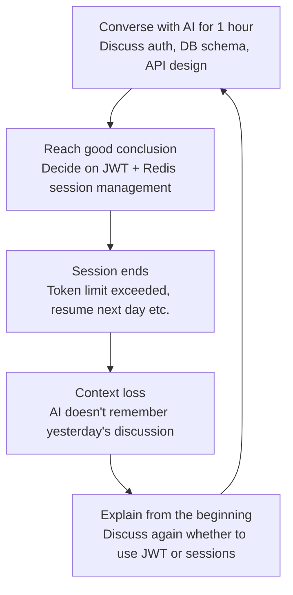
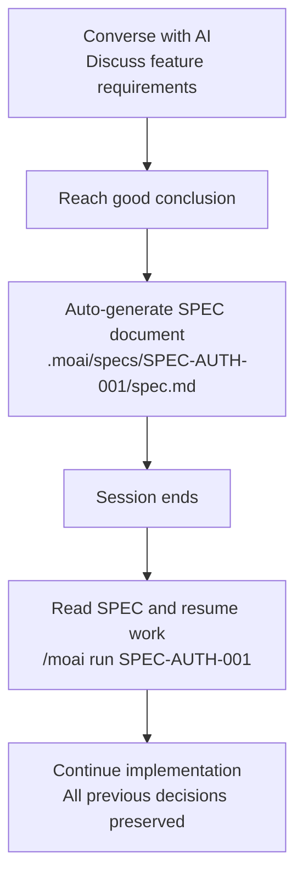
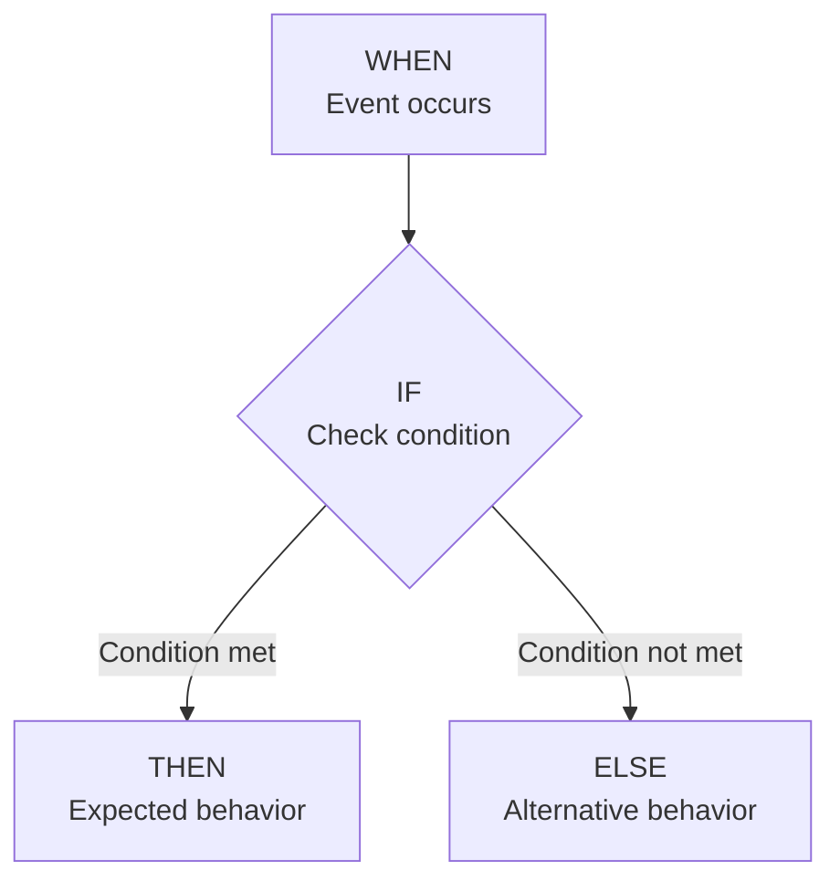
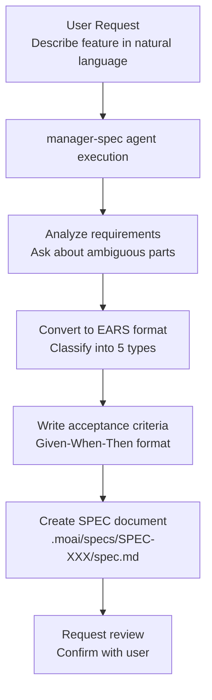

import { Callout } from "nextra/components";

# SPEC-Based Development

Detailed guide to MoAI-ADK's SPEC-based development methodology.

<Callout type="tip">
  **One-line summary:** SPEC is "documenting conversations with AI." Even if session ends, you can continue working anytime with just the SPEC.
</Callout>

<Callout type="info">
  **SPEC is for Agents:** SPEC is not for developers to memorize or learn. It's a document that agents reference when performing work. Just understanding SPEC principles conceptually is sufficient.
</Callout>

## What is SPEC?

**SPEC** (Specification) is a document that defines project requirements in a structured format.

Using a daily life analogy, SPEC is like a **recipe for cooking**. When cooking from memory alone, it's easy to miss ingredients or forget the order. But if you write down the recipe, anyone can cook the same dish accurately.

| Cooking Recipe | SPEC Document | Common Points |
|----------------|---------------|---------------|
| List of required ingredients | List of requirements | Define what's needed |
| Cooking order | Implementation order | Define the sequence |
| Finished photo | Acceptance criteria | Define what the finished result looks like |
| No vague expressions like "a little salt" | Clear with EARS format | Remove ambiguity |

## Why Do We Need SPEC?

### Vibe Coding's Context Loss Problem

When writing code while conversing with AI, the biggest problem is **context loss**.



**Specific Situations Where Context Loss Occurs:**

| Situation | What Happens | Result |
|-----------|--------------|--------|
| Session timeout | Previous conversation disappears after some time | Lost decisions |
| `/clear` executed | Initialize context to save tokens | Entire previous context lost |
| Token limit exceeded | Long conversations cut old content | Lost early decisions |
| Resume next day | New session doesn't know yesterday's conversation | Must re-explain everything |

### Solving Problems with SPEC

SPEC fundamentally solves these problems by **saving conversations to files**.



**Difference with and without SPEC:**

<Callout type="info">
**Working without SPEC:**

Assume you discussed "user authentication feature" with AI for 1 hour yesterday. JWT or sessions? Token expiration time? Where to store refresh token? You must discuss all this again.

**With SPEC:**

Just one line to start implementing yesterday's decision:

```bash
> /moai run SPEC-AUTH-001
```

</Callout>

## EARS Format

**EARS** (Easy Approach to Requirements Syntax) is a method for writing clear requirements. Removes natural language ambiguity and converts requirements to testable format.

EARS provides 5 types of requirement patterns.

### 1. Ubiquitous (Always True)

Requirements the system must **always** comply with. Apply unconditionally.

**Format:** "The system shall ~"

**Example:**

```yaml
- id: REQ-001
  type: ubiquitous
  priority: HIGH
  text: "The system shall validate all user inputs"
  acceptance_criteria:
    - "Perform type validation for all input values"
    - "Use parameterized queries to prevent SQL Injection"
    - "Output escaping to prevent XSS"
```

**Daily Analogy:** Like "always wear seatbelt when driving." No special conditions, always follow.

### 2. Event-driven (Event-Based)

Defines how the system should respond when a specific event occurs.

**Format:** "WHEN ~, IF ~, THEN ~"



**Example:**

```yaml
- id: REQ-002
  type: event-driven
  priority: HIGH
  text: |
    WHEN user clicks login button,
    IF email and password are valid,
    THEN the system shall issue JWT token and redirect to dashboard
  acceptance_criteria:
    - given: "Registered user account exists"
      when: "Login with correct email and password"
      then: "200 response with JWT token issued"
      and: "Token expiration time is 1 hour"
```

**Daily Analogy:** Like "When doorbell rings (WHEN), check monitor to see if I know them (IF), then open the door (THEN)."

### 3. State-driven (State-Based)

Defines how the system should behave while a specific state is maintained.

**Format:** "WHILE ~, the system shall ~"

**Example:**

```yaml
- id: REQ-003
  type: state-driven
  priority: MEDIUM
  text: |
    WHILE user is logged in,
    the system shall refresh session every 5 minutes
  acceptance_criteria:
    - "Auto refresh 5 minutes after last activity"
    - "Show notification 5 minutes before session expires"
    - "Auto logout after 30 minutes of inactivity"
```

**Daily Analogy:** Like "While air conditioner is on (WHILE), maintain room temperature at 25°C."

### 4. Unwanted (Prohibited)

Defines what the system must **never** do. Mainly used for security requirements.

**Format:** "The system shall not ~"

**Example:**

```yaml
- id: REQ-004
  type: unwanted
  priority: CRITICAL
  text: "The system shall not store passwords in plain text"
  acceptance_criteria:
    - "Password hashed with bcrypt (cost factor 12)"
    - "Unhashed password not included in logs"
    - "Cannot store plain text password in database"

- id: REQ-005
  type: unwanted
  priority: CRITICAL
  text: "The system shall not use hardcoded secret keys"
  acceptance_criteria:
    - "All secret keys use environment variables or secret manager"
    - "No secret keys included in code"
    - "Prevent secret keys in Git commits"
```

**Daily Analogy:** Like "Don't hide house key under doormat." Explicitly states what NOT to do.

### 5. Optional (Nice-to-Have)

Features recommended but not required for implementation.

**Format:** "Where possible, the system shall ~"

**Example:**

```yaml
- id: REQ-006
  type: optional
  priority: LOW
  text: "Where possible, the system shall send email notification on login"
  acceptance_criteria:
    - "Only works if email server is configured"
    - "Provide option to disable notifications"
```

**Daily Analogy:** Like "Make dessert if time permits." Nice to have but not required.

### EARS at a Glance

| Type | Format | Purpose | Priority |
|---------------|--------------------------|------------------|----------|
| **Ubiquitous** | "The system shall ~" | Always-applicable rules | Usually HIGH |
| **Event-driven** | "WHEN ~, THEN ~" | Define event responses | Varies by feature |
| **State-driven** | "WHILE ~, the system shall ~" | State-maintaining behavior | Usually MEDIUM |
| **Unwanted** | "The system shall not ~" | Prohibitions (security) | Usually CRITICAL |
| **Optional** | "Where possible, the system shall ~" | Optional features | Usually LOW |

## SPEC Document Structure

SPEC documents are automatically created by **manager-spec agent**. Developers don't need to memorize EARS format; just request in natural language and the agent converts it.

**Complete SPEC Document Structure:**

```yaml
---
id: SPEC-AUTH-001               # Unique identifier
title: User Authentication System # Clear and concise title
priority: HIGH                  # HIGH, MEDIUM, LOW
status: ACTIVE                  # DRAFT, ACTIVE, IN_PROGRESS, COMPLETED
created: 2025-01-12             # Creation date
updated: 2025-01-12             # Last modified date
author: Development Team         # Author
version: 1.0.0                  # Document version
---

# User Authentication System

## Overview
Implement JWT-based user authentication system

## Requirements
### Ubiquitous
- The system shall require authentication for all API requests

### Event-driven
- WHEN user logs in, THEN the system shall issue JWT

### Unwanted
- The system shall not store passwords in plain text

## Acceptance Criteria
- 200 response with JWT token for valid credentials
- 401 response for invalid credentials

## Constraints
- API response time within 500ms
- Password bcrypt hashing (cost factor 12)

## Dependencies
- Redis (session management)
- PostgreSQL (user data)
```

## SPEC Workflow

SPEC creation starts with a single `/moai plan` command.



**Execution Method:**

```bash
# SPEC creation command
> /moai plan "Implement user authentication feature"
```

This automatically proceeds with:

1. **Requirements Analysis**: manager-spec analyzes what "user authentication feature" means
2. **Clarification Questions**: Asks user about ambiguous parts (e.g., "Do you prefer JWT or sessions?")
3. **EARS Conversion**: Automatically classifies natural language into 5 EARS types
4. **Document Creation**: Creates `.moai/specs/SPEC-AUTH-001/spec.md` file
5. **Review Request**: Shows generated SPEC to user for confirmation

<Callout type="warning">
  **Important:** Always review SPEC documents created by agents at least once. AI may misinterpret requirements or miss items. Especially check if acceptance criteria are testable and priorities are appropriate.
</Callout>

## Related Documents

- [What is MoAI-ADK?](/core-concepts/what-is-moai-adk) -- Understand the overall structure of MoAI-ADK
- [Domain-Driven Development](/core-concepts/ddd) -- Learn how to safely implement code based on SPEC
- [TRUST 5 Quality](/core-concepts/trust-5) -- Learn quality validation criteria for implemented code