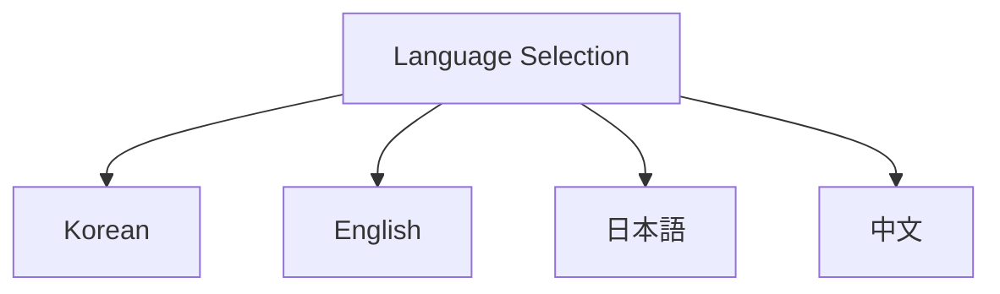
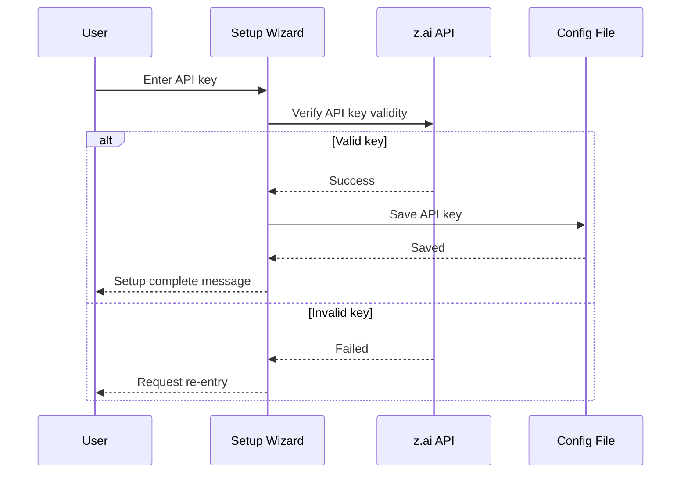
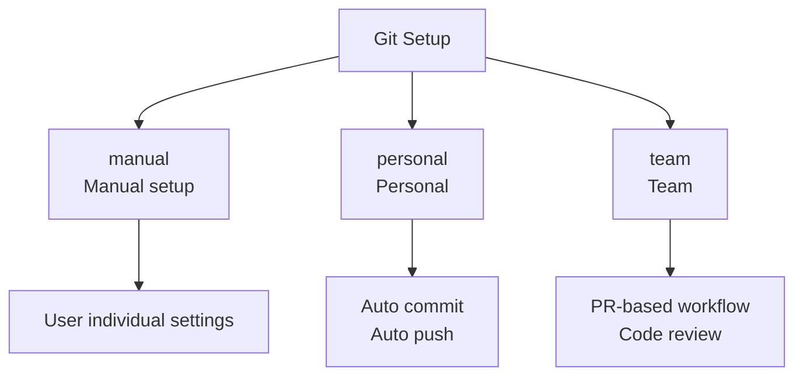
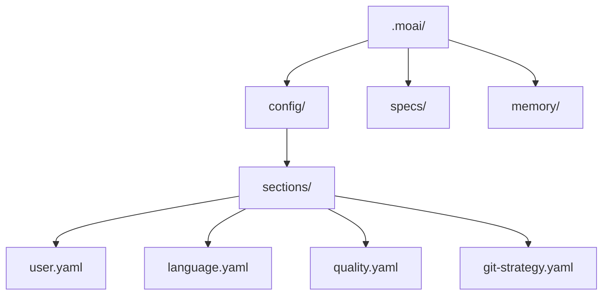
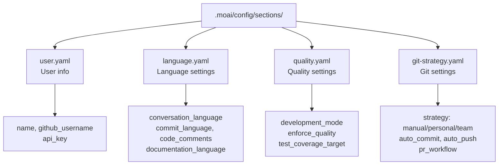

import { Callout } from 'nextra/components'

# Initial Setup

Complete your first setup using MoAI-ADK's interactive setup wizard. Configure your system for development in 9 steps.

## Starting the Setup Wizard

### Creating New Project

To create and initialize a new project:

```bash
moai init my-project
```

This creates a `my-project` folder and initializes MoAI-ADK.

### Installing in Current Folder

To install MoAI-ADK in an existing project, navigate to that folder and run:

```bash
cd my-existing-project
moai init
```

<Callout type="tip">
`moai init` installs directly in the current folder. For new projects, use `moai init <project-name>`.
</Callout>

## 9-Step Setup Process

### Step 1: Language Selection

Select your preferred language. All interactions will be provided in the selected language.

```bash
? Select language:
  Korean
  English
  Japanese
  Chinese
```



<Callout type="tip">
Language can be changed later in `.moai/config/sections/language.yaml`.
</Callout>

### Step 2: Name Entry

Enter your name. This will be used in commit messages and documentation generation.

```bash
? Enter your name: [name]
```

<Callout type="info">
Your name is used in the "Co-Authored-By" tag of Git commit messages.
</Callout>

### Step 3: GLM API Key Entry

Enter your z.ai GLM 4.7 API key. Coding plan users can get free API keys from [z.ai](https://z.ai/subscribe?ic=1NDV03BGWU).

```bash
? Enter GLM API key: [sk-...]
```



<Callout type="tip">
GLM 4.7 provides GPT-4 level performance at 70% lower cost. Coding plan users can get free API keys from [z.ai](https://z.ai/subscribe?ic=1NDV03BGWU).
</Callout>

### Step 4: Project Settings

Enter the default project name. This will be used when creating new projects.

```bash
? Default project name: [my-project]
```

### Step 5: Git Settings

Select your Git configuration method.

```bash
? Git configuration method:
  manual (default)
  personal
  team
```



**manual**: User manually controls Git operations.
**personal**: Auto commit and push for development projects
**team**: Pull Request-based workflow for team collaboration

<Callout type="info">
Git settings are saved in `.moai/config/sections/git-strategy.yaml`. After installation, you can directly modify this file or re-run the setup wizard with `moai update -c` to reconfigure.
</Callout>

### Step 6: GitHub Username

Enter your GitHub username. This will be linked to commits and PRs.

```bash
? GitHub username: [username]
```

<Callout type="info">
GitHub username is used in `Co-Authored-By: username <noreply@anthropic.com>` format.
</Callout>

### Step 7: Commit Message Language

Select the language for commit messages.

```bash
? Commit message language:
  korean (default)
  english
```

<Callout type="tip">
Commit message language can be set differently from code comment language.
</Callout>

### Step 8: Code Comment Language

Select the language for code comments.

```bash
? Code comment language:
  english (recommended, default)
  korean
```

<Callout type="info">
For most projects, using English for code comments is recommended.
</Callout>

### Step 9: Documentation Language

Select the language for documentation generation.

```bash
? Documentation language:
  korean (default)
  english
  japanese
  chinese
```

## Setup Completion

After completing all steps, configuration files will be created:



Check the generated configuration files:

```bash
cat .moai/config/sections/user.yaml
```

## Configuration Structure



## Modifying Configuration

Configuration can be modified at any time:

### Manual Modification

```bash
# User settings
vim .moai/config/sections/user.yaml

# Language settings
vim .moai/config/sections/language.yaml

# Quality settings
vim .moai/config/sections/quality.yaml

# Git settings
vim .moai/config/sections/git-strategy.yaml
```

### Reset Configuration

Re-run the setup wizard to reconfigure all settings:

```bash
# Re-run setup wizard (recommended)
moai update -c

# Or complete reset
moai init --reset
```

<Callout type="tip">
`moai update -c` allows you to selectively reset only the items you want to change while keeping existing settings.
</Callout>

<Callout type="warning">
`moai init --reset` overwrites all existing settings. Backup important settings.
</Callout>

## Configuration Verification

Verify that configuration is correctly set up:

```bash
moai doctor
```

Output example:

```bash
moai doctor
Running system diagnostics...

┏━━━━━━━━━━━━━━━━━━━━━━━━━━━━━━━━━━━━━━━━━━┳━━━━━━━━┓
┃ Check                                    ┃ Status ┃
┡━━━━━━━━━━━━━━━━━━━━━━━━━━━━━━━━━━━━━━━━━━╇━━━━━━━━┩
│ Python >= 3.11                           │   ✓    │
│ Git installed                            │   ✓    │
│ Project structure (.moai/)               │   ✓    │
│ Config file (.moai/config/config.yaml)   │   ✓    │
└──────────────────────────────────────────┴────────┘

✓ All checks passed
```

This command verifies:

- Python >= 3.11 installed
- Git installed
- Project structure (`.moai/` folder)
- Configuration file (`.moai/config/config.yaml`)

## Next Steps

Once setup is complete, follow the [Quick Start](./quickstart) guide to create your first project.

```bash
moai --help
```

You can see all commands and options.

---

## Next Steps

Learn how to create your first project in [Quick Start](./quickstart).