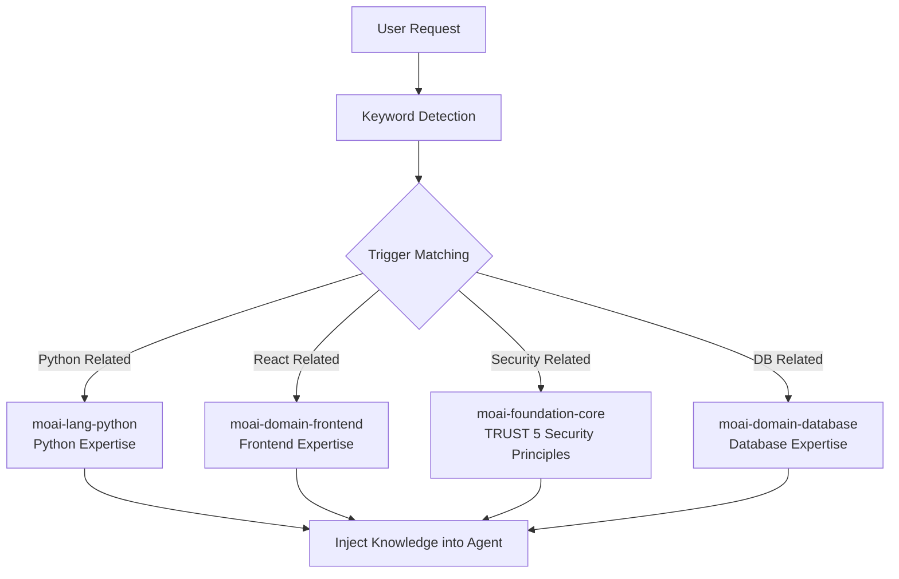
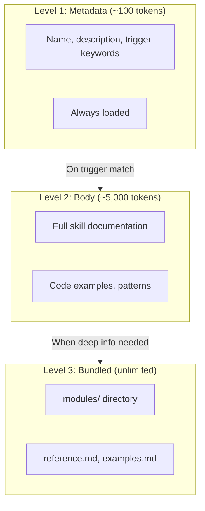
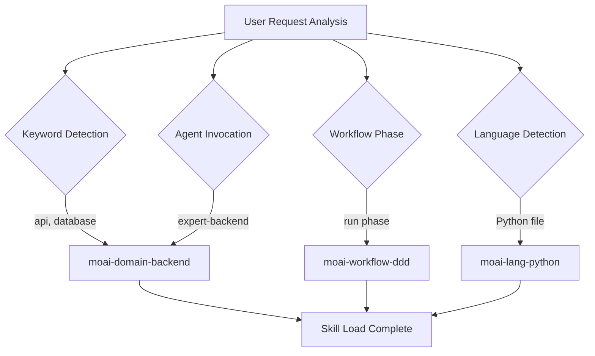
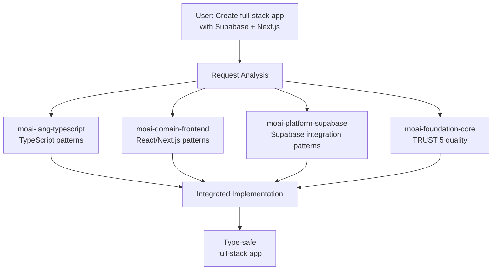

import { Callout } from "nextra/components";

# Skill Guide

Detailed guide to MoAI-ADK's skill system.

<Callout type="tip">

**What is a Skill?**

Remember the helicopter scene from the 1999 movie **The Matrix**? Neo asks Trinity
if she knows how to fly a helicopter, and she calls headquarters to tell them the
helicopter model and asks them to send the operating manual.

<p align="center">
  <iframe
    width="720"
    height="360"
    src="https://www.youtube.com/embed/9Luu4itC-Zs"
    title="The Matrix Helicopter Scene"
    frameBorder="0"
    allow="accelerometer; autoplay; clipboard-write; encrypted-media; gyroscope; picture-in-picture"
    allowFullScreen
  ></iframe>
</p>

**Claude Code's skills** **(are that **operating manual**. They load only the
necessary knowledge at the moment it's needed, allowing the AI to immediately act
like an expert.

</Callout>

## What is a Skill?

A skill is a **knowledge module** that provides Claude Code with specialized
knowledge in a specific domain.

To use a school analogy: Claude Code is the student and skills are textbooks.
Just as you open a math textbook for math class and a science textbook for
science class, Claude Code loads the Python skill when writing Python code and
the Frontend skill when creating React UIs.



**Without skills**: Claude Code responds with only general knowledge. **With
skills**: Applies MoAI-ADK's rules, patterns, and best practices to respond.

## Skill Categories

MoAI-ADK has a total of **52 skills** classified into 9 categories.

### Foundation (Core Philosophy) - 5 skills

| Skill Name                    | Description                                           |
| ----------------------------- | ----------------------------------------------------- |
| `moai-foundation-core`        | SPEC-First DDD, TRUST 5 framework, execution rules    |
| `moai-foundation-claude`      | Claude Code extension patterns (Skills, Agents, etc.) |
| `moai-foundation-philosopher` | Strategic thinking framework, decision analysis       |
| `moai-foundation-quality`     | Automatic code quality validation, TRUST 5 validation  |
| `moai-foundation-context`     | Token budget management, session state maintenance    |

### Workflow (Automation Workflows) - 11 skills

| Skill Name                | Description                                     |
| ------------------------- | ------------------------------------------------ |
| `moai-workflow-spec`      | SPEC document creation, EARS format, analysis   |
| `moai-workflow-project`   | Project initialization, docs creation, language |
| `moai-workflow-ddd`       | ANALYZE-PRESERVE-IMPROVE cycle                  |
| `moai-workflow-tdd`       | RED-GREEN-REFACTOR test-driven development      |
| `moai-workflow-testing`   | Test creation, debugging, code review           |
| `moai-workflow-worktree`  | Git worktree based parallel development         |
| `moai-workflow-thinking`  | Sequential Thinking, UltraThink mode            |
| `moai-workflow-loop`      | Ralph Engine autonomous loop, LSP integration   |
| `moai-workflow-jit-docs`  | Just-in-time document loading, smart search     |
| `moai-workflow-templates` | Code boilerplates, project templates            |
| `moai-docs-generation`     | Technical docs, API docs, user guides           |

### Domain (Domain Expertise) - 4 skills

| Skill Name            | Description                                             |
| --------------------- | ------------------------------------------------------- |
| `moai-domain-backend` | API design, microservices, database integration         |
| `moai-domain-frontend`| React 19, Next.js 16, Vue 3.5, component architecture   |
| `moai-domain-database`| PostgreSQL, MongoDB, Redis, advanced data patterns      |
| `moai-domain-uiux`     | Design systems, accessibility, theme integration        |

### Language (Programming Languages) - 16 skills

| Skill Name              | Target Language                           |
| ----------------------- | ----------------------------------------- |
| `moai-lang-python`      | Python 3.13+, FastAPI, Django             |
| `moai-lang-typescript`  | TypeScript 5.9+, React 19, Next.js 16     |
| `moai-lang-javascript`  | JavaScript ES2024+, Node.js 22, Bun, Deno |
| `moai-lang-go`          | Go 1.23+, Fiber, Gin, GORM (consolidated) |
| `moai-lang-rust`        | Rust 1.92+, Axum, Tokio (consolidated)    |
| `moai-lang-flutter`     | Flutter 3.24+, Dart 3.5+, Riverpod (consolidated) |
| `moai-lang-java`        | Java 21 LTS, Spring Boot 3.3              |
| `moai-lang-cpp`         | C++23/C++20, CMake, RAII                  |
| `moai-lang-ruby`        | Ruby 3.3+, Rails 7.2                      |
| `moai-lang-php`         | PHP 8.3+, Laravel 11, Symfony 7           |
| `moai-lang-kotlin`      | Kotlin 2.0+, Ktor, Compose Multiplatform  |
| `moai-lang-csharp`      | C# 12, .NET 8, ASP.NET Core               |
| `moai-lang-scala`       | Scala 3.4+, Akka, ZIO                     |
| `moai-lang-elixir`      | Elixir 1.17+, Phoenix 1.7, LiveView       |
| `moai-lang-swift`       | Swift 6+, SwiftUI, Combine                |
| `moai-lang-r`           | R 4.4+, tidyverse, ggplot2, Shiny         |

### Platform (Cloud/BaaS) - 4 skills

| Skill Name                     | Target Platform                                  |
| ----------------------------- | ------------------------------------------------ |
| `moai-platform-auth`          | Auth0, Clerk, Firebase-auth integrated auth      |
| `moai-platform-database-cloud`| Neon, Supabase, Firestore integrated database    |
| `moai-platform-deployment`    | Vercel, Railway, Convex integrated deployment    |
| `moai-platform-chrome-extension`| Chrome Extension Manifest V3 development      |

### Library (Special Libraries) - 4 skills

| Skill Name            | Description                            |
| --------------------- | -------------------------------------- |
| `moai-library-shadcn` | shadcn/ui component implementation      |
| `moai-library-mermaid`| Mermaid 11.12 diagram generation        |
| `moai-library-nextra` | Nextra documentation site framework     |
| `moai-formats-data`   | TOON encoding, JSON/YAML optimization   |

### Tool (Development Tools) - 2 skills

| Skill Name            | Description                                  |
| --------------------- | -------------------------------------------- |
| `moai-tool-ast-grep`  | AST-based structural code search, security   |
| `moai-tool-svg`       | SVG generation, optimization, icon system    |

### Framework (App Frameworks) - 1 skill

| Skill Name                 | Description                          |
| ------------------------- | ------------------------------------- |
| `moai-framework-electron` | Electron 33+ desktop app development |

### Design Tools - 1 skill

| Skill Name                 | Description                          |
| ------------------------- | ------------------------------------- |
| `moai-design-tools`       | Figma, Pencil integrated design tools |

## Progressive Disclosure System

MoAI-ADK's skills use a **3-level progressive disclosure** system. Loading all
skills at once would waste tokens, so only the necessary amount is loaded
incrementally.



### Role of Each Level

| Level  | Tokens | Load Timing | Content                                  |
| ------ | ------ | ----------- | ---------------------------------------- |
| Level 1 | ~100   | Always      | Skill name, description, trigger keywords |
| Level 2 | ~5,000 | On trigger  | Full documentation, code examples, patterns |
| Level 3 | Unlimited| On demand | modules/, reference.md, examples.md       |

### Token Savings

- **Old method**: Load all 52 skills = ~260,000 tokens (impossible)
- **Progressive disclosure**: Load only metadata = ~5,200 tokens (97% savings)
- **On-demand load**: Only 2-3 skills needed for task = ~15,000 additional tokens

## Skill Trigger Mechanism

Skills are automatically loaded via **4 trigger conditions**.



### Trigger Configuration Example

```yaml
# Define triggers in skill frontmatter
triggers:
  keywords: ["api", "database", "authentication"] # Keyword matching
  agents: ["manager-spec", "expert-backend"] # On agent invocation
  phases: ["plan", "run"] # Workflow phases
  languages: ["python", "typescript"] # Programming languages
```

**Trigger Priority:**

1. **Keywords**: Load immediately when keyword detected in user message
2. **Agents**: Auto-load when specific agent is invoked
3. **Phases**: Load according to Plan/Run/Sync phase
4. **Languages**: Load based on programming language of files being worked on

## Skill Usage

### Explicit Invocation

You can directly invoke skills in Claude Code conversations.

```bash
# Invoke skills in Claude Code
> Skill("moai-lang-python")
> Skill("moai-domain-backend")
> Skill("moai-library-mermaid")
```

### Auto Load

In most cases, skills are **automatically loaded** via the trigger mechanism.
Users don't need to invoke them directly; the conversation context is analyzed
to activate appropriate skills.

## Skill Directory Structure

Skill files are located in the `.claude/skills/` directory.

```
.claude/skills/
├── moai-foundation-core/       # Foundation category
│   ├── skill.md                # Main skill document (under 500 lines)
│   ├── modules/                # Deep documentation (unlimited)
│   │   ├── trust-5-framework.md
│   │   ├── spec-first-ddd.md
│   │   └── delegation-patterns.md
│   ├── examples.md             # Real-world examples
│   └── reference.md            # External reference links
│
├── moai-lang-python/           # Language category
│   ├── skill.md
│   └── modules/
│       ├── fastapi-patterns.md
│       └── testing-pytest.md
│
└── my-skills/                  # User custom skills (excluded from updates)
    └── my-custom-skill/
        └── skill.md
```

<Callout type="warning">
  **Warning**: Skills with `moai-*` prefix are overwritten on MoAI-ADK updates.
  Personal skills must be created in `.claude/skills/my-skills/` directory.
</Callout>

### Skill File Structure

Each skill's `skill.md` follows this structure.

```markdown
---
name: moai-lang-python
description: >
  Python 3.13+ development expert. FastAPI, Django, pytest patterns provided.
  Use for Python API, web app, data pipeline development.
version: 3.0.0
category: language
status: active
triggers:
  keywords: ["python", "fastapi", "django", "pytest"]
  languages: ["python"]
allowed-tools: ["Read", "Grep", "Glob", "Bash", "Context7 MCP"]
---

# Python Development Expert

## Quick Reference

(Quick reference - 30 seconds)

## Implementation Guide

(Implementation guide - 5 minutes)

## Advanced Patterns

(Advanced patterns - 10 minutes+)

## Works Well With

(Related skills/agents)
```

## Real-World Examples

### Auto Skill Load in Python Project

Scenario where user is working on a Python FastAPI project.

```bash
# 1. User requests API development
> Create a user authentication API with FastAPI

# 2. Keywords automatically detected by MoAI-ADK
# "FastAPI" → moai-lang-python trigger
# "authentication" → moai-domain-backend trigger
# "API" → moai-domain-backend trigger

# 3. Auto-loaded skills
# - moai-lang-python (Level 2): FastAPI patterns, pytest tests
# - moai-domain-backend (Level 2): API design patterns, auth strategy
# - moai-foundation-core (Level 1): TRUST 5 quality standards

# 4. Agent uses skill knowledge for implementation
# - Apply FastAPI router patterns
# - Apply JWT authentication best practices
# - Auto-generate pytest tests
# - Meet TRUST 5 quality standards
```

### Skill Collaboration

Process where multiple skills collaborate on a single task.



## Related Documentation

- [Agent Guide](/advanced/agent-guide) - Agent system that uses skills
- [Builder Agents Guide](/advanced/builder-agents) - Custom skill creation
- [CLAUDE.md Guide](/advanced/claude-md-guide) - Skill configuration and rules

<Callout type="tip">
  **Tip**: The key to using skills effectively is **using appropriate keywords**.
  Requesting "Create a REST API with Python" will automatically activate the
  `moai-lang-python` and `moai-domain-backend` skills to generate optimal code.
</Callout>