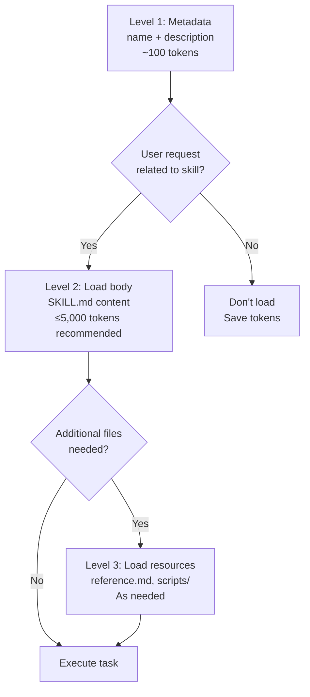
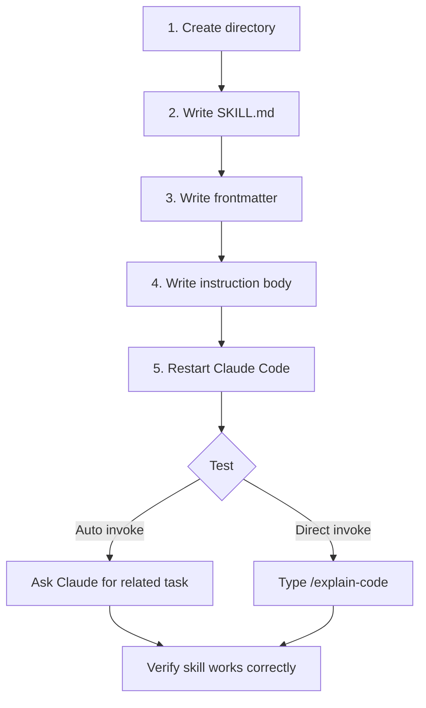
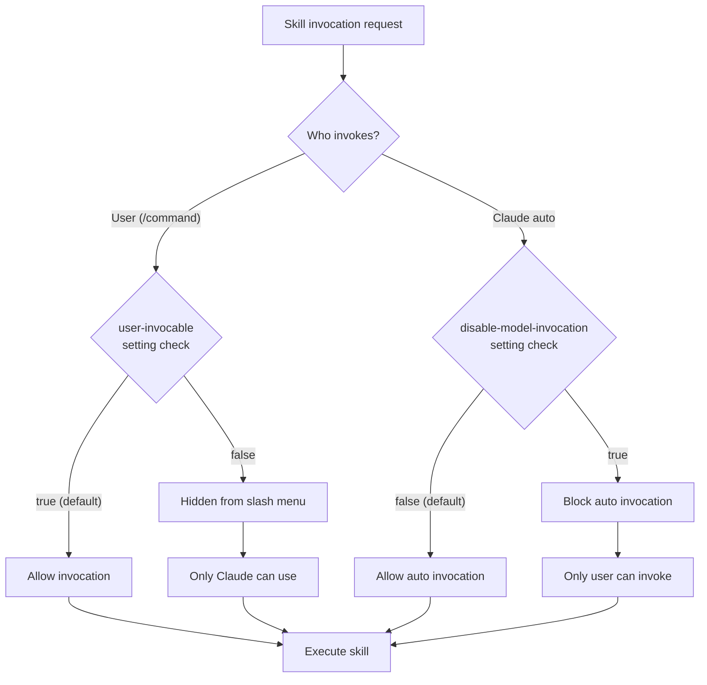

import { Callout } from 'nextra/components'

# Skills

Reusable instruction files that extend Claude Code's capabilities, written in SKILL.md for Claude to automatically utilize.

<Callout type="tip">
One-line summary: Skills are markdown files that Claude reads and follows. Creating SKILL.md in a directory adds a new feature to Claude's toolbox.
</Callout>

## What are Skills?

Skills are extensions that add new knowledge or workflows to Claude Code. Metaphorically, skills are like **manuals** handed to Claude. Just as you give a work manual to a new employee who follows it, Claude reads skill files and performs tasks according to those instructions.

Key features of skills:

- **Auto-discovery**: Claude compares user requests with skill descriptions to automatically select appropriate skills
- **Direct invocation**: Users can also invoke directly using slash commands in the form `/skillname`
- **Reusable**: Once written, can be used repeatedly across multiple sessions and projects
- **Markdown-based**: Written in markdown without requiring separate programming languages

### Agent Skills Open Standard

Skills follow the **Agent Skills** open standard developed by Anthropic. This standard works identically across various AI tools:

- Claude Code
- Cursor
- Gemini CLI
- VS Code (GitHub Copilot)
- GitHub

One skill file can be reused across multiple tools.

### Progressive Disclosure Architecture

Skills use a 3-level loading system to efficiently use the context window. Loading all skills at once would waste tokens, so they load incrementally as needed.



| Level | When loaded | Content | Token cost |
|-------|------------|---------|------------|
| **Level 1** | Always when Claude starts | name, description | ~100 tokens per skill |
| **Level 2** | When skill is selected | SKILL.md body | ≤5,000 tokens recommended |
| **Level 3** | When reference files needed | Additional files, scripts | Virtually unlimited |

## Create Your First Skill

Let's create a skill. Here's the process for creating a simple skill that explains code.



### Step 1: Create Directory

To add a skill to your project, create a directory under `.claude/skills/`:

```bash
mkdir -p .claude/skills/explain-code
```

To create a personal skill (usable across all projects):

```bash
mkdir -p ~/.claude/skills/explain-code
```

### Step 2: Write SKILL.md

Create a `SKILL.md` file. The file consists of YAML frontmatter and markdown body:

```markdown
---
name: explain-code
description: Explains code in simple Korean for junior developers. Use when the user asks to explain, describe, or break down code.
---

# Code Explanation Skill

## Instructions

1. Read the code file specified by the user
2. Summarize the overall purpose of the code in one sentence
3. Explain the role of each function and class
4. Describe the flow of main logic step by step
5. Additionally explain concepts that beginners might find difficult

## Output Format

- Explain in Korean
- Include English original text for technical terms
- Include code examples in explanations
```

### Step 3: Test

After restarting Claude Code, you can test in two ways:

- **Auto invocation**: Ask "Please explain the code in this file" and Claude will automatically select the skill
- **Direct invocation**: Type `/explain-code` to invoke explicitly

## Skill Directory Structure

Skills organize related files in one directory:

```
my-skill/
├── SKILL.md           # Main instruction file (required, under 500 lines)
├── template.md        # Template for Claude to use
├── examples/
│   └── sample.md      # Example outputs
└── scripts/
    └── validate.sh    # Script for Claude to execute
```

Role of each file:

- **SKILL.md** (required): Core instruction file. Consists of frontmatter and markdown body. Keep under 500 lines.
- **template.md**: Template referenced when Claude generates output. For example, for a PR review skill, put the review form template here.
- **examples/**: Provide examples of expected outputs to Claude. Specific examples improve Claude's output quality.
- **scripts/**: Scripts Claude can execute with bash. Used for validation, transformation, build, etc.

<Callout type="info">
When referencing other files in SKILL.md, keep references to one level deep only. If SKILL.md references advanced.md and advanced.md references details.md, Claude may read incompletely. It's safest for SKILL.md to directly reference all files.
</Callout>

## Skill Storage Locations

Skills can be stored in multiple locations, with higher priority taking precedence when names conflict:

| Priority | Location | Path | Scope |
|----------|----------|------|-------|
| 1 (highest) | **Enterprise** | Managed settings | All users in organization |
| 2 | **Personal** | `~/.claude/skills/<skillname>/SKILL.md` | User's all projects |
| 3 | **Project** | `.claude/skills/<skillname>/SKILL.md` | That project only |
| 4 | **Plugin** | `<plugin>/skills/<skillname>/SKILL.md` | Where plugin is active |

<Callout type="info">
When the same skill name exists in Enterprise and Personal, the Enterprise skill takes precedence. Plugin skills use `pluginname:skillname` namespace to avoid conflicts.
</Callout>

### Monorepo Auto-Discovery

In monorepo structures, Claude also auto-discovers skills in nested directories. For example, skills in `packages/api/.claude/skills/` are automatically recognized when working in that directory. Not all loaded at startup, but included when reading files in that sub-tree.

## Skill Types

Skill content is divided into two main types:

### Reference Content

Knowledge that Claude references throughout its work. Includes coding rules, API patterns, style guides, etc.

```yaml
---
name: api-style-guide
description: API design conventions and patterns for this project. Use when designing or reviewing API endpoints.
---
```

```markdown
# API Style Guide

## Endpoint naming conventions
- Use plural form for resource names: `/users`, `/orders`
- Nested resources: `/users/{id}/orders`
- Use HTTP methods instead of verbs

## Response format
- Success: `{ "data": ... }`
- Error: `{ "error": { "code": "...", "message": "..." } }`
```

### Task Content

Instructions for Claude to perform specific tasks step by step. Includes deployment, code review, code generation, etc. Task skills typically set `disable-model-invocation: true` to run only when explicitly invoked by users.

```yaml
---
name: deploy
description: Deploy the application to production. Runs build, test, and deployment steps.
disable-model-invocation: true
allowed-tools: Bash, Read, Grep
---
```

```markdown
# Deployment Skill

## Steps
1. Verify current branch is main
2. Run all tests: `npm test`
3. Production build: `npm run build`
4. Execute deployment: `npm run deploy`
5. Verify deployment and report results
```

**Which type to choose?**

- If information needs to be referenced repeatedly across multiple tasks: **Reference Content**
- If there's a procedure to execute at a specific point: **Task Content**
- Task content is usually invoked directly with `/skillname`

## Frontmatter Settings

You can finely control skill behavior in the YAML frontmatter of SKILL.md:

| Field | Required | Default | Description |
|-------|----------|---------|-------------|
| `name` | No | Directory name | Display name. Use lowercase and hyphens only. Max 64 characters |
| `description` | Recommended | - | Purpose and when to use the skill. Claude reads this and decides when to select the skill. Max 1024 characters |
| `argument-hint` | No | - | Autocomplete hint. Example: `[issue-number]` |
| `disable-model-invocation` | No | `false` | If `true`, Claude cannot auto-invoke. Only users can invoke |
| `user-invocable` | No | `true` | If `false`, hides from slash menu. Only Claude can invoke |
| `allowed-tools` | No | - | Restrict tools Claude can use. Example: `Read, Grep, Glob` |
| `model` | No | Current model | Specify model to use when executing skill |
| `context` | No | - | If set to `fork`, executes in subagent with isolation |
| `agent` | No | `general-purpose` | Agent type when `context: fork`. `Explore`, `Plan`, `general-purpose` |
| `hooks` | No | - | Hooks attached to skill lifecycle |

### String Substitution

You can use the following variables in frontmatter and body:

| Variable | Description | Example |
|----------|-------------|---------|
| `$ARGUMENTS` | All arguments passed | `$ARGUMENTS` is `staging` when `/deploy staging` |
| `$ARGUMENTS[0]` or `$0` | First argument | `$ARGUMENTS[0]` is `PR-123` when `/review PR-123` |
| `$ARGUMENTS[1]` or `$1` | Second argument | Access sequentially |
| `${CLAUDE_SESSION_ID}` | Current session ID | Unique session identifier |

## Invocation Control

Controlling who can invoke a skill is important. Based on frontmatter settings, the invoking subject changes:



| Frontmatter setting | User invocation | Claude auto invocation | Use case |
|---------------------|----------------|------------------------|----------|
| (default) | Possible | Possible | General skills |
| `disable-model-invocation: true` | Possible | Impossible | Deployment, dangerous tasks |
| `user-invocable: false` | Impossible | Possible | Internal helper skills |

### Recommended Settings by Use Case

- **General skills**: Use defaults. Claude automatically invokes at appropriate times.
- **Dangerous tasks like deployment, data deletion**: Set `disable-model-invocation: true`. Only runs when user explicitly types `/deploy`.
- **Helper skills for other skills**: Set `user-invocable: false`. Not shown in slash menu but Claude uses automatically when needed.

## Passing Arguments

You can pass arguments to skills to make them behave dynamically.

### Basic Usage

```markdown
---
name: review-pr
description: Review a pull request by number.
argument-hint: "[PR number]"
---

# PR Review

Review PR #$ARGUMENTS.
```

When user types `/review-pr 123`, `$ARGUMENTS` is replaced with `123`.

### Position-Based Arguments

When passing multiple arguments, use positional indexes:

```markdown
---
name: compare-branches
description: Compare two git branches.
argument-hint: "[base branch] [compare branch]"
---

# Branch Comparison

Base branch: $0
Compare branch: $1
```

Typing `/compare-branches main develop` replaces `$0` with `main` and `$1` with `develop`.

## Advanced Patterns

### Dynamic Context Injection

Backtick blocks starting with `!` execute as shell commands and their output is inserted into the skill body. This allows skills to include fresh runtime information.

```markdown
## Current branch info
!`git branch --show-current`

## Recent commits
!`git log --oneline -5`

## Open issues list
!`gh issue list --limit 5`
```

When Claude loads this skill, each command executes and actual git branch names, recent commit history, and GitHub issue lists are inserted. This allows skills to always reflect current project state.

### Execute in Subagent

Setting `context: fork` makes the skill execute in an isolated subagent. Subagents have their own context window, so they don't consume the main conversation's context.

```yaml
---
name: codebase-analysis
description: Analyze entire codebase structure and generate report.
context: fork
agent: Explore
allowed-tools: Read, Grep, Glob
---
```

You can specify subagent type with the `agent` field:

- **Explore**: Optimized for read-only exploration. Good for code analysis, understanding structure
- **Plan**: Optimized for planning. Good for architecture design, strategy formulation
- **general-purpose** (default): General agent. Both reading and writing possible

<Callout type="warning">
Skills executed in subagents are isolated from the main conversation. Subagents don't know the main conversation's previous content, and only return results in summary form. Also, subagents cannot create other subagents.
</Callout>

### Permission Restrictions

Use the `allowed-tools` field to restrict which tools a skill can use. This is important for security and safety.

```yaml
---
name: safe-reader
description: Read-only analysis of code files.
allowed-tools:
  - Read
  - Grep
  - Glob
---
```

This skill can only read and search files, not modify files or execute commands.

Recommended permission settings:

- **Read-only skills**: `Read, Grep, Glob` - Good for analysis, review tasks
- **File modification skills**: `Read, Write, Edit, Grep, Glob` - Good for refactoring, code generation
- **Build/deploy skills**: `Read, Grep, Glob, Bash` - Good for build, test, deploy

If `allowed-tools` is not specified, Claude follows standard permission model and asks for tool usage permission as needed.

## Skill Sharing

### Project Sharing

Commit the `.claude/skills/` directory to version control to share the same skills across the entire team:

```bash
git add .claude/skills/
git commit -m "Add team coding standards skill"
git push
```

### Share as Plugin

To distribute across multiple projects or share publicly, package as a plugin. Put skills in the plugin's `skills/` directory to access with `pluginname:skillname` namespace.

### Organization-Wide Deployment

Deploy skills to all users in an organization via Enterprise managed settings. This is useful for enforcing organization-level rules like security policies and coding standards.

## Tips for Writing Effective Skills

### Writing `description`

The `description` is the key criterion for Claude to select skills. Write well and Claude will use skills at the right times.

**Good examples:**

- "Extract text and tables from PDF files, fill forms, merge documents. Use when working with PDF files or when the user mentions PDFs, forms, or document extraction."
- "Generate descriptive commit messages by analyzing git diffs. Use when the user asks for help writing commit messages or reviewing staged changes."

**Bad examples:**

- "Helps with documents" - Too vague
- "Processes data" - Not specific
- "I can help you with files" - Don't use first person

Writing rules:

- **Write in third person**: "Processes Excel files and generates reports" (O) / "I can help you process" (X)
- **Include both purpose and triggers**: What it does + when to use it
- **Include specific keywords**: Add terms users are likely to mention

### SKILL.md Writing Principles

Claude is already very smart. Only add information to skills that Claude **doesn't know**:

- Check if you're repeating explanations Claude already knows
- Review whether each paragraph provides sufficient value for token cost
- Keep under 500 lines, separate detailed content into separate files

## Troubleshooting

| Problem | Cause | Solution |
|---------|-------|----------|
| Skill not auto-selected | Lack of trigger keywords in description | Add key terms users might mention to description. Verify behavior by invoking directly with `/skillname` |
| Skill selected too often | Description too general | Make description more specific or set `disable-model-invocation: true` |
| Claude doesn't recognize some skills | Character budget exceeded | Increase environment variable `SLASH_COMMAND_TOOL_CHAR_BUDGET` (default 15,000) |
| YAML parsing error | Frontmatter syntax error | Check `---` markers, use spaces instead of tabs, check indentation |
| File references don't work | Deep nested references | Have SKILL.md directly reference all files (one level only) |
| Skill conflicts | Similar descriptions | Use unique trigger keywords in each skill's description |

<Callout type="warning">
If total character count of skills exceeds the default budget of 15,000, some skills may not load. If using many skills, increase the `SLASH_COMMAND_TOOL_CHAR_BUDGET` environment variable.
</Callout>

### Security Notes

Since skills provide new capabilities to Claude, only use skills from trusted sources:

- Skills you wrote yourself
- Official skills provided by Anthropic
- Skills shared by verified teammates

Review all files in SKILL.md and scripts/ directories before using externally sourced skills.

## Related Documents

- [Extensions](/claude-code/extensions) - Complete overview of skills, subagents, hooks, MCP, plugins
- [Memory management](/claude-code/memory) - Difference between CLAUDE.md and skills, memory hierarchy
- [Interactive mode](/claude-code/interactive-mode) - Interactive workflows with slash commands
- [Settings](/claude-code/settings) - Skill-related settings and environment variables
- [Troubleshooting](/claude-code/troubleshooting) - Additional solutions for skill-related issues

<Callout type="tip">
If you're new to writing skills, start with a simple reference skill. Creating a skill for your project's coding rules or frequently used commands is a good starting point.
</Callout>