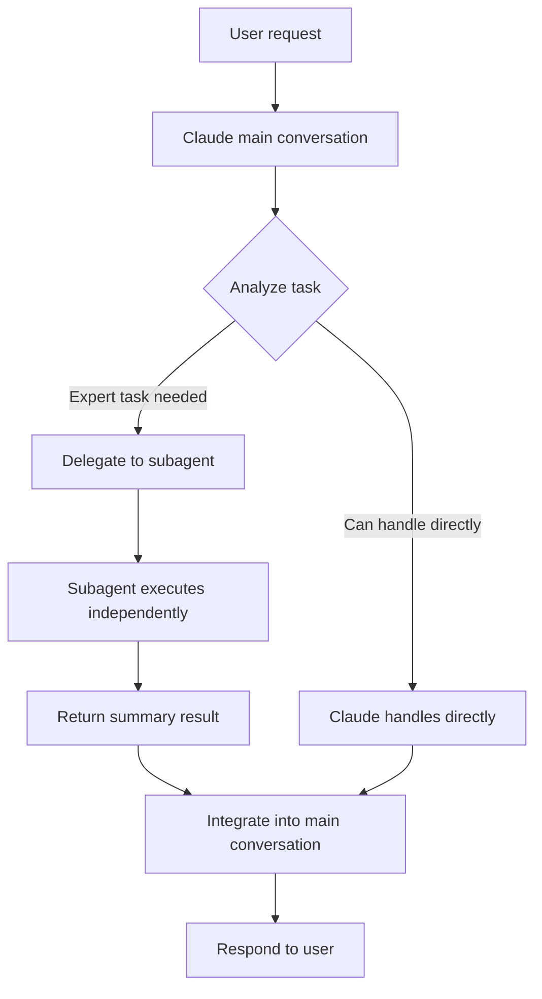
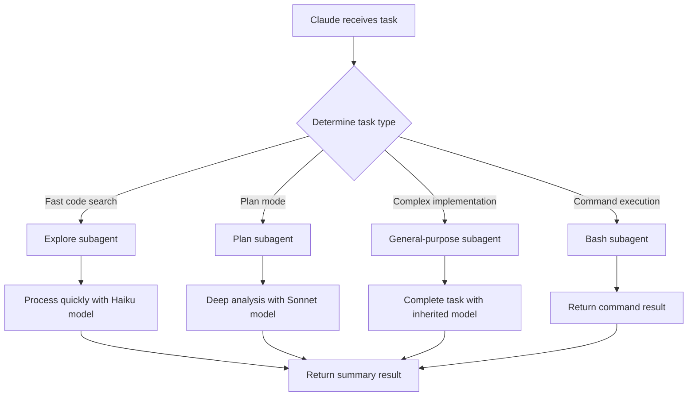
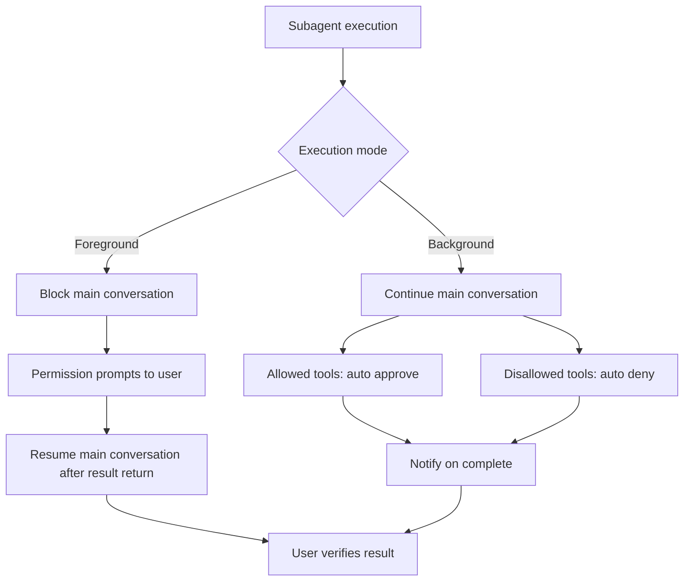

import { Callout } from 'nextra/components'

# Subagents

Learn how to create and utilize specialized AI workers in Claude Code to efficiently handle complex tasks.

<Callout type="tip">
One-line summary: Subagents are specialized AI workers for specific tasks that handle delegated work independently without polluting the main conversation's context.
</Callout>

## What are Subagents?

Subagents are similar to delegating tasks to experts within a team. For example, just as a project manager doesn't write all code directly but delegates API work to backend developers and UI work to frontend developers, Claude can also delegate specific tasks to specialized subagents.

Each subagent has these elements:

- **Independent context window**: Separate workspace from main conversation (up to 200K tokens)
- **Custom system prompt**: Instructions defining the subagent's role and behavior
- **Tool access control**: Selectively allowing only necessary tools for enhanced security
- **Independent permission settings**: Individual control over file editing, command execution, etc.

### Benefits of Using Subagents

- **Context preservation**: Even if a subagent reads dozens of files, only key findings are delivered to the main conversation, keeping context clean
- **Enhanced specialization**: Higher success rates for specific tasks with detailed domain instructions
- **Reusability**: Once created, can be used repeatedly across the entire project
- **Cost reduction**: Can route to lightweight models like Haiku for cost savings
- **Parallel processing**: Multiple subagents can run simultaneously to increase task speed



<Callout type="info">
Key to context preservation: Even if a subagent analyzes 50 files, only key findings are summarized and delivered to the main conversation. The main conversation's context window isn't wasted, allowing longer tasks to continue.
</Callout>

## Built-in Subagents

Claude Code includes built-in subagents for frequently used tasks.

| Subagent | Model | Tools | Purpose |
|---|---|---|---|
| **Explore** | Haiku | Read, Grep, Glob, Bash | Codebase exploration and analysis (read-only) |
| **Plan** | Sonnet (inherit) | Read, Grep, Glob, Bash | Plan mode codebase investigation (read-only) |
| **General-purpose** | inherit | All tools | Complex multi-step tasks |
| **Bash** | inherit | Bash | Command execution only |
| **statusline-setup** | Sonnet | Limited | Status line setup |
| **Claude Code Guide** | Haiku | Limited | Claude Code usage guide |



**Explore** subagent uses Haiku model for fast, inexpensive codebase exploration. Thoroughness can be adjusted to quick, medium, or very thorough. Read-only, so it doesn't modify code.

**Plan** subagent is automatically invoked in plan mode, used to investigate codebases and create implementation plans. Inherits the main model for powerful analysis capabilities.

**General-purpose** subagent has access to all tools to independently perform complex multi-step tasks.

## Creating Subagents

### Using `/agents` Command

The easiest way to create a subagent is with the `/agents` command.

1. Type `/agents` in Claude Code conversation
2. Select **Create New Agent**
3. Choose project level (current project only) or user level (all your projects)
4. Describe the subagent's purpose and when to use it
5. Select necessary tools (leave blank for all tools)
6. Press `e` to edit system prompt in editor

<Callout type="tip">
For first-time creators, it's recommended to ask Claude to generate the system prompt, then customize it based on your needs.
</Callout>

### Create Directly as File

You can define a subagent directly by including YAML frontmatter in a markdown file.

**File locations:**
- Project subagent: `.claude/agents/agentname.md`
- Personal subagent: `~/.claude/agents/agentname.md`

**File format example:**

```markdown
---
name: code-reviewer
description: "Expert reviewing quality and security after code changes. Automatically use after code modifications."
tools: Read, Grep, Glob, Bash
model: inherit
---

You are a senior code reviewer. Focus on code quality, security, and maintainability.

When called:
1. Check recent changes with git diff
2. Focus analysis on changed files
3. Start review immediately

Review checklist:
- Code is concise and readable
- Function and variable names are appropriate
- No duplicate code
- Error handling is appropriate
- Security vulnerabilities
- Test coverage is sufficient
```

**Each field description:**

- `name`: Unique identifier for the subagent. Use only lowercase and hyphens
- `description`: Describes when Claude should use this subagent. Including expressions like "use PROACTIVELY" or "MUST BE USED" promotes automatic delegation
- `tools`: List of allowed tools, comma-separated. Omit to inherit all tools
- `model`: Specify model to use. Omit to use default (usually sonnet)

### Create with CLI Flag

Use the `--agents` flag to define temporary subagents valid only for that session.

```bash
claude --agents '{
  "quick-reviewer": {
    "description": "Quick code review expert. Auto use after code changes.",
    "prompt": "You are a code review expert. Focus on quality and security.",
    "tools": ["Read", "Grep", "Glob", "Bash"],
    "model": "sonnet"
  }
}'
```

This is useful for CI/CD pipelines or one-off tasks. Subagent definition disappears when session ends.

## Storage Locations and Priority

Subagents can be defined in multiple locations, with only one applying when the same name exists in multiple places based on priority.

| Location | Scope | Priority |
|---|---|---|
| `--agents` CLI flag | Current session only | 1 (highest) |
| `.claude/agents/` | Current project | 2 |
| `~/.claude/agents/` | All projects | 3 |
| Plugin's `agents/` | Where plugin is active | 4 (lowest) |

<Callout type="info">
Store project-specific subagents in `.claude/agents/` and subagents shared across all projects in `~/.claude/agents/`. Project subagents can be committed to Git and shared with teammates.
</Callout>

## Frontmatter Settings

All fields available in the YAML frontmatter of subagent files:

| Field | Required | Description | Default |
|---|---|---|---|
| `name` | Required | Unique identifier (lowercase, hyphens) | - |
| `description` | Required | Describe when Claude should delegate | - |
| `tools` | Optional | Allowed tools list (comma-separated) | Inherit all tools |
| `disallowedTools` | Optional | Disallowed tools list | - |
| `model` | Optional | Model to use: sonnet, opus, haiku, inherit | inherit |
| `permissionMode` | Optional | Permission handling mode | default |
| `skills` | Optional | List of skills to preload at startup | - |
| `hooks` | Optional | Lifecycle Hook definitions | - |

## Tool Control

### Tool Allow and Deny

Use the `tools` field to explicitly specify which tools a subagent can use, or the `disallowedTools` field to block specific tools.

**Read-only agent example:**

```yaml
---
name: analyzer
description: "Code analysis expert. Read-only."
tools: Read, Grep, Glob
---
```

**Can edit files but cannot execute commands example:**

```yaml
---
name: editor
description: "Code editing expert. Does not execute commands."
tools: Read, Write, Edit, Grep, Glob
disallowedTools: Bash
---
```

### Permission Mode

Control how the subagent handles permissions with the `permissionMode` field.

| Mode | Behavior | When to use |
|---|---|---|
| `default` | Show standard permission prompts | General subagents |
| `acceptEdits` | Auto-approve file edits | Trusted editing tasks |
| `dontAsk` | Auto-deny permission prompts (allowed tools work) | Read-only analysis |
| `bypassPermissions` | Skip all permission checks | Fully trusted environment |
| `plan` | Read-only exploration mode | Codebase investigation |

<Callout type="warning">
`bypassPermissions` mode skips all permission checks and poses security risks. Use only in fully trusted environments. In most cases, `acceptEdits` or `default` modes are sufficient.
</Callout>

### Skill Preload

Use the `skills` field to automatically load specific skills when the subagent starts.

```yaml
---
name: api-builder
description: "API construction expert."
tools: Read, Write, Edit, Bash, Grep, Glob
skills: moai-lang-typescript, moai-domain-backend
---
```

Skills are not inherited from the parent conversation. Skills needed in the subagent must be explicitly specified in the `skills` field. This is different from the skill's `context: fork` setting; the `skills` field means skill loading at the subagent level.

## Execution Modes

### Foreground vs Background

Subagents run in two ways.



**Foreground execution** (default):
- Main conversation waits for subagent completion
- Permission prompts go directly to user
- Results immediately integrated into main conversation

**Background execution**:
- Main conversation continues
- Allowed tool permissions are auto-approved
- Disallowed tool permissions are auto-denied
- Notification on completion
- Convert foreground subagent to background with `Ctrl+B`

<Callout type="info">
Background subagents may have limitations using MCP tools. Subagents requiring MCP tools should run in foreground for safety.
</Callout>

### Automatic Delegation

Claude decides whether to automatically delegate to subagents based on:

- Whether user request matches the subagent's `description`
- Whether `description` includes expressions like "use PROACTIVELY" or "MUST BE USED"
- Current context and available tools

You can also explicitly request a specific subagent:

- "Review recent changes with the code-reviewer subagent"
- "Investigate this error with the debugger subagent"

**Important limitation: Subagents cannot create other subagents.** This is a fundamental design principle to prevent infinite recursion. All delegation happens only from the main conversation.

## Common Patterns

### Large Task Isolation

Isolate tasks that analyze dozens of files or process large logs to subagents to protect the main conversation's context.

"Analyze test run results and identify causes of failed tests"

In this case, the subagent reads and analyzes all test logs, but only key findings are delivered to the main conversation.

### Parallel Research

Run multiple subagents simultaneously to perform independent investigations in parallel.

"While analyzing backend API structure, also investigate frontend component dependencies"

Two subagents analyze their respective areas simultaneously, then results are integrated into the main conversation.

### Subagent Chaining

Chain subagents sequentially to create complex workflows.

"First use the code-analyzer subagent to find performance issues, then use the optimizer subagent to resolve them"

The first subagent's results are passed as input to the second subagent.

## Subagent vs Main Conversation

| Criterion | Main conversation | Subagent |
|---|---|---|
| **Context** | Share entire conversation | Independent context |
| **User interaction** | Free conversation possible | Cannot communicate directly with user |
| **Suitable tasks** | Frequent feedback, quick fixes | Large analysis, parallel processing |
| **Cost** | Use main model | Can choose lightweight model |
| **Tool access** | All tools | Can be restricted |
| **Result** | Directly integrated into conversation | Return only summary |

<Callout type="tip">
Decision criterion: "Does this task read many files or generate long output?" If yes, subagent is suitable. "Is frequent user communication needed?" If yes, main conversation is suitable.
</Callout>

## Context Management

### Resuming

Each subagent execution is assigned a unique `agentId`. Use this ID to continue working with the subagent's context intact.

```bash
"Resume agent abc123 and now analyze the authorization logic"
```

This is useful for long-running investigation tasks, iterative improvement work, or multi-step workflows spanning multiple sessions.

### Auto Compaction

When a subagent's context reaches approximately 95% capacity, auto-compaction is performed. Compaction summarizes previous conversation content to make room for new context.

### Transcript Storage

Subagent execution history is automatically saved at:

```
~/.claude/projects/{projectpath}/{sessionID}/subagents/
```

This allows you to later verify what work a subagent performed.

## Hooks Configuration

### Frontmatter Hooks

Define hooks that apply only to that agent in the subagent file's frontmatter. Supported events are `PreToolUse`, `PostToolUse`, `Stop`.

```yaml
---
name: safe-editor
description: "Safe code editing expert."
tools: Read, Edit, Bash, Grep, Glob
hooks:
  PreToolUse:
    - matcher: "Edit"
      hooks:
        - type: command
          command: "./scripts/pre-edit-check.sh"
  PostToolUse:
    - matcher: "Edit|Write"
      hooks:
        - type: command
          command: "./scripts/run-linter.sh"
          timeout: 45
---
```

- `matcher`: Regex pattern for tool names (e.g., `"Edit"`, `"Write|Edit"`, `"Bash"`)
- `type`: Specify `"command"` (shell command) or `"prompt"` (LLM prompt)
- `command`: Shell command to execute
- `timeout`: Timeout in seconds (default 60)

<Callout type="warning">
The `once` field is not supported in agent frontmatter hooks. For one-time execution, use skill hooks.
</Callout>

### settings.json Hooks

Define hooks in `settings.json` that run at subagent start and end times.

- **SubagentStart**: Runs when subagent starts
- **SubagentStop**: Runs when subagent ends

Set `matcher` on these hooks to apply only to specific named subagents.

## Example Subagents

### Code Reviewer

Read-only subagent that reviews quality and security after code changes.

```markdown
---
name: code-reviewer
description: "Expert reviewing quality, security, and maintainability after code changes. PROACTIVELY use after code modifications."
tools: Read, Grep, Glob, Bash
model: inherit
---

You are a senior code reviewer.

When called:
1. Check recent changes with git diff
2. Focus analysis on changed files
3. Start review immediately

Review checklist:
- Code is concise and readable
- Function and variable names are appropriate
- No duplicate code
- Error handling is appropriate
- No exposed API keys or secrets
- Input validation implemented
- Test coverage is sufficient
- No performance issues
```

### Debugger

Subagent specialized in error analysis and problem resolution. Includes file editing permissions.

```markdown
---
name: debugger
description: "Debugging expert investigating errors, test failures, and unexpected behavior. PROACTIVELY use when problems occur."
tools: Read, Edit, Bash, Grep, Glob
---

You are a debugger expert in root cause analysis.

Debugging process:
- Analyze error messages and logs
- Check recent code changes
- Formulate and verify hypotheses
- Add strategic debug logging
- Inspect variable state

Provide for each issue:
- Root cause explanation
- Evidence supporting diagnosis
- Specific code fix
- Testing method
- Prevention recommendations
```

### Data Scientist

Subagent specialized in SQL queries and data analysis. Explicitly specifies Sonnet model.

```markdown
---
name: data-scientist
description: "SQL query and data analysis expert. PROACTIVELY use for data analysis tasks."
tools: Bash, Read, Write
model: sonnet
---

You are a data scientist expert in SQL and BigQuery analysis.

Key principles:
- Write optimized SQL queries with appropriate filters
- Use appropriate aggregate functions and joins
- Include comments for complex logic
- Format results for readability
- Provide data-driven recommendations
```

### DB Query Validator

Subagent that combines Bash tool with PreToolUse Hook to validate SQL queries before execution.

```markdown
---
name: db-query-validator
description: "Expert that validates and safely executes database queries."
tools: Bash, Read
hooks:
  PreToolUse:
    - matcher: "Bash"
      hooks:
        - type: command
          command: "./scripts/validate-sql.sh"
          timeout: 10
---

You are a database query validation expert.

Before all SQL query executions:
- Allow only SELECT statements (block INSERT, UPDATE, DELETE)
- Require LIMIT clause
- Validate table names
- Check query execution plan
```

## Disabling Subagents

To disable a specific subagent, add it to the `deny` list in `settings.json`.

```json
{
  "permissions": {
    "deny": ["Task(Explore)", "Task(my-agent)"]
  }
}
```

Or disable via CLI:

```bash
claude --disallowedTools "Task(Explore)"
```

## Troubleshooting

**Cannot find subagent:**
- Verify file is in correct location (`.claude/agents/` or `~/.claude/agents/`)
- Verify `name` field consists only of lowercase letters and hyphens
- Verify YAML frontmatter syntax is correct

**Subagent not automatically invoked:**
- Add "PROACTIVELY" or "MUST BE USED" expressions to `description`
- Check that user request keywords match description keywords

**Permission errors occur:**
- Verify `tools` field includes all necessary tools
- Verify `permissionMode` is appropriate for the task
- Verify necessary tools aren't in `disallowedTools`

**Context overflow occurs:**
- Reduce amount of data passed (recommend: 20K-50K tokens)
- Replace large datasets with file references
- Auto-compaction works, but passing appropriate context from the start is better

**Subagent tries to call another subagent:**
- This is impossible by design. Subagents cannot create other subagents
- For complex workflows, use chaining patterns in the main conversation

## Related Documents

- [Extensions](/claude-code/extensions) - Complete extensions overview including skills, MCP, hooks
- [Settings](/claude-code/settings) - settings.json configuration and permission management
- [Memory management](/claude-code/memory) - CLAUDE.md and context management
- [Best practices](/claude-code/best-practices) - Tips for effective Claude Code usage
- [Troubleshooting](/claude-code/troubleshooting) - Common problems and solutions

<Callout type="tip">
When creating subagents for the first time, start with a simple read-only agent. After understanding how it works, gradually add tools and permissions for safe subagent utilization.
</Callout>