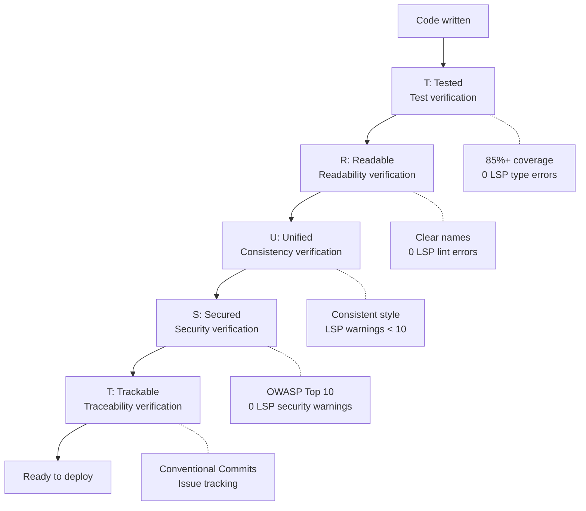
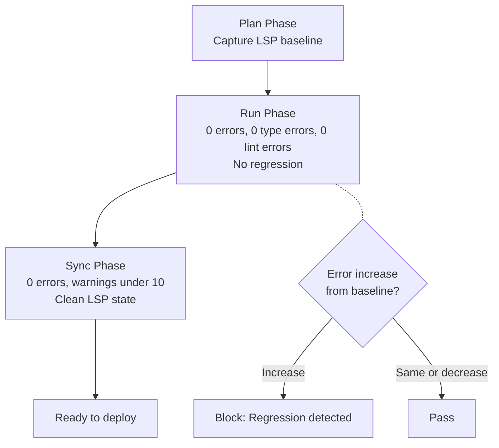
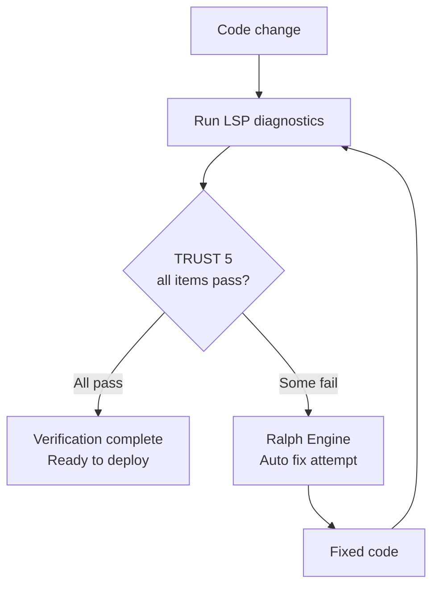

import { Callout } from "nextra/components";

# TRUST 5 Quality Framework

Detailed guide to 5 quality principles that all MoAI-ADK code must pass.

<Callout type="tip">
  **One-line summary:** TRUST 5 is an automated quality gate that verifies "is code tested, readable, consistent, secure, and trackable?"
</Callout>

## What is TRUST 5?

TRUST 5 is **5 quality principles** that MoAI-ADK applies to all code. Both AI-generated and human-written code must pass these standards.

Using a daily life analogy, it's like building inspection for buildings. You must check structural safety, electrical wiring, plumbing, fire safety, and building permit documents before you can move in. Code is the same.

| Building Inspection | TRUST 5 | What's Checked |
|---------------------|---------|----------------|
| Structural safety | **T** (Tested) | Verify code works correctly with tests |
| Electrical/plumbing blueprints | **R** (Readable) | Can other developers understand the code |
| Building code compliance | **U** (Unified) | Matches project coding standards |
| Fire/security systems | **S** (Secured) | No security vulnerabilities |
| Permit documents | **T** (Trackable) | Change history clearly recorded |



## T - Tested (Tested)

**Core:** All code must be verified with tests.

### What's Checked

| Check Item | Criteria | Description |
|------------|----------|-------------|
| Test Coverage | 85% or more | 85%+ of all code must be verified by tests |
| Characterization Tests | Protect existing code | Tests to preserve existing behavior during refactoring |
| LSP Type Errors | 0 | No type checking errors |
| LSP Diagnostic Errors | 0 | No language server diagnostic errors |

### Why 85%?

There's a reason we don't require 100%.

| Coverage | Realistic Meaning |
|----------|-------------------|
| Under 60% | Major features may not be tested |
| 60-84% | Basic features tested but edge cases may be missing |
| **85-95%** | **Core logic and most edge cases verified (recommended)** |
| 95-100% | Test maintenance cost starts to exceed benefits |

### Best Practices

```python
def calculate_discount(price: float, discount_rate: float) -> float:
    """Calculate discounted price.

    Args:
        price: Original price (0 or more)
        discount_rate: Discount rate (0.0 ~ 1.0)

    Returns:
        Discounted price

    Raises:
        ValueError: For invalid input values
    """
    if price < 0:
        raise ValueError("Price cannot be less than 0")
    if not 0 <= discount_rate <= 1:
        raise ValueError("Discount rate must be between 0.0 and 1.0")
    return price * (1 - discount_rate)


# Tests verify both normal and exception cases
def test_calculate_discount_normal():
    assert calculate_discount(10000, 0.1) == 9000
    assert calculate_discount(5000, 0.5) == 2500
    assert calculate_discount(0, 0.5) == 0

def test_calculate_discount_invalid_price():
    with pytest.raises(ValueError, match="Price cannot"):
        calculate_discount(-1000, 0.1)

def test_calculate_discount_invalid_rate():
    with pytest.raises(ValueError, match="Discount rate"):
        calculate_discount(10000, 1.5)
```

---

## R - Readable (Readable)

**Core:** Code must be clear and easy to understand.

### What's Checked

| Check Item | Criteria | Description |
|------------|----------|-------------|
| Naming Rules | Reveals intent | Variable, function, class names must be clear |
| Code Comments | Explain complex logic | Comments explaining "why" (not "what") |
| LSP Lint Errors | 0 | Pass all linter rules |
| Function Length | Appropriate size | Functions shouldn't be too long |

### Best Practices

```python
# Bad: Can't tell what it does from the name
def calc(d, r):
    return d * (1 - r)

# Good: Can understand the role just by reading the name
def calculate_discounted_price(original_price: float, discount_rate: float) -> float:
    """Calculate price discounted by discount_rate from original_price."""
    return original_price * (1 - discount_rate)
```

<Callout type="info">
  **Readability Tip:** Ask yourself "can I understand this 6 months from now?" If not, rename or add comments.
</Callout>

---

## U - Unified (Unified)

**Core:** Maintain consistent code style across the entire project.

### What's Checked

| Check Item | Criteria | Description |
|------------|----------|-------------|
| Code Format | Auto-formatter applied | Python: ruff/black, JS: prettier |
| Naming Rules | Follow project standards | No mixing snake_case, camelCase etc. |
| Error Handling | Consistent pattern | Use same error handling approach everywhere |
| LSP Warnings | Under 10 | Language server warnings under threshold |

### Best Practices

```python
# Unified error handling pattern
class AppError(Exception):
    """Application base error"""
    def __init__(self, message: str, code: int = 500):
        self.message = message
        self.code = code

class NotFoundError(AppError):
    """Resource not found"""
    def __init__(self, resource: str, id: str):
        super().__init__(f"{resource} '{id}' not found", code=404)

class ValidationError(AppError):
    """Input validation failed"""
    def __init__(self, field: str, reason: str):
        super().__init__(f"'{field}' validation failed: {reason}", code=400)

# Use same pattern in all services
def get_user(user_id: str) -> User:
    user = user_repository.find_by_id(user_id)
    if not user:
        raise NotFoundError("User", user_id)
    return user
```

---

## S - Secured (Secured)

**Core:** All code must pass security verification.

### What's Checked

| Check Item | Criteria | Description |
|------------|----------|-------------|
| OWASP Top 10 | Full compliance | Prevent most common web security vulnerabilities |
| Dependency Scan | No vulnerable packages | Don't use libraries with known vulnerabilities |
| Encryption Policy | Protect sensitive data | Passwords, tokens must be encrypted |
| LSP Security Warnings | 0 | No security-related warnings |

### Major Security Checks

| Vulnerability | Prevention Method | Example |
|---------------|-------------------|---------|
| **SQL Injection** | Parameterized queries | `db.execute("SELECT * FROM users WHERE id = %s", (id,))` |
| **XSS** | Output escaping | Auto-escape HTML output |
| **Password Exposure** | bcrypt hashing | `bcrypt.hashpw(password, salt)` |
| **Hardcoded Secret Keys** | Environment variables | `os.environ["SECRET_KEY"]` |
| **CSRF** | Token verification | Include CSRF token in all state-changing requests |

### Best Practices

```python
# Bad: SQL Injection vulnerability
def get_user(username: str) -> dict:
    query = f"SELECT * FROM users WHERE username = '{username}'"
    return db.execute(query)

# Good: Safe with parameterized queries
def get_user(username: str) -> dict:
    query = "SELECT * FROM users WHERE username = %s"
    return db.execute(query, (username,))
```

---

## T - Trackable (Trackable)

**Core:** All changes must be clearly traceable.

### What's Checked

| Check Item | Criteria | Description |
|------------|----------|-------------|
| Commit Messages | Conventional Commits | `feat:`, `fix:`, `refactor:` etc. standard format |
| Issue Links | GitHub Issues reference | Include related issue numbers in commits |
| CHANGELOG | Maintain change log | Record changes shown to users |
| LSP State Tracking | Record diagnostic history | Track LSP state changes to detect regression |

### Conventional Commits Format

```bash
# Structure: <type>(<scope>): <description>
# Examples:

# Add new feature
$ git commit -m "feat(auth): Add JWT login API"

# Fix bug
$ git commit -m "fix(auth): Fix token expiration time calculation error"

# Refactor
$ git commit -m "refactor(auth): Separate auth logic into AuthService"

# Security improvement
$ git commit -m "security(db): Prevent SQL Injection with parameterized queries"
```

**Commit Types:**

| Type | Description | Example |
|------|-------------|---------|
| `feat` | New feature | `feat(api): Add user list API` |
| `fix` | Bug fix | `fix(auth): Fix login error message` |
| `refactor` | Code improvement (no behavior change) | `refactor(db): Optimize queries` |
| `security` | Security improvement | `security(auth): Environment variable for secret key` |
| `docs` | Documentation change | `docs(readme): Update installation guide` |
| `test` | Test add/modify | `test(auth): Add login test cases` |

---

## LSP Quality Gates

MoAI-ADK uses **LSP** (Language Server Protocol) to verify code quality in real-time. LSP is the system that shows errors with red underlines in your IDE.

### Phase-by-Phase LSP Thresholds

Different LSP standards apply to Plan, Run, and Sync phases.

| Phase | Error Allowance | Type Error Allowance | Lint Error Allowance | Warning Allowance | Regression Allowance |
|-------|-----------------|---------------------|---------------------|------------------|---------------------|
| **Plan** | Capture baseline | Capture baseline | Capture baseline | - | - |
| **Run** | 0 | 0 | 0 | - | Not allowed |
| **Sync** | 0 | - | - | Max 10 | Not allowed |

**Meaning of Each Phase:**

- **Plan Phase**: Capture current code's LSP state as "baseline." This becomes the reference.
- **Run Phase**: LSP errors must be 0 at implementation completion. Errors shouldn't increase from baseline (no regression).
- **Sync Phase**: LSP must be clean before documentation and PR creation. Warnings allowed up to 10.



## Ralph Engine Integration

**Ralph Engine** is MoAI-ADK's autonomous quality verification loop. Automatically detects and fixes code issues based on LSP diagnostic results.



**How It Works:**

1. When code changes, LSP runs diagnostics
2. If items don't meet TRUST 5 standards, Ralph Engine attempts auto-fix
3. Run LSP diagnostics again after fix to verify pass
4. Repeat until pass (max 3 retries)

**Related Commands:**

```bash
# Run auto fix
> /moai fix

# Repeat auto fix until complete
> /moai loop
```

## quality.yaml Configuration

Manage TRUST 5 related settings in `.moai/config/sections/quality.yaml` file.

### Key Settings

```yaml
constitution:
  # Enable TRUST 5 quality verification
  enforce_quality: true

  # Target test coverage
  test_coverage_target: 85

  # LSP quality gate settings
  lsp_quality_gates:
    enabled: true

    plan:
      require_baseline: true # Capture baseline at Plan start

    run:
      max_errors: 0 # Error allowance in Run phase: 0
      max_type_errors: 0 # Type error allowance: 0
      max_lint_errors: 0 # Lint error allowance: 0
      allow_regression: false # No regression from baseline

    sync:
      max_errors: 0 # Error allowance in Sync phase: 0
      max_warnings: 10 # Warning allowance: max 10
      require_clean_lsp: true # Require clean LSP state

    cache_ttl_seconds: 5 # LSP diagnostic cache time
    timeout_seconds: 3 # LSP diagnostic timeout
```

## Related Documents

- [What is MoAI-ADK?](/core-concepts/what-is-moai-adk) -- Understand the overall structure of MoAI-ADK
- [SPEC-Based Development](/core-concepts/spec-based-dev) -- Learn Plan phase where TRUST 5 is applied
- [Domain-Driven Development](/core-concepts/ddd) -- Learn Run phase where TRUST 5 is applied