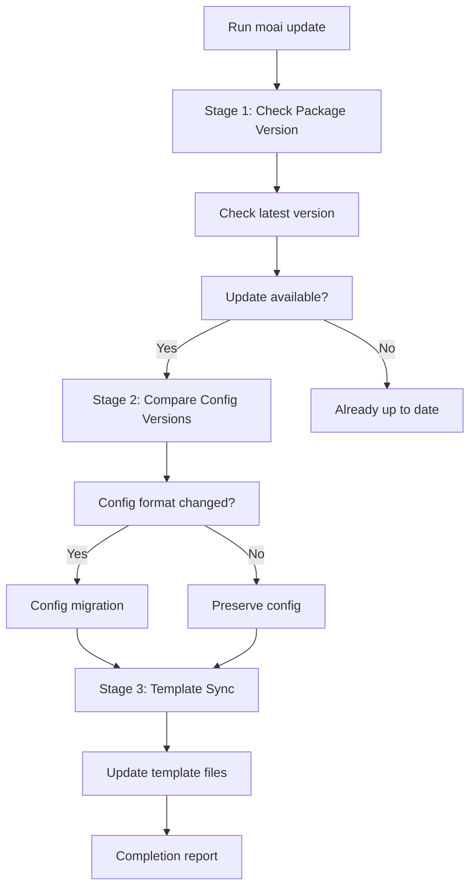
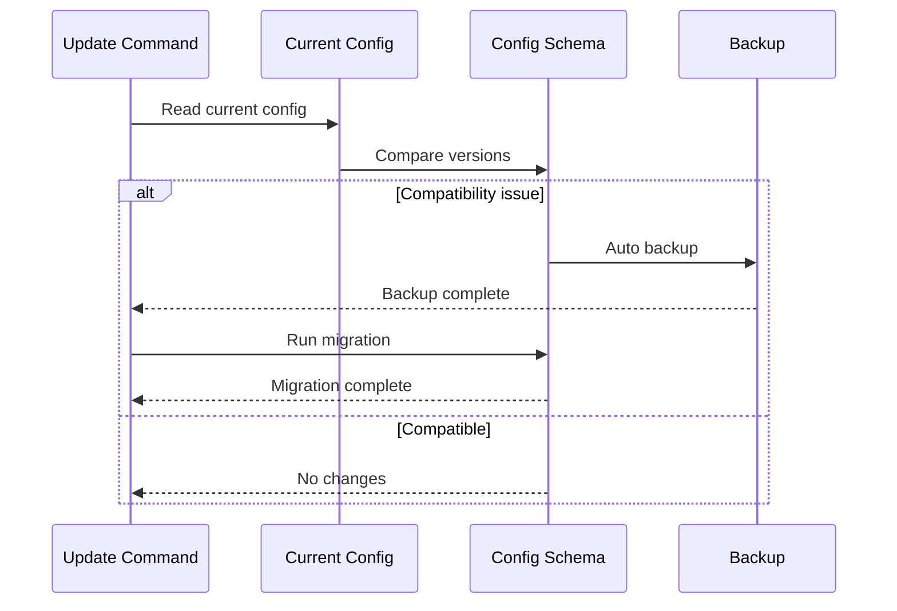
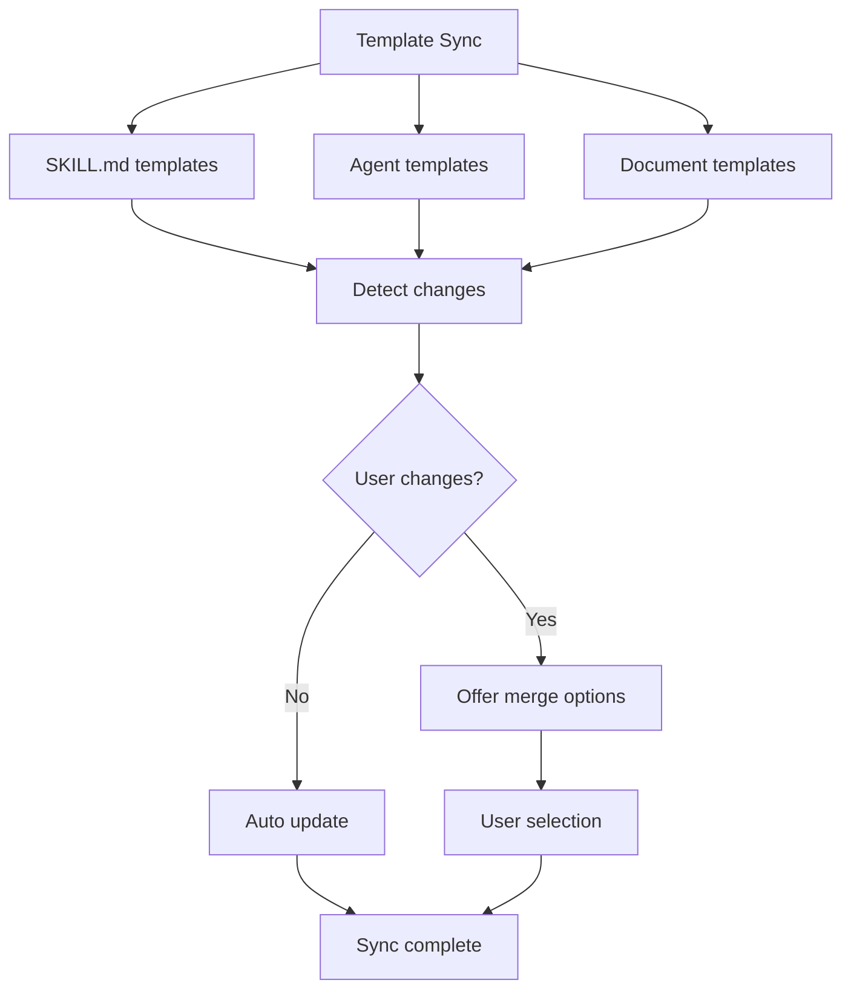

import { Callout } from 'nextra/components'

# Update

Keep MoAI-ADK up to date and perform smooth upgrades with the smart update workflow.

## Update Command

To update MoAI-ADK to the latest version:

```bash
moai update
```

This command runs a 3-phase smart update workflow.

## 3-Phase Smart Update Workflow



### Stage 1: Check Package Version

First, compare the currently installed version with the latest version on PyPI.

```bash
# Check current version
moai --version

# Check available updates
moai update --check-only
```

**Items Checked:**

- Currently installed version
- PyPI latest version
- Changelog (new features, bug fixes, compatibility)

**Output Example:**

```
Current version: 1.2.0
Latest version: 1.3.0

Release notes:
- Add new expert-performance agent
- Improve token optimization
- Fix SPEC validation issues

Update available! Run 'moai update' to upgrade.
```

### Stage 2: Compare Config Versions

Check configuration file format and compatibility.



**Files Checked:**

- `.moai/config/sections/user.yaml`
- `.moai/config/sections/language.yaml`
- `.moai/config/sections/quality.yaml`

**Migration Example:**

```yaml
# Old config (v1.2.0)
development_mode: ddd
test_coverage_target: 85

# New config (v1.3.0)
development_mode: ddd
test_coverage_target: 85
ddd_settings:
  require_existing_tests: true
  characterization_tests: true
```

<Callout type="tip">
Configuration files in `.moai/config/` are always backed up before migration.
</Callout>

### Stage 3: Template Sync

Synchronize project templates and base files to the latest version.



**Files Synced:**

- `.moai/templates/` - Project templates
- `.claude/skills/` - Skill templates
- `.claude/agents/` - Agent templates

<Callout type="info">
User-modified template files are preserved, with merge options offered for new versions.
</Callout>

## Update Options

### Operation Modes

| Command | Binary Update | Template Sync |
|---------|----------------|---------------|
| `moai update` | O | O |
| `moai update --binary` | O | X |
| `moai update --templates-only` | X | O |

### Binary-Only Update

Update the MoAI-ADK binary only without syncing templates:

```bash
$ moai update --binary
```

**Use cases:**
- When you have manually modified templates
- When you want to skip template synchronization
- When only binary update is needed

### Template-Only Sync

Sync templates only without updating the binary:

```bash
$ moai update --templates-only
```

**Use cases:**
- Apply latest skill and agent templates
- Keep binary version while updating templates
- When template sync is needed across multiple projects

### Check Only

Check available versions without actual update:

```bash
$ moai update --check-only
```

### Auto Update

Automatically update without confirmation:

```bash
$ moai update --yes
```

### Specific Version

Update to a specific version:

```bash
$ moai update --version 1.2.0
```

### Keep Backup

Preserve backup for recovery if update fails:

```bash
$ moai update --keep-backup
```

## Post-Update Procedures

### Step 1: Check Version

```bash
moai --version
```

### Step 2: Verify Configuration

```bash
moai doctor
```

### Step 3: Check New Features

```bash
moai --help
```

Check for newly added commands or options.

## Troubleshooting

### Problem: Update Failed

```bash
Error: Update failed - permission denied
```

**Solution:**

```bash
# Manual update with uv
uv tool install moai-adk --force-reinstall

# Or manual update with pip
pip install --upgrade moai-adk
```

### Problem: Config Migration Error

```bash
Error: Config migration failed
```

**Solution:**

```bash
# Restore from backup
cp -r .moai/config.bak .moai/config

# Manual migration
vim .moai/config/sections/quality.yaml
```

### Problem: Template Conflicts

```bash
Warning: Template conflicts detected
```

**Solution:**

```bash
# Auto merge (preserve user changes)
$ moai update --merge

# Manual merge (preserve backup, create merge guide)
$ moai update --manual

# Force update (no backup)
$ moai update --force
```

## Personal Settings Management

When updating MoAI-ADK, **CLAUDE.md** and **settings.json** are overwritten with new versions. If you have personal modifications, manage them as follows.

### Using .local Files

Store personal settings in separate files to prevent overwriting during updates:

| File | Location | Purpose |
|------|----------|---------|
| `CLAUDE.md` | Project root | MoAI-ADK managed (changed on update) |
| `settings.json` | `.claude/` | MoAI-ADK managed (changed on update) |
| `CLAUDE.local.md` | Project root | ✅ Project personal settings (not affected by update) |
| `.claude/settings.local.json` | Project | ✅ Project personal settings (not affected by update) |

**Personal Settings Example (Project Local):**

```markdown
# CLAUDE.local.md

## User Information

- Name: John Developer
- Role: Senior Software Engineer
- Expertise: Backend Development, DevOps

## Development Preferences

- Languages: Python, TypeScript
- Frameworks: FastAPI, React
- Testing: pytest, Jest
- Documentation: Markdown, OpenAPI
```

**Personal Settings Example (settings):**

```json
// .claude/settings.local.json
{
  "env": {
    "ANTHROPIC_AUTH_TOKEN": "YOUR-API-KEY",
    "ANTHROPIC_BASE_URL": "https://api.z.ai/api/anthropic",
    "ANTHROPIC_DEFAULT_HAIKU_MODEL": "glm-4.7-flashx",
    "ANTHROPIC_DEFAULT_SONNET_MODEL": "glm-4.7",
    "ANTHROPIC_DEFAULT_OPUS_MODEL": "glm-4.7"
  },
  "permissions": {
    "allow": [
      "Bash(bun run typecheck:*)",
      "Bash(bun install)",
      "Bash(bun run build)"
    ]
  },
  "enabledMcpjsonServers": [
    "context7"
  ],
  "companyAnnouncements": [
    "🗿 MoAI-ADK: 20 Specialized Agents + 52 Skills with SPEC-First DDD",
    "⚡ /moai: One-stop Plan→Run→Sync automation with intelligent routing",
    "🌳 moai worktree: Parallel SPEC development in isolated worktree environments",
    "🤖 Expert Agents (9): backend, frontend, security, devops, debug, performance, refactoring, testing, chrome-extension",
    "🤖 Manager Agents (7): git, spec, ddd, docs, quality, project, strategy",
    "🤖 Builder Agents (4): agent, skill, command, plugin",
    "🤖 Team Agents (8, experimental): researcher, analyst, architect, designer, backend-dev, frontend-dev, tester, quality",
    "📋 Workflow: /moai plan (SPEC) → /moai run (DDD) → /moai sync (Docs)",
    "🚀 Options: --team (parallel Agent Teams), --ultrathink (deep analysis via Sequential Thinking MCP), --loop (iterative auto-fix)",
    "✅ Quality: TRUST 5 + ≥85% coverage + Ralph Engine (LSP + AST-grep)",
    "🔄 Git Strategy: 3-Mode (Manual/Personal/Team) with Smart Merge config updates",
    "📚 Tip: moai update --templates-only syncs latest skills and agents to your project",
    "📚 Tip: moai worktree new SPEC-XXX creates isolated worktree for parallel development",
    "⚙️ moai update -c: Configure Model availability (high/medium/low) based on your Claude plan tier",
    "💡 Hybrid Mode: Plan with Claude (Opus/Sonnet), Run/Sync with GLM-5 for cost savings",
    "💡 Parallel Dev: Terminal 1 runs Claude, Terminal 2+ run 'moai glm && claude' for parallel execution",
    "💎 GLM-5 Sponsor: z.ai partnership - cost-effective AI with equivalent performance",
    "🏆 moai rank: Track your Claude token usage and compete on rank.mo.ai.kr leaderboard"
  ],
  "_meta": {
    "description": "User-specific Claude Code settings (gitignored - never commit)",
    "created_at": "2026-01-27T18:15:26.175926Z",
    "note": "Edit this file to customize your local development environment"
  }
}
```

<Callout type="info">
**Configuration Priority:** Local > Project > User > Enterprise<br />
<code>settings.local.json</code> overrides project settings.
</Callout>

### moai Folder Structure

MoAI-ADK only manages files in the following folders:

```
.claude/
├── agents/
│   └── moai/                # MoAI-ADK agents (update target)
│
├── hooks/
│   └── moai/                # MoAI-ADK hook scripts (update target)
│
├── skills/
│   ├── moai-*               # MoAI-ADK skills (moai- prefix, update target)
│   │
│   └── my-skills/           # ✅ Personal skills (not updated)
│
└── rules/
    └── moai/                # Rule files (moai managed)
        ├── core/            # Core principles and constitution
        ├── development/     # Development guidelines and standards
        ├── languages/       # Language-specific rules (16 languages)
        └── workflow/        # Workflow phase definitions
```

**Naming Conventions:**

| Type | Location | Update Impact |
|------|----------|---------------|
| **Agents** | `agents/moai/` | ⚠️ **Changed on update** |
| **Hooks** | `hooks/moai/` | ⚠️ **Changed on update** |
| **Skills** | `skills/moai-*` | ⚠️ **Changed on update** |
| **Rules** | `rules/moai/` | ⚠️ **Changed on update** |
| **Personal Agents** | `agents/my-agents/` | ✅ **Not affected by update** |
| **Personal Skills** | `skills/my-skills/` | ✅ **Not affected by update** |

<Callout type="warning">
**Important:** Skills with `moai-*` prefix are managed by MoAI-ADK. Use `my-*` folders or separate prefixes for personal additions or modifications.
</Callout>

<Callout type="warning">
**Important:** Files in `moai/` folders may be overwritten during updates. Use separate folders for personal additions or modifications.
</Callout>

### How to Organize Files

```bash
# Move personal agents (example)
mv .claude/agents/my-agent.md .claude/my-agents/

# Move personal skills (example)
mv .claude/skills/my-skill.md .claude/my-skills/
```

### Changelog

Check [GitHub Releases](https://github.com/modu-ai/moai-adk/releases) for recent changes.

## Rollback

If problems occur after update, you can rollback to a previous version:

```bash
# Rollback to specific version
uv tool install moai-adk==1.2.0 --force-reinstall

# Or restore from backup
cp -r .moai/config.bak .moai/config
```

<Callout type="warning">
Commit your work before rollback.
</Callout>

## Next Steps

After completing update:

1. **[Check Changelog](/getting-started/update)** - Learn new features
2. **[Core Concepts](/core-concepts/what-is-moai-adk)** - Master new agents and features
3. **[Quick Start](/getting-started/quickstart)** - Apply new features to your project

---

Update regularly to take advantage of the latest features and improvements in MoAI-ADK!