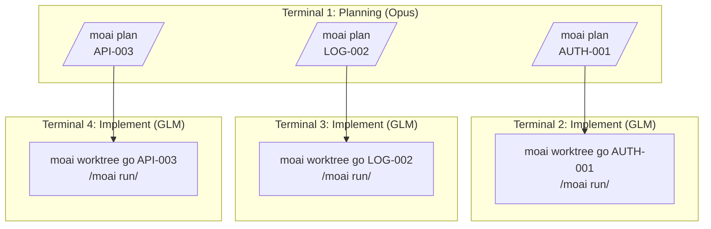
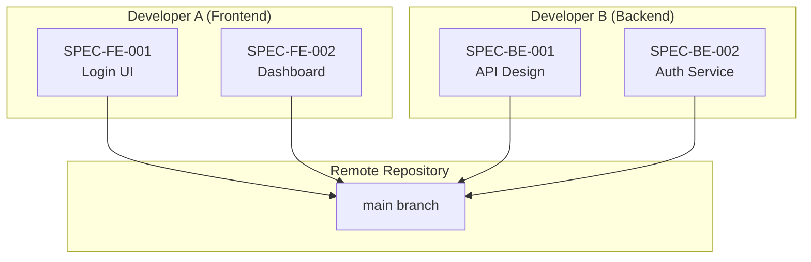
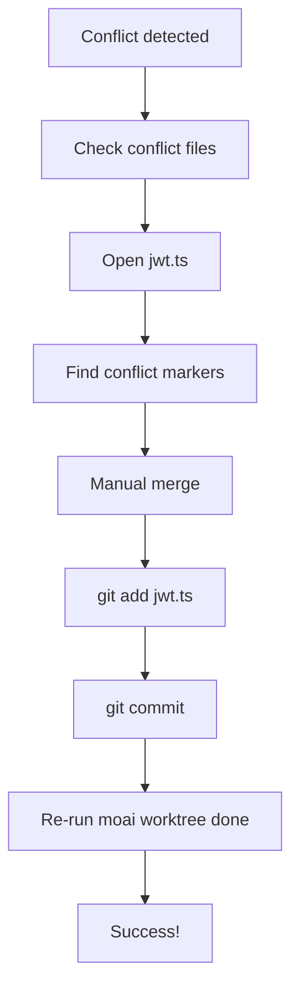
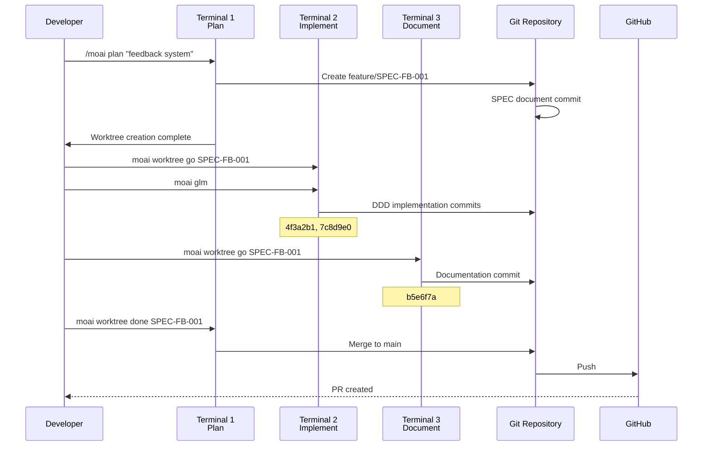

# Git Worktree Real Usage Examples

Learn how to apply Git Worktree in real projects through concrete examples.

## Table of Contents

1. [Single SPEC Development](#single-spec-development)
2. [Parallel SPEC Development](#parallel-spec-development)
3. [Team Collaboration Scenarios](#team-collaboration-scenarios)
4. [Troubleshooting Cases](#troubleshooting-cases)

---

## Single SPEC Development

### Scenario: Implement User Authentication System

#### Step 1: SPEC Planning (Terminal 1)

```bash
# In project root
$ cd /Users/goos/MoAI/moai-project

# Create SPEC plan
> /moai plan "Implement JWT-based user authentication system" --worktree

# Output
✓ MoAI-ADK SPEC Manager v2.0
━━━━━━━━━━━━━━━━━━━━━━━━━━━━━━━━━━━━━━━━━━

Analyzing SPEC...
  - Feature requirements: 8 found
  - Technical requirements: 5 found
  - API endpoints: 6 identified

Creating SPEC document...
  ✓ .moai/specs/SPEC-AUTH-001/spec.md
  ✓ .moai/specs/SPEC-AUTH-001/requirements.md
  ✓ .moai/specs/SPEC-AUTH-001/api-design.md

Creating Worktree...
  ✓ Branch created: feature/SPEC-AUTH-001
  ✓ Worktree created: /Users/goos/MoAI/moai-project/.moai/worktrees/SPEC-AUTH-001
  ✓ Branch checkout complete

━━━━━━━━━━━━━━━━━━━━━━━━━━━━━━━━━━━━━━━━━━
Next steps:
  1. Run in new terminal: moai worktree go SPEC-AUTH-001
  2. Change LLM: moai glm
  3. Start Claude: claude
  4. Start development: /moai run SPEC-AUTH-001

Cost saving tip: Use 'moai glm' for 70% cost savings during implementation!
━━━━━━━━━━━━━━━━━━━━━━━━━━━━━━━━━━━━━━━━━━
```

#### Step 2: Enter Worktree and Implement (Terminal 2)

```bash
# Open new terminal
$ moai worktree go SPEC-AUTH-001

# New terminal opens and moves to Worktree
# Prompt changes
(SPEC-AUTH-001) ~/moai-project/.moai/worktrees/SPEC-AUTH-001

# Change LLM to low-cost model
(SPEC-AUTH-001) $ moai glm
✓ LLM changed: GLM 4.7 (70% cost savings)

# Start Claude Code
(SPEC-AUTH-001) $ claude
Claude Code v1.0.0
Type 'help' for available commands

# Start DDD implementation
> /moai run SPEC-AUTH-001

# Output
✓ MoAI-ADK DDD Executor v2.0
━━━━━━━━━━━━━━━━━━━━━━━━━━━━━━━━━━━━━━━━━━

Phase 1: ANALYZE
  ✓ Requirement analysis complete
  ✓ Existing code analysis complete
  ✓ Test coverage target: 85%

Phase 2: PRESERVE
  ✓ Created 12 characterization tests
  ✓ Existing behavior preserved

Phase 3: IMPROVE
  ✓ JWT authentication middleware implemented
  ✓ Refresh token rotation implemented
  ✓ Token invalidation on logout implemented

━━━━━━━━━━━━━━━━━━━━━━━━━━━━━━━━━━━━━━━━━━
Implementation complete!
  - Commit: 4f3a2b1 (feat: JWT authentication middleware)
  - Commit: 7c8d9e0 (feat: refresh token rotation)
  - Commit: 2a1b3c4 (feat: token invalidation on logout)

Next steps:
  1. Run tests: pytest tests/auth/
  2. Document: /moai sync SPEC-AUTH-001
  3. Complete: moai worktree done SPEC-AUTH-001
━━━━━━━━━━━━━━━━━━━━━━━━━━━━━━━━━━━━━━━━━━
```

#### Step 3: Documentation (same Terminal 2)

```bash
# Run documentation
> /moai sync SPEC-AUTH-001

# Output
✓ MoAI-ADK Documentation Generator v2.0
━━━━━━━━━━━━━━━━━━━━━━━━━━━━━━━━━━━━━━━━━━

Generating documentation...
  ✓ API docs: docs/api/auth.md
  ✓ Architecture diagram: docs/diagrams/auth-flow.mmd
  ✓ User guide: docs/guides/authentication.md

Commit complete:
  ✓ b5e6f7a (docs: authentication documentation)

━━━━━━━━━━━━━━━━━━━━━━━━━━━━━━━━━━━━━━━━━━
Documentation complete!
Next step: moai worktree done SPEC-AUTH-001 --push
━━━━━━━━━━━━━━━━━━━━━━━━━━━━━━━━━━━━━━━━━━
```

#### Step 4: Complete and Merge (Terminal 1)

```bash
# Return to project root
$ cd /Users/goos/MoAI/moai-project

# Complete Worktree
$ moai worktree done SPEC-AUTH-001 --push

# Output
✓ MoAI-ADK Worktree Manager v2.0
━━━━━━━━━━━━━━━━━━━━━━━━━━━━━━━━━━━━━━━━━━

Completing Worktree: SPEC-AUTH-001

1. Switching to main branch...
   ✓ Switched to branch 'main'

2. Merging feature branch...
   ✓ Merge 'feature/SPEC-AUTH-001' into main

3. Pushing to remote repository...
   ✓ github.com:username/repo.git
   ✓ Branch 'main' set up to track remote branch 'main'

4. Cleaning Worktree...
   ✓ Remove Worktree: .moai/worktrees/SPEC-AUTH-001
   ✓ Remove branch: feature/SPEC-AUTH-001

━━━━━━━━━━━━━━━━━━━━━━━━━━━━━━━━━━━━━━━━━━
✓ SPEC-AUTH-001 complete!

Total commits: 4
  - 2e9b4c3 docs: authentication documentation
  - 7c8d9e0 feat: refresh token rotation
  - 4f3a2b1 feat: JWT authentication middleware
  - b5e6f7a feat: token invalidation on logout

━━━━━━━━━━━━━━━━━━━━━━━━━━━━━━━━━━━━━━━━━━
```

---

## Parallel SPEC Development

### Scenario: Develop 3 SPECs Simultaneously



#### Terminal 1: Planning (all SPECs)

```bash
# SPEC 1: Authentication
> /moai plan "JWT authentication system" --worktree
✓ SPEC-AUTH-001 creation complete

# SPEC 2: Logging
> /moai plan "Structured logging system" --worktree
✓ SPEC-LOG-002 creation complete

# SPEC 3: API
> /moai plan "REST API v2" --worktree
✓ SPEC-API-003 creation complete

# Check Worktrees
moai worktree list
SPEC-AUTH-001  feature/SPEC-AUTH-001  /path/to/SPEC-AUTH-001
SPEC-LOG-002   feature/SPEC-LOG-002   /path/to/SPEC-LOG-002
SPEC-API-003   feature/SPEC-API-003   /path/to/SPEC-API-003
```

#### Terminal 2: AUTH-001 Implementation

```bash
$ moai worktree go SPEC-AUTH-001
(SPEC-AUTH-001) $ moai glm
(SPEC-AUTH-001) $ claude
> /moai run SPEC-AUTH-001
# ... implementation in progress ...
```

#### Terminal 3: LOG-002 Implementation

```bash
$ moai worktree go SPEC-LOG-002
(SPEC-LOG-002) $ moai glm
(SPEC-LOG-002) $ claude
> /moai run SPEC-LOG-002
# ... implementation in progress ...
```

#### Terminal 4: API-003 Implementation

```bash
$ moai worktree go SPEC-API-003
(SPEC-API-003) $ moai glm
(SPEC-API-003) $ claude
> /moai run SPEC-API-003
# ... implementation in progress ...
```

#### Monitor Parallel Progress

```bash
# Check all Worktree status in Terminal 1
$ moai worktree status --verbose

Worktree: SPEC-AUTH-001
Branch: feature/SPEC-AUTH-001
Status: 3 commits ahead of main
LLM: GLM 4.7
Last activity: 5 minutes ago

Worktree: SPEC-LOG-002
Branch: feature/SPEC-LOG-002
Status: 2 commits ahead of main
LLM: GLM 4.7
Last activity: 3 minutes ago

Worktree: SPEC-API-003
Branch: feature/SPEC-API-003
Status: 4 commits ahead of main
LLM: GLM 4.7
Last activity: 7 minutes ago
```

---

## Team Collaboration Scenarios

### Scenario: 2 Developers Collaborating



#### Developer A: Frontend Development

```bash
# On Developer A's machine
git clone https://github.com/team/project.git
cd project

# Create Frontend SPEC
> /moai plan "Login UI component" --worktree
✓ SPEC-FE-001 created

# Develop in Worktree
moai worktree go SPEC-FE-001
(SPEC-FE-001) $ moai glm
(SPEC-FE-001) $ claude
> /moai run SPEC-FE-001

# After implementation, push to remote
(SPEC-FE-001) $ exit
moai worktree done SPEC-FE-001 --push
✓ Complete and PR created
```

#### Developer B: Backend Development

```bash
# On Developer B's machine
git clone https://github.com/team/project.git
cd project

# Create Backend SPEC
> /moai plan "Authentication API service" --worktree
✓ SPEC-BE-001 created

# Develop in Worktree
moai worktree go SPEC-BE-001
(SPEC-BE-001) $ moai glm
(SPEC-BE-001) $ claude
> /moai run SPEC-BE-001

# After implementation, push to remote
(SPEC-BE-001) $ exit
moai worktree done SPEC-BE-001 --push
✓ Complete and PR created
```

#### PR Merge and Integration

```bash
# By team lead or CI system
gh pr list
# FE-001  Login UI Component          Ready
# BE-001  Authentication API Service  Ready

# Merge PRs
gh pr merge FE-001 --merge
gh pr merge BE-001 --merge

# All developers stay up to date
git pull origin main
```

---

## Troubleshooting Cases

### Case 1: Resolve Merge Conflict

```bash
$ moai worktree done SPEC-AUTH-001 --push

# Output
✗ Merge conflict occurred!
Conflict files:
  - src/auth/jwt.ts
  - tests/auth.test.ts

Resolution steps:
1. Edit conflict files to resolve
2. git add <file>
3. git commit
4. Re-run moai worktree done SPEC-AUTH-001 --push
```

**Resolution process**:



```bash
# Resolve conflict
cd .moai/worktrees/SPEC-AUTH-001
code src/auth/jwt.ts

# Check conflict markers
<<<<<<< HEAD
const secret = process.env.JWT_SECRET;
=======
const secret = config.jwt.secret;
>>>>>>> feature/SPEC-AUTH-001

# Manually merge
const secret = process.env.JWT_SECRET || config.jwt.secret;

# Stage and commit
git add src/auth/jwt.ts
git commit -m "fix: resolve merge conflict in JWT config"

# Retry completion
cd /Users/goos/MoAI/moai-project
moai worktree done SPEC-AUTH-001 --push
✓ Complete!
```

### Case 2: Recover Corrupted Worktree

```bash
$ moai worktree go SPEC-AUTH-001
✗ Worktree is corrupted.

# Diagnose
$ moai worktree status SPEC-AUTH-001
✗ Worktree directory does not exist

# Recover
$ moai worktree remove SPEC-AUTH-001 --force
✓ Removed existing Worktree

$ moai worktree new SPEC-AUTH-001
✓ Worktree recreation complete
```

### Case 3: Insufficient Disk Space

```bash
$ df -h
Filesystem      Size  Used Avail Use%
/dev/disk1     500G  480G   20G  96%

# Clean old Worktrees
$ moai worktree clean --older-than 14

# Worktrees to be cleaned:
  - SPEC-OLD-001 (30 days ago)
  - SPEC-OLD-002 (45 days ago)
  - SPEC-OLD-003 (60 days ago)

Continue? [y/N] y

✓ 3 Worktrees cleaned
✓ 12GB disk space freed
```

---

## Real Project Workflow

### Complete Development Cycle Example



---

## Success Stories

### Case: Startup Application

```bash
# Situation: Need to develop 3 features simultaneously
# Time: 1 week
# Developers: 2

# Day 1: Plan all SPECs
> /moai plan "User management" --worktree
> /moai plan "Payment system" --worktree
> /moai plan "Notification system" --worktree

# Days 2-4: Parallel implementation
# Terminal 1: User management
$ moai worktree go SPEC-USER-001 && moai glm
# Terminal 2: Payment system
$ moai worktree go SPEC-PAY-001 && moai glm
# Terminal 3: Notification system
$ moai worktree go SPEC-NOTIF-001 && moai glm

# Days 5-6: Documentation and testing
# Run /moai sync in each Worktree

# Day 7: Merge
$ moai worktree done SPEC-USER-001 --push
$ moai worktree done SPEC-PAY-001 --push
$ moai worktree done SPEC-NOTIF-001 --push

# Results
# - All 3 features completed
# - 66% time savings with parallel development
# - 70% cost savings with GLM
```

---

## Tips and Tricks

### Tip 1: Terminal Management

```bash
# Use tmux for session management
tmux new-session -d -s spec-user 'moai worktree go SPEC-USER-001'
tmux new-session -d -s spec-pay 'moai worktree go SPEC-PAY-001'

# List sessions
tmux ls
spec-user: 1 windows
spec-pay: 1 windows

# Switch sessions
tmux attach-session -t spec-user
```

### Tip 2: Progress Tracking

```bash
# All Worktree progress
for spec in $(moai worktree list --porcelain | awk '{print $1}'); do
    echo "=== $spec ==="
    cd ~/.moai/worktrees/$spec
    git log --oneline -5
    echo ""
done
```

### Tip 3: Automation Script

```bash
#!/bin/bash
# auto-workflow.sh

SPEC_ID=$1

echo "1. Creating SPEC plan..."
> /moai plan "$2" --worktree

echo "2. Entering Worktree..."
moai worktree go $SPEC_ID

echo "3. Changing LLM..."
moai glm

echo "4. Starting Claude..."
claude

# Usage
# ./auto-workflow.sh SPEC-AUTH-001 "authentication system"
```

## Related Documents

- [Git Worktree Overview](./index)
- [Complete Guide](./guide)
- [FAQ](./faq)