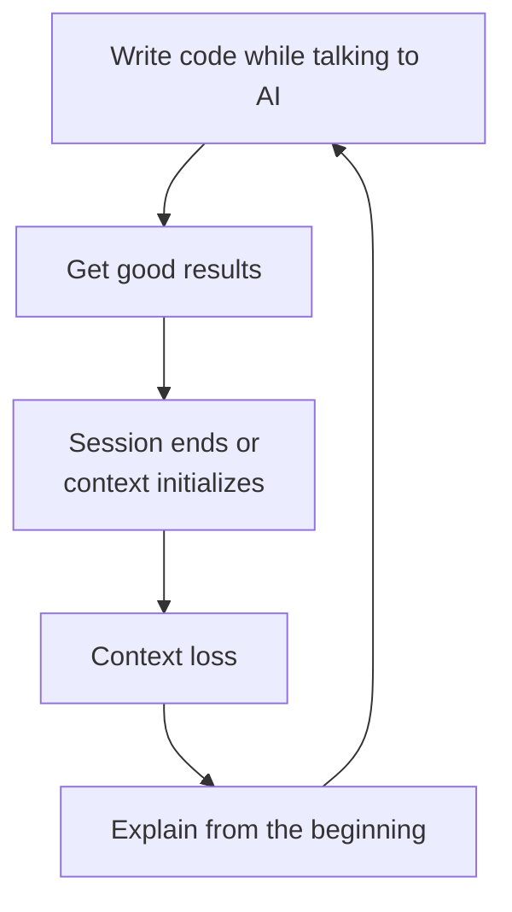
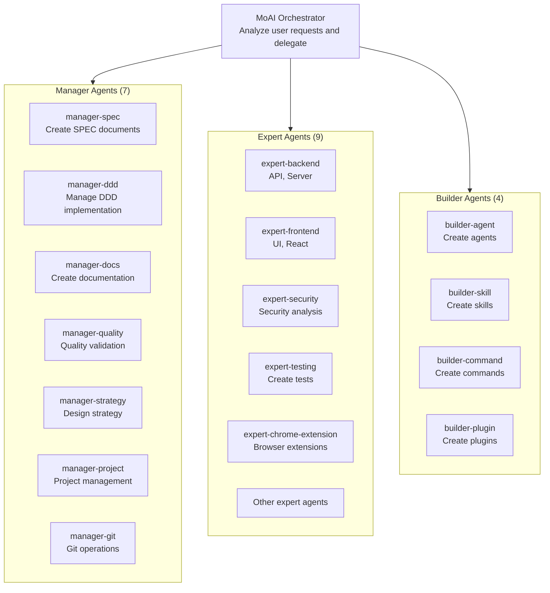
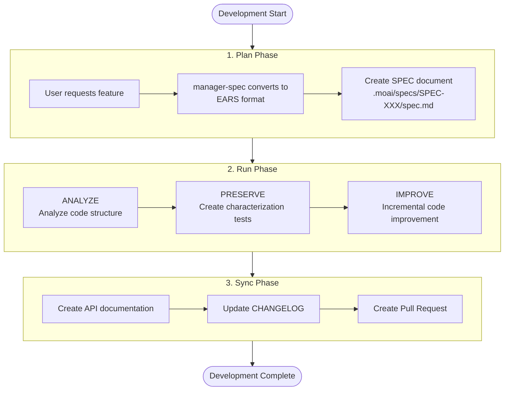
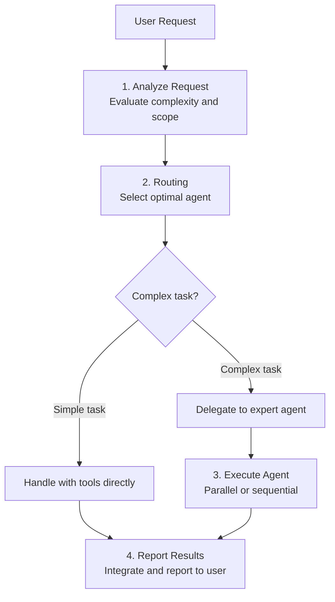

import { Callout } from 'nextra/components'

# What is MoAI-ADK?

MoAI-ADK is a high-quality code generation framework for AI-based development. With 20 specialized agents and 52 skills, it provides a systematic and safe development workflow.

<Callout type="tip">
**One-line summary:** MoAI-ADK is an AI development framework that "documents conversations with AI (SPEC), safely improves code (DDD), and automatically validates quality (TRUST 5)."
</Callout>

## MoAI-ADK Introduction

**MoAI** means "MoAI" (MoAI - Everybody's AI). **ADK** stands for Agentic Development Kit, a toolkit where AI agents lead the development process.

MoAI-ADK is an **Agentic Development Kit** that enables AI agents to interact with each other within Claude Code to perform agent coding. Just like an AI development team collaborating to complete a project, MoAI-ADK's AI agents perform development work in their respective areas of expertise while collaborating with each other.

| AI Development Team | MoAI-ADK | Role |
|---------------------|----------|------|
| Product Owner | User (Developer) | Decide what to build |
| Team Lead / Tech Lead | MoAI Orchestrator | Coordinate overall work and delegate to team members |
| Planner / Spec Writer | manager-spec | Document requirements |
| Developers / Engineers | expert-backend, expert-frontend | Implement actual code |
| QA / Code Reviewer | manager-quality | Validate quality standards |

## Why MoAI-ADK?

### Problems with Vibe Coding

**Vibe Coding** is a method of writing code while naturally conversing with AI. You say "create this feature" and AI generates code. It's intuitive and fast, but causes serious problems in practice.



**Specific Problems in Practice:**

| Problem | Situation Example | Result |
|---------|-------------------|--------|
| **Context Loss** | Have to re-explain authentication method discussed for 1 hour yesterday | Time waste, inconsistent quality |
| **Quality Inconsistency** | AI sometimes generates good code, sometimes bad code | Unpredictable code quality |
| **Breaking Existing Code** | Said "fix this part" but broke other features | Bugs, rollback needed |
| **Repeated Explanations** | Have to explain project structure and coding rules every time | Reduced productivity |
| **No Validation** | No way to verify if AI-generated code is safe | Security vulnerabilities, missing tests |

### MoAI-ADK Solutions

| Problem | MoAI-ADK Solution |
|---------|-------------------|
| Context loss | Permanently preserve requirements with **SPEC documents** |
| Quality inconsistency | Apply consistent quality standards with **TRUST 5 framework** |
| Breaking existing code | Protect existing functionality with **DDD** characterization tests |
| Repeated explanations | Automatically load project context with **CLAUDE.md and skill system** |
| No validation | Automatically validate code quality with **LSP quality gates** |

## Core Philosophy

<Callout type="warning">
**"The purpose of Vibe Coding is not fast productivity, but code quality."**

MoAI-ADK is not a tool for quickly churning out code. The goal is to create **higher quality** code than humans write directly, while leveraging AI. Fast speed is a secondary effect that naturally follows while maintaining quality.
</Callout>

This philosophy is concretized in three principles:

1. **SPEC-First**: Before writing code, clearly define what to make in a document
2. **Safe Improvement (DDD)**: Incrementally improve while preserving existing code behavior
3. **Auto Quality Validation (TRUST 5)**: Automatically validate all code with 5 quality principles

## Key Components

MoAI-ADK is composed of three axes: **agents**, **skills**, and **commands**.

### Agents (20)

Agents are experts in specific fields. Users don't need to call agents directly; MoAI orchestrator automatically selects and delegates to the appropriate agent.

| Type | Count | Role | Examples |
|------|-------|------|----------|
| **Manager** Agents | 7 | Workflow management and coordination | manager-spec, manager-ddd, manager-docs |
| **Expert** Agents | 9 | Specialized domain implementation | expert-backend, expert-frontend, expert-security, expert-chrome-extension |
| **Builder** Agents | 4 | Create new components | builder-agent, builder-skill, builder-command |



### Skills (52)

Skills are **expert knowledge modules** that agents use. They contain best practices and patterns for programming languages, platforms, and frameworks.

| Category | Count | Description | Examples |
|----------|-------|-------------|----------|
| **Foundation** | Foundation Skills | MoAI core principles and patterns | moai-foundation-core, moai-foundation-claude |
| **Workflow** | Workflows | Development process management | moai-workflow-spec, moai-workflow-ddd |
| **Domain** | Domains | Backend, frontend, DB expertise | moai-domain-backend, moai-domain-frontend |
| **Language** | Languages | Support for 16 programming languages | moai-lang-python, moai-lang-typescript |
| **Platform** | Platforms | Cloud and infrastructure | moai-platform-vercel, moai-platform-supabase |
| **Library** | Libraries | Frameworks and libraries | moai-library-nextra, moai-library-mermaid |
| **Tool** | Tools | Development tool integration | moai-tool-ast-grep, moai-tool-svg |
| **Framework** | Frameworks | Application frameworks | moai-framework-electron |

### Commands (8)

Commands are **slash commands** that users execute directly in Claude Code.

**Workflow Commands (4):**

| Command | Role | Phase |
|---------|------|-------|
| `/moai project` | Project initialization and documentation generation | Preparation |
| `/moai plan` | Create SPEC document | Plan |
| `/moai run` | Implement with DDD | Run |
| `/moai sync` | Document sync and PR creation | Sync |

**Utility Commands (4):**

| Command | Role |
|---------|------|
| `/moai` | Autonomous execution from SPEC to code (full workflow) |
| `/moai fix` | One-time auto fix (parallel scan and fix) |
| `/moai loop` | Autonomous repeat fix loop (repeat until complete) |
| `/moai feedback` | Submit feedback to MoAI-ADK |

## 3-Phase Development Workflow

All MoAI-ADK development follows the **Plan - Run - Sync** 3-phase process. This flow is similar to cooking.

| Phase | Cooking Analogy | MoAI-ADK | Responsible Agent |
|-------|-----------------|----------|-------------------|
| **Plan** | Write recipe | Define requirements in SPEC document | manager-spec |
| **Run** | Cook food | Implement code with DDD | manager-ddd |
| **Sync** | Take photos and share | Generate documentation and create PR | manager-docs |



**Actual Usage Example:**

```bash
# 1. Plan: Define requirements
> /moai plan "Implement JWT-based user authentication"

# 2. Run: Implement with DDD
> /moai run SPEC-AUTH-001

# 3. Sync: Generate documentation and PR
> /moai sync SPEC-AUTH-001
```

## MoAI Orchestrator

MoAI is the **central coordinator** of MoAI-ADK. It analyzes all user requests and delegates work to the most appropriate agent. Users only need to talk to MoAI, and it assigns experts automatically.



**MoAI's Core Roles:**

1. **Request Analysis**: Understand user intent and detect technical keywords
2. **Agent Selection**: Select optimal agent using 5-step decision tree
3. **Parallel Execution**: Process up to 10 independent tasks in parallel
4. **Result Integration**: Integrate results from multiple agents into one report

<Callout type="info">
**Agent Selection Criteria:** MoAI selects agents in the following order:

1. Need codebase exploration? --> Explore agent
2. Need external document research? --> Web search tools
3. Need domain expertise? --> Expert agent
4. Need workflow coordination? --> Manager agent
5. Complex multi-step task? --> manager-strategy agent
</Callout>

## Project Structure

When you install MoAI-ADK, the following structure is created in your project:

```
my-project/
├── CLAUDE.md                  # MoAI execution guidelines
├── .claude/
│   ├── agents/moai/           # 20 AI agent definitions
│   ├── skills/moai-*/         # 52 skill modules
│   ├── hooks/moai/            # Automation hook scripts
│   └── rules/moai/            # Coding rules and standards
└── .moai/
    ├── config/                # MoAI configuration files
    │   └── sections/
    │       └── quality.yaml   # TRUST 5 quality settings
    ├── specs/                 # SPEC document storage
    │   └── SPEC-XXX/
    │       └── spec.md
    └── memory/                # Cross-session context persistence
```

**Key File Descriptions:**

| File/Directory | Role |
|----------------|------|
| `CLAUDE.md` | Execution guidelines that MoAI reads. Contains project rules, agent catalog, workflow definitions |
| `.claude/agents/` | Define each agent's expertise and tool permissions |
| `.claude/skills/` | Knowledge modules containing best practices for programming languages, platforms |
| `.moai/specs/` | Where SPEC documents are stored. Each feature has its own directory |
| `.moai/config/` | Manages project settings like TRUST 5 quality standards, DDD settings |

## Multilingual Support

MoAI-ADK supports 4 languages. When users request in Korean, it responds in Korean; when requested in English, it responds in English.

| Language | Code | Support Range |
|----------|------|---------------|
| Korean | ko | Conversation, documentation, commands, error messages |
| English | en | Conversation, documentation, commands, error messages |
| Japanese | ja | Conversation, documentation, commands, error messages |
| Chinese | zh | Conversation, documentation, commands, error messages |

<Callout type="info">
**Language Settings:** In `.moai/config/sections/language.yaml`, you can set conversation language, code comment language, and commit message language separately. For example, you can converse in Korean while writing code comments and commit messages in English.
</Callout>

## Next Steps

Now that you understand the big picture of MoAI-ADK, it's time to learn each core concept in detail.

- [SPEC-Based Development](/core-concepts/spec-based-dev) -- Learn how to define requirements as documents
- [Domain-Driven Development](/core-concepts/ddd) -- Learn how to safely improve existing code
- [TRUST 5 Quality](/core-concepts/trust-5) -- Learn how to automatically validate code quality