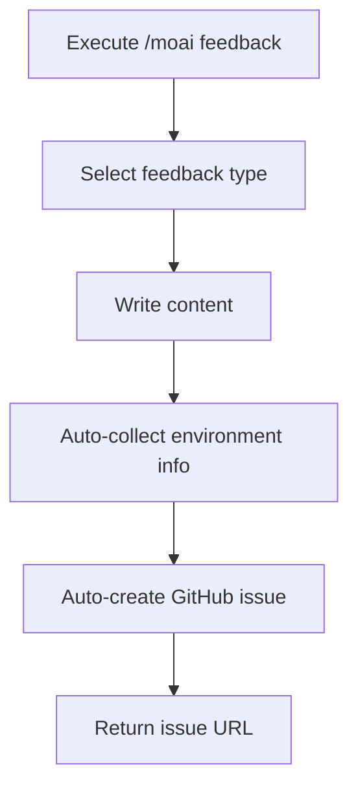
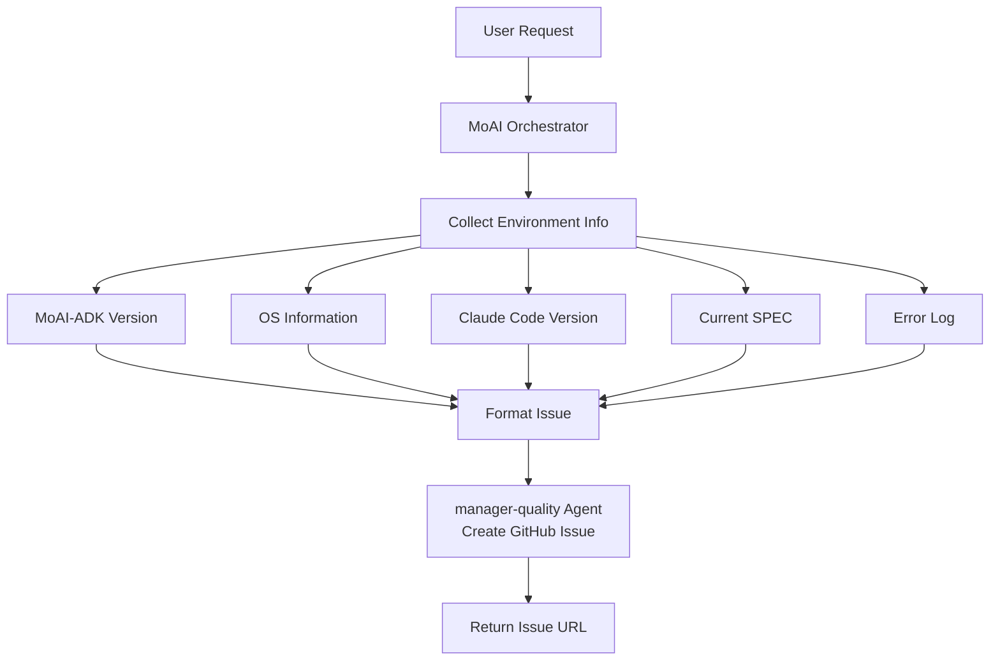

import { Callout } from 'nextra/components'

# /moai feedback

Command to submit feedback or bug reports for MoAI-ADK.

<Callout type="info">

**New Command Format**

`/moai:9-feedback` has been changed to `/moai feedback`.

</Callout>

<Callout type="tip">
**One-line summary**: `/moai feedback` is a command that **automatically creates GitHub issues** for improvement suggestions or bug reports about MoAI-ADK itself.
</Callout>

## Overview

Use this command when you find a bug while using MoAI-ADK, need a new feature, or have an improvement idea. You don't need to visit GitHub directly - you can submit feedback right from within Claude Code.

<Callout type="info">
**Important**: This command is **not for modifying your project code**. It's for conveying feedback about the MoAI-ADK tool itself to the development team.
</Callout>

## Usage

```bash
# Standard form
> /moai feedback

# Short aliases
> /moai fb
> /moai bug
> /moai issue
```

When you execute the command, you'll be guided through selecting feedback type and entering content.

## Supported Flags

| Flag | Description | Example |
|------|-------------|---------|
| `--type {bug,feature,question}` | Directly specify feedback type | `/moai feedback --type bug` |
| `--title "<title>"` | Directly specify title | `/moai feedback --title "Error report"` |
| `--dry-run` | Check content only without creating issue | `/moai feedback --dry-run` |

## How It Works

When you run `/moai feedback`, the following process occurs:



### Automatically Collected Information

When submitting feedback, the following information is automatically included to help the development team quickly understand the problem.

| Collected Item | Description | Example |
|----------------|-------------|---------|
| MoAI-ADK Version | Currently installed version | v10.8.0 |
| OS Information | Operating system and version | macOS 15.2 |
| Claude Code Version | Claude Code version in use | 1.0.30 |
| Current SPEC | SPEC ID being worked on | SPEC-AUTH-001 |
| Error Log | Recent errors (if any) | TypeError: ... |

## Feedback Types

### Bug Report

Report errors or unexpected behavior encountered while using MoAI-ADK.

```bash
> /moai feedback
# Type selection: Bug Report
# Title: Characterization tests not created during /moai run
# Description: I ran /moai run for SPEC-AUTH-001, but characterization tests
#        weren't created in the PRESERVE phase and it went straight to IMPROVE.
# Reproduction: Run /moai run SPEC-AUTH-001
```

### Feature Request

Suggest new features you'd like to see added to MoAI-ADK.

```bash
> /moai feedback
# Type selection: Feature Request
# Title: Add option to target specific files only in /moai loop
# Description: It would be great if /moai loop could target only specific directories or
#        files instead of the entire project.
# Example: /moai loop --path src/auth/
```

### Improvement Proposal

Propose ideas for improving existing features.

```bash
> /moai feedback
# Type selection: Improvement Proposal
# Title: Show before/after diff in /moai fix execution results
# Description: If /moai fix showed its automatic fixes in diff format,
#        we could see at a glance what changes were made.
```

## Agent Delegation Chain

The agent delegation flow for the `/moai feedback` command:



**Agent Roles:**

| Agent | Role | Main Tasks |
|-------|------|------------|
| **MoAI Orchestrator** | Guide feedback process |
| **manager-quality** | GitHub integration | Create issue, return URL |

## Practical Examples

### Situation: Unexpected error during command execution

```bash
# Situation with error
> /moai "Implement payment feature" --branch
# Error: Branch creation failed - permission denied

# Submit feedback
> /moai feedback
```

MoAI Orchestrator asks for feedback type, title, and description in sequence. When you enter your answers, a GitHub issue is automatically created and the issue URL is returned.

```
GitHub issue has been created:
https://github.com/anthropics/moai-adk/issues/1234

The development team will respond after review.
```

<Callout type="info">
**Feedback is always welcome!** Even minor inconveniences - please submit feedback as it helps improve MoAI-ADK.
</Callout>

## Frequently Asked Questions

### Q: Can I edit or delete feedback content?

Yes, you can edit or close the issue directly on GitHub. Since the issue URL is provided, you can access it anytime.

### Q: Can I report the same problem multiple times?

Don't worry - GitHub checks for duplicate issues. If the problem has already been reported, you'll be guided to the existing issue.

### Q: When will I receive a response to my feedback?

The development team reviews and comments on issues weekly. Complex problems may take time to resolve.

### Q: What's the difference between `/moai feedback` and creating GitHub issues directly?

`/moai feedback` automatically collects environment information, helping the development team understand problems faster. It's more efficient than manually creating issues.

## Related Documents

- [/moai - Full Autonomous Automation](/utility-commands/moai)
- [/moai loop - Iterative Fixing Loop](/utility-commands/moai-loop)
- [/moai fix - One-shot Auto Fix](/utility-commands/moai-fix)