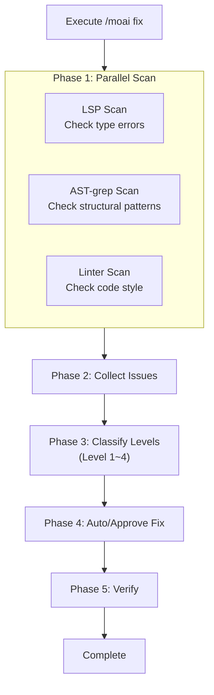
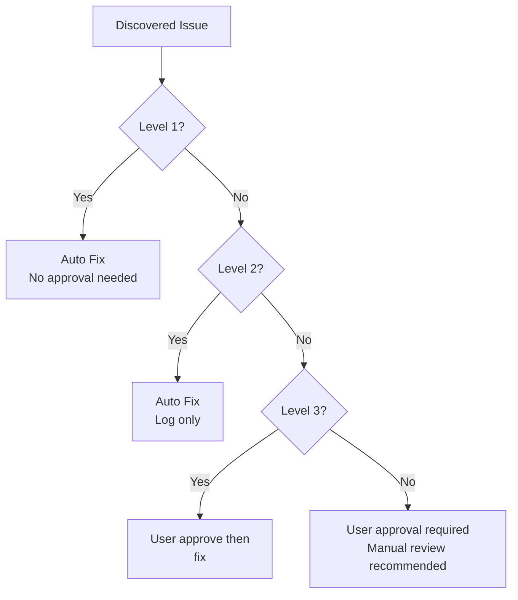
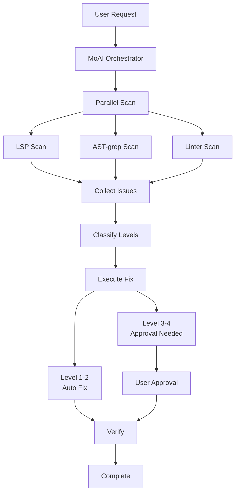

import { Callout } from 'nextra/components'

# /moai fix

One-shot auto-fix command. **Parallel scans** code errors then **fixes all at once**.

<Callout type="tip">
**One-line summary**: `/moai fix` is a "quick cleanup tool". It fixes lint errors and type errors accumulated in code **all at once**.
</Callout>

## Overview

During development, import ordering breaks, types don't match, and lint warnings accumulate. Instead of finding and fixing each problem one by one, run `/moai fix` and AI will automatically find and fix issues.

Unlike `/moai loop`, it runs **only once**, making it suitable when you want to quickly clean up the current state.

## Usage

```bash
> /moai fix
```

When executed without separate arguments, it scans the current project for errors and auto-fixes what's possible.

## Supported Flags

| Flag | Description | Example |
|------|-------------|---------|
| `--dry` (or `--dry-run`) | Show results only without fixing | `/moai fix --dry` |
| `--sequential` (or `--seq`) | Sequential scan instead of parallel | `/moai fix --sequential` |
| `--level N` | Specify maximum fix level (default 3) | `/moai fix --level 2` |
| `--errors` (or `--errors-only`) | Fix errors only, skip warnings | `/moai fix --errors` |
| `--security` (or `--include-security`) | Include security issues | `/moai fix --security` |
| `--no-fmt` (or `--no-format`) | Skip formatting fixes | `/moai fix --no-fmt` |
| `--resume [ID]` (or `--resume-from`) | Resume from snapshot (latest for latest) | `/moai fix --resume` |
| `--team` | Force Agent Teams mode | `/moai fix --team` |
| `--solo` | Force sub-agent mode | `/moai fix --solo` |

### --dry Flag

Preview what changes will be made without fixing:

```bash
> /moai fix --dry
```

With this option, no actual code modifications are made - only discovered issues and expected changes are displayed.

### --level Flag

Limit the fix level:

```bash
# Fix Level 1-2 only (formatting, lint)
> /moai fix --level 2

# Fix Level 1 only (formatting only)
> /moai fix --level 1
```

## Execution Process

`/moai fix` runs in 5 phases:



### Phase 1: Parallel Scan

Three tools scan code **simultaneously**.

| Scan Tool | Checks | Problems Found |
|-----------|--------|----------------|
| **LSP** | Type system | Type mismatches, undefined variables, wrong argument counts |
| **AST-grep** | Code structure | Unused code, dangerous patterns, inefficient structures |
| **Linter** | Code style | Import ordering, indentation, naming rule violations |

### Phase 2: Issue Collection

Merges scan results into a single list.

```
Discovered Issues (example):
  [Level 1] src/api/router.py:3 - Import ordering needed
  [Level 1] src/models/user.py:15 - Unnecessary whitespace
  [Level 2] src/utils/helper.py:8 - Unused variable "temp"
  [Level 2] src/auth/service.py:22 - Unnecessary else statement
  [Level 3] src/auth/service.py:45 - Missing error handling
  [Level 4] src/db/connection.py:12 - SQL Injection possibility
```

### Phase 3: Level Classification

Collected issues are **classified into 4 levels by risk**. Whether auto-fix is applied depends on level.



## Issue Level Details

### Level 1: Formatting Errors

Formal issues that **don't affect code behavior**. AI fixes automatically.

| Item | Content |
|------|---------|
| **Risk** | Very low |
| **Approval** | Not needed (auto fix) |
| **Examples** | Import ordering, trailing whitespace removal, line break unification, indentation fixes |
| **Fix Tools** | black, isort, prettier |

**Actual Fix Example:**

```python
# Before fix (Level 1 issue)
import os
import sys
from pathlib import Path
import json

# After fix (auto fixed)
import json
import os
import sys
from pathlib import Path
```

### Level 2: Lint Warnings

**Minor** issues affecting code quality. AI fixes automatically and logs.

| Item | Content |
|------|---------|
| **Risk** | Low |
| **Approval** | Not needed (auto fix, log recorded) |
| **Examples** | Unused variables, unnecessary else, duplicate code, naming rule violations |
| **Fix Tools** | ruff, eslint, golangci-lint |

**Actual Fix Example:**

```python
# Before fix (Level 2 issue)
def get_user(user_id):
    result = db.query(user_id)
    if result:
        return result
    else:           # Unnecessary else
        return None

# After fix (auto fixed)
def get_user(user_id):
    result = db.query(user_id)
    if result:
        return result
    return None
```

### Level 3: Logic Errors

Issues that **can change code behavior**. Fixed after user approval.

| Item | Content |
|------|---------|
| **Risk** | Medium |
| **Approval** | Needed (fix after user confirmation) |
| **Examples** | Missing error handling, wrong conditionals, unhandled edge cases, async errors |
| **Fix Method** | Show changes to user and request approval |

**Content Shown to User:**

```
[Level 3] src/auth/service.py:45
  Issue: Error handling missing on authentication failure
  Proposal: Add try-except block to return appropriate error response on authentication failure

  Approve? (y/n)
```

### Level 4: Security Vulnerabilities

**Serious issues affecting security**. Requires user approval and manual review is recommended.

| Item | Content |
|------|---------|
| **Risk** | High |
| **Approval** | Required (manual review strongly recommended) |
| **Examples** | SQL Injection, XSS vulnerabilities, hardcoded secrets, unsafe deserialization |
| **Fix Method** | Explain problem and solution in detail, request user review |

<Callout type="warning">
**When Level 4 issues are found**, AI doesn't fix automatically. Security vulnerabilities can create bigger problems if fixed incorrectly, so please review and fix manually.
</Callout>

## Difference from /moai loop

| Comparison Item | `/moai fix` | `/moai loop` |
|-----------------|-------------|--------------|
| **Execution Count** | Once | Repeats until complete |
| **Level Classification** | Yes (Level 1-4) | No |
| **Approval Process** | Level 3-4 needs approval | Handles autonomously |
| **Time Required** | Short (1-2 min) | Can be long (5-30 min) |
| **Best For** | Simple error cleanup | Large-scale problem resolution |

<Callout type="tip">
**Selection Guide**:
- "Want to quickly clean lint errors before commit" → `/moai fix`
- "Many test failures, want to fix all" → `/moai loop`
</Callout>

## Agent Delegation Chain

The agent delegation flow for the `/moai fix` command:



**Agent Roles:**

| Agent | Role | Main Tasks |
|-------|------|------------|
| **MoAI Orchestrator** | Coordinate parallel scan |
| **expert-backend** | Backend fixes (Level 1-2) |
| **expert-frontend** | Frontend fixes (Level 1-2) |
| **expert-debug** | Logic error fixes (Level 3-4) |
| **manager-quality** | Quality verification | Verify fix results |

## Practical Examples

### Situation: Code cleanup before commit

After implementing a new feature, you want to clean up code before committing.

```bash
# Check current status
$ ruff check src/
# Found 12 lint warnings

# Run fix
> /moai fix
```

**Execution Log:**

```
[Parallel Scan]
  LSP: Found 2 errors
  AST-grep: Found 3 pattern violations
  Linter: Found 12 warnings

[Issue Classification]
  Level 1 (formatting): 7 → Auto fix
  Level 2 (lint): 8 → Auto fix
  Level 3 (logic): 2 → Approval needed
  Level 4 (security): 0

[Level 1-2 Auto Fix Complete]
  - Import ordering: 5 fixes
  - Trailing whitespace removal: 2 fixes
  - Unused variable removal: 3 fixes
  - Unnecessary else removal: 2 fixes
  - Type hint fixes: 2 fixes
  - Naming rule fixes: 1 fix

[Level 3 Approval Request]
  Issue 1: src/auth/service.py:45
    Problem: Error handling missing on token expiration
    Proposal: Add TokenExpiredError exception handling
    → Approved: Fix complete

  Issue 2: src/api/router.py:78
    Problem: Input validation missing
    Proposal: Add input validation with Pydantic model
    → Approved: Fix complete

[Verification]
  LSP errors: 0
  Linter warnings: 0
  All fixes verified.

Complete: 17 issues fixed
```

## Frequently Asked Questions

### Q: Do I need to approve all Level 3-4 issues?

Yes, each Level 3-4 issue requires approval. However, you can check with `--dry` first and only approve important ones.

### Q: What if problems occur after `/moai fix`?

You can revert with Git. It's good to commit before fixing, or backup with `git stash`.

### Q: What if I want to fix only specific files?

Use the `--path` flag:

```bash
> /moai fix --path src/auth/
```

### Q: What's the difference between `/moai fix` and `/moai`?

`/moai fix` is only responsible for **error fixing**. `/moai` automatically performs the **entire workflow** from SPEC creation to implementation and documentation.

## Related Documents

- [/moai loop - Iterative Fixing Loop](/utility-commands/moai-loop)
- [/moai - Full Autonomous Automation](/utility-commands/moai)
- [TRUST 5 Quality System](/core-concepts/trust-5)