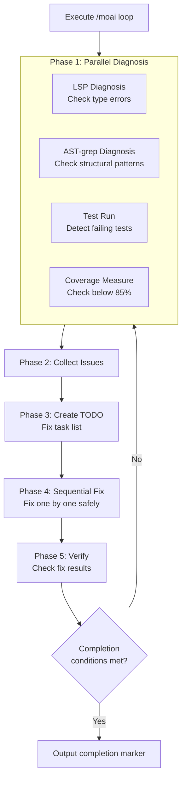
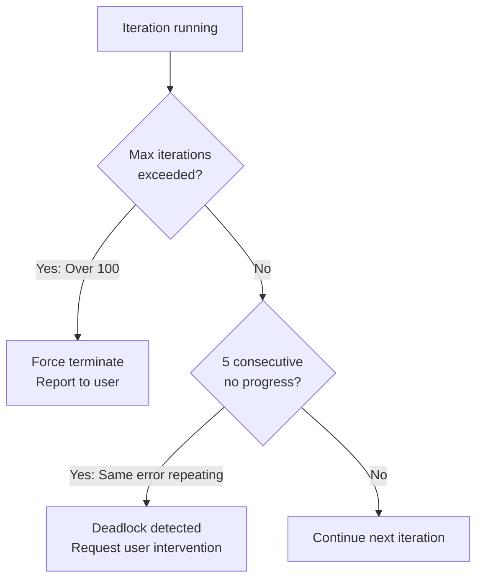
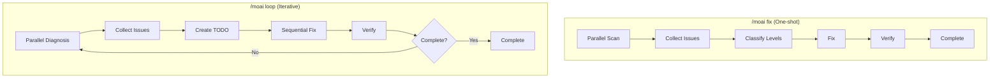
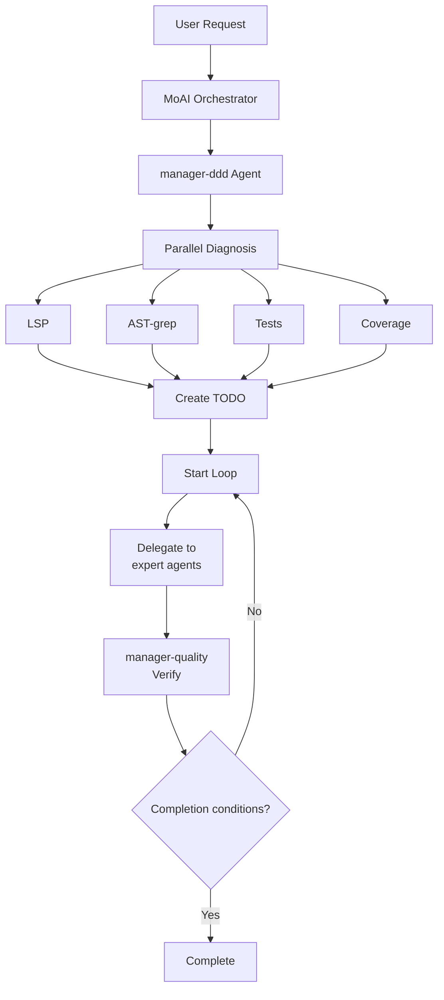

import { Callout } from "nextra/components";

# /moai loop

Autonomous iterative fixing loop command. AI automatically repeats the process of **diagnosing, fixing, and verifying** problems until **all errors are resolved**.

<Callout type="tip">
  **One-line summary**: `/moai loop` is the "Ralph Engine" autonomous fixing engine.
  It repeats **diagnose → fix → verify** to automatically resolve all code problems.
</Callout>

## Overview

When writing code, multiple issues can occur simultaneously: type errors, lint warnings, test failures. Instead of fixing each manually, run `/moai loop` and AI will **automatically iteratively fix** all problems.

Unlike `/moai fix` which fixes **only once**, `/moai loop` continues until **completion conditions are met**.

## Usage

```bash
> /moai loop
```

When executed without separate arguments, it automatically finds and fixes all problems in the current project.

## Supported Flags

| Flag                                   | Description                             | Example                          |
| -------------------------------------- | --------------------------------------- | -------------------------------- |
| `--max N` (or `--max-iterations`)      | Limit maximum iterations (default 100) | `/moai loop --max 10`            |
| `--path <path>`                        | Target only specific path               | `/moai loop --path src/auth/`     |
| `--stop-on {level}`                    | Stop at specific level or above        | `/moai loop --stop-on 3`          |
| `--auto` (or `--auto-fix`)             | Enable auto-fix (default Level 1)      | `/moai loop --auto-fix`           |
| `--sequential` (or `--seq`)            | Sequential diagnosis instead of parallel| `/moai loop --sequential`       |
| `--errors` (or `--errors-only`)        | Fix errors only, skip warnings         | `/moai loop --errors`             |
| `--coverage` (or `--include-coverage`) | Include coverage (default 85%)         | `/moai loop --coverage`           |
| `--memory-check`                       | Enable memory pressure detection       | `/moai loop --memory-check`       |
| `--resume ID` (or `--resume-from`)     | Resume from snapshot                  | `/moai loop --resume latest`      |

### --max Flag

Limit the number of iterations:

```bash
# Maximum 10 iterations only
> /moai loop --max 10
```

<Callout type="warning">
  To prevent infinite loops, the default is 100 iterations. Most cases complete within 10 iterations.
</Callout>

## Execution Process

`/moai loop` goes through the following process each iteration:



### Phase 1: Parallel Diagnosis

Four diagnostic tools run **simultaneously** to quickly identify all project problems:

| Diagnostic Tool | Checks | Example Problems Found |
| --------------- | ------- | ------------------------ |
| **LSP**         | Type system | Type mismatches, undefined variables, wrong arguments |
| **AST-grep**    | Code structure | Unused imports, dangerous patterns, code smells |
| **Tests**       | Test execution | Failing tests, errors occurring |
| **Coverage**    | Coverage measurement | Modules below 85% |

<Callout type="info">
  **What is parallel diagnosis?** Running 4 diagnostics **simultaneously** is about 4x faster than running them sequentially. Collected problems are merged into a single list.
</Callout>

### Phase 2: Issue Collection

Organizes all problems found by parallel diagnosis into a single list:

```
Discovered Issues (example):
  [LSP] src/auth/service.py:42 - Cannot assign "int" to "str" type
  [LSP] src/auth/router.py:15 - Undefined type "User"
  [AST] src/utils/helper.py:3 - Unused import "os"
  [TEST] tests/test_auth.py::test_login - AssertionError
  [COV] src/auth/service.py - Coverage 62% (target 85%)
```

### Phase 3: TODO Creation

Automatically creates fix task list (TODO) based on collected issues. Considers **dependency order** to determine fix sequence.

For example, if a type definition is missing, that type is added first before fixing code that uses it.

### Phase 4: Sequential Fix

Fixes items in the TODO list **one by one sequentially**. Parallel fixing could cause conflicts, so processes safely one at a time.

### Phase 5: Verification

After fixes, runs diagnosis again to verify problems are resolved. If problems remain, returns to Phase 1 and repeats.

## Loop Prevention Mechanism

Two safety measures prevent infinite loops:



| Safety Measure       | Condition             | Action                                           |
| -------------------- | --------------------- | ------------------------------------------------ |
| **Max iteration limit** | Over 100 iterations   | Force terminate loop and report current state    |
| **No progress detection** | Same error 5 times consecutively | Consider deadlock and request user intervention |

<Callout type="warning">
  **When deadlock occurs?** If AI fails to fix the same error 5 times consecutively, it automatically stops and requests user intervention. In this case, please check the error content directly or provide hints.
</Callout>

## Completion Conditions

`/moai loop` terminates the loop when all **three conditions** are met:

| Condition            | Criteria         | Description                              |
| -------------------- | ---------------- | ---------------------------------------- |
| **zero_errors**      | 0 LSP errors      | No type errors or syntax errors          |
| **tests_pass**       | All tests pass   | No failing tests                         |
| **coverage >= 85%**  | Coverage 85%+    | Meets TRUST 5 quality standards           |

## Difference from /moai fix

`/moai fix` and `/moai loop` look similar but have key differences:



| Comparison Item | `/moai fix`           | `/moai loop`            |
| ---------------- | --------------------- | ----------------------- |
| **Execution Count**| Once                  | Repeats until complete  |
| **Goal**          | Fix currently visible errors | Completely resolve all errors |
| **Level Classification** | Yes (Level 1-4)  | No (handle all issues)   |
| **Approval Needed**| Level 3-4 needs approval| Handles autonomously     |
| **Time Required**  | Short (1-2 min)       | Can be long (5-30 min)   |
| **Usage Timing**   | Simple fixes          | After large refactoring  |

<Callout type="tip">
  **Selection Guide**: Use `/moai fix` for quick resolution when there are few errors. `/moai loop` is more effective when there are many errors or interconnected problems.
</Callout>

## Agent Delegation Chain

The agent delegation flow for the `/moai loop` command:



**Agent Roles:**

| Agent                | Role        | Main Tasks          |
| -------------------- | ----------- | ------------------- |
| **MoAI Orchestrator** | Loop coordination |
| **manager-ddd**       | Loop management | Create TODO, coordinate fixes |
| **expert-\***         | Execute fixes | Actual code modification |
| **manager-quality**   | Quality verification | Check completion conditions |

## Practical Examples

### Situation: Multiple errors after DDD implementation

After implementing code with `/moai run`, assume multiple errors remain.

```bash
# Check current status
$ pytest --tb=short
# 3 test failures
# Coverage: 71%

# Check LSP errors
# 5 type errors, 2 undefined references

# Run loop
> /moai loop
```

**Execution Log:**

```
[Iteration 1/100]
  Diagnosis: 5 LSP errors, 3 test failures, coverage 71%
  TODO: 7 fix tasks created
  Fix: Resolved 5 type errors
  Verify: 0 LSP errors, 2 test failures, coverage 71%

[Iteration 2/100]
  Diagnosis: 2 test failures, coverage 71%
  TODO: 2 fix tasks created
  Fix: 2 test logic fixes
  Verify: 0 LSP errors, 0 test failures, coverage 74%

[Iteration 3/100]
  Diagnosis: coverage 74% (target 85%)
  TODO: 3 test addition tasks created
  Fix: Add missing test cases
  Verify: 0 LSP errors, 0 test failures, coverage 87%

Completion conditions met!
  - LSP errors: 0
  - Tests: All passed
  - Coverage: 87%

DONE
```

In this example, `/moai loop` resolved all problems in just 3 iterations. Manually, you would have had to check and fix each error one by one.

## Frequently Asked Questions

### Q: What if `/moai loop` runs too long?

You can limit iterations with the `--max` flag, or interrupt with `Ctrl+C`. Current state is saved so you can resume later.

### Q: What if I want to fix only specific error types?

Use the `--stop-on` flag:

```bash
# Stop at Level 3 or above (handle security, logic errors manually)
> /moai loop --stop-on 3
```

### Q: What's the difference between `/moai loop` and `/moai`?

`/moai loop` is only responsible for the **error fixing loop**. `/moai` automatically performs the **entire workflow** from SPEC creation to implementation and documentation.

### Q: What if the loop falls into deadlock?

If AI repeats the same error 5 times consecutively, it automatically stops and requests user intervention. In this case, please check the code directly or provide hints.

## Related Documents

- [/moai fix - One-shot Auto Fix](/utility-commands/moai-fix)
- [/moai - Full Autonomous Automation](/utility-commands/moai)
- [TRUST 5 Quality System](/core-concepts/trust-5)
- [Domain-Driven Development](/core-concepts/ddd)