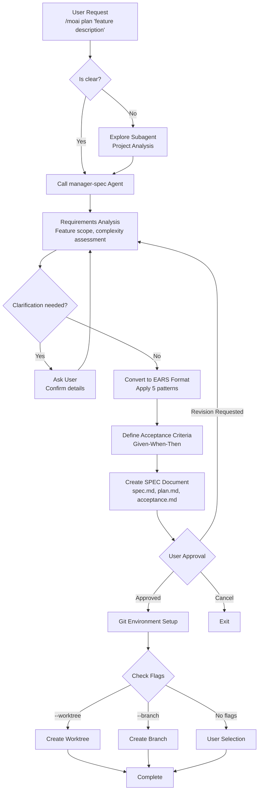
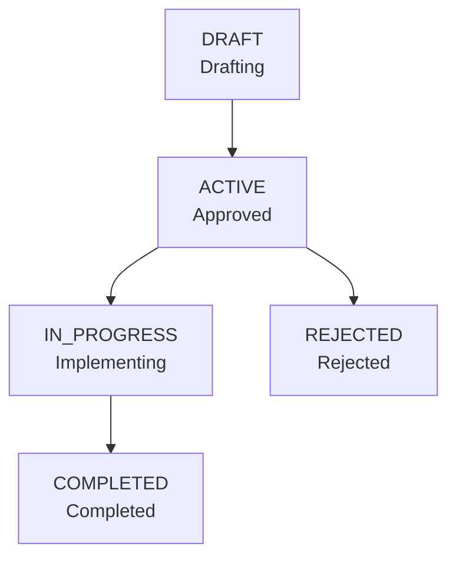

import { Callout } from "nextra/components";

# /moai plan

Creates clear SPEC documents in EARS format, turning your conversations with AI into permanent requirement documents.

<Callout type="info">

**New Command Format**

`/moai:1-plan` has been changed to `/moai plan`.

</Callout>

## Overview

`/moai plan` is the **Phase 1 (Plan)** command of the MoAI-ADK workflow. It converts natural language feature requests into structured **SPEC** documents in **EARS** (Easy Approach to Requirements Syntax) format. Internally, the **manager-spec** agent analyzes requirements and generates unambiguous specifications.

<Callout type="info">

**Why do you need a SPEC?**

The biggest problem with **Vibe Coding** is **context loss**.

When your session with AI ends, **all previous discussions disappear**. When you exceed the token limit, **old conversations get cut off**. When you resume work the next day, **you don't remember yesterday's decisions**.

**SPEC documents solve this problem.**

They **save requirements to files** for permanent preservation. They structure them **unambiguously** in EARS format. Even if the session is interrupted, you can **continue working** just by reading the SPEC.

</Callout>

## Usage

Enter the following in the Claude Code conversation:

```bash
> /moai plan "Description of the feature you want to implement"
```

**Usage Examples:**

```bash
# Simple feature
> /moai plan "User login feature"

# Detailed feature description
> /moai plan "JWT-based user authentication: login, signup, token refresh API"

# Refactoring request
> /moai plan "Refactor legacy authentication system to JWT-based"
```

## Supported Flags

| Flag                | Description                        | Example                                |
| ------------------- | ---------------------------------- | -------------------------------------- |
| `--worktree`        | Auto-create worktree (highest)     | `/moai plan "feature" --worktree`      |
| `--branch`          | Create traditional branch          | `/moai plan "feature" --branch`        |
| `--resume SPEC-XXX` | Resume interrupted SPEC work       | `/moai plan --resume SPEC-AUTH-001`    |
| `--team`            | Force Agent Teams mode             | `/moai plan "feature" --team`          |
| `--solo`            | Force sub-agent mode               | `/moai plan "feature" --solo`          |
| `--seq`             | Sequential diagnosis instead of parallel | `/moai plan "feature" --seq`    |
| `--ultrathink`      | Enable Sequential Thinking MCP     | `/moai plan "feature" --ultrathink`    |

### Flag Priority

When multiple flags are specified, they are applied in the following order:

1. **--worktree** (highest): Creates an independent Git worktree
2. **--branch** (alternative): Creates a traditional feature branch
3. **No flags** (default): Create SPEC only, create branch based on user selection

### --worktree Flag

Creates an **independent Git worktree** along with the SPEC to prepare for parallel development:

```bash
> /moai plan "Implement payment system" --worktree
```

When using this option:

1. Creates a SPEC document
2. Commits the SPEC (required for worktree creation)
3. Creates a worktree on the `feature/SPEC-{ID}` branch
4. Allows independent development without affecting main code

<Callout type="tip">
  The `--worktree` option is useful when **developing multiple features simultaneously**. Each SPEC works in an independent worktree, so they don't conflict with each other.
</Callout>

## EARS Format Requirements

SPEC documents define requirements using **EARS** (Easy Approach to Requirements Syntax) format. There are 5 patterns, and the manager-spec agent automatically converts natural language to the appropriate pattern.

| Pattern         | Format                          | Purpose              | Example                                                |
| --------------- | ------------------------------- | -------------------- | ------------------------------------------------------ |
| **Ubiquitous**  | "The system SHALL ~"            | Always-applied rules | "The system SHALL log all API requests"                |
| **Event-driven**| "WHEN ~, THEN the system SHALL ~"| Event response       | "WHEN logging in, THEN the system SHALL issue a JWT"   |
| **State-driven**| "WHILE ~, the system SHALL ~"   | State-based behavior | "WHILE logged in, the system SHALL maintain session"   |
| **Unwanted**    | "The system SHALL NOT ~"        | Prohibitions         | "The system SHALL NOT store passwords in plain text"   |
| **Optional**    | "WHERE PRACTICAL, the system SHALL ~" | Optional features  | "WHERE PRACTICAL, the system SHALL support 2FA"        |

<Callout type="tip">
  You don't need to memorize EARS format. The manager-spec agent **automatically converts** natural language. Just describe the feature you want naturally.
</Callout>

## Execution Process

The process that `/moai plan` performs internally:



**Key Points:**

- If the request is unclear, the **Explore subagent** analyzes the project
- If requirements are unclear, the manager-spec agent **asks the user additional questions**
- Automatically generates **Given-When-Then format acceptance criteria** for all requirements
- Generated SPEC documents are finalized after receiving **user approval**

## SPEC Creation Phases

### Phase 1A: Project Analysis (Optional)

Executed when the request is ambiguous or project situation needs to be understood:

| Execution Condition         | Skip Condition             |
| --------------------------- | -------------------------- |
| Unclear request             | Clear SPEC title           |
| Need to find existing files/patterns | Resume scenario        |
| Project status uncertain    | Existing SPEC context exists |

### Phase 1B: SPEC Planning

The **manager-spec** agent performs the following tasks:

- Project document analysis (product.md, structure.md, tech.md)
- Propose 1-3 SPEC candidates and naming
- Check for duplicate SPECs (.moai/specs/)
- Design EARS structure
- Identify implementation plan and technical constraints
- Verify library versions (stable only, exclude beta/alpha)

### Phase 1.5: Pre-validation Gate

Prevents common errors before SPEC creation:

**Step 1 - Document Type Classification:**

- Detect SPEC, Report, Documentation keywords
- Route reports to .moai/reports/
- Route documentation to .moai/docs/

**Step 2 - SPEC ID Validation (All checks must pass):**

- **ID Format**: `SPEC-domain-number` pattern (e.g., `SPEC-AUTH-001`)
- **Domain Name**: Approved domain list (AUTH, API, UI, DB, REFACTOR, FIX, UPDATE, PERF, TEST, DOCS, INFRA, DEVOPS, SECURITY, etc.)
- **ID Uniqueness**: Check for duplicates in .moai/specs/
- **Directory Structure**: Must create directory, flat files prohibited

**Compound Domain Rule:** Maximum 2 domains recommended (e.g., UPDATE-REFACTOR-001), maximum 3 allowed.

### Phase 2: SPEC Document Creation

Three files are created simultaneously:

**spec.md:**

- YAML frontmatter (7 required fields: id, version, status, created, updated, author, priority)
- HISTORY section (immediately after frontmatter)
- Complete EARS structure (5 requirement types)
- Content written in conversation_language

**plan.md:**

- Implementation plan with task decomposition
- Technology stack specification and dependencies
- Risk analysis and mitigation strategies

**acceptance.md:**

- Minimum 2 Given/When/Then scenarios
- Edge case test scenarios
- Performance and quality gate criteria

**Quality Constraints:**

- Requirement modules: Maximum 5 per SPEC
- Acceptance criteria: Minimum 2 Given/When/Then scenarios
- Technical terms and function names remain in English

### Phase 3: Git Environment Setup (Conditional)

**Execution Condition:** Phase 2 complete AND one of the following:

- --worktree flag provided
- --branch flag provided or user selected branch creation
- Branch creation allowed in settings (git_strategy config)

**Skip Point:** develop_direct workflow, no flags and selected "use current branch"

## Output

SPEC documents are saved in the `.moai/specs/` directory:

```
.moai/
└── specs/
    └── SPEC-AUTH-001/
        ├── spec.md          # EARS requirements
        ├── plan.md          # Implementation plan
        └── acceptance.md     # Acceptance criteria
```

**Basic structure of SPEC document:**

```yaml
---
id: SPEC-AUTH-001
version: 1.0.0
status: ACTIVE
created: 2026-01-28
updated: 2026-01-28
author: Development Team
priority: HIGH
---
```

## SPEC Status Management

SPEC documents have the following status lifecycle:



| Status       | Description                  | Can run `/moai run` |
| ------------ | ---------------------------- | ------------------- |
| `DRAFT`      | Still being drafted          | No                  |
| `ACTIVE`     | Approved, waiting for impl   | **Yes**             |
| `IN_PROGRESS`| Currently being implemented  | Yes (resume)        |
| `COMPLETED`  | Implementation and verification complete | No  |
| `REJECTED`   | Rejected, needs rewriting    | No                  |

## Practical Examples

### Example: Creating JWT Authentication SPEC

**Step 1: Execute Command**

```bash
> /moai plan "JWT-based user authentication system: signup, login, token refresh"
```

**Step 2: manager-spec Asks Questions** (if needed)

The manager-spec agent may ask questions to confirm details:

- "What is the minimum password length?"
- "What should the token expiration time be?"
- "Does it include social login?"

**Step 3: SPEC Document Creation Result**

A SPEC document with the following structure is created:

```yaml
---
id: SPEC-AUTH-001
title: JWT-based user authentication system
priority: HIGH
status: ACTIVE
---
```

```markdown
# Requirements (EARS Format)

## Ubiquitous

- The system SHALL hash all passwords with bcrypt for storage
- The system SHALL log all authentication requests

## Event-driven

- WHEN logging in with valid credentials, THEN the system SHALL issue a JWT access token (1 hour) and refresh token (7 days)

## Unwanted

- The system SHALL NOT store passwords in plain text
- The system SHALL NOT allow API access with expired tokens
```

**Step 4: Git Environment Setup After User Approval**

```bash
# When using --worktree flag
> /moai plan "JWT authentication" --worktree

# Result:
# 1. Create SPEC document (.moai/specs/SPEC-AUTH-001/)
# 2. Commit SPEC (feat(spec): Add SPEC-AUTH-001)
# 3. Create worktree (.git/worktrees/SPEC-AUTH-001)
# 4. Display worktree path
```

**Step 5: Execute `/clear` Then Move to Implementation Phase**

```bash
# Clear tokens
> /clear

# Start implementation
> /moai run SPEC-AUTH-001
```

## Frequently Asked Questions

### Q: Can I manually edit SPEC documents?

Yes, you can directly edit the `.moai/specs/SPEC-XXX/spec.md` file. If you add requirements or modify acceptance criteria and then run `/moai run`, the changes will be reflected.

### Q: Can I write code directly without a SPEC?

You can write code directly in Claude Code, but working without a SPEC means you lose context whenever the session ends. **For complex features, creating a SPEC first is more efficient.**

### Q: What rules are used to generate SPEC IDs?

It follows the format `SPEC-domain-number` (e.g., `SPEC-AUTH-001`)

- `SPEC-AUTH-001`: First authentication-related SPEC
- `SPEC-PAYMENT-002`: Second payment-related SPEC

The domain is automatically determined by manager-spec based on the feature area.

### Q: What's the difference between `/moai plan` and `/moai`?

`/moai plan` is only responsible for **SPEC document creation**. `/moai` automatically performs the **entire workflow** from SPEC creation to implementation and documentation.

### Q: What's the difference between --worktree and --branch?

**--worktree** creates an independent working directory for a completely isolated environment. **--branch** creates a new branch in the current repository. If developing multiple features simultaneously, --worktree is recommended.

## Related Documents

- [SPEC-Based Development](/core-concepts/spec-based-dev) - Detailed explanation of EARS format
- [/moai run](./moai-2-run) - Next step: DDD implementation
- [/moai sync](./moai-3-sync) - Final step: Documentation synchronization