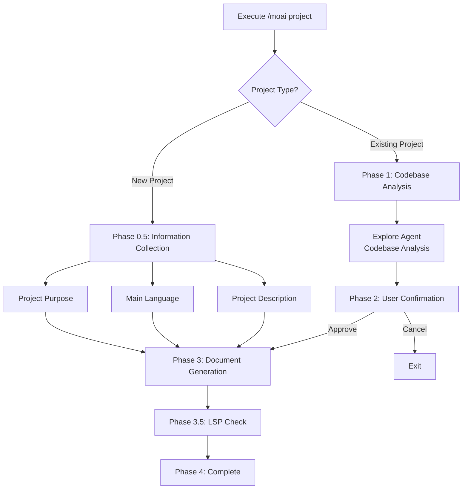
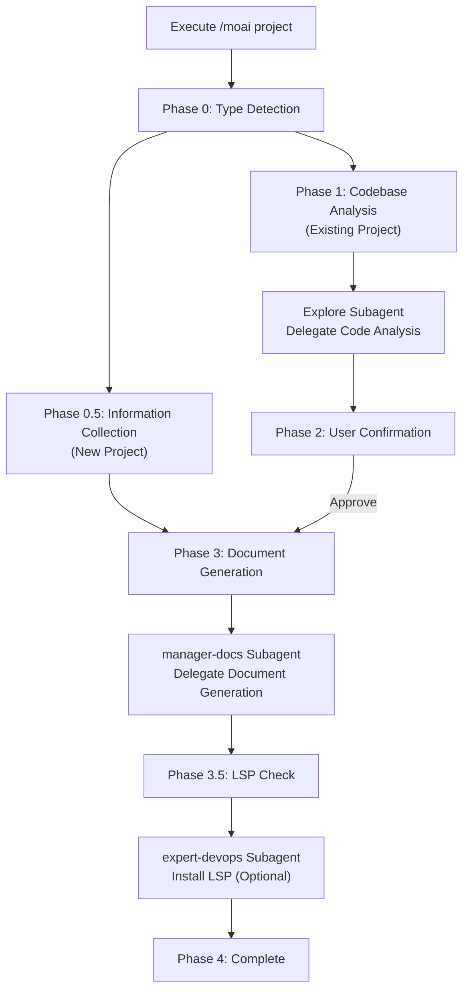

import { Callout } from "nextra/components";

# /moai project

Analyzes your project's codebase to automatically generate foundational documents that AI needs to understand your project.

<Callout type="info">

**New Command Format**

`/moai:0-project` has been changed to `/moai project`.

</Callout>

## Overview

`/moai project` is the **project document generation** command of the MoAI-ADK workflow. It analyzes the project's source code, configuration files, and directory structure to help AI quickly understand the project.

<Callout type="tip">
**Why do you need project documents?**

Claude Code knows nothing about your project when starting a new conversation.
Through documents created by `/moai project`, AI will understand:

- What the project **does** (product.md)
- How the code **is structured** (structure.md)
- What **technologies are used** (tech.md)

Only with these documents can AI perform accurate tasks appropriate for the project context in subsequent commands like `/moai plan` and `/moai run`.

</Callout>

## Usage

```bash
> /moai project
```

When executed without separate arguments or options, it automatically analyzes the current project directory.

## Generated Documents

`/moai project` creates 3 documents under the `.moai/project/` directory:

```
.moai/
└── project/
    ├── product.md      # Project overview
    ├── structure.md    # Directory structure analysis
    └── tech.md         # Technology stack information
```

### product.md - Project Overview

Contains the core information of the project:

| Item            | Description                      | Example                           |
| --------------- | -------------------------------- | --------------------------------- |
| **Project Name** | Official name of the project     | "MoAI-ADK"                         |
| **Description**  | What the project does            | "AI-based development toolkit"     |
| **Target Users** | Who the project is for           | "Developers using Claude Code"     |
| **Key Features** | List of main features            | "SPEC creation, DDD implementation, documentation automation" |
| **Project Status**| Current development stage        | "v1.1.0, Production"              |

### structure.md - Directory Structure

Analyzes the file and folder composition of the project:

| Item               | Description                                      |
| ------------------ | ------------------------------------------------ |
| **Directory Tree** | Visualizes the entire folder structure           |
| **Main Folder Purpose** | Describes the role of each folder        |
| **Module Composition** | Relationships between core modules        |
| **Entry Points**    | Program start files (main.py, index.ts, etc.) |

### tech.md - Technology Stack

Organizes technology information used in the project:

| Item              | Description             | Example                          |
| ----------------- | ------------------------ | -------------------------------- |
| **Programming Languages** | Languages and versions used | "Python 3.12, TypeScript 5.5" |
| **Frameworks**     | Major frameworks         | "FastAPI 0.115, React 19"         |
| **Databases**     | DB types and ORM         | "PostgreSQL 16, SQLAlchemy"       |
| **Build Tools**   | Build and package management | "Poetry, Vite"               |
| **Deployment Environment** | Hosting and CI/CD    | "Docker, GitHub Actions"          |

## Execution Process

`/moai project` runs different workflows depending on the project type.

### New Project vs Existing Project



## Detailed Workflow

### Phase 0: Project Type Detection

First, check the project type.

<Callout type="warning">
  **[HARD] Rule**: Must ask project type first. Before analyzing codebase, confirm project situation with the user.
</Callout>

**Question**: What type of project is this?

| Option            | Description                                                   |
| ----------------- | ------------------------------------------------------------ |
| **New Project**   | Project starting from scratch. Proceeds with information collection format |
| **Existing Project** | Project with existing code. Automatically analyzes code    |

### Phase 0.5: New Project Information Collection

For new projects, collect the following information:

**Question 1 - Project Purpose**:

- **Web Application**: Frontend, backend, or full-stack web app
- **API Service**: REST API, GraphQL, or microservices
- **CLI Tool**: Command-line utility or automation tool
- **Library/Package**: Reusable code library or SDK

**Question 2 - Main Language**:

- **Python**: Backend, data science, automation
- **TypeScript/JavaScript**: Web, Node.js, frontend
- **Go**: High-performance services, CLI tools
- **Other**: Rust, Java, Ruby, etc. (detailed questions)

**Question 3 - Project Description** (free input):

- Project name
- Main features or goals
- Target users

Based on collected information, generate initial documents and move to Phase 4.

### Phase 1: Codebase Analysis (Existing Project)

For existing projects, delegate analysis to the **Explore agent**.

<Callout type="info">
  **Agent Delegation**: Codebase analysis is performed by the Explore subagent. MoAI only collects results and presents them to the user.
</Callout>

**Analysis Goals**:

- **Project Structure**: Main directories, entry points, architecture patterns
- **Technology Stack**: Languages, frameworks, core dependencies
- **Core Features**: Main features and business logic locations
- **Build System**: Build tools, package managers, scripts

**Explore Agent Output**:

- Detected primary language
- Identified frameworks
- Architecture patterns (MVC, Clean Architecture, Microservices, etc.)
- Main directory mapping (source, tests, config, docs)
- Dependency catalog
- Entry point identification

### Phase 2: User Confirmation

Show analysis results to the user and get approval.

**Displayed Content**:

- Detected language
- Frameworks
- Architecture
- Core feature list

**Options**:

- **Proceed**: Continue with document generation
- **Detailed Review**: Review analysis details first
- **Cancel**: Adjust project setup

### Phase 3: Document Generation

Delegate document generation to the **manager-docs agent**.

**Passed Content**:

- Phase 1 analysis results (or Phase 0.5 user input)
- Phase 2 user confirmation
- Output directory: `.moai/project/`
- Language: conversation_language from config

**Generated Files**:

| File          | Content                                                                     |
| ------------- | --------------------------------------------------------------------------- |
| **product.md** | Project name, description, target users, key features, use cases           |
| **structure.md**| Directory tree, purpose of each directory, key file locations, module composition |
| **tech.md**   | Technology stack overview, framework selection rationale, development environment requirements, build/deployment configuration |

### Phase 3.5: Development Environment Check

Checks if appropriate LSP servers are installed for the detected technology stack.

**Language-specific LSP Mapping** (16 languages supported):

| Language               | LSP Server                   | Check Command                      |
| ---------------------- | ---------------------------- | ---------------------------------- |
| Python                 | pyright or pylsp             | `which pyright`                    |
| TypeScript/JavaScript  | typescript-language-server   | `which typescript-language-server` |
| Go                     | gopls                        | `which gopls`                      |
| Rust                   | rust-analyzer                | `which rust-analyzer`              |
| Java                   | jdtls (Eclipse JDT)          | -                                  |
| Ruby                   | solargraph                   | `which solargraph`                 |
| PHP                    | intelephense                 | Check via npm                      |
| C/C++                  | clangd                       | `which clangd`                     |
| Kotlin                 | kotlin-language-server       | -                                  |
| Scala                  | metals                       | -                                  |
| Swift                  | sourcekit-lsp                | -                                  |
| Elixir                 | elixir-ls                    | -                                  |
| Dart/Flutter           | dart language-server         | Built into Dart SDK                |
| C#                     | OmniSharp or csharp-ls       | -                                  |
| R                      | languageserver (R package)   | -                                  |
| Lua                    | lua-language-server          | -                                  |

**Options when LSP Not Installed**:

- **Continue without LSP**: Proceed to completion
- **Show Installation Guide**: Display setup guide for detected language
- **Auto Install Now**: Install via expert-devops agent (requires confirmation)

### Phase 4: Completion

Displays completion message in the user's language.

- List of generated files
- Location: `.moai/project/`
- Status: Success or partial completion

**Next Step Options**:

- **Write SPEC**: Define feature specification with `/moai plan`
- **Review Documents**: Open and review generated files
- **Start New Session**: Clear context and start fresh

## When to Use?

### Must Run

- **First time applying MoAI-ADK to a new project** - Foundation documents needed for AI to understand the project
- **Introducing MoAI-ADK to an existing project** - Automatically generates documents even for projects with existing code

### Good to Run Again

- **After major project structure changes** - When directory structure or technology stack has changed
- **After introducing new major technologies** - e.g., database changes, framework additions
- **When new team members join the project** - Onboarding based on latest documents

<Callout type="warning">
  `/moai project` **overwrites** existing documents. If you have manual modifications, back up before running.
</Callout>

## Practical Examples

### Example 1: Starting with a New Project

#### Step 1: Execute Command

First, initialize the project in the terminal and run Claude Code.

```bash
# Initialize project in terminal
$ moai init my-api-project
$ cd my-api-project

# Generate project documents in Claude Code
> /moai project
```

#### Step 2: Select Project Type

Since this is a new project, select "New Project".

```bash
AI: Please select the project type:
1. New Project (starting from scratch)
2. Existing Project (code exists)

User: 1
```

AI switches to new project information collection mode.

#### Step 3: Select Project Purpose

Select the purpose of the project.

```bash
AI: Please select the project purpose:
1. Web Application
2. API Service
3. CLI Tool
4. Library/Package

User: 2
```

Select API Service to specify this is a REST API server project.

#### Step 4: Select Main Language

Select the programming language to use.

```bash
AI: Please select the main language:
1. Python
2. TypeScript/JavaScript
3. Go
4. Other

User: 1
```

Select Python to configure a backend API server development environment.

#### Step 5: Enter Project Details

Enter detailed information about the project.

```bash
AI: Please describe the project (name, goals, target users):

User: REST API server. Has user authentication and data management features. Tool for developers.
```

This information is used to create the `product.md` document.

#### Step 6: Document Generation Complete

AI automatically generates documents based on collected information.

```bash
[Generating documents...]

Complete! 3 documents have been created in the .moai/project/ directory.
```

Generated documents:

- `.moai/project/product.md` - Project overview
- `.moai/project/structure.md` - Directory structure
- `.moai/project/tech.md` - Technology stack

### Example 2: Introducing MoAI-ADK to Existing Project

#### Step 1: Navigate to Project Directory and Initialize

Navigate to a project with existing code and initialize MoAI-ADK.

```bash
# Navigate to existing project directory
$ cd ~/projects/existing-api

# Initialize MoAI-ADK
$ moai init

# Generate project documents in Claude Code
> /moai project
```

#### Step 2: Select Project Type

Select that this is an existing project.

```bash
AI: Please select the project type:
1. New Project (starting from scratch)
2. Existing Project (code exists)

User: 2
```

Proceed with existing project mode to start codebase analysis.

#### Step 3: Automatic Codebase Analysis

Explore agent automatically analyzes the project.

```bash
[Explore agent analyzing codebase...]

Analysis Results:
- Language: Python 3.12
- Framework: FastAPI 0.115
- Database: PostgreSQL 16
- Architecture: Clean Architecture
- Core Features:
  * User authentication
  * Data CRUD
  * API endpoint management
```

The agent automatically identifies project structure, dependencies, and patterns.

#### Step 4: Confirm Analysis Results

Review analysis results and approve document generation.

```bash
Do you want to generate documents with this analysis?
1. Proceed
2. Detailed Review
3. Cancel

User: 1
```

If the analysis is accurate, select "Proceed" to continue with document generation.

#### Step 5: Document Generation

manager-docs agent generates documents based on analysis results.

```bash
[manager-docs agent generating documents...]

Complete! The following files have been created:
- .moai/project/product.md
- .moai/project/structure.md
- .moai/project/tech.md
```

Each document documents a different aspect of the project.

#### Step 6: LSP Check and Completion

Verify that the development environment is properly configured.

```bash
LSP server 'pyright' is installed.

Please select the next step:
1. Write SPEC (/moai plan)
2. Review Documents
3. Start New Session
```

Since the LSP server is installed, you can start development immediately.

### Example 3: Workflow Progression After Project Document Generation

#### Step 1: Generate Project Documents (First Time Only)

Generate documents when first setting up the project.

```bash
> /moai project
```

This step only needs to be done once per project.

#### Step 2: Create SPEC

Once project documents are generated, AI understands the project.

```bash
> /moai plan "Implement user authentication feature"
```

Since AI already knows the project's technology stack and structure, it can create more accurate SPECs.

<Callout type="tip">
  `/moai project` typically only needs to be run **1-2 times** per project. You don't need to run it every time; only run it again when the project structure changes significantly.
</Callout>

## Agent Chain



## Frequently Asked Questions

### Q: What happens if I run `/moai plan` without project documents?

You can create a SPEC, but AI may make **inaccurate technical judgments** without knowing the project's technology stack or structure. Always recommend running `/moai project` first.

### Q: Do you analyze private code too?

`/moai project` only operates **locally**. Code is not transmitted to external servers, and generated documents are also stored locally in the `.moai/project/` directory.

### Q: Does it work with monorepo projects?

Yes, monorepo structure is also supported. Running from the root directory analyzes the entire project structure.

### Q: What happens if there's no LSP server?

Document generation proceeds even without an LSP server. However, code quality diagnosis in the subsequent `/moai run` phase may be limited. Phase 3.5 provides LSP installation guidance.

## Related Documents

- [Quick Start](/getting-started/quickstart) - Complete workflow tutorial
- [/moai plan](./moai-1-plan) - Next step: SPEC document creation
- [SPEC-based Development](/core-concepts/spec-based-dev) - Detailed SPEC methodology explanation
- [Subagent Catalog](/advanced/agent-guide) - Explore, manager-docs agent details