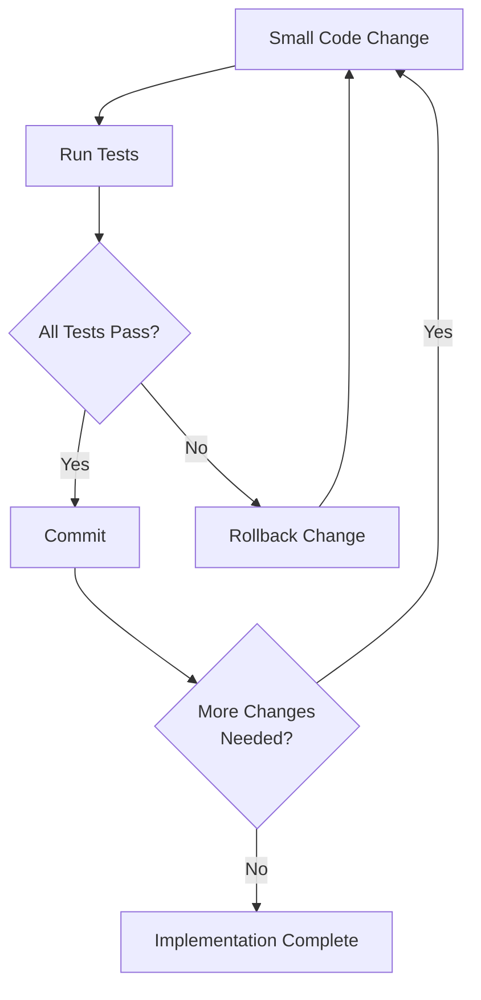
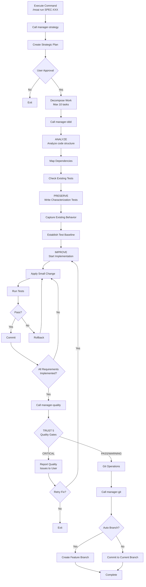

import { Callout } from "nextra/components";

# /moai run

Implements code using DDD (Domain-Driven Development) methodology based on SPEC documents.

<Callout type="info">

**New Command Format**

`/moai:2-run` has been changed to `/moai run`.

</Callout>

## Overview

`/moai run` is the **Phase 2 (Run)** command of the MoAI-ADK workflow. It reads the SPEC document created in Phase 1 and safely implements code through the **ANALYZE-PRESERVE-IMPROVE** cycle without breaking existing functionality. Internally, the **manager-ddd** agent manages the entire process.

<Callout type="info">
**Understanding DDD through Home Renovation**

The DDD ANALYZE-PRESERVE-IMPROVE cycle is like **home renovation**:

| Phase        | Analogy            | Actual Work                       |
| ------------ | ------------------ | --------------------------------- |
| **ANALYZE**  | Home inspection    | Understand current code structure and problems |
| **PRESERVE** | Take photos        | Record existing behavior with characterization tests |
| **IMPROVE**  | Remodel room by room| Make small improvements while tests pass |

Just as demolishing the entire house at once is dangerous, it's safer to **change code gradually while verifying each time**.

</Callout>

## Usage

Pass the SPEC ID created in the Plan phase as an argument:

```bash
# Must run /clear after Plan phase completion
> /clear

# Start implementation by specifying SPEC ID
> /moai run SPEC-AUTH-001
```

<Callout type="warning">
  Make sure to run `/clear` before executing `/moai run`. You need to clean up tokens used in the Plan phase to fully utilize **200K tokens** in the Run phase.
</Callout>

## Supported Flags

| Flag                | Description                  | Example                             |
| ------------------- | ---------------------------- | ----------------------------------- |
| `--resume SPEC-XXX` | Resume interrupted implementation | `/moai run --resume SPEC-AUTH-001` |
| `--team`            | Force Agent Teams mode       | `/moai run SPEC-AUTH-001 --team`     |
| `--solo`            | Force sub-agent mode         | `/moai run SPEC-AUTH-001 --solo`     |

**Resume Function:**

When re-executing, continues work from the last successful phase checkpoint.

## DDD Cycle

`/moai run` executes three phases in order: **ANALYZE -> PRESERVE -> IMPROVE**. Let's look at what happens in each phase in detail.

### 1. ANALYZE (Analyze)

Read existing code and compare with SPEC requirements to understand what needs to be done.

**Analysis Items:**

| Item        | Description                 | Example                                   |
| ----------- | -------------------------- | ----------------------------------------- |
| Code Structure | Files, modules, dependencies | "auth.py depends on user_service.py"      |
| Domain Boundaries | Scope of business logic   | "Separate authentication and user domains" |
| Test Status | Existing test coverage     | "Currently 45% coverage"                  |
| Technical Debt | Parts needing improvement  | "SQL Injection vulnerability found"       |

### 2. PRESERVE (Preserve)

Records the current behavior of existing code as **characterization tests**. These tests serve as a **safety net** to ensure existing functionality still works after refactoring.

<Callout type="tip">
**What are Characterization Tests?**

Rather than judging "whether this code is right or wrong," it's about **recording "this is how it currently behaves."**

For example, if an existing login function returns `{"status": "success"}` on success, this behavior is recorded as a test. Later, if you change the code and this test fails, you immediately know that "existing behavior has changed."

</Callout>

### 3. IMPROVE (Improve)

Makes **small changes** to code according to SPEC requirements, running tests each time to verify existing behavior is preserved.

**Core Principle: Small Changes + Verify Each Time**



## Execution Process

The entire process that `/moai run` performs internally:



## Phase-by-Phase Details

### Phase 1: Analysis and Planning

The **manager-strategy** subagent performs the following tasks:

- Complete SPEC document analysis
- Extract requirements and success criteria
- Identify implementation phases and individual tasks
- Determine technology stack and dependency requirements
- Estimate complexity and effort
- Create detailed execution strategy with phased approach

**Output:** Execution plan including plan_summary, requirements list, success_criteria, effort_estimate

### Phase 1.5: Work Decomposition

Decompose approved execution plan into atomic and reviewable tasks:

**Task Structure:**

- **Task ID**: Sequential within SPEC (TASK-001, TASK-002, etc.)
- **Description**: Clear task statement
- **Requirement Mapping**: SPEC requirements satisfied
- **Dependencies**: List of prerequisite tasks
- **Acceptance Criteria**: Method to verify completion

**Constraint:** Maximum 10 tasks per SPEC. If more needed, recommend splitting SPEC.

### Phase 2: DDD Implementation

The **manager-ddd** subagent executes the ANALYZE-PRESERVE-IMPROVE cycle:

**Requirements:**

- Initialize task tracking
- Execute complete ANALYZE-PRESERVE-IMPROVE cycle
- Verify existing tests pass after each transformation
- Create characterization tests for code paths without coverage
- Achieve 85% or higher test coverage

**Output:** files_modified, characterization_tests_created, test_results, behavior_preserved, structural_metrics

### Phase 2.5: Quality Validation

The **manager-quality** subagent performs TRUST 5 validation:

| TRUST 5 Pillar | Validation Items                     |
| -------------- | ------------------------------------ |
| **Tested**     | Tests exist and pass, DDD discipline maintained |
| **Readable**   | Follows project rules, includes documentation |
| **Unified**    | Follows existing project patterns    |
| **Secured**    | No security vulnerabilities, OWASP compliant |
| **Trackable**  | Clear commit messages, supports history analysis |

**Additional Validation:**

- Test coverage 85% or higher
- Behavior preservation: Pass existing tests without changes
- Characterization tests pass: Behavior snapshots match
- Structural improvement: Coupling and cohesion metrics improved

**Output:** trust_5_validation results, coverage_percentage, overall_status (PASS/WARNING/CRITICAL), issues_found

### Phase 3: Git Operations (Conditional)

The **manager-git** subagent performs Git automation:

**Execution Conditions:**

- quality_status is PASS or WARNING
- If git_strategy.automation.auto_branch is true, create feature branch
- If auto_branch is false, commit directly to current branch

### Phase 4: Completion and Guidance

Present the following options to the user:

| Option          | Description                                   |
| --------------- | --------------------------------------------- |
| Document Sync   | Run `/moai sync` to create docs and PR        |
| Implement Other Feature | Run `/moai plan` to create additional SPECs |
| Review Results | Check implementation and test coverage locally |
| Complete        | End session                                   |

## Quality Gates

When implementation is complete, all following quality criteria must be met:

| Item           | Criteria       | Description                              |
| -------------- | -------------- | ---------------------------------------- |
| LSP Errors     | **0**          | No type checker, linter errors           |
| Type Errors    | **0**          | No type errors from pyright, mypy, tsc, etc. |
| Lint Errors    | **0**          | No linter errors from ruff, eslint, etc. |
| Test Coverage  | **85% or higher** | Code test coverage target             |
| Behavior Preservation | **100%**   | All characterization tests pass         |

<Callout type="info">

**Why 85% coverage?**

Reasons for targeting 85% instead of 100%

**100% is unrealistic** and may add meaningless tests. **85% covers most core logic**. The remaining 15% is difficult-to-test code like config files and error handlers.

</Callout>

## Practical Examples

### Example: Implementing SPEC-AUTH-001

**Step 1: SPEC Creation Complete in Plan Phase**

```bash
> /moai plan "JWT-based user authentication: signup, login, token refresh"
# SPEC-AUTH-001 creation complete
```

**Step 2: Clear Tokens Then Start Implementation**

```bash
> /clear
> /moai run SPEC-AUTH-001
```

**Step 3: Tasks Automatically Performed by manager-ddd**

The 4 Phases that manager-ddd agent performs to implement the SPEC.

---

#### Phase 1: Strategic Planning

Analyze the SPEC document and create implementation strategy.

```bash
Phase 1: Strategic Planning
- SPEC document analysis complete
- Extracted 5 requirements
- Decomposed into 7 tasks (TASK-001 ~ TASK-007)
- Estimated complexity: Medium
```

---

#### Phase 1.5: Work Decomposition

Break down implementation work into detailed units.

```bash
Phase 1.5: Work Decomposition
- TASK-001: Define user model
- TASK-002: Password hashing utility
- TASK-003: JWT token generation/validation
- TASK-004: Signup API
- TASK-005: Login API
- TASK-006: Token refresh API
- TASK-007: Input validation middleware
```

---

#### Phase 2: DDD Implementation

Implement safely using the ANALYZE-PRESERVE-IMPROVE cycle.

**ANALYZE Phase** - Understand existing code:

```bash
ANALYZE Phase:
- Existing code structure analysis: src/auth/ (4 files)
- Test coverage check: Currently 32%
- Dependency mapping: bcrypt, PyJWT, SQLAlchemy
```

**PRESERVE Phase** - Protect existing behavior:

```bash
PRESERVE Phase:
- Wrote 12 characterization tests
- Existing behavior capture complete
- Test baseline established: 32%
```

**IMPROVE Phase** - Implement gradually:

```bash
IMPROVE Phase:
- Iteration 1: TASK-001 User model (tests pass)
- Iteration 2: TASK-002 Password hashing (tests pass)
- Iteration 3: TASK-003 JWT tokens (tests pass)
- Iteration 4: TASK-004 Signup API (tests pass)
- Iteration 5: TASK-005 Login API (tests pass)
- Iteration 6: TASK-006 Token refresh (tests pass)
- Iteration 7: TASK-007 Input validation (tests pass)
```

---

#### Phase 2.5: Quality Validation

Validate quality with TRUST 5 pillars.

```bash
Phase 2.5: Quality Validation
- All TRUST 5 pillars passed
- Test coverage: 89%
- LSP errors: 0
- Type errors: 0
- Characterization tests: 12/12 passed
- New tests: 24/24 passed
- Status: PASS
```

---

#### Phase 3: Git Operations

Create commits with Conventional Commits.

```bash
Phase 3: Git Operations
- Branch: feature/SPEC-AUTH-001
- Created 7 commits (Conventional Commits)
```

---

#### Phase 4: Completion

When implementation is complete, guide to the next step.

```bash
Phase 4: Completion
- Implementation complete
- Next step: /moai sync
```

**Step 4: After Implementation Complete, Move to Sync Phase**

```bash
> /clear
> /moai sync SPEC-AUTH-001
```

## Frequently Asked Questions

### Q: What happens to the PRESERVE phase if there's no existing code in a new project?

The PRESERVE phase **passes quickly** if there's no existing code. Tests for new code are written together in the IMPROVE phase.

### Q: What if tokens run out during implementation?

The manager-ddd agent **automatically saves progress**. After `/clear`, run `/moai run SPEC-XXX` again to continue work based on the SPEC document.

### Q: What if it's difficult to achieve 85% test coverage?

You can adjust the coverage target in `quality.yaml`, but **this is not recommended**.
85% is the minimum standard to ensure core logic is tested. If coverage is insufficient, manager-ddd automatically adds missing tests.

### Q: What if CRITICAL status appears in Phase 2.5?

The quality issues are reported to the user, and asked whether to retry fixes. Selecting "Yes" returns to the IMPROVE phase to continue fixes.

### Q: What's the difference between `/moai run` and `/moai`?

`/moai run` only performs **implementation based on an already created SPEC**. `/moai` automatically performs the **entire workflow** from SPEC creation to implementation and documentation.

## Related Documents

- [Domain-Driven Development](/core-concepts/ddd) - Detailed ANALYZE-PRESERVE-IMPROVE cycle explanation
- [TRUST 5 Quality System](/core-concepts/trust-5) - Detailed quality gates explanation
- [/moai plan](./moai-1-plan) - Previous phase: SPEC document creation
- [/moai sync](./moai-3-sync) - Next phase: Documentation synchronization and PR