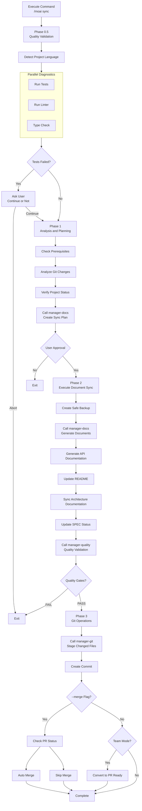

import { Callout } from "nextra/components";

# /moai sync

Synchronizes documentation for completed implementation code and prepares for deployment through Git automation.

<Callout type="info">

**New Command Format**

`/moai:3-sync` has been changed to `/moai sync`.

</Callout>

## Overview

`/moai sync` is the **Phase 3 (Sync)** command of the MoAI-ADK workflow. It analyzes code implemented in Phase 2 to automatically generate documentation, and creates Git commits and PRs (Pull Requests) to complete deployment preparation. Internally, the **manager-docs** agent manages the entire process.

<Callout type="info">
**Why is documentation synchronization needed?**

Writing documentation separately after writing code is tedious, and code and documentation easily become inconsistent. `/moai sync` solves this problem:

- **Analyze code** to **automatically generate** API documentation
- **Automatically update** README and CHANGELOG
- **Automatically create** Git commits and PRs

Since code changes and documentation are always synchronized, the problem of "outdated documentation" disappears.

</Callout>

## Usage

Execute after the Run phase is complete:

```bash
# Run /clear after Run phase completion (recommended)
> /clear

# Document synchronization and PR creation
> /moai sync
```

## Supported Modes

| Mode         | Description                   | When to Use               |
| ------------ | ----------------------------- | ------------------------- |
| `auto` (default) | Smart sync of changed files only | Daily development      |
| `force`      | Regenerate all documents      | Error recovery, major refactoring |
| `status`     | Read-only status check        | Quick health check        |
| `project`    | Update entire project docs    | Milestone completion, periodic sync |

### Usage by Mode

```bash
# Default mode (changed files only)
> /moai sync

# Full regeneration
> /moai sync --mode force

# Status check only
> /moai sync --mode status

# Update entire project
> /moai sync --mode project
```

## Supported Flags

| Flag     | Description              | Example                 |
| -------- | ------------------------ | ----------------------- |
| `--merge`| Auto-merge PR after completion | `/moai sync --merge` |
| `--team` | Force Agent Teams mode   | `/moai sync --team`     |
| `--solo` | Force sub-agent mode     | `/moai sync --solo`     |

### --merge Flag

Automatically merges PR and cleans up branches after Sync completion:

```bash
> /moai sync --merge
```

**Workflow:**

1. Check CI/CD status (gh pr checks)
2. Check merge conflicts (gh pr view --json mergeable)
3. When passing and mergeable: Auto merge (gh pr merge --squash --delete-branch)
4. Checkout to develop branch, pull, delete local branch

<Callout type="tip">
  The `--merge` option only auto-merges PRs **when CI/CD has passed**. Ensures safe automation.
</Callout>

**Token Efficiency Strategy:**

- Load only metadata and summaries from SPEC documents
- Cache and reuse the list of changed files from previous phases
- Use document templates to reduce generation time

## Execution Process

The entire process that `/moai sync` performs internally:



## Phase-by-Phase Details

### Phase 0.5: Quality Validation (Parallel Diagnostics)

Validates project quality before document synchronization.

**Step 1 - Detect Project Language:**

| Language         | Indicator Files                                    |
| ---------------- | --------------------------------------------------- |
| Python           | pyproject.toml, setup.py, requirements.txt           |
| TypeScript       | tsconfig.json, package.json (typescript)             |
| JavaScript       | package.json (no tsconfig)                          |
| Go               | go.mod, go.sum                                      |
| Rust             | Cargo.toml, Cargo.lock                              |
| Other 11 languages supported |

**Step 2 - Parallel Diagnostics:**

Three tools run simultaneously:

| Diagnostic Tool | Purpose           | Timeout |
| --------------- | ----------------- | ------- |
| Test Run        | Detect test failures | 180 seconds |
| Linter          | Check code style  | 120 seconds |
| Type Check      | Check type errors | 120 seconds |

**Step 3 - Handle Test Failures:**

When tests fail, present options to the user:

- **Continue**: Continue regardless of failures
- **Abort**: Stop and exit

**Step 4 - Code Review:**

The **manager-quality** subagent performs TRUST 5 quality validation and generates a comprehensive report.

**Step 5 - Generate Quality Report:**

Aggregate status of test-runner, linter, type-checker, code-review and determine overall status (PASS or WARN).

### Phase 1: Analysis and Planning

The **manager-docs** subagent creates synchronization strategy.

**Output:** documents_to_update, specs_requiring_sync, project_improvements_needed, estimated_scope

### Phase 2: Execute Document Synchronization

**Step 1 - Create Safe Backup:**

Create a backup before modifications:

- Create timestamp
- Backup directory: `.moai-backups/sync-{timestamp}/`
- Copy important files: README.md, docs/, .moai/specs/
- Verify backup integrity

**Step 2 - Document Synchronization:**

The **manager-docs** subagent performs the following tasks:

- Reflect changed code in Living Documents
- Automatically generate and update API documentation
- Update README if needed
- Synchronize architecture documentation
- Fix project issues and recover broken references
- Ensure SPEC documents match implementation
- Detect changed domains and create domain-specific updates
- Generate synchronization report: `.moai/reports/sync-report-{timestamp}.md`

**Step 3 - Post-Sync Quality Validation:**

The **manager-quality** subagent validates synchronization quality against TRUST 5 criteria:

- All project links complete
- Documents well formatted
- All documents consistent
- No credential exposures
- All SPECs properly linked

**Step 4 - Update SPEC Status:**

Batch update completed SPECs to "completed" status, recording version changes and status transitions.

### Phase 3: Git Operations and PR

The **manager-git** subagent performs Git operations:

**Step 1 - Create Commit:**

- Stage all changed documents, reports, README, docs/ files
- Create single commit listing synchronized documents, project fixes, SPEC updates
- Verify commit with git log

**Step 2 - Convert to PR Ready (Team Mode Only):**

- Check settings in git_strategy.mode
- If Team mode: Convert from Draft PR to Ready (gh pr ready)
- Assign reviewers and labels if configured
- If Personal mode: Skip

**Step 3 - Auto Merge (--merge flag only):**

- Check CI/CD status with gh pr checks
- Check merge conflicts with gh pr view --json mergeable
- When passing and mergeable: Run gh pr merge --squash --delete-branch
- Checkout to develop, pull, delete local branch

### Phase 4: Completion and Next Steps

**Standard Completion Report:**

Summarize and display the following:

- mode, scope, number of updated/created files
- Project improvements
- Updated documents
- Generated reports
- Backup location

**Worktree Mode Next Steps (auto-detected from git context):**

| Option              | Description                        |
| ------------------- | ---------------------------------- |
| Return to Main Dir  | Exit worktree and go to main       |
| Continue in Worktree| Continue working in current worktree |
| Switch to Other Worktree | Select another worktree       |
| Remove This Worktree| Clean up worktree                  |

**Branch Mode Next Steps (auto-detected from git context):**

| Option                  | Description                       |
| ----------------------- | --------------------------------- |
| Commit and Push Changes | Upload changes to remote         |
| Return to Main Branch   | To develop or main               |
| Create PR               | Create Pull Request              |
| Continue on Branch      | Continue working on current branch |

**Standard Next Steps:**

| Option           | Description                     |
| ---------------- | ------------------------------- |
| Create Next SPEC | Run `/moai plan`               |
| Start New Session| Run `/clear`                   |
| Review PR        | Team mode: gh pr view           |
| Continue Dev     | Personal mode: continue working |

## Generated Documents

Documents that `/moai sync` automatically generates or updates:

### API Documentation

Analyzes API endpoints, function signatures, and class structures from implemented code to create documentation.

| Document Type | Content                     | Generation Condition          |
| ------------- | --------------------------- | ----------------------------- |
| API Reference | Endpoints, request/response schemas | When REST API is included |
| Function Docs | Parameters, return values, exceptions | When public functions included |
| Class Docs    | Properties, methods, inheritance relationships | When classes included |

### README Update

Updates the project's README.md as follows:

- **Usage Section**: Usage examples for newly added features
- **API Section**: Add list of new endpoints
- **Dependencies Section**: Reflect newly added libraries

### CHANGELOG Writing

Records change history in [Keep a Changelog](https://keepachangelog.com) format:

```markdown
## [Unreleased]

### Added

- JWT-based user authentication system (SPEC-AUTH-001)
  - POST /api/auth/register - Signup
  - POST /api/auth/login - Login
  - POST /api/auth/refresh - Token refresh
```

## Git Automation

`/moai sync` automatically performs Git operations after document generation.

### Commit Message Format

MoAI-ADK follows [Conventional Commits](https://www.conventionalcommits.org/) format:

| Prefix     | Purpose    | Example                                        |
| ---------- | ---------- | ---------------------------------------------- |
| `feat`     | New feature| `feat(auth): add JWT authentication`           |
| `fix`      | Bug fix    | `fix(auth): resolve token expiration issue`    |
| `docs`     | Documentation | `docs(auth): update API documentation`    |
| `refactor` | Refactoring | `refactor(auth): centralize auth logic`    |
| `test`     | Testing    | `test(auth): add characterization tests`       |

## Quality Gates

Sync phase quality criteria are more documentation-focused than Run phase:

| Item       | Criteria       | Description                      |
| ---------- | -------------- | -------------------------------- |
| LSP Errors | **0**          | Code must have no errors         |
| Warnings   | **Maximum 10** | Some warnings allowed during doc generation |
| LSP Status | **Clean**      | Overall clean state              |

<Callout type="warning">
  If quality gates fail, document generation and PR creation are **blocked**. First go back to `/moai run` to fix code issues, or use `/moai fix` for quick error fixes.
</Callout>

## Practical Examples

### Example: Document Synchronization and PR Creation

**Step 1: Confirm Run Phase Complete**

```bash
# Check that Run phase is complete
# manager-ddd should have output "DONE" or "COMPLETE" marker
```

**Step 2: Clear Tokens Then Run Sync**

```bash
> /clear
> /moai sync
```

**Step 3: Tasks Automatically Performed by manager-docs**

The 4 Phases that manager-docs agent performs for document synchronization.

---

#### Phase 0.5: Quality Validation

Verify project status before document generation.

```bash
Phase 0.5: Quality Validation
  Project language: Python
  Tests: 36/36 passed
  Linter: 0 errors
  Type check: 0 errors
  Coverage: 89%
  Overall status: PASS
```

---

#### Phase 1: Analysis and Planning

Analyze Git changes and create synchronization plan.

```bash
Phase 1: Analysis and Planning
  Git changes: 12 files modified
  Sync plan: 1 API doc, README update, add CHANGELOG
  User approval: Complete
```

---

#### Phase 2: Document Synchronization

Generate necessary documents and update existing documents.

```bash
Phase 2: Document Synchronization
  Create backup: .moai-backups/sync-20260128-143052/
  API documentation: docs/api/auth.md (new)
  README.md: Update usage section
  CHANGELOG.md: Add v1.1.0 entries
  SPEC-AUTH-001 status: ACTIVE → COMPLETED

  Quality validation: All items passed
```

---

#### Phase 3: Git Operations

Create commit and open PR.

```bash
Phase 3: Git Operations
  Create commit: docs(auth): synchronize documentation for SPEC-AUTH-001
  PR status: Draft → Ready (Team mode)
```

**Step 4: Review Created PR**

```bash
# Check PR in terminal
$ gh pr view 42
```

The created PR automatically includes SPEC requirements, list of changed files, and test results.

## Frequently Asked Questions

### Q: What if I don't want to automatically create a PR?

Set `auto_pr: false` in `git-strategy.yaml` to only automatically perform up to commit. You can create a PR at your preferred time.

### Q: Can I change the CHANGELOG format?

Currently [Keep a Changelog](https://keepachangelog.com) format is used by default. Custom format support is planned for the future.

### Q: What if I only want to generate documents without Git operations?

Set `auto_commit: false` in `git-strategy.yaml` to only perform document generation. You can manually perform Git operations.

### Q: What to do when quality gates fail?

There are two ways:

```bash
# Method 1: Quick fix with /moai fix
> /moai fix "Fix lint errors"

# Method 2: Re-implement with /moai run
> /moai run SPEC-AUTH-001
```

After fixing, run `/moai sync` again.

### Q: What's the difference between `/moai sync` and `/moai`?

`/moai sync` is only responsible for **documenting completed implementation code**. `/moai` automatically performs the **entire workflow** from SPEC creation to implementation and documentation.

## Related Documents

- [/moai run](/workflow-commands/moai-run) - Previous phase: DDD implementation
- [TRUST 5 Quality System](/core-concepts/trust-5) - Detailed quality gates explanation
- [Quick Start](/getting-started/quickstart) - Complete workflow tutorial