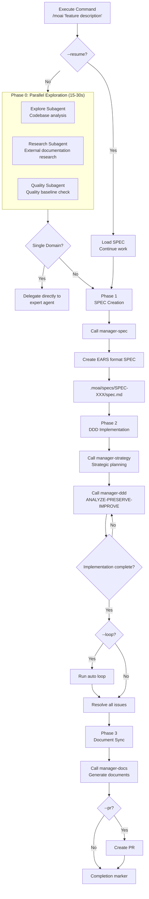

import { Callout } from "nextra/components";

# /moai

Fully autonomous automation command. When you provide a goal, MoAI autonomously executes the **plan → run → sync** pipeline.

<Callout type="tip">
  **One-line summary**: `/moai` is a "fully autonomous automation" command. You just describe the feature you want in natural language, and MoAI automatically performs **the entire process** from SPEC creation to implementation and documentation.
</Callout>

## Overview

`/moai` is the **fully autonomous automation workflow** command of MoAI-ADK. There's no need to execute subcommands separately - the entire development process is automated with a single command:

1. **SPEC Creation** (manager-spec)
2. **DDD Implementation** (manager-ddd)
3. **Documentation Synchronization** (manager-docs)

## Usage

```bash
# Basic usage
> /moai "Description of the feature you want to implement"

# With worktree
> /moai "feature description" --worktree

# With branch
> /moai "feature description" --branch

# Enable loop mode
> /moai "feature description" --loop

# Resume existing SPEC
> /moai --resume SPEC-AUTH-001
```

## Supported Flags

| Flag                | Description                             | Example                           |
| ------------------- | --------------------------------------- | --------------------------------- |
| `--loop`            | Enable automatic iterative fixing       | `/moai "feature" --loop`          |
| `--max N`           | Specify maximum iterations (default 100) | `/moai "feature" --loop --max 10` |
| `--branch`          | Auto-create feature branch              | `/moai "feature" --branch`        |
| `--pr`              | Auto-create PR after completion         | `/moai "feature" --pr`            |
| `--resume SPEC-XXX` | Resume existing SPEC work                | `/moai --resume SPEC-AUTH-001`     |
| `--team`            | Force Agent Teams mode                  | `/moai "feature" --team`          |
| `--solo`            | Force sub-agent mode                    | `/moai "feature" --solo`          |

### --loop Flag

Automatically executes iterative fixing after implementation to resolve all errors:

```bash
> /moai "JWT authentication system" --loop
```

When using this option:

1. Create SPEC
2. DDD implementation
3. **Auto-run loop** (resolve LSP errors, test failures, coverage issues)
4. Document synchronization
5. PR creation

<Callout type="tip">
  The `--loop` option **completely automates post-implementation cleanup** to maximize productivity.
</Callout>

## Execution Process

The entire process that `/moai` performs internally:



**Key Points:**

- **Phase 0 (Parallel Exploration)**: Three agents run simultaneously for 2-3x speed improvement
- **Single Domain Routing**: Simple tasks are delegated directly to expert agents, skipping SPEC
- **Completion Marker**: Outputs `<moai>DONE</moai>` or `<moai>COMPLETE</moai>` when work is complete

## Phase-by-Phase Details

### Phase 0: Parallel Exploration (Optional)

Three agents run **simultaneously** to quickly understand project context:

| Agent    | Role              | Tasks                                           |
| -------- | ----------------- | ---------------------------------------------- |
| **Explore**  | Codebase analysis | Find related files, architecture patterns, existing implementations |
| **Research** | External doc research | Official docs, API docs, similar implementation examples |
| **Quality**  | Quality baseline  | Test coverage, lint status, technical debt    |

**Speed Improvement**: Parallel execution is 2-3x faster than sequential (15-30s vs 45-90s)

**Single Domain Routing:**

- Single domain tasks (e.g., "SQL optimization"): Delegate directly to domain expert agent without SPEC creation
- Multi-domain tasks: Proceed with full workflow

### Phase 1: SPEC Creation

The **manager-spec** subagent creates EARS format SPEC documents:

- .moai/specs/SPEC-XXX/spec.md
- EARS format requirements
- Given-When-Then acceptance criteria
- Content written in conversation_language

### Phase 2: DDD Implementation Loop

**[HARD] Agent Delegation Rule**: All implementation work must be delegated to specialized agents. Direct implementation is prohibited even after auto-compact.

**Expert Agent Selection:**

| Task Type          | Agent                         |
| ------------------ | ----------------------------- |
| Backend logic      | expert-backend subagent       |
| Frontend components| expert-frontend subagent      |
| Test creation      | expert-testing subagent       |
| Bug fixing         | expert-debug subagent         |
| Refactoring        | expert-refactoring subagent   |
| Security fixes     | expert-security subagent      |

**Loop Behavior (when --loop or ralph.yaml loop.enabled is true):**

```
problem exists AND iteration < max:
  1. Run diagnostics (parallel by default)
  2. Delegate fix to appropriate expert agent
  3. Verify fix results
  4. Check for completion marker
  5. Exit loop when marker found
```

### Phase 3: Document Synchronization

The **manager-docs** subagent synchronizes implementation with documentation:

- Generate API documentation
- Update README
- Add to CHANGELOG
- Add completion marker on success

## TODO Management

**[HARD] TodoWrite Tool Required**: Must use TodoWrite for all task tracking

- When issue found: TodoWrite (pending status)
- Before starting work: TodoWrite (in_progress status)
- After completing work: TodoWrite (completed status)
- Prohibit printing TODO list as text

## Completion Markers

AI adds markers when work is complete:

- `<moai>DONE</moai>` - Task complete
- `<moai>COMPLETE</moai>` - Fully complete
- `<moai:done />` - XML format

## LLM Mode Routing

Automatic routing based on llm.yaml settings:

| Mode          | Plan Phase     | Run Phase      |
| ------------- | -------------- | -------------- |
| `claude-only` | Claude         | Claude         |
| `hybrid`      | Claude         | GLM (worktree) |
| `glm-only`    | GLM (worktree) | GLM (worktree) |

## Practical Examples

### Example: Full Automation of JWT Authentication System

**Step 1: Execute Command**

```bash
> /moai "JWT-based user authentication system: signup, login, token refresh" --worktree --loop --pr
```

**Step 2: Phase 0 - Parallel Exploration**

```
[Starting parallel exploration]
  Explore subagent: Analyzing src/auth/...
  Research subagent: Researching JWT best practices...
  Quality subagent: Confirming test coverage 32%...

[Exploration complete - 23s]
  Files found: 4
  Recommended libraries: PyJWT, bcrypt
  Baseline: LSP 0 errors, coverage 32%
```

**Step 3: Phase 1 - SPEC Creation**

```
[Calling manager-spec]
  SPEC ID: SPEC-AUTH-001
  Requirements: 5 (EARS format)
  Acceptance criteria: 3 scenarios

  User approval: Complete
```

**Step 4: Phase 2 - DDD Implementation**

```
[manager-strategy]
  Work decomposition: 7 tasks
  Strategic planning complete

[manager-ddd]
  ANALYZE: Code structure analysis complete
  PRESERVE: Wrote 12 characterization tests
  IMPROVE: 7 tasks implementation complete

[manager-quality]
  TRUST 5: All pillars passed
  Coverage: 89%
  Status: PASS
```

**Step 5: Auto Loop (--loop)**

```
[Starting loop - iteration 1/100]
  Diagnostics: Found 2 type errors
  Fix: Delegated to expert-backend subagent
  Verify: All errors resolved

[Loop complete - 1 iteration]
  Completion conditions met!
```

**Step 6: Phase 3 - Document Synchronization**

```
[manager-docs]
  API documentation: docs/api/auth.md created
  README: Updated usage section
  CHANGELOG: Added v1.1.0 entries
  SPEC-AUTH-001: ACTIVE → COMPLETED
```

**Step 7: Complete**

```
[Complete]
  SPEC: SPEC-AUTH-001
  Commits: 7
  Tests: 36/36 passed
  Coverage: 89%
  PR: #42 created (Draft → Ready)

<moai:COMPLETE />
```

## Frequently Asked Questions

### Q: What's the difference between `/moai` and subcommands?

| Command       | Scope          | When to Use                     |
| ------------- | -------------- | ------------------------------- |
| `/moai`       | Full automation| Want quick full automation      |
| `/moai plan`  | SPEC only      | Want to review SPEC first        |
| `/moai run`   | Implementation only| SPEC already exists        |
| `/moai sync`  | Documentation only| Update docs after implementation |

### Q: When should I use the --loop flag?

Use when you want to automatically fix all errors after implementation. Especially useful for cleanup after large refactoring.

### Q: What is single domain routing?

Single domain tasks (e.g., "SQL query optimization") are delegated directly to the domain expert agent without SPEC creation, saving time.

## Related Documents

- [/moai plan](/workflow-commands/moai-plan) - SPEC creation details
- [/moai run](/workflow-commands/moai-run) - DDD implementation details
- [/moai sync](/workflow-commands/moai-sync) - Document synchronization details
- [/moai loop](/utility-commands/moai-loop) - Iterative fixing loop details
- [/moai fix](/utility-commands/moai-fix) - One-shot auto-fix details