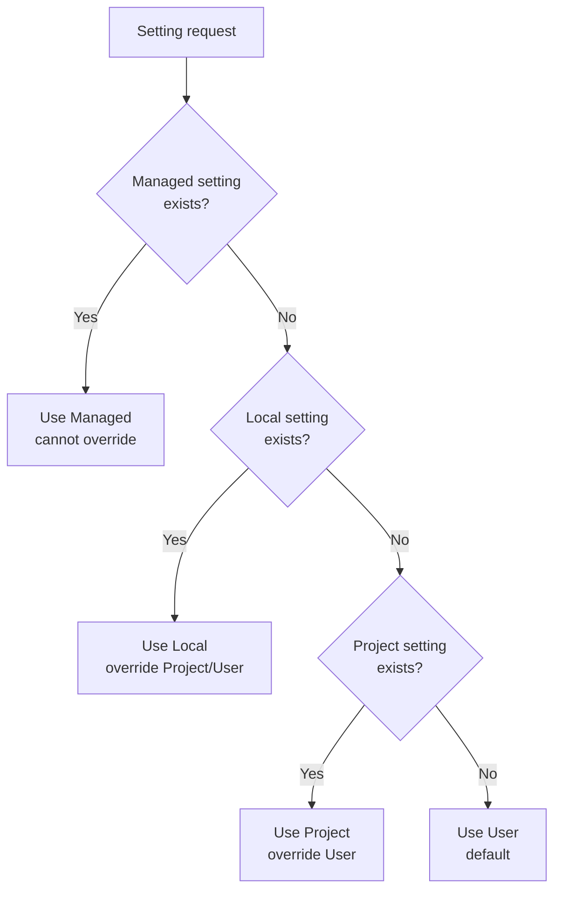
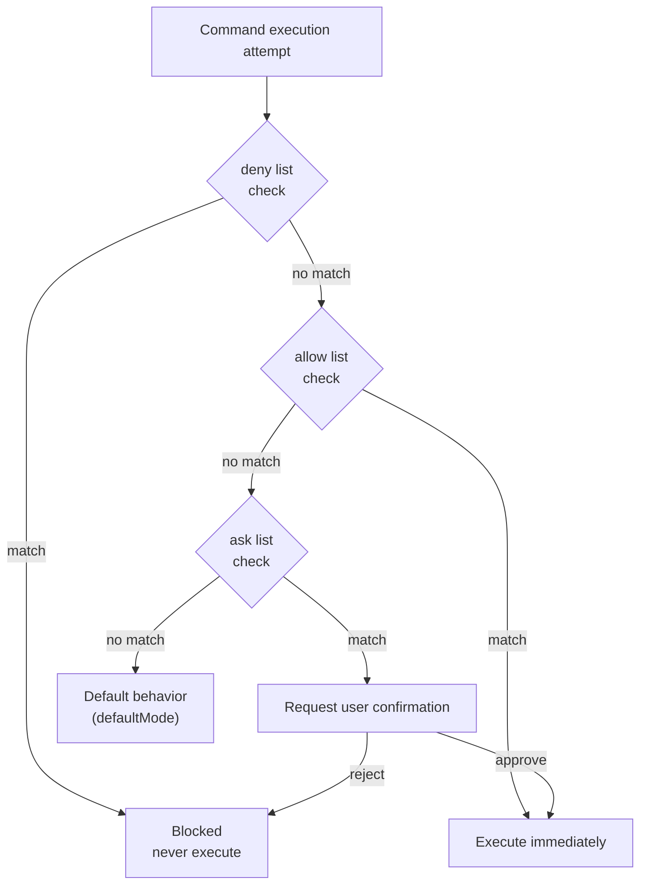

import { Callout } from 'nextra/components'

# settings.json Guide

A comprehensive guide to Claude Code's configuration file system.

<Callout type="tip">
**One-line summary**: `settings.json` is the **control tower** of Claude Code. It manages permissions, environment variables, hooks, and security policies in one place.
</Callout>

## Configuration Scopes

Claude Code uses a **scope system** to determine where settings apply and who they are shared with.

### Four Scope Types

| Scope | Location | Affects | Team Shared | Priority |
|-------|----------|---------|-------------|----------|
| **Managed** | System-level `managed-settings.json` | All users on machine | ✅ (IT deployed) | Highest |
| **User** | `~/.claude/` | User personal (all projects) | ❌ | Low |
| **Project** | `.claude/` | All collaborators in repo | ✅ (Git tracked) | Medium |
| **Local** | `.claude/*.local.*` | User (this repo only) | ❌ | High |

### Priority by Scope

When the same setting exists in multiple scopes, the more specific scope takes precedence:



**Priority:** Managed > Command-line args > Local > Project > User

### Uses for Each Scope

**Managed Scope** - Use for:
- Organization-wide security policies
- Non-overridable compliance requirements
- Standardized configurations deployed by IT/DevOps

**User Scope** - Use for:
- Personal preferences across all projects (themes, editor settings)
- Tools and plugins used across all projects
- API keys and authentication (stored securely)

**Project Scope** - Use for:
- Team-shared settings (permissions, hooks, MCP servers)
- Plugins that the team should have
- Tool standardization across collaborators

**Local Scope** - Use for:
- Personal overrides for specific projects
- Testing settings before sharing with team
- Machine-specific settings that don't work for others

## File Locations

MoAI-ADK uses four settings file locations.

| File | Location | Purpose | Git Tracked |
|------|----------|---------|-------------|
| `managed-settings.json` | System-level* | Managed settings (IT deployed) | No |
| `settings.json` (User) | `~/.claude/settings.json` | Personal global settings | No |
| `settings.json` (Project) | `.claude/settings.json` | Team shared settings | Yes |
| `settings.local.json` | `.claude/settings.local.json` | Personal project settings | No |

**System-level locations:**
- macOS: `/Library/Application Support/ClaudeCode/`
- Linux/WSL: `/etc/claude-code/`
- Windows: `C:\Program Files\ClaudeCode\`

<Callout type="warning">
**Warning**: `.claude/settings.json` is overwritten during MoAI-ADK updates. Always write personal settings in `settings.local.json` or `~/.claude/settings.json`.
</Callout>

## What is settings.json?

`settings.json` is Claude Code's **global configuration file**. It defines which commands are automatically allowed, which are blocked, which hooks to execute, and what environment variables to set.

## Overall Structure

```json
{
  "model": "",
  "language": "",
  "attribution": {},
  "companyAnnouncements": [],
  "autoUpdatesChannel": "",
  "spinnerTipsEnabled": true,
  "terminalProgressBarEnabled": true,
  "sandbox": {},
  "hooks": {},
  "permissions": {},
  "enabledPlugins": {},
  "extraKnownMarketplaces": {},
  "enableAllProjectMcpServers": false,
  "enabledMcpjsonServers": [],
  "disabledMcpjsonServers": [],
  "fileSuggestion": {},
  "alwaysThinkingEnabled": false,
  "maxThinkingTokens": 0,
  "statusLine": {},
  "outputStyle": "",
  "cleanupPeriodDays": 30,
  "env": {}
}
```

## Core Settings Reference

### model

Overrides the default model to use.

```json
{
  "model": "claude-sonnet-4-5-20250929"
}
```

### language

Sets Claude's default response language.

```json
{
  "language": "korean"
}
```

Supported languages: `"korean"`, `"japanese"`, `"spanish"`, `"french"`, etc.

### cleanupPeriodDays

Deletes inactive sessions older than this period on startup. Set to `0` to delete all sessions immediately. (default: 30 days)

```json
{
  "cleanupPeriodDays": 20
}
```

### autoUpdatesChannel

Release channel to follow for updates.

```json
{
  "autoUpdatesChannel": "stable"
}
```

- `"stable"`: Versions about a week old, skips major regressions
- `"latest"` (default): Most recent release

### spinnerTipsEnabled

Whether to show tips in the spinner while Claude is working. Set to `false` to disable tips. (default: `true`)

```json
{
  "spinnerTipsEnabled": false
}
```

### terminalProgressBarEnabled

Enables terminal progress bar displaying progress in supported terminals like Windows Terminal and iTerm2. (default: `true`)

```json
{
  "terminalProgressBarEnabled": false
}
```

### showTurnDuration

Displays turn duration message after responses (e.g., "Cooked for 1m 6s"). Set to `false` to hide this message.

```json
{
  "showTurnDuration": true
}
```

### respectGitignore

Controls whether the `@` file selector respects `.gitignore` patterns. When `true` (default), files matching `.gitignore` patterns are excluded from suggestions.

```json
{
  "respectGitignore": false
}
```

### plansDirectory

Customizes where plan files are stored. Path is relative to project root. Default: `~/.claude/plans`

```json
{
  "plansDirectory": "./plans"
}
```

## Permissions Settings

Manages permissions for commands that Claude Code can execute.

### Permissions Structure

```json
{
  "permissions": {
    "defaultMode": "default",
    "allow": [],
    "ask": [],
    "deny": [],
    "additionalDirectories": [],
    "disableBypassPermissionsMode": "disable"
  }
}
```

### defaultMode

Default permission mode when opening Claude Code.

| Value | Description |
|-------|-------------|
| `"acceptEdits"` | Automatically allow file edits |
| `"allowEdits"` | Allow file edits |
| `"rejectEdits"` | Reject file edits |
| `"default"` | Default behavior |

<Callout type="info">
**Note**: Current MoAI-ADK settings use `"defaultMode": "default"`. This may be a legacy value.
</Callout>

### allow (Auto-Allow)

List of commands that are **immediately allowed to execute** without user confirmation.

**Default Allowed Command Categories:**

| Category | Example Commands | Count |
|----------|------------------|-------|
| File Tools | `Read`, `Write`, `Edit`, `Glob`, `Grep` | 7 |
| Git Commands | `git add`, `git commit`, `git diff`, `git log`, etc. | 15+ |
| Package Managers | `npm`, `pip`, `uv`, `npx` | 4 |
| Build/Test | `pytest`, `make`, `node`, `python` | 10+ |
| Code Quality | `ruff`, `black`, `prettier`, `eslint` | 6+ |
| Exploration Tools | `ls`, `find`, `tree`, `cat`, `head` | 10+ |
| GitHub CLI | `gh issue`, `gh pr`, `gh repo view` | 3 |
| MCP Tools | `mcp__context7__*`, `mcp__sequential-thinking__*` | 3 |
| Other | `AskUserQuestion`, `Task`, `Skill`, `TodoWrite` | 4 |

**allow Format Examples:**

```json
{
  "allow": [
    "Read",                          // Tool name only
    "Bash(git add:*)",               // Bash + command pattern
    "Bash(pytest:*)",                // Wildcard
    "mcp__context7__resolve-library-id",  // MCP tool
    "Bash(npm run *)",               // Space-separated (new format)
    "WebFetch(domain:example.com)"   // Domain pattern
  ]
}
```

### ask (Confirm Before Execution)

List of commands that **request user confirmation before executing**.

```json
{
  "ask": [
    "Bash(chmod:*)",       // Change file permissions
    "Bash(chown:*)",       // Change ownership
    "Bash(rm:*)",          // Delete files
    "Bash(sudo:*)",        // Admin privileges
    "Read(./.env)",        // Read env file
    "Read(./.env.*)"       // Read env files
  ]
}
```

**ask Behavior:**
1. Claude Code attempts to execute the command
2. Prompts user "Run this command?"
3. Executes if approved, aborts if rejected

### deny (Always Block)

List of commands that are **never executed under any circumstances**.

**Blocked Categories:**

| Category | Blocked Patterns | Reason |
|----------|------------------|--------|
| Sensitive File Access | `Read(./secrets/**)`, `Write(~/.ssh/**)` | Protect security credentials |
| Cloud Credentials | `Read(~/.aws/**)`, `Read(~/.config/gcloud/**)` | Protect cloud accounts |
| System Destruction | `Bash(rm -rf /:*)`, `Bash(rm -rf ~:*)` | System protection |
| Dangerous Git | `Bash(git push --force:*)`, `Bash(git reset --hard:*)` | Code protection |
| Disk Format | `Bash(dd:*)`, `Bash(mkfs:*)`, `Bash(fdisk:*)` | Disk protection |
| System Commands | `Bash(reboot:*)`, `Bash(shutdown:*)` | System stability |
| DB Deletion | `Bash(DROP DATABASE:*)`, `Bash(TRUNCATE:*)` | Data protection |

**deny Format Examples:**

```json
{
  "deny": [
    "Read(./secrets/**)",           // Block reading secrets dir
    "Write(~/.ssh/**)",             // Block modifying SSH keys
    "Bash(git push --force:*)",     // Block force push
    "Bash(rm -rf /:*)",            // Block root deletion
    "Bash(DROP DATABASE:*)"        // Block DB deletion
  ]
}
```

### additionalDirectories

Additional working directories that Claude can access.

```json
{
  "permissions": {
    "additionalDirectories": [
      "../docs/"
    ]
  }
}
```

### disableBypassPermissionsMode

Prevents `bypassPermissions` mode from being enabled. Disables the `--dangerously-skip-permissions` command-line flag.

```json
{
  "permissions": {
    "disableBypassPermissionsMode": "disable"
  }
}
```

## Permission Rule Syntax

Permission rules follow the format `Tool` or `Tool(specifier)`.

### Rule Evaluation Order

When multiple rules match the same tool usage, rules are evaluated in this order:

1. **Deny** rules are checked first
2. **Ask** rules are checked second
3. **Allow** rules are checked last

The first matching rule determines the behavior. This means deny rules always take precedence over allow rules.

### Matching All Usages of a Tool

To match all usages of a tool, use the tool name without parentheses:

| Rule | Effect |
|------|--------|
| `Bash` | Matches **all** Bash commands |
| `WebFetch` | Matches **all** web fetch requests |
| `Read` | Matches **all** file reads |

`Bash(*)` is equivalent to `Bash` and matches all Bash commands. Both syntaxes can be used interchangeably.

### Using Specifiers for Fine Control

Add specifiers in parentheses to match specific tool usages:

| Rule | Effect |
|------|--------|
| `Bash(npm run build)` | Matches exact command `npm run build` |
| `Read(./.env)` | Matches reading `.env` file in current directory |
| `WebFetch(domain:example.com)` | Matches fetch requests for example.com |

### Wildcard Patterns

Bash rules support glob patterns with `*`. Wildcards can appear at the beginning, middle, or end of commands.

```json
{
  "permissions": {
    "allow": [
      "Bash(npm run *)",
      "Bash(git commit *)",
      "Bash(git * main)",
      "Bash(* --version)",
      "Bash(* --help *)"
    ],
    "deny": [
      "Bash(git push *)"
    ]
  }
}
```

**Important:** Space before `*` matters:
- `Bash(ls *)` matches `ls -la` but not `lsof`
- `Bash(ls*)` matches both

**Legacy Syntax:** The `:*` suffix syntax (e.g., `Bash(npm run:*)`) is equivalent to `*` but is deprecated.

### Domain-Specific Patterns

For tools like WebFetch, you can use domain-specific patterns:

```json
{
  "permissions": {
    "allow": [
      "WebFetch(domain:docs.anthropic.com)",
      "WebFetch(domain:github.com)"
    ],
    "deny": [
      "WebFetch(domain:malicious-site.com)"
    ]
  }
}
```

### Permission Priority Diagram



**Priority:** `deny` > `ask` > `allow` > `defaultMode`

## Sandbox Settings

Configures advanced sandboxing behavior. Sandboxing isolates bash commands from the filesystem and network.

<Callout type="warning">
**Important:** Filesystem and network restrictions are configured through Read, Edit, WebFetch permission rules, not through sandbox settings.
</Callout>

```json
{
  "sandbox": {
    "enabled": true,
    "autoAllowBashIfSandboxed": true,
    "excludedCommands": ["docker"],
    "allowUnsandboxedCommands": false,
    "network": {
      "allowUnixSockets": [
        "/var/run/docker.sock"
      ],
      "allowLocalBinding": true,
      "httpProxyPort": 8080,
      "socksProxyPort": 8081
    },
    "enableWeakerNestedSandbox": false
  }
}
```

### Sandbox Settings Reference

| Key | Description | Example |
|-----|-------------|---------|
| `enabled` | Enable bash sandboxing (macOS, Linux, WSL2). Default: false | `true` |
| `autoAllowBashIfSandboxed` | Auto-approve sandboxed bash commands. Default: true | `true` |
| `excludedCommands` | Commands that must run outside the sandbox | `["docker", "git"]` |
| `allowUnsandboxedCommands` | Allow commands to run outside sandbox via `dangerouslyDisableSandbox` parameter. Default: true | `false` |
| `network.allowUnixSockets` | Unix socket paths accessible from sandbox (e.g., SSH agent) | `["~/.ssh/agent-socket"]` |
| `network.allowLocalBinding` | Allow binding to localhost ports (macOS only). Default: false | `true` |
| `network.httpProxyPort` | HTTP proxy port if you bring your own proxy | `8080` |
| `network.socksProxyPort` | SOCKS5 proxy port if you bring your own proxy | `8081` |
| `enableWeakerNestedSandbox` | Enable weaker sandbox for unprivileged Docker environments (Linux, WSL2 only). **Reduces security**. Default: false | `true` |

## Attribution Settings

Claude Code adds attribution to git commits and pull requests. These are configured separately.

```json
{
  "attribution": {
    "commit": "Custom attribution text\n\nCo-Authored-By: AI <email@example.com>",
    "pr": ""
  }
}
```

### Attribution Settings Reference

| Key | Description |
|-----|-------------|
| `commit` | Attribution for git commits (including trailers). Empty string hides commit attribution |
| `pr` | Attribution for pull request descriptions. Empty string hides PR attribution |

### Default Commit Attribution

```
🤖 Generated with [Claude Code](https://claude.com/claude-code)

Co-Authored-By: Claude Sonnet 4.5 <noreply@anthropic.com>
```

### Default PR Attribution

```
🤖 Generated with [Claude Code](https://claude.com/claude-code)
```

## Hooks Settings

Registers scripts that react to Claude Code events.

```json
{
  "hooks": {
    "SessionStart": [
      {
        "matcher": "",
        "hooks": [
          {
            "type": "command",
            "command": "script path"
          }
        ]
      }
    ],
    "PreToolUse": [
      {
        "matcher": "Write|Edit",
        "hooks": [
          {
            "type": "command",
            "command": "security guard script path",
            "timeout": 5000
          }
        ]
      }
    ],
    "PostToolUse": [
      {
        "matcher": "Write|Edit",
        "hooks": [
          {
            "type": "command",
            "command": "formatter script path",
            "timeout": 30000
          },
          {
            "type": "command",
            "command": "linter script path",
            "timeout": 60000
          }
        ]
      }
    ]
  }
}
```

### Hook Event Types

| Event | Description |
|-------|-------------|
| `SessionStart` | Run on session start |
| `SessionEnd` | Run on session end |
| `PreToolUse` | Run before tool use |
| `PostToolUse` | Run after tool use |
| `PreCompact` | Run before context compacting |

<Callout type="info">
See [Hooks Guide](/advanced/hooks-guide) for detailed hook configuration.
</Callout>

## Plugin Settings

Plugin-related settings.

```json
{
  "enabledPlugins": {
    "formatter@acme-tools": true,
    "deployer@acme-tools": true,
    "analyzer@security-plugins": false
  },
  "extraKnownMarketplaces": {
    "acme-tools": {
      "source": {
        "source": "github",
        "repo": "acme-corp/claude-plugins"
      }
    }
  }
}
```

### enabledPlugins

Controls which plugins are enabled. Format: `"plugin-name@marketplace-name": true/false`

**Scopes:**
- **User settings** (`~/.claude/settings.json`): Personal plugin preferences
- **Project settings** (`.claude/settings.json`): Project-specific plugins shared with team
- **Local settings** (`.claude/settings.local.json`): Machine-specific overrides (not committed)

### extraKnownMarketplaces

Defines additional marketplaces to make available in the repository. Typically used in repository-level settings to ensure team members have access to required plugin sources.

## MCP Settings

Settings for MCP (Model Context Protocol) servers.

```json
{
  "enableAllProjectMcpServers": true,
  "enabledMcpjsonServers": ["memory", "github"],
  "disabledMcpjsonServers": ["filesystem"]
}
```

### MCP Settings Reference

| Key | Description | Example |
|-----|-------------|---------|
| `enableAllProjectMcpServers` | Auto-approve all MCP servers defined in project `.mcp.json` file | `true` |
| `enabledMcpjsonServers` | List of specific MCP servers to approve | `["memory", "github"]` |
| `disabledMcpjsonServers` | List of specific MCP servers to deny | `["filesystem"]` |
| `allowedMcpServers` | Used only in managed-settings.json. MCP server allowlist | `[{ "serverName": "github" }]` |
| `deniedMcpServers` | Used only in managed-settings.json. MCP server blocklist (takes precedence) | `[{ "serverName": "filesystem" }]` |

## File Suggestion Settings

Configures custom commands for `@` file path autocompletion.

```json
{
  "fileSuggestion": {
    "type": "command",
    "command": "~/.claude/file-suggestion.sh"
  }
}
```

Built-in file suggestions use fast filesystem traversal, but large monorepos may benefit from project-specific indexing (e.g., pre-built file indices or custom tools).

## Extended Thinking Settings

Settings for Extended Thinking.

```json
{
  "alwaysThinkingEnabled": true,
  "maxThinkingTokens": 10000
}
```

### Extended Thinking Settings Reference

| Key | Description | Example |
|-----|-------------|---------|
| `alwaysThinkingEnabled` | Enable extended thinking by default in all sessions | `true` |
| `maxThinkingTokens` | Override thinking token budget (default: 31999, 0 = disabled) | `10000` |

Can also be set via environment variables:
- `MAX_THINKING_TOKENS=10000`: Thinking token limit
- `MAX_THINKING_TOKENS=0`: Disable thinking

## Company Announcements

Announcements to display to users on startup. When multiple announcements are provided, they rotate randomly.

```json
{
  "companyAnnouncements": [
    "Welcome to Acme Corp! Review our code guidelines at docs.acme.com",
    "Reminder: Code reviews required for all PRs",
    "New security policy in effect"
  ]
}
```

## Status Line Settings

Configures the status line displayed at the bottom of Claude Code.

```json
{
  "statusLine": {
    "type": "command",
    "command": "${SHELL:-/bin/bash} -l -c 'uv run --no-sync moai-adk statusline'",
    "padding": 0,
    "refreshInterval": 300
  }
}
```

| Field | Description |
|-------|-------------|
| `type` | `"command"` (execute command) |
| `command` | Command to run (returns status information) |
| `padding` | Padding size |
| `refreshInterval` | Refresh interval (milliseconds) |

## Output Style Settings

```json
{
  "outputStyle": "R2-D2"
}
```

Output style determines Claude Code's response format. Change to your preferred style in `settings.local.json`.

## Environment Variables Settings

Set environment variables that control Claude Code's behavior in the `env` section.

### MoAI-ADK Environment Variables

<Callout type="info">
**MoAI-ADK Extension**: These settings are specific to MoAI-ADK and not part of official Claude Code.
</Callout>

```json
{
  "env": {
    "MOAI_CONFIG_SOURCE": "sections"
  }
}
```

| Variable | Value | Description |
|----------|-------|-------------|
| `MOAI_CONFIG_SOURCE` | `"sections"` | MoAI configuration source mode |

### Official Claude Code Environment Variables

```json
{
  "env": {
    "ENABLE_TOOL_SEARCH": "auto:5",
    "MAX_THINKING_TOKENS": "31999",
    "CLAUDE_CODE_FILE_READ_MAX_OUTPUT_TOKENS": "64000",
    "CLAUDE_CODE_MAX_OUTPUT_TOKENS": "32000",
    "CLAUDE_AUTOCOMPACT_PCT_OVERRIDE": "50"
  }
}
```

### Key Environment Variables Reference

| Variable | Value | Description |
|----------|-------|-------------|
| `ENABLE_TOOL_SEARCH` | `"auto"`, `"auto:N"`, `"true"`, `"false"` | Control MCP tool search |
| `MAX_THINKING_TOKENS` | `0`-`31999` | Thinking token limit (0=disabled) |
| `CLAUDE_CODE_MAX_OUTPUT_TOKENS` | `1`-`64000` | Maximum output tokens (default: 32000) |
| `CLAUDE_CODE_FILE_READ_MAX_OUTPUT_TOKENS` | number | File read max output tokens |
| `CLAUDE_AUTOCOMPACT_PCT_OVERRIDE` | `1`-`100` | Auto-compact trigger percentage (default: ~95%) |
| `CLAUDE_CODE_ENABLE_TELEMETRY` | `"1"` | Enable OpenTelemetry data collection |
| `CLAUDE_CODE_DISABLE_BACKGROUND_TASKS` | `"1"` | Disable background tasks |
| `DISABLE_AUTOUPDATER` | `"1"` | Disable auto-updater |
| `HTTP_PROXY` | URL | HTTP proxy server |
| `HTTPS_PROXY` | URL | HTTPS proxy server |

<Callout type="tip">
**Tip**: `ENABLE_TOOL_SEARCH` value `"auto:5"` enables tool search when context usage is at 5%. `"auto"` defaults to 10%, `"true"` is always on, `"false"` is always off.
</Callout>

### Tool Search Details

`ENABLE_TOOL_SEARCH` controls MCP tool search:

| Value | Description |
|-------|-------------|
| `"auto"` (default) | Enable at 10% context |
| `"auto:N"` | Custom threshold (e.g., `"auto:5"` is 5%) |
| `"true"` | Always enabled |
| `"false"` | Disabled |

## settings.json vs settings.local.json

| Item | settings.json | settings.local.json |
|------|---------------|---------------------|
| Managed by | MoAI-ADK | User |
| Git tracked | Tracked | .gitignore |
| On update | Overwritten | Preserved |
| Purpose | Team shared settings | Personal settings |
| Priority | Default | Override (takes precedence) |

### settings.local.json Usage Example

```json
{
  "permissions": {
    "allow": [
      "Bash(bun:*)",     // Personal tools
      "Bash(bun add:*)"
    ]
  },
  "enabledMcpjsonServers": [
    "context7"          // Personally enabled MCP server
  ],
  "outputStyle": "Mr.Alfred"  // Personal preferred output style
}
```

<Callout type="info">
Settings in `settings.local.json` are **merged** with `settings.json`. When the same key exists, `settings.local.json` takes precedence.
</Callout>

## MoAI-Specific Settings

<Callout type="info">
**MoAI-ADK Extension**: Settings in this section are specific to MoAI-ADK and not included in official Claude Code documentation.
</Callout>

### MoAI Custom statusLine

MoAI-ADK provides a custom status line:

```json
{
  "statusLine": {
    "type": "command",
    "command": "${SHELL:-/bin/bash} -l -c 'uv run --no-sync moai-adk statusline'",
    "padding": 0,
    "refreshInterval": 300
  }
}
```

### MoAI Custom Hooks

MoAI-ADK provides the following custom hooks:

```json
{
  "hooks": {
    "SessionStart": [
      {
        "matcher": "",
        "hooks": [
          {
            "type": "command",
            "command": "/bin/zsh -l -c 'uv run \"$CLAUDE_PROJECT_DIR/.claude/hooks/moai/session_start__show_project_info.py\"'"
          }
        ]
      }
    ],
    "PreCompact": [
      {
        "matcher": "",
        "hooks": [
          {
            "type": "command",
            "command": "/bin/zsh -l -c 'uv run \"$CLAUDE_PROJECT_DIR/.claude/hooks/moai/pre_compact__save_context.py\"'",
            "timeout": 5000
          }
        ]
      }
    ],
    "SessionEnd": [
      {
        "matcher": "",
        "hooks": [
          {
            "type": "command",
            "command": "/bin/zsh -l -c 'uv run \"$CLAUDE_PROJECT_DIR/.claude/hooks/moai/session_end__auto_cleanup.py\" &'"
          }
        ]
      }
    ],
    "PreToolUse": [
      {
        "matcher": "Write|Edit",
        "hooks": [
          {
            "type": "command",
            "command": "/bin/zsh -l -c 'uv run \"$CLAUDE_PROJECT_DIR/.claude/hooks/moai/pre_tool__security_guard.py\"'",
            "timeout": 5000
          }
        ]
      }
    ],
    "PostToolUse": [
      {
        "matcher": "Write|Edit",
        "hooks": [
          {
            "type": "command",
            "command": "/bin/zsh -l -c 'uv run \"$CLAUDE_PROJECT_DIR/.claude/hooks/moai/post_tool__code_formatter.py\"'",
            "timeout": 30000
          },
          {
            "type": "command",
            "command": "/bin/zsh -l -c 'uv run \"$CLAUDE_PROJECT_DIR/.claude/hooks/moai/post_tool__linter.py\"'",
            "timeout": 60000
          },
          {
            "type": "command",
            "command": "/bin/zsh -l -c 'uv run \"$CLAUDE_PROJECT_DIR/.claude/hooks/moai/post_tool__ast_grep_scan.py\"'",
            "timeout": 30000
          }
        ]
      }
    ]
  }
}
```

### MoAI Output Style

```json
{
  "outputStyle": "Mr.Alfred"
}
```

This style provides Alfred AI orchestrator's unique response format.

## Practical Examples: Customizing Settings

### Adding New Tool Allow

If your project uses `bun`, add it to `settings.local.json`.

```json
{
  "permissions": {
    "allow": [
      "Bash(bun:*)",
      "Bash(bun add:*)",
      "Bash(bun remove:*)",
      "Bash(bun run:*)"
    ]
  }
}
```

### Enabling MCP Server

Enable the Context7 MCP server.

```json
{
  "enabledMcpjsonServers": [
    "context7"
  ]
}
```

### Enabling Sandbox

Enable sandbox for security and exclude Docker.

```json
{
  "sandbox": {
    "enabled": true,
    "autoAllowBashIfSandboxed": true,
    "excludedCommands": ["docker"],
    "network": {
      "allowUnixSockets": [
        "/var/run/docker.sock"
      ]
    }
  },
  "permissions": {
    "deny": [
      "Read(.envrc)",
      "Read(~/.aws/**)"
    ]
  }
}
```

### Adding Custom Hook

Register a personal hook.

```json
{
  "hooks": {
    "PostToolUse": [
      {
        "matcher": "Write|Edit",
        "hooks": [
          {
            "type": "command",
            "command": "python3 .claude/hooks/my-hooks/custom_check.py",
            "timeout": 10000
          }
        ]
      }
    ]
  }
}
```

### Customizing Attribution

```json
{
  "attribution": {
    "commit": "Generated with AI\n\nCo-Authored-By: AI <email@example.com>",
    "pr": ""
  }
}
```

## Related Documentation

- [Claude Code Official Settings Documentation](https://code.claude.com/docs/en/settings) - Official Claude Code settings
- [Hooks Guide](/advanced/hooks-guide) - Detailed hook configuration
- [CLAUDE.md Guide](/advanced/claude-md-guide) - Project instructions configuration
- [MCP Server Usage](/advanced/mcp-servers) - MCP server setup guide
- [IAM Documentation](https://code.claude.com/docs/en/iam) - Permissions system overview

<Callout type="tip">
**Tip**: After changing settings, restart Claude Code for changes to take effect. `settings.local.json` is not tracked by Git, so feel free to modify it for your personal environment.
</Callout>