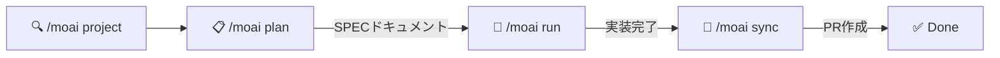
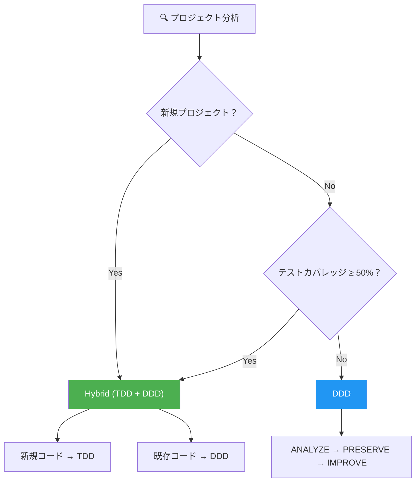
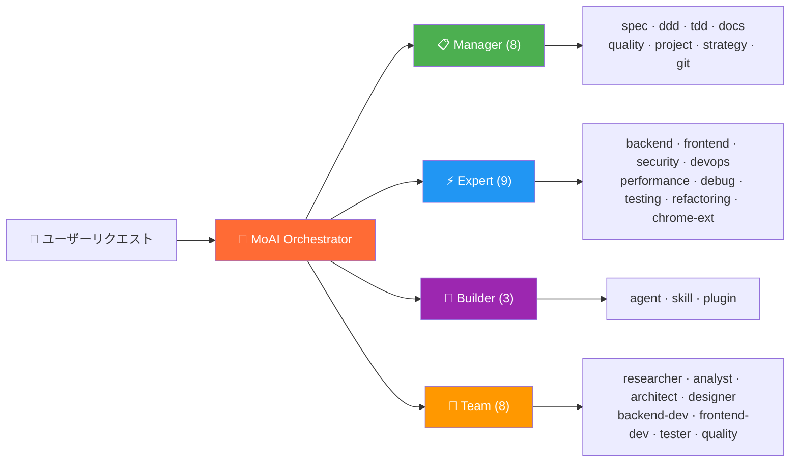
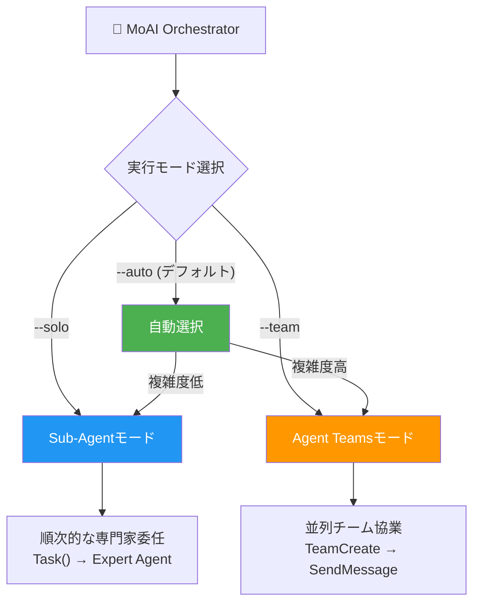
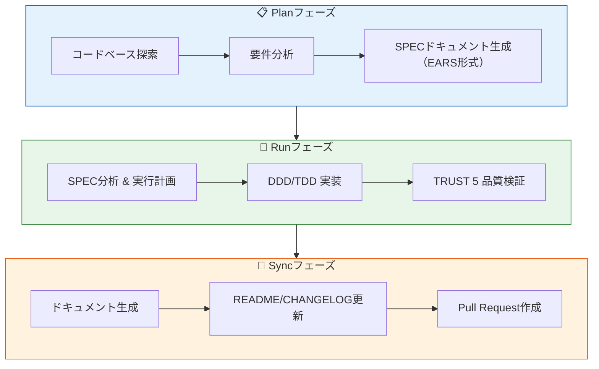

<p align="center">
  
</p>

<h1 align="center">MoAI-ADK</h1>

<p align="center">
  <strong>Claude Codeのための Agentic Development Kit</strong>
</p>

<p align="center">
  <a href="./README.md">English</a> ·
  <a href="./README.ko.md">한국어</a> ·
  <a href="./README.ja.md">日本語</a> ·
  <a href="./README.zh.md">中文</a>
</p>

<p align="center">
  <a href="https://github.com/modu-ai/moai-adk/actions/workflows/ci.yml"></a>
  <a href="https://github.com/modu-ai/moai-adk/actions/workflows/codeql.yml"></a>
  <a href="https://codecov.io/gh/modu-ai/moai-adk"></a>
  <br>
  <a href="https://go.dev/"></a>
  <a href="https://github.com/modu-ai/moai-adk/releases"></a>
  <a href="./LICENSE"></a>
</p>

<p align="center">
  <a href="https://adk.mo.ai.kr"><strong>Official Documentation</strong></a>
</p>

---

> 📚 **[公式ドキュメント](https://adk.mo.ai.kr)** | **[GitHub Discussions](https://github.com/modu-ai/moai-adk/discussions)**

---

> **「バイブコーディングの目的は、素早い生産性ではなく、コード品質である。」**

MoAI-ADKは、Claude Codeのための**高性能AI開発環境**です。28の専門AIエージェントと52のスキルが連携し、品質の高いコードを生み出します。新規プロジェクトにはHybrid方法論（TDD + DDD）を、既存プロジェクトにはDDDを自動的に適用し、Sub-AgentとAgent Teamsの二重実行モードをサポートします。

Goで書かれたシングルバイナリ -- 依存関係なしに、あらゆるプラットフォームで即座に実行できます。

---

## なぜMoAI-ADKなのか？

PythonベースのMoAI-ADK（約73,000行）をGoで完全に書き直しました。

| 項目 | Python Edition | Go Edition |
|------|---------------|------------|
| デプロイ | pip + venv + 依存関係 | **シングルバイナリ**、依存関係なし |
| 起動時間 | ~800ms インタプリタ起動 | **~5ms** ネイティブ実行 |
| 並行処理 | asyncio / threading | **ネイティブgoroutines** |
| 型安全性 | ランタイム（mypy任意） | **コンパイル時に強制** |
| クロスプラットフォーム | Pythonランタイムが必要 | **ビルド済みバイナリ**（macOS, Linux, Windows） |
| フック実行 | Shellラッパー + Python | **コンパイル済みバイナリ**、JSONプロトコル |

### 主要な数値

- **34,220行** Goコード、**32個**のパッケージ
- **85-100%** テストカバレッジ
- **28個** 専門AIエージェント + **52個** スキル
- **18個** プログラミング言語対応
- **8個** Claude Codeフックイベント

---

## システム要件

| プラットフォーム | サポート環境 | 備考 |
|----------------|------------|------|
| macOS | Terminal, iTerm2 | 完全サポート |
| Linux | Bash, Zsh | 完全サポート |
| Windows | **WSL（推奨）**, PowerShell 7.x+ | ネイティブcmd.exeは非サポート |

**前提条件：**
- **Git**が全プラットフォームでインストールされている必要があります
- **Windowsユーザー**: [Git for Windows](https://gitforwindows.org/)が**必須**です（Git Bash含む）
  - **WSL**（Windows Subsystem for Linux）の使用を推奨します
  - PowerShell 7.x以上も対応しています
  - レガシーWindows PowerShell 5.xおよびcmd.exeは**非サポート**です

---

## クイックスタート

### 1. インストール

#### macOS / Linux / WSL

```bash
curl -fsSL https://raw.githubusercontent.com/modu-ai/moai-adk/main/install.sh | bash
```

#### Windows（PowerShell 7.x+）

> **推奨**: 最適な体験のため、WSLで上記のLinuxインストールコマンドを使用してください。

```powershell
irm https://raw.githubusercontent.com/modu-ai/moai-adk/main/install.ps1 | iex
```

> [Git for Windows](https://gitforwindows.org/)が先にインストールされている必要があります。

#### ソースからビルド（Go 1.25+）

```bash
git clone https://github.com/modu-ai/moai-adk.git
cd moai-adk && make build
```

> ビルド済みバイナリは[Releases](https://github.com/modu-ai/moai-adk/releases)ページからダウンロードできます。

### 2. プロジェクトの初期化

```bash
moai init my-project
```

対話型ウィザードが言語、フレームワーク、方法論を自動検出し、Claude Code統合ファイルを生成します。

### 3. Claude Codeで開発を開始

```bash
# Claude Code 起動後
/moai project                            # プロジェクトドキュメント生成（product.md, structure.md, tech.md）
/moai plan "ユーザー認証機能を追加"       # SPECドキュメント生成
/moai run SPEC-AUTH-001                   # DDD/TDD 実装
/moai sync SPEC-AUTH-001                  # ドキュメント同期 & PR作成
```



---

## MoAI開発方法論

MoAI-ADKは、プロジェクトの状態に応じて最適な開発方法論を自動選択します。



### Hybrid方法論（新規プロジェクトのデフォルト）

新規プロジェクトおよび継続的な開発に推奨される方法論です。コードの種類に応じてTDDとDDDを自動的に適用します。

| コード種類 | 方法論 | サイクル | 説明 |
|-----------|--------|--------|------|
| 新規コード | **TDD** | RED → GREEN → REFACTOR | テストを先に書き、通過させた後、リファクタリング |
| 既存コード | **DDD** | ANALYZE → PRESERVE → IMPROVE | 既存の振る舞いを分析し、特性テストで保全した後、段階的に改善 |

### DDD方法論（既存プロジェクト）

テストカバレッジが低い既存プロジェクトで安全にリファクタリングするための方法論です。

```
ANALYZE   → 既存コードと依存関係の分析、ドメイン境界の特定
PRESERVE  → 特性テストの作成、現在の振る舞いのスナップショット取得
IMPROVE   → テストで保護された状態での段階的な改善
```

> 方法論は `moai init` 時に自動選択され、`.moai/config/sections/quality.yaml` の `development_mode` で変更できます。

---

## AIエージェントオーケストレーション

MoAIは**戦略的オーケストレーター**です。直接コードを書くのではなく、28の専門エージェントにタスクを委任します。



### エージェントカテゴリ

| カテゴリ | 数量 | エージェント | 役割 |
|----------|------|---------|------|
| **Manager** | 8 | spec, ddd, tdd, docs, quality, project, strategy, git | ワークフロー調整、SPEC作成、品質管理 |
| **Expert** | 9 | backend, frontend, security, devops, performance, debug, testing, refactoring, chrome-extension | ドメイン専門の実装、分析、最適化 |
| **Builder** | 3 | agent, skill, plugin | 新しいMoAIコンポーネントの作成 |
| **Team** | 8 | researcher, analyst, architect, designer, backend-dev, frontend-dev, tester, quality | 並列チームベースの開発 |

### 52スキル（プログレッシブディスクロージャー）

トークン効率のため、3段階のプログレッシブディスクロージャーシステムで管理されています：

| カテゴリ | スキル数 | 例 |
|----------|---------|------|
| **Foundation** | 5 | core, claude, philosopher, quality, context |
| **Workflow** | 11 | spec, project, ddd, tdd, testing, worktree, thinking... |
| **Domain** | 5 | backend, frontend, database, uiux, data-formats |
| **Language** | 18 | Go, Python, TypeScript, Rust, Java, Kotlin, Swift, C++... |
| **Platform** | 9 | Vercel, Supabase, Firebase, Auth0, Clerk, Railway... |
| **Library** | 3 | shadcn, nextra, mermaid |
| **Tool** | 2 | ast-grep, svg |
| **Specialist** | 11 | Figma, Flutter, Chrome Extension, Pencil... |

---

## モデルポリシー（トークン最適化）

MoAI-ADKは、Claude Codeサブスクリプションプランに基づいて、28のエージェントに最適なAIモデルを割り当てます。プランのレート制限内で品質を最大化します。

| ポリシー | プラン | Opus | Sonnet | Haiku | 用途 |
|----------|--------|------|--------|-------|------|
| **High** | Max $200/月 | 23 | 1 | 4 | 最高品質、最大スループット |
| **Medium** | Max $100/月 | 4 | 19 | 5 | 品質とコストのバランス |
| **Low** | Plus $20/月 | 0 | 12 | 16 | 経済的、Opusなし |

> **なぜ重要なのか？** Plus $20プランにはOpusが含まれていません。`Low`に設定すると、すべてのエージェントがSonnetとHaikuのみを使用し、レート制限エラーを防止します。上位プランでは、重要なエージェント（セキュリティ、戦略、アーキテクチャ）にOpusを、通常タスクにSonnet/Haikuを配分します。

### 設定方法

```bash
# プロジェクト初期化時
moai init my-project          # 対話型ウィザードでモデルポリシーを選択

# 既存プロジェクトの再設定
moai update -c                # 設定ウィザードを再実行
```

> デフォルトポリシーは `High` です。`moai update` 実行後、`moai update -c` でこの設定を構成するよう案内が表示されます。

---

## 二重実行モード

MoAI-ADKは、Claude Codeがサポートする**Sub-Agent**と**Agent Teams**の2つの実行モードを提供します。



### Sub-Agentモード (`--solo`)

既存のClaude Codeの `Task()` APIを活用した順次的なエージェント委任方式です。

- 1つの専門エージェントにタスクを委任し、結果を受け取る
- 段階的にManager → Expert → Qualityの順に進行
- シンプルで予測可能なワークフローに最適

```bash
/moai run SPEC-AUTH-001 --solo    # Sub-Agentモードを強制
```

### Agent Teamsモード (`--team`)

Claude CodeのAgent Teams APIを活用した並列チームベースの開発方式です。

- 複数のエージェントが同時に作業し、共有タスクリストで協業
- `TeamCreate`、`SendMessage`、`TaskList`によるリアルタイム調整
- 大規模な機能開発やマルチドメインタスクに最適

```bash
/moai plan "大規模機能" --team   # Plan: researcher + analyst + architect 並列
/moai run SPEC-XXX --team         # Run: backend-dev + frontend-dev + tester 並列
```

### 自動モード (`--auto`、デフォルト)

プロジェクトの複雑度を分析し、最適なモードを自動選択します：

| 条件 | 選択モード |
|------|-----------|
| ドメイン3つ以上 | Agent Teams |
| 影響ファイル10以上 | Agent Teams |
| 複雑度スコア7以上 | Agent Teams |
| その他 | Sub-Agent |

---

## MoAIワークフロー

### Plan → Run → Sync パイプライン

MoAIの中核ワークフローは3つのフェーズで構成されています：



### 自律開発ループ（Ralph Engine）

LSP診断とAST-grepを組み合わせた自律的なエラー修正エンジンです：

```bash
/moai fix       # シングルパス：スキャン → 分類 → 修正 → 検証
/moai loop      # 反復修正：完了マーカー検出まで繰り返し（最大100回）
```

**Ralph Engineの動作：**
1. **並列スキャン**：LSP診断 + AST-grep + リンターを同時実行
2. **自動分類**：エラーをLevel 1（自動修正）～ Level 4（ユーザー介入）に分類
3. **収束検知**：同一エラーの繰り返し時に代替戦略を適用
4. **完了条件**：0エラー、0型エラー、85%以上のカバレッジ

---

## TRUST 5 品質フレームワーク

すべてのコード変更は、5つの品質基準で検証されます：

| 基準 | 説明 | 検証項目 |
|------|------|-----------|
| **T**ested | テスト済み | 85%以上のカバレッジ、特性テスト、ユニットテスト合格 |
| **R**eadable | 可読性が高い | 明確な命名規則、一貫したコードスタイル、リントエラー0 |
| **U**nified | 統一されている | 一貫したフォーマット、インポート順序、プロジェクト構造の遵守 |
| **S**ecured | 安全である | OWASP準拠、入力検証、セキュリティ警告0 |
| **T**rackable | 追跡可能 | コンベンショナルコミット、Issue参照、構造化ログ |

---

## CLIコマンド

| コマンド | 説明 |
|--------|------|
| `moai init` | 対話型プロジェクト設定（言語/フレームワーク/方法論の自動検出） |
| `moai doctor` | システム状態の診断と環境検証 |
| `moai status` | Gitブランチ、品質メトリクスなどのプロジェクト状態概要 |
| `moai update` | 最新バージョンへのアップデート（自動ロールバック対応） |
| `moai update --check` | インストールなしでアップデートを確認 |
| `moai update --project` | プロジェクトテンプレートのみ同期 |
| `moai worktree new <name>` | 新しいGit worktreeを作成（並列ブランチ開発） |
| `moai worktree list` | アクティブなworktree一覧 |
| `moai worktree switch <name>` | worktreeの切り替え |
| `moai worktree sync` | アップストリームと同期 |
| `moai worktree remove <name>` | worktreeの削除 |
| `moai worktree clean` | 古いworktreeのクリーンアップ |
| `moai worktree go <name>` | 現在のシェルでworktreeディレクトリに移動 |
| `moai hook <event>` | Claude Codeフックディスパッチャー |
| `moai version` | バージョン、コミットハッシュ、ビルド日時の情報 |

---

## アーキテクチャ

```
moai-adk/
├── cmd/moai/             # アプリケーションエントリポイント
├── internal/             # コアプライベートパッケージ
│   ├── astgrep/          # AST-grep統合
│   ├── cli/              # Cobra CLIコマンド定義
│   ├── config/           # スレッドセーフなYAML設定管理
│   ├── core/
│   │   ├── git/          # Git操作（ブランチ、worktree、コンフリクト検出）
│   │   ├── project/      # プロジェクト初期化、言語/フレームワーク検出
│   │   └── quality/      # TRUST 5 品質ゲート、並列バリデーター
│   ├── defs/             # 言語定義とフレームワーク検出
│   ├── git/              # Gitコンベンション検証エンジン
│   ├── hook/             # コンパイル済みフックシステム（8イベント、JSONプロトコル）
│   ├── loop/             # Ralphフィードバックループ（状態マシン、収束検知）
│   ├── lsp/              # LSPクライアント（16以上の言語、並列サーバー管理）
│   ├── manifest/         # ファイル追跡（SHA-256整合性）
│   ├── merge/            # 3-wayマージエンジン（6つの戦略）
│   ├── rank/             # MoAI Rank同期とトランスクリプト管理
│   ├── resilience/       # リトライポリシーとサーキットブレーカー
│   ├── shell/            # シェル統合（worktreeナビゲーション）
│   ├── statusline/       # Claude Codeステータスライン統合
│   ├── template/         # テンプレートデプロイ（go:embed）、設定生成
│   ├── ui/               # 対話型TUI（セレクター、チェックボックス、ウィザード）
│   └── update/           # バイナリ自己更新メカニズム
├── pkg/                  # パブリックライブラリパッケージ
│   ├── models/           # 共有データモデル
│   └── version/          # ビルドバージョンメタデータ
└── Makefile              # ビルド自動化
```

### 主要パッケージカバレッジ

| パッケージ | 目的 | カバレッジ |
|--------|------|----------|
| `foundation` | EARSパターン、TRUST 5、18言語定義 | 98.4% |
| `core/quality` | 並列バリデーター、フェーズゲート | 96.8% |
| `ui` | 対話型TUIコンポーネント | 96.8% |
| `config` | スレッドセーフYAML設定 | 94.1% |
| `loop` | Ralphフィードバックループ、収束検知 | 92.7% |
| `cli` | Cobraコマンド | 92.0% |
| `ralph` | 収束判定エンジン | 100% |
| `statusline` | Claude Codeステータスライン | 100% |

---

## スポンサー

### z.ai GLM 5

MoAI-ADKは**z.ai GLM 5**とのパートナーシップにより、経済的なAI開発環境を提供しています。

| 特典 | 説明 |
|------|------|
| 70%コスト削減 | Claudeの1/7の価格で同等のパフォーマンス |
| 完全互換 | Claude Codeとコード変更なしで利用可能 |
| 無制限利用 | 日次/週次のトークン制限なく自由に利用 |

**[GLM 5に登録する（10%追加割引）](https://z.ai/subscribe?ic=1NDV03BGWU)** -- 登録リワードはMoAIオープンソース開発に使用されます。

---

## コントリビューション

コントリビューションを歓迎します！ 詳しいガイドは[CONTRIBUTING.md](CONTRIBUTING.md)をご覧ください。

### クイックスタート

1. リポジトリをフォークしてください
2. フィーチャーブランチを作成：`git checkout -b feature/my-feature`
3. テストを作成（新規コードはTDD、既存コードは特性テスト）
4. すべてのテストの合格を確認：`make test`
5. リンティングの合格を確認：`make lint`
6. コードフォーマット：`make fmt`
7. コンベンショナルコミットメッセージでコミット
8. プルリクエストをオープン

**コード品質要件**：85%以上のカバレッジ / リントエラー0 / 型エラー0 / コンベンショナルコミット

### コミュニティ

- [GitHub Discussions](https://github.com/modu-ai/moai-adk/discussions) -- 質問、アイデア、フィードバック
- [Issues](https://github.com/modu-ai/moai-adk/issues) -- バグ報告、機能リクエスト

---

## Star History

[](https://www.star-history.com/#modu-ai/moai-adk&type=date&legend=top-left)

---

## ライセンス

[Copyleft 3.0](./LICENSE) -- 詳細はLICENSEファイルをご参照ください。

## 関連リンク

- [公式ドキュメント](https://adk.mo.ai.kr)
- [Claude Code](https://docs.anthropic.com/en/docs/claude-code)
- [GitHub Discussions](https://github.com/modu-ai/moai-adk/discussions) -- 質問、アイデア、コミュニティ
