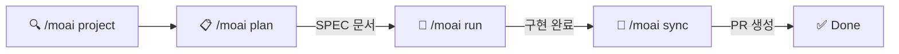
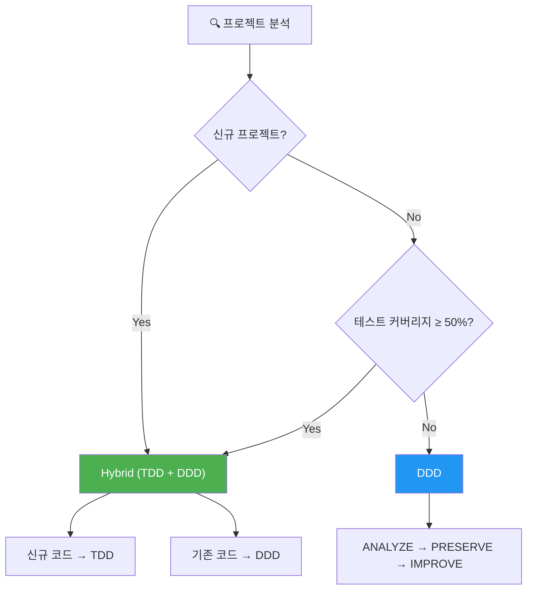
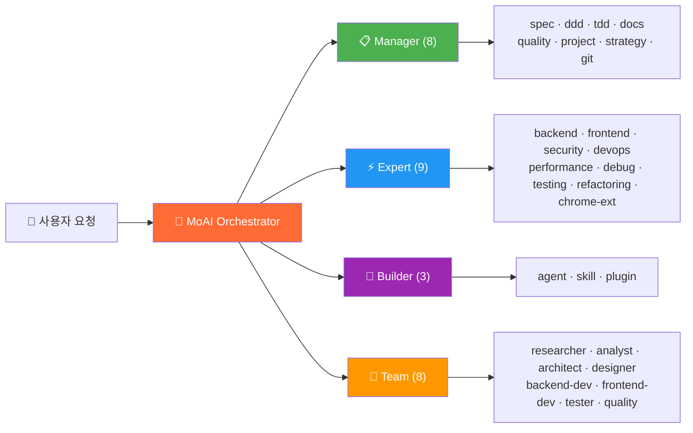
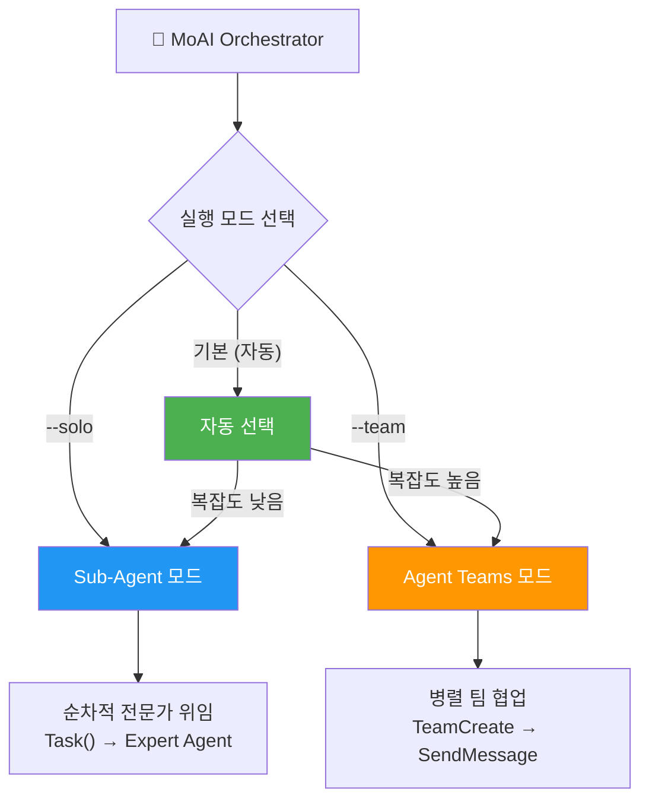
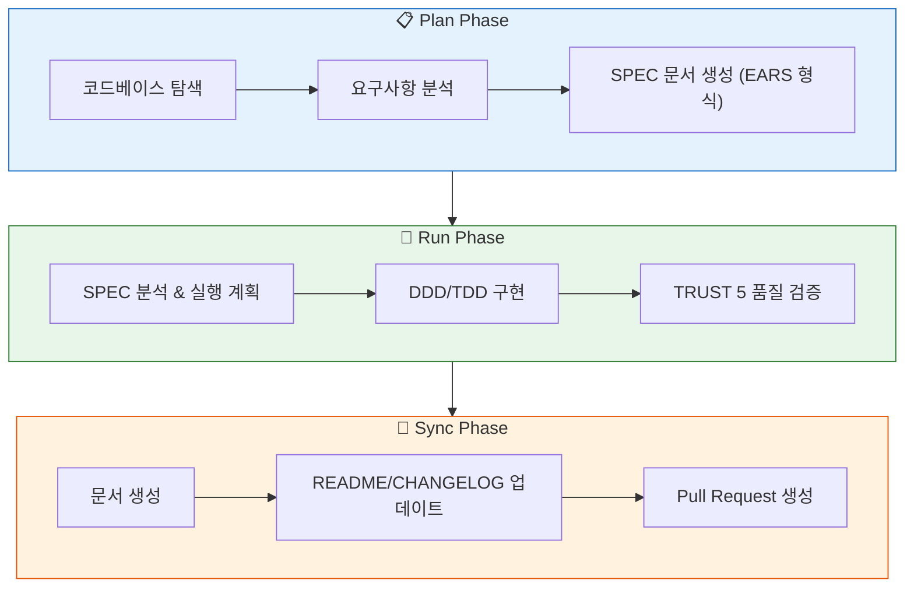

<p align="center">
  
</p>

<h1 align="center">MoAI-ADK</h1>

<p align="center">
  <strong>Claude Code를 위한 Agentic Development Kit</strong>
</p>

<p align="center">
  <a href="./README.md">English</a> ·
  <a href="./README.ko.md">한국어</a> ·
  <a href="./README.ja.md">日本語</a> ·
  <a href="./README.zh.md">中文</a>
</p>

<p align="center">
  <a href="https://github.com/modu-ai/moai-adk/actions/workflows/ci.yml"></a>
  <a href="https://github.com/modu-ai/moai-adk/actions/workflows/codeql.yml"></a>
  <a href="https://codecov.io/gh/modu-ai/moai-adk"></a>
  <br>
  <a href="https://go.dev/"></a>
  <a href="https://github.com/modu-ai/moai-adk/releases"></a>
  <a href="./LICENSE"></a>
</p>

<p align="center">
  <a href="https://adk.mo.ai.kr"><strong>Official Documentation</strong></a>
</p>

---

> 📚 **[공식 문서](https://adk.mo.ai.kr)** | **[GitHub Discussions](https://github.com/modu-ai/moai-adk/discussions)** | **[Discord 커뮤니티](https://discord.gg/moai-adk)**

---

> **"바이브 코딩의 목적은 빠른 생산성이 아니라 코드 품질이다."**

MoAI-ADK는 Claude Code를 위한 **고성능 AI 개발 환경**입니다. 28개 전문 AI 에이전트와 52개 스킬이 협력하여 품질 있는 코드를 만듭니다. 신규 프로젝트에는 Hybrid 방법론(TDD + DDD)을, 기존 프로젝트에는 DDD를 자동 적용하며, Sub-Agent와 Agent Teams 이중 실행 모드를 지원합니다.

Go로 작성된 단일 바이너리 — 의존성 없이 모든 플랫폼에서 즉시 실행됩니다.

---

## 왜 MoAI-ADK인가?

Python 기반 MoAI-ADK(~73,000줄)를 Go로 완전히 재작성했습니다.

| 항목 | Python Edition | Go Edition |
|------|---------------|------------|
| 배포 | pip + venv + 의존성 | **단일 바이너리**, 의존성 없음 |
| 시작 시간 | ~800ms 인터프리터 부팅 | **~5ms** 네이티브 실행 |
| 동시성 | asyncio / threading | **네이티브 goroutines** |
| 타입 안전성 | 런타임 (mypy 선택) | **컴파일 타임 강제** |
| 크로스 플랫폼 | Python 런타임 필요 | **프리빌트 바이너리** (macOS, Linux, Windows) |
| 훅 실행 | Shell 래퍼 + Python | **컴파일된 바이너리**, JSON 프로토콜 |

### 핵심 수치

- **34,220줄** Go 코드, **32개** 패키지
- **85-100%** 테스트 커버리지
- **28개** 전문 AI 에이전트 + **52개** 스킬
- **18개** 프로그래밍 언어 지원
- **8개** Claude Code 훅 이벤트

---

## 시스템 요구사항

| 플랫폼 | 지원 환경 | 비고 |
|--------|----------|------|
| macOS | Terminal, iTerm2 | 완전 지원 |
| Linux | Bash, Zsh | 완전 지원 |
| Windows | **WSL (권장)**, PowerShell 7.x+ | 네이티브 cmd.exe 미지원 |

**필수 조건:**
- **Git**이 모든 플랫폼에서 설치되어 있어야 합니다
- **Windows 사용자**: [Git for Windows](https://gitforwindows.org/) **필수 설치** (Git Bash 포함)
  - **WSL** (Windows Subsystem for Linux) 사용을 권장합니다
  - PowerShell 7.x 이상도 지원됩니다
  - 레거시 Windows PowerShell 5.x 및 cmd.exe는 **지원하지 않습니다**

---

## 빠른 시작

### 1. 설치

#### macOS / Linux / WSL

```bash
curl -fsSL https://raw.githubusercontent.com/modu-ai/moai-adk/main/install.sh | bash
```

#### Windows (PowerShell 7.x+)

> **권장**: 최상의 경험을 위해 WSL에서 위의 Linux 설치 명령어를 사용하세요.

```powershell
irm https://raw.githubusercontent.com/modu-ai/moai-adk/main/install.ps1 | iex
```

> [Git for Windows](https://gitforwindows.org/)가 먼저 설치되어 있어야 합니다.

#### 소스에서 빌드 (Go 1.25+)

```bash
git clone https://github.com/modu-ai/moai-adk.git
cd moai-adk && make build
```

> 프리빌트 바이너리는 [Releases](https://github.com/modu-ai/moai-adk/releases) 페이지에서 다운로드할 수 있습니다.

### 2. 프로젝트 초기화

```bash
moai init my-project
```

대화형 마법사가 언어, 프레임워크, 방법론을 자동 감지하고 Claude Code 통합 파일을 생성합니다.

### 3. Claude Code에서 개발 시작

```bash
# Claude Code 실행 후
/moai project                            # 프로젝트 문서 생성 (product.md, structure.md, tech.md)
/moai plan "사용자 인증 기능 추가"        # SPEC 문서 생성
/moai run SPEC-AUTH-001                   # DDD/TDD 구현
/moai sync SPEC-AUTH-001                  # 문서 동기화 & PR 생성
```



---

## MoAI 개발 방법론

MoAI-ADK는 프로젝트 상태에 따라 최적의 개발 방법론을 자동 선택합니다.



### Hybrid 방법론 (신규 프로젝트 기본값)

신규 프로젝트와 지속적 개발에 권장되는 방법론입니다. 코드 유형에 따라 TDD와 DDD를 자동 적용합니다.

| 코드 유형 | 방법론 | 사이클 | 설명 |
|-----------|--------|--------|------|
| 신규 코드 | **TDD** | RED → GREEN → REFACTOR | 테스트를 먼저 작성하고, 통과시킨 후, 리팩토링 |
| 기존 코드 | **DDD** | ANALYZE → PRESERVE → IMPROVE | 기존 동작을 분석하고, 특성 테스트로 보존한 후, 점진적 개선 |

### DDD 방법론 (기존 프로젝트)

테스트 커버리지가 낮은 기존 프로젝트에서 안전하게 리팩토링하기 위한 방법론입니다.

```
ANALYZE   → 기존 코드와 의존성 분석, 도메인 경계 식별
PRESERVE  → 특성 테스트 작성, 현재 동작 스냅샷 캡처
IMPROVE   → 테스트로 보호된 상태에서 점진적 개선
```

> 방법론은 `moai init` 시 자동 선택되며, `.moai/config/sections/quality.yaml`의 `development_mode`에서 변경할 수 있습니다.

---

## AI 에이전트 오케스트레이션

MoAI는 **전략적 오케스트레이터**입니다. 직접 코드를 작성하지 않고, 28개 전문 에이전트에게 작업을 위임합니다.



### 에이전트 카테고리

| 카테고리 | 수량 | 에이전트 | 역할 |
|----------|------|---------|------|
| **Manager** | 8 | spec, ddd, tdd, docs, quality, project, strategy, git | 워크플로우 조율, SPEC 생성, 품질 관리 |
| **Expert** | 9 | backend, frontend, security, devops, performance, debug, testing, refactoring, chrome-extension | 도메인 전문 구현, 분석, 최적화 |
| **Builder** | 3 | agent, skill, plugin | 새로운 MoAI 컴포넌트 생성 |
| **Team** | 8 | researcher, analyst, architect, designer, backend-dev, frontend-dev, tester, quality | 병렬 팀 기반 개발 |

### 52개 스킬 (프로그레시브 디스클로저)

토큰 효율을 위해 3단계 프로그레시브 디스클로저 시스템으로 관리됩니다:

| 카테고리 | 스킬 수 | 예시 |
|----------|---------|------|
| **Foundation** | 5 | core, claude, philosopher, quality, context |
| **Workflow** | 11 | spec, project, ddd, tdd, testing, worktree, thinking... |
| **Domain** | 5 | backend, frontend, database, uiux, data-formats |
| **Language** | 18 | Go, Python, TypeScript, Rust, Java, Kotlin, Swift, C++... |
| **Platform** | 9 | Vercel, Supabase, Firebase, Auth0, Clerk, Railway... |
| **Library** | 3 | shadcn, nextra, mermaid |
| **Tool** | 2 | ast-grep, svg |
| **Specialist** | 11 | Figma, Flutter, Chrome Extension, Pencil... |

---

## 모델 정책 (토큰 최적화)

MoAI-ADK는 Claude Code 구독 요금제에 맞춰 28개 에이전트에 최적의 AI 모델을 할당합니다. 요금제의 사용량 제한 내에서 품질을 극대화합니다.

| 정책 | 요금제 | Opus | Sonnet | Haiku | 용도 |
|------|--------|------|--------|-------|------|
| **High** | Max $200/월 | 23 | 1 | 4 | 최고 품질, 최대 처리량 |
| **Medium** | Max $100/월 | 4 | 19 | 5 | 품질과 비용의 균형 |
| **Low** | Plus $20/월 | 0 | 12 | 16 | 경제적, Opus 미포함 |

> **왜 중요한가요?** Plus $20 요금제는 Opus를 포함하지 않습니다. `Low`로 설정하면 모든 에이전트가 Sonnet과 Haiku만 사용하여 사용량 제한 오류를 방지합니다. 상위 요금제에서는 핵심 에이전트(보안, 전략, 아키텍처)에 Opus를, 일반 작업에 Sonnet/Haiku를 배분합니다.

### 설정 방법

```bash
# 프로젝트 초기화 시
moai init my-project          # 대화형 마법사에서 모델 정책 선택

# 기존 프로젝트 재설정
moai update -c                # 설정 마법사 재실행
```

> 기본 정책은 `High`입니다. `moai update` 실행 후, `moai update -c`로 이 설정을 구성하도록 안내가 표시됩니다.

---

## 이중 실행 모드

MoAI-ADK는 Claude Code가 지원하는 **Sub-Agent**와 **Agent Teams** 두 가지 실행 모드를 모두 제공합니다.



### Agent Teams 모드 (기본값)

MoAI-ADK는 프로젝트 복잡도를 자동으로 분석하여 최적의 실행 모드를 선택합니다:

| 조건 | 선택 모드 | 이유 |
|------|-----------|------|
| 도메인 3개 이상 | Agent Teams | 멀티 도메인 조율 |
| 영향 파일 10개 이상 | Agent Teams | 대규모 변경 |
| 복잡도 점수 7 이상 | Agent Teams | 높은 복잡도 |
| 그 외 | Sub-Agent | 단순하고 예측 가능한 워크플로우 |

**Agent Teams 모드**는 병렬 팀 기반 개발을 사용합니다:

- 여러 에이전트가 동시에 작업하고 공유 작업 목록으로 협업
- `TeamCreate`, `SendMessage`, `TaskList`를 통한 실시간 조율
- 대규모 기능 개발, 멀티 도메인 작업에 적합

```bash
/moai plan "대규모 기능"          # 자동: researcher + analyst + architect 병렬
/moai run SPEC-XXX                # 자동: backend-dev + frontend-dev + tester 병렬
/moai run SPEC-XXX --team         # Agent Teams 모드 강제
```

### Sub-Agent 모드 (`--solo`)

기존 Claude Code의 `Task()` API를 활용한 순차적 에이전트 위임 방식입니다.

- 하나의 전문 에이전트에게 작업을 위임하고 결과를 받음
- 단계별로 Manager → Expert → Quality 순서로 진행
- 단순하고 예측 가능한 워크플로우에 적합

```bash
/moai run SPEC-AUTH-001 --solo    # Sub-Agent 모드 강제
```

---

## MoAI 워크플로우

### Plan → Run → Sync 파이프라인

MoAI의 핵심 워크플로우는 3단계로 구성됩니다:



### 자율 개발 루프 (Ralph Engine)

LSP 진단과 AST-grep을 결합한 자율 에러 수정 엔진입니다:

```bash
/moai fix       # 단일 패스: 스캔 → 분류 → 수정 → 검증
/moai loop      # 반복 수정: 완료 마커 감지까지 반복 (최대 100회)
```

**Ralph Engine 동작:**
1. **병렬 스캔**: LSP 진단 + AST-grep + 린터를 동시 실행
2. **자동 분류**: 에러를 Level 1(자동 수정) ~ Level 4(사용자 개입)로 분류
3. **수렴 감지**: 동일 에러 반복 시 대체 전략 적용
4. **완료 조건**: 0 에러, 0 타입 에러, 85%+ 커버리지

---

## TRUST 5 품질 프레임워크

모든 코드 변경은 5가지 품질 기준으로 검증됩니다:

| 기준 | 설명 | 검증 항목 |
|------|------|-----------|
| **T**ested | 테스트됨 | 85%+ 커버리지, 특성 테스트, 유닛 테스트 통과 |
| **R**eadable | 읽기 쉬움 | 명확한 명명 규칙, 일관된 코드 스타일, 린트 오류 0 |
| **U**nified | 통일됨 | 일관된 포맷팅, 임포트 순서, 프로젝트 구조 준수 |
| **S**ecured | 안전함 | OWASP 준수, 입력 검증, 보안 경고 0 |
| **T**rackable | 추적 가능 | 컨벤셔널 커밋, 이슈 참조, 구조화된 로그 |

---

## CLI 명령어

| 명령어 | 설명 |
|--------|------|
| `moai init` | 대화형 프로젝트 설정 (언어/프레임워크/방법론 자동 감지) |
| `moai doctor` | 시스템 상태 진단 및 환경 검증 |
| `moai status` | Git 브랜치, 품질 메트릭 등 프로젝트 상태 요약 |
| `moai update` | 최신 버전으로 업데이트 (자동 롤백 지원) |
| `moai update --check` | 설치 없이 업데이트 확인 |
| `moai update --project` | 프로젝트 템플릿만 동기화 |
| `moai worktree new <name>` | 새 Git worktree 생성 (병렬 브랜치 개발) |
| `moai worktree list` | 활성 worktree 목록 |
| `moai worktree switch <name>` | worktree 전환 |
| `moai worktree sync` | 업스트림과 동기화 |
| `moai worktree remove <name>` | worktree 제거 |
| `moai worktree clean` | 오래된 worktree 정리 |
| `moai worktree go <name>` | 현재 셸에서 worktree 디렉토리로 이동 |
| `moai hook <event>` | Claude Code 훅 디스패처 |
| `moai version` | 버전, 커밋 해시, 빌드 날짜 정보 |

---

## 아키텍처

```
moai-adk/
├── cmd/moai/             # 애플리케이션 진입점
├── internal/             # 핵심 프라이빗 패키지
│   ├── astgrep/          # AST-grep 통합
│   ├── cli/              # Cobra CLI 명령어 정의
│   ├── config/           # 스레드 안전 YAML 구성 관리
│   ├── core/
│   │   ├── git/          # Git 작업 (브랜치, worktree, 충돌 감지)
│   │   ├── project/      # 프로젝트 초기화, 언어/프레임워크 감지
│   │   └── quality/      # TRUST 5 품질 게이트, 병렬 검증기
│   ├── defs/             # 언어 정의 및 프레임워크 감지
│   ├── git/              # Git 컨벤션 검증 엔진
│   ├── hook/             # 컴파일된 훅 시스템 (8개 이벤트, JSON 프로토콜)
│   ├── loop/             # Ralph 피드백 루프 (상태 머신, 수렴 감지)
│   ├── lsp/              # LSP 클라이언트 (16개+ 언어, 병렬 서버 관리)
│   ├── manifest/         # 파일 출적 추적 (SHA-256 무결성)
│   ├── merge/            # 3-way 병합 엔진 (6가지 전략)
│   ├── rank/             # MoAI Rank 동기화 및 트랜스크립트 관리
│   ├── resilience/       # 재시도 정책 및 서킷 브레이커
│   ├── shell/            # 셸 통합 (worktree 내비게이션)
│   ├── statusline/       # Claude Code 상태줄 통합
│   ├── template/         # 템플릿 배포 (go:embed), 설정 생성
│   ├── ui/               # 대화형 TUI (선택기, 체크박스, 마법사)
│   └── update/           # 바이너리 자체 업데이트 메커니즘
├── pkg/                  # 퍼블릭 라이브러리 패키지
│   ├── models/           # 공유 데이터 모델
│   └── version/          # 빌드 버전 메타데이터
└── Makefile              # 빌드 자동화
```

### 주요 패키지 커버리지

| 패키지 | 목적 | 커버리지 |
|--------|------|----------|
| `foundation` | EARS 패턴, TRUST 5, 18개 언어 정의 | 98.4% |
| `core/quality` | 병렬 검증기, 페이즈 게이트 | 96.8% |
| `ui` | 대화형 TUI 컴포넌트 | 96.8% |
| `config` | 스레드 안전 YAML 구성 | 94.1% |
| `loop` | Ralph 피드백 루프, 수렴 감지 | 92.7% |
| `cli` | Cobra 명령어 | 92.0% |
| `ralph` | 수렴 결정 엔진 | 100% |
| `statusline` | Claude Code 상태줄 | 100% |

---

## 스폰서

### z.ai GLM 5

MoAI-ADK는 **z.ai GLM 5**과 파트너십을 통해 경제적인 AI 개발 환경을 제공합니다.

| 혜택 | 설명 |
|------|------|
| 70% 비용 절감 | Claude 대비 1/7 가격으로 동등한 성능 |
| 완벽 호환 | Claude Code와 코드 수정 없이 사용 가능 |
| 무제한 사용 | 일간/주간 토큰 리밋 없이 자유롭게 사용 |

**[GLM 5 가입하기 (10% 추가 할인)](https://z.ai/subscribe?ic=1NDV03BGWU)** — 가입 리워드는 MoAI 오픈소스 개발에 사용됩니다.

---

## 자주 묻는 질문 (FAQ)

### Q: statusline의 버전 표시는 무엇을 의미하나요?

MoAI statusline은 버전 정보와 업데이트 알림을 함께 표시합니다:

```
🗿 v2.2.2 ⬆️ v2.2.5
```

- **`v2.2.2`**: 현재 설치된 버전
- **`⬆️ v2.2.5`**: 업데이트 가능한 새 버전

최신 버전을 사용 중일 때는 버전 번호만 표시됩니다:
```
🗿 v2.2.5
```

**업데이트 방법**: `moai update` 실행 시 업데이트 알림이 사라집니다.

**참고**: Claude Code의 빌트인 버전 표시(`🔅 v2.1.38`)와는 다릅니다. MoAI 표시는 MoAI-ADK 버전을 추적하며, Claude Code는 자체 버전을 별도로 표시합니다.

---

### Q: "Allow external CLAUDE.md file imports?" 경고가 나타납니다

프로젝트를 열 때 Claude Code가 외부 파일 import에 대한 보안 프롬프트를 표시할 수 있습니다:

```
External imports:
  /Users/<user>/.moai/config/sections/quality.yaml
  /Users/<user>/.moai/config/sections/user.yaml
  /Users/<user>/.moai/config/sections/language.yaml
```

**권장 조치**: **"No, disable external imports"** 선택 ✅

**이유:**
- 프로젝트의 `.moai/config/sections/`에 이미 이 파일들이 존재합니다
- 프로젝트별 설정이 전역 설정보다 우선 적용됩니다
- 필수 설정은 이미 CLAUDE.md 텍스트에 포함되어 있습니다
- 외부 import를 비활성화하는 것이 더 안전하며 기능에 영향을 주지 않습니다

**파일 설명:**
- `quality.yaml`: TRUST 5 프레임워크 및 개발 방법론 설정
- `language.yaml`: 언어 설정 (대화, 코멘트, 커밋)
- `user.yaml`: 사용자 이름 (선택 사항, Co-Authored-By 표시용)

---

## 기여

기여를 환영합니다! 자세한 가이드는 [CONTRIBUTING.ko.md](CONTRIBUTING.ko.md)를 참조하세요.

### 빠른 시작

1. 저장소를 포크하세요
2. 기능 브랜치 생성: `git checkout -b feature/my-feature`
3. 테스트 작성 (새 코드는 TDD, 기존 코드는 특성 테스트)
4. 모든 테스트 통과 확인: `make test`
5. 린팅 통과 확인: `make lint`
6. 코드 포맷팅: `make fmt`
7. 컨벤셔널 커밋 메시지로 커밋
8. 풀 리퀘스트 오픈

**코드 품질 요구사항**: 85%+ 커버리지 · 0 린트 오류 · 0 타입 오류 · 컨벤셔널 커밋

### 커뮤니티

- [GitHub Discussions](https://github.com/modu-ai/moai-adk/discussions) — 질문, 아이디어, 피드백
- [Issues](https://github.com/modu-ai/moai-adk/issues) — 버그 리포트, 기능 요청

---

## Star History

[](https://www.star-history.com/#modu-ai/moai-adk&type=date&legend=top-left)

---

## 라이선스

[Copyleft 3.0](./LICENSE) — 자세한 내용은 LICENSE 파일을 참조하세요.

## 관련 링크

- [공식 문서](https://adk.mo.ai.kr)
- [Claude Code](https://docs.anthropic.com/en/docs/claude-code)
- [GitHub Discussions](https://github.com/modu-ai/moai-adk/discussions) — 질문, 아이디어, 커뮤니티
- [Discord 커뮤니티](https://discord.gg/moai-adk) — 실시간 소통, 팁 공유
