```mermaid
graph LR
    A["🔍 /moai project"] --> B["📋 /moai plan"]
    B -->|"SPEC Document"| C["🔨 /moai run"]
    C -->|"Implementation Complete"| D["📄 /moai sync"]
    D -->|"PR Created"| E["✅ Done"]
```

https://x.com/MoAIagents
<p align="center">
  
</p>

<h1 align="center">MoAI-ADK</h1>

<p align="center">
  <strong>Agentic Development Kit for Claude Code</strong>
</p>

<p align="center">
  <a href="./README.md">English</a> ·
  <a href="./README.ko.md">한국어</a> ·
  <a href="./README.ja.md">日本語</a> ·
  <a href="./README.zh.md">中文</a>
</p>

<p align="center">
  <a href="https://github.com/modu-ai/moai-adk/actions/workflows/ci.yml"></a>
  <a href="https://github.com/modu-ai/moai-adk/actions/workflows/codeql.yml"></a>
  <a href="https://codecov.io/gh/modu-ai/moai-adk"></a>
  <br>
  <a href="https://go.dev/"></a>
  <a href="https://github.com/modu-ai/moai-adk/releases"></a>
  <a href="./LICENSE"></a>
</p>


---


---

> **"The purpose of vibe coding is not rapid productivity but code quality."**

MoAI-ADK is a **high-performance AI development environment** for Claude Code. 28 specialized AI agents and 52 skills collaborate to produce quality code. It automatically applies the Hybrid methodology (TDD + DDD) for new projects and DDD for existing projects, and supports dual execution modes with Sub-Agent and Agent Teams.

A single binary written in Go -- runs instantly on any platform with zero dependencies.

---

## Why MoAI-ADK?

We completely rewrote the Python-based MoAI-ADK (~73,000 lines) in Go.

| Aspect | Python Edition | Go Edition |
|--------|---------------|------------|
| Distribution | pip + venv + dependencies | **Single binary**, zero dependencies |
| Startup time | ~800ms interpreter boot | **~5ms** native execution |
| Concurrency | asyncio / threading | **Native goroutines** |
| Type safety | Runtime (mypy optional) | **Compile-time enforced** |
| Cross-platform | Python runtime required | **Prebuilt binaries** (macOS, Linux, Windows) |
| Hook execution | Shell wrapper + Python | **Compiled binary**, JSON protocol |

### Key Numbers

- **34,220 lines** of Go code, **32** packages
- **85-100%** test coverage
- **28** specialized AI agents + **52** skills
- **18** programming languages supported
- **14** Claude Code hook events

---

## System Requirements

| Platform | Supported Environments | Notes |
|----------|----------------------|-------|
| macOS | Terminal, iTerm2 | Fully supported |
| Linux | Bash, Zsh | Fully supported |
| Windows | **WSL (recommended)**, PowerShell 7.x+ | Native cmd.exe is not supported |

**Prerequisites:**
- **Git** must be installed on all platforms
- **Windows users**: [Git for Windows](https://gitforwindows.org/) is **required** (includes Git Bash)
  - Use **WSL** (Windows Subsystem for Linux) for the best experience
  - PowerShell 7.x or later is supported as an alternative
  - Legacy Windows PowerShell 5.x and cmd.exe are **not supported**

---

## Quick Start

### 1. Installation

#### macOS / Linux / WSL

```bash
curl -fsSL https://raw.githubusercontent.com/modu-ai/moai-adk/main/install.sh | bash
```

#### Windows (PowerShell 7.x+)

> **Recommended**: Use WSL with the Linux installation command above for the best experience.

```powershell
irm https://raw.githubusercontent.com/modu-ai/moai-adk/main/install.ps1 | iex
```

> Requires [Git for Windows](https://gitforwindows.org/) to be installed first.

#### Build from Source (Go 1.25+)

```bash
git clone https://github.com/modu-ai/moai-adk.git
cd moai-adk && make build
```

> Prebuilt binaries are available on the [Releases](https://github.com/modu-ai/moai-adk/releases) page.

### 2. Initialize a Project

```bash
moai init my-project
```

An interactive wizard auto-detects your language, framework, and methodology, then generates Claude Code integration files.

### 3. Start Developing with Claude Code

```bash
# After launching Claude Code
/moai project                            # Generate project docs (product.md, structure.md, tech.md)
/moai plan "Add user authentication"     # Create a SPEC document
/moai run SPEC-AUTH-001                   # DDD/TDD implementation
/moai sync SPEC-AUTH-001                  # Sync docs & create PR
```



---

## MoAI Development Methodology

MoAI-ADK automatically selects the optimal development methodology based on your project's state.

```mermaid
flowchart TD
    A["🔍 Project Analysis"] --> B{"New Project?"}
    B -->|"Yes"| C["Hybrid (TDD + DDD)"]
    B -->|"No"| D{"Test Coverage ≥ 50%?"}
    D -->|"Yes"| C
    D -->|"No"| E["DDD"]
    C --> F["New Code → TDD"]
    C --> G["Existing Code → DDD"]
    E --> H["ANALYZE → PRESERVE → IMPROVE"]

    style C fill:#4CAF50,color:#fff
    style E fill:#2196F3,color:#fff
```



### Hybrid Methodology (Default for New Projects)

The recommended methodology for new projects and ongoing development. It automatically applies TDD or DDD depending on the type of code being modified.

| Code Type | Methodology | Cycle | Description |
|-----------|-------------|-------|-------------|
| New code | **TDD** | RED → GREEN → REFACTOR | Write tests first, make them pass, then refactor |
| Existing code | **DDD** | ANALYZE → PRESERVE → IMPROVE | Analyze existing behavior, preserve with characterization tests, then improve incrementally |

### DDD Methodology (Existing Projects)

A methodology for safely refactoring existing projects with low test coverage.

```
ANALYZE   → Analyze existing code and dependencies, identify domain boundaries
PRESERVE  → Write characterization tests, capture current behavior snapshots
IMPROVE   → Improve incrementally under test protection
```

> The methodology is automatically selected during `moai init` and can be changed via `development_mode` in `.moai/config/sections/quality.yaml`.

---

## AI Agent Orchestration

MoAI is a **strategic orchestrator**. Rather than writing code directly, it delegates tasks to 28 specialized agents.

```mermaid
graph LR
    U["👤 User Request"] --> M["🗿 MoAI Orchestrator"]

    M --> MG["📋 Manager (8)"]
    M --> EX["⚡ Expert (9)"]
    M --> BL["🔧 Builder (3)"]
    M --> TM["👥 Team (8)"]

    MG --> MG1["spec · ddd · tdd · docs<br/>quality · project · strategy · git"]
    EX --> EX1["backend · frontend · security · devops<br/>performance · debug · testing · refactoring · chrome-ext"]
    BL --> BL1["agent · skill · plugin"]
    TM --> TM1["researcher · analyst · architect · designer<br/>backend-dev · frontend-dev · tester · quality"]

    style M fill:#FF6B35,color:#fff
    style MG fill:#4CAF50,color:#fff
    style EX fill:#2196F3,color:#fff
    style BL fill:#9C27B0,color:#fff
    style TM fill:#FF9800,color:#fff
```



### Agent Categories

| Category | Count | Agents | Role |
|----------|-------|--------|------|
| **Manager** | 8 | spec, ddd, tdd, docs, quality, project, strategy, git | Workflow coordination, SPEC creation, quality management |
| **Expert** | 9 | backend, frontend, security, devops, performance, debug, testing, refactoring, chrome-extension | Domain-specific implementation, analysis, optimization |
| **Builder** | 3 | agent, skill, plugin | Creating new MoAI components |
| **Team** | 8 | researcher, analyst, architect, designer, backend-dev, frontend-dev, tester, quality | Parallel team-based development |

### 52 Skills (Progressive Disclosure)

Managed through a 3-level progressive disclosure system for token efficiency:

| Category | Count | Examples |
|----------|-------|----------|
| **Foundation** | 5 | core, claude, philosopher, quality, context |
| **Workflow** | 11 | spec, project, ddd, tdd, testing, worktree, thinking... |
| **Domain** | 5 | backend, frontend, database, uiux, data-formats |
| **Language** | 18 | Go, Python, TypeScript, Rust, Java, Kotlin, Swift, C++... |
| **Platform** | 9 | Vercel, Supabase, Firebase, Auth0, Clerk, Railway... |
| **Library** | 3 | shadcn, nextra, mermaid |
| **Tool** | 2 | ast-grep, svg |
| **Specialist** | 11 | Figma, Flutter, Chrome Extension, Pencil... |

---

## Model Policy (Token Optimization)

MoAI-ADK assigns optimal AI models to each of 28 agents based on your Claude Code subscription plan. This maximizes quality within your plan's rate limits.

| Policy | Plan | Opus | Sonnet | Haiku | Best For |
|--------|------|------|--------|-------|----------|
| **High** | Max $200/mo | 23 | 1 | 4 | Maximum quality, highest throughput |
| **Medium** | Max $100/mo | 4 | 19 | 5 | Balanced quality and cost |
| **Low** | Plus $20/mo | 0 | 12 | 16 | Budget-friendly, no Opus access |

> **Why does this matter?** The Plus $20 plan does not include Opus access. Setting `Low` ensures all agents use only Sonnet and Haiku, preventing rate limit errors. Higher plans benefit from Opus on critical agents (security, strategy, architecture) while using Sonnet/Haiku for routine tasks.

### Configuration

```bash
# During project initialization
moai init my-project          # Interactive wizard includes model policy selection

# Reconfigure existing project
moai update -c                # Re-runs the configuration wizard
```

> Default policy is `High`. After running `moai update`, a notice guides you to configure this setting via `moai update -c`.

---

## Dual Execution Modes

MoAI-ADK provides both **Sub-Agent** and **Agent Teams** execution modes supported by Claude Code.

```mermaid
graph TD
    A["🗿 MoAI Orchestrator"] --> B{"Select Execution Mode"}
    B -->|"--solo"| C["Sub-Agent Mode"]
    B -->|"--team"| D["Agent Teams Mode"]
    B -->|"Default (Auto)"| E["Auto Selection"]

    C --> F["Sequential Expert Delegation<br/>Task() → Expert Agent"]
    D --> G["Parallel Team Collaboration<br/>TeamCreate → SendMessage"]
    E -->|"High Complexity"| D
    E -->|"Low Complexity"| C

    style C fill:#2196F3,color:#fff
    style D fill:#FF9800,color:#fff
    style E fill:#4CAF50,color:#fff
```



### Agent Teams Mode (Default)

MoAI-ADK automatically analyzes project complexity and selects the optimal execution mode:

| Condition | Selected Mode | Reason |
|-----------|---------------|--------|
| 3+ domains | Agent Teams | Multi-domain coordination |
| 10+ affected files | Agent Teams | Large-scale changes |
| Complexity score 7+ | Agent Teams | High complexity |
| Otherwise | Sub-Agent | Simple, predictable workflow |

**Agent Teams Mode** uses parallel team-based development:

- Multiple agents work simultaneously, collaborating through a shared task list
- Real-time coordination via `TeamCreate`, `SendMessage`, and `TaskList`
- Best suited for large-scale feature development and multi-domain tasks

```bash
/moai plan "large feature"          # Auto: researcher + analyst + architect in parallel
/moai run SPEC-XXX                  # Auto: backend-dev + frontend-dev + tester in parallel
/moai run SPEC-XXX --team           # Force Agent Teams mode
```

### Sub-Agent Mode (`--solo`)

A sequential agent delegation approach using Claude Code's `Task()` API.

- Delegates a task to a single specialized agent and receives the result
- Progresses step by step: Manager → Expert → Quality
- Best suited for simple and predictable workflows

```bash
/moai run SPEC-AUTH-001 --solo      # Force Sub-Agent mode
```

---

## MoAI Workflow

### Plan → Run → Sync Pipeline

MoAI's core workflow consists of three phases:

```mermaid
graph TB
    subgraph Plan ["📋 Plan Phase"]
        P1["Explore Codebase"] --> P2["Analyze Requirements"]
        P2 --> P3["Generate SPEC Document (EARS Format)"]
    end

    subgraph Run ["🔨 Run Phase"]
        R1["Analyze SPEC & Create Execution Plan"] --> R2["DDD/TDD Implementation"]
        R2 --> R3["TRUST 5 Quality Validation"]
    end

    subgraph Sync ["📄 Sync Phase"]
        S1["Generate Documentation"] --> S2["Update README/CHANGELOG"]
        S2 --> S3["Create Pull Request"]
    end

    Plan --> Run
    Run --> Sync

    style Plan fill:#E3F2FD,stroke:#1565C0
    style Run fill:#E8F5E9,stroke:#2E7D32
    style Sync fill:#FFF3E0,stroke:#E65100
```



### Autonomous Development Loop (Ralph Engine)

An autonomous error-fixing engine that combines LSP diagnostics with AST-grep:

```bash
/moai fix       # Single pass: scan → classify → fix → verify
/moai loop      # Iterative fix: repeats until completion marker detected (max 100 iterations)
```

**How the Ralph Engine works:**
1. **Parallel Scan**: Runs LSP diagnostics + AST-grep + linters simultaneously
2. **Auto-Classification**: Classifies errors from Level 1 (auto-fix) to Level 4 (user intervention)
3. **Convergence Detection**: Applies alternative strategies when the same error repeats
4. **Completion Criteria**: 0 errors, 0 type errors, 85%+ coverage

---

## TRUST 5 Quality Framework

Every code change is validated against five quality criteria:

| Criterion | Meaning | Validation |
|-----------|---------|------------|
| **T**ested | Tested | 85%+ coverage, characterization tests, unit tests passing |
| **R**eadable | Readable | Clear naming conventions, consistent code style, 0 lint errors |
| **U**nified | Unified | Consistent formatting, import ordering, project structure adherence |
| **S**ecured | Secured | OWASP compliance, input validation, 0 security warnings |
| **T**rackable | Trackable | Conventional commits, issue references, structured logging |

---

## CLI Commands

| Command | Description |
|---------|-------------|
| `moai init` | Interactive project setup (auto-detects language/framework/methodology) |
| `moai doctor` | System health diagnosis and environment verification |
| `moai status` | Project status summary including Git branch, quality metrics, etc. |
| `moai update` | Update to the latest version (with automatic rollback support) |
| `moai update --check` | Check for updates without installing |
| `moai update --project` | Sync project templates only |
| `moai worktree new <name>` | Create a new Git worktree (parallel branch development) |
| `moai worktree list` | List active worktrees |
| `moai worktree switch <name>` | Switch to a worktree |
| `moai worktree sync` | Sync with upstream |
| `moai worktree remove <name>` | Remove a worktree |
| `moai worktree clean` | Clean up stale worktrees |
| `moai worktree go <name>` | Navigate to worktree directory in current shell |
| `moai hook <event>` | Claude Code hook dispatcher |
| `moai version` | Display version, commit hash, and build date |

---

## Architecture

```
moai-adk/
├── cmd/moai/             # Application entry point
├── internal/             # Core private packages
│   ├── astgrep/          # AST-grep integration for structural code analysis
│   ├── cli/              # Cobra CLI command definitions
│   ├── config/           # Thread-safe YAML configuration management
│   ├── core/
│   │   ├── git/          # Git operations (branches, worktrees, conflict detection)
│   │   ├── project/      # Project initialization, language/framework detection
│   │   └── quality/      # TRUST 5 quality gates, parallel validators
│   ├── defs/             # Language definitions and framework detection
│   ├── git/              # Git convention validation engine
│   ├── hook/             # Compiled hook system (14 events, JSON protocol)
│   ├── loop/             # Ralph feedback loop (state machine, convergence detection)
│   ├── lsp/              # LSP client (16+ languages, parallel server management)
│   ├── manifest/         # File provenance tracking (SHA-256 integrity)
│   ├── merge/            # 3-way merge engine (6 strategies)
│   ├── rank/             # MoAI Rank sync and transcript management
│   ├── resilience/       # Retry policies and circuit breakers
│   ├── shell/            # Shell integration (worktree navigation)
│   ├── statusline/       # Claude Code status line integration
│   ├── template/         # Template deployment (go:embed), settings generation
│   ├── ui/               # Interactive TUI (selectors, checkboxes, wizards)
│   └── update/           # Binary self-update mechanism
├── pkg/                  # Public library packages
│   ├── models/           # Shared data models
│   └── version/          # Build version metadata
└── Makefile              # Build automation
```

### Key Package Coverage

| Package | Purpose | Coverage |
|---------|---------|----------|
| `foundation` | EARS patterns, TRUST 5, 18 language definitions | 98.4% |
| `core/quality` | Parallel validators, phase gates | 96.8% |
| `ui` | Interactive TUI components | 96.8% |
| `config` | Thread-safe YAML configuration | 94.1% |
| `loop` | Ralph feedback loop, convergence detection | 92.7% |
| `cli` | Cobra commands | 92.0% |
| `ralph` | Convergence decision engine | 100% |
| `statusline` | Claude Code status line | 100% |

---

## Sponsors

### z.ai GLM 5

MoAI-ADK partners with **z.ai GLM 5** to provide a cost-effective AI development environment.

| Benefit | Description |
|---------|-------------|
| 70% cost savings | Equivalent performance at 1/7 the price of Claude |
| Full compatibility | Works with Claude Code with no code changes |
| Unlimited usage | No daily/weekly token limits |

**[Sign up for GLM 5 (extra 10% discount)](https://z.ai/subscribe?ic=1NDV03BGWU)** -- Referral rewards are used to fund MoAI open-source development.

---

## Frequently Asked Questions

### Q: How do I customize which statusline segments are displayed?

The statusline supports 4 display presets plus custom configuration:

- **Full** (default): All 8 segments displayed
- **Compact**: Model + Context + Git Status + Branch only
- **Minimal**: Model + Context only
- **Custom**: Pick individual segments

Configure during `moai init` / `moai update -c` wizard, or edit `.moai/config/sections/statusline.yaml`:

```yaml
statusline:
  preset: compact  # or full, minimal, custom
  segments:
    model: true
    context: true
    output_style: false
    directory: false
    git_status: true
    claude_version: false
    moai_version: false
    git_branch: true
```

See [SPEC-STATUSLINE-001](.moai/specs/SPEC-STATUSLINE-001/spec.md) for details.

---

### Q: What does the version indicator in statusline mean?

The MoAI statusline shows version information with update notifications:

```
🗿 v2.2.2 ⬆️ v2.2.5
```

- **`v2.2.2`**: Currently installed version
- **`⬆️ v2.2.5`**: New version available for update

When you're on the latest version, only the version number is displayed:
```
🗿 v2.2.5
```

**To update**: Run `moai update` and the update notification will disappear.

**Note**: This is different from Claude Code's built-in version indicator (`🔅 v2.1.38`). The MoAI indicator tracks MoAI-ADK versions, while Claude Code shows its own version separately.

---

### Q: "Allow external CLAUDE.md file imports?" warning appears

When opening a project, Claude Code may show a security prompt about external file imports:

```
External imports:
  /Users/<user>/.moai/config/sections/quality.yaml
  /Users/<user>/.moai/config/sections/user.yaml
  /Users/<user>/.moai/config/sections/language.yaml
```

**Recommended action**: Select **"No, disable external imports"** ✅

**Why?**
- Your project's `.moai/config/sections/` already contains these files
- Project-specific settings take precedence over global settings
- The essential configuration is already embedded in CLAUDE.md text
- Disabling external imports is more secure and doesn't affect functionality

**What are these files?**
- `quality.yaml`: TRUST 5 framework and development methodology settings
- `language.yaml`: Language preferences (conversation, comments, commits)
- `user.yaml`: User name (optional, for Co-Authored-By attribution)

---

## Contributing

Contributions are welcome! See [CONTRIBUTING.md](CONTRIBUTING.md) for detailed guidelines.

### Quick Start

1. Fork the repository
2. Create a feature branch: `git checkout -b feature/my-feature`
3. Write tests (TDD for new code, characterization tests for existing code)
4. Ensure all tests pass: `make test`
5. Ensure linting passes: `make lint`
6. Format code: `make fmt`
7. Commit with conventional commit messages
8. Open a pull request

**Code quality requirements**: 85%+ coverage · 0 lint errors · 0 type errors · Conventional commits

### Community

- [GitHub Discussions](https://github.com/modu-ai/moai-adk/discussions) -- Questions, ideas, feedback
- [Issues](https://github.com/modu-ai/moai-adk/issues) -- Bug reports, feature requests

---

## Star History

[](https://www.star-history.com/#modu-ai/moai-adk&type=date&legend=top-left)

---

## License

[Copyleft 3.0](./LICENSE) -- See the LICENSE file for details.

## Links

- [Official Documentation](https://adk.mo.ai.kr)
- [Claude Code](https://docs.anthropic.com/en/docs/claude-code)
- [GitHub Discussions](https://github.com/modu-ai/moai-adk/discussions) -- Questions, ideas, community
